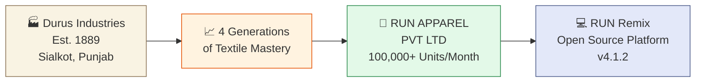

# 🧵 RUN APPAREL (PVT) LTD

> **From Thread to Finish Line** — Premium Sustainable Sportswear Manufacturing Since 1889

---

## 🕰️ Our Heritage



We are a **100% B2B** sustainable sportswear manufacturer based in **Sialkot, Pakistan** — the global capital of sports goods. Our family has been turning raw thread into world-class athletic apparel for over **137 years**.

---

## 🏭 Factory at a Glance

```
┌────────────────────────────────────────────────────────────────────────┐
│                   RUN APPAREL FACTORY DASHBOARD                        │
├─────────────────────┬──────────────────────────────────────────────────┤
│  📍 Location         │  13 Km Daska Road, Sialkot, Punjab, Pakistan    │
│  🏗️ Facility         │  193,000+ sq meters of manufacturing floor      │
│  👷 Workforce        │  Skilled artisans + AI-assisted automation      │
│  📦 Monthly Output   │  100,000+ high-performance athletic garments    │
│  ☀️ Solar Power      │  80% on-site solar (1,200+ rooftop panels)     │
│  💧 Water Recycling  │  85% industrial wastewater recycled (ZLD)       │
│  🌿 Fiber Sources    │  GOTS organic cotton + GRS recycled polyester   │
└─────────────────────┴──────────────────────────────────────────────────┘
```

---

## 🏆 Certifications

| Certification | What It Means |
|---------------|---------------|
| **SMETA 4-Pillar** | Ethical labor practices verified by Sedex |
| **GOTS Organic** | Organic fiber processing from farm to finished garment |
| **OEKO-TEX 100** | Every fabric tested safe from harmful chemicals |
| **ISO 9001** | International quality management standard |

---

## 💻 Explore Our Open Source

| Repository | Description |
|------------|-------------|
| [**RUN**](https://github.com/RUN-APPAREL/RUN) | RUN Remix — AI-native digital manufacturing platform with 3D configurator. React 19, Express 5, Vite 8. |

---

## 📬 Get in Touch

- **Lead:** M. Hateem Jamshaid (Business Development Director)
- **Email:** hateem@runapparel.com
- **WhatsApp:** +92-336-1777313
- **Website:** [wear-run.com](https://wear-run.com)
