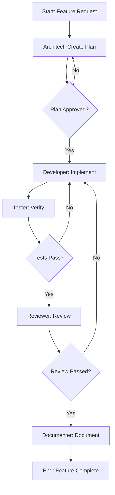
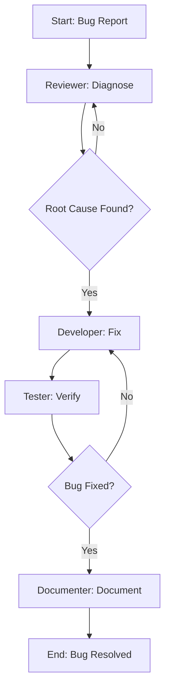

# Multi-Agent Orchestration System

## Overview

This document defines the multi-agent orchestration capabilities for RUN Remix, enabling coordinated AI agent workflows for complex development tasks.

---

## Agent Architecture

### Agent Types

| Agent Type | Role | Capabilities |
|------------|------|--------------|
| **Orchestrator** | Coordinates multi-step workflows | Task delegation, progress tracking, error recovery |
| **Architect** | Designs system architecture | Technical specifications, API contracts, data models |
| **Developer** | Implements code | Feature development, bug fixes, refactoring |
| **Tester** | Ensures quality | Test creation, coverage analysis, test execution |
| **Reviewer** | Code quality assurance | Code review, standards compliance, security audit |
| **Documenter** | Creates documentation | README updates, JSDoc comments, API docs |

---

## Orchestrator Configuration

```yaml
# .kilocode/orchestrators/config.yaml
orchestrator:
  name: run-remix-orchestrator
  version: 1.0.0
  
  agents:
    - name: architect
      skills:
        - writing-plans
        - api-design
      priority: 1
      
    - name: developer
      skills:
        - test-driven-development
        - refactoring
        - error-handling
      priority: 2
      
    - name: tester
      skills:
        - test-driven-development
        - verification-before-completion
      priority: 3
      
    - name: reviewer
      skills:
        - code-review
        - systematic-debugging
      priority: 4
      
    - name: documenter
      skills:
        - writing-plans
      priority: 5
  
  workflows:
    - name: feature-development
      steps:
        - agent: architect
          action: create-plan
        - agent: developer
          action: implement
        - agent: tester
          action: verify
        - agent: reviewer
          action: review
        - agent: documenter
          action: document
    
    - name: bug-fix
      steps:
        - agent: reviewer
          action: diagnose
        - agent: developer
          action: fix
        - agent: tester
          action: verify
        - agent: documenter
          action: document
    
    - name: refactoring
      steps:
        - agent: architect
          action: analyze
        - agent: developer
          action: refactor
        - agent: tester
          action: verify
        - agent: reviewer
          action: review
```

---

## Workflow Definitions

### Feature Development Workflow



### Bug Fix Workflow



---

## Agent Communication Protocol

### Message Format

```typescript
interface AgentMessage {
  id: string;
  timestamp: string;
  from: AgentType;
  to: AgentType;
  type: 'request' | 'response' | 'notification' | 'error';
  payload: {
    action: string;
    data: unknown;
    context?: {
      taskId: string;
      workflowId: string;
      stepIndex: number;
    };
  };
  status: 'pending' | 'in-progress' | 'completed' | 'failed';
}
```

### Handoff Protocol

```typescript
interface AgentHandoff {
  taskId: string;
  fromAgent: AgentType;
  toAgent: AgentType;
  artifacts: {
    type: 'plan' | 'code' | 'test' | 'review' | 'documentation';
    path: string;
    description: string;
  }[];
  context: {
    requirements: string[];
    constraints: string[];
    decisions: string[];
  };
  status: 'ready' | 'blocked' | 'completed';
}
```

---

## Skill Activation Rules

### Automatic Skill Activation

| Trigger Condition | Activated Skill | Agent |
|-------------------|-----------------|-------|
| New feature request | writing-plans | Architect |
| Code implementation needed | test-driven-development | Developer |
| Tests failing | systematic-debugging | Tester |
| Code ready for merge | code-review | Reviewer |
| API endpoint creation | api-design | Architect |
| Performance issue | refactoring | Developer |
| Error in production | error-handling | Developer |

### Skill Composition

```typescript
// Complex task requiring multiple skills
const complexFeatureWorkflow = {
  name: 'complex-feature',
  skills: [
    { skill: 'writing-plans', agent: 'architect', order: 1 },
    { skill: 'api-design', agent: 'architect', order: 2 },
    { skill: 'test-driven-development', agent: 'developer', order: 3 },
    { skill: 'error-handling', agent: 'developer', order: 4 },
    { skill: 'verification-before-completion', agent: 'tester', order: 5 },
    { skill: 'code-review', agent: 'reviewer', order: 6 },
  ],
};
```

---

## Error Recovery

### Failure Handling

```typescript
interface FailureRecovery {
  failureType: 'validation' | 'test' | 'review' | 'deployment';
  recoveryStrategy: 'retry' | 'escalate' | 'rollback' | 'abort';
  maxRetries: number;
  escalationPath: AgentType[];
}

const recoveryStrategies: Record<string, FailureRecovery> = {
  validation: {
    failureType: 'validation',
    recoveryStrategy: 'retry',
    maxRetries: 3,
    escalationPath: ['architect', 'developer'],
  },
  test: {
    failureType: 'test',
    recoveryStrategy: 'retry',
    maxRetries: 2,
    escalationPath: ['tester', 'developer'],
  },
  review: {
    failureType: 'review',
    recoveryStrategy: 'retry',
    maxRetries: 2,
    escalationPath: ['reviewer', 'developer'],
  },
  deployment: {
    failureType: 'deployment',
    recoveryStrategy: 'rollback',
    maxRetries: 1,
    escalationPath: ['orchestrator', 'architect'],
  },
};
```

---

## Progress Tracking

### Task Status

```typescript
interface TaskProgress {
  taskId: string;
  workflowId: string;
  currentStep: number;
  totalSteps: number;
  currentAgent: AgentType;
  status: 'pending' | 'in-progress' | 'blocked' | 'completed' | 'failed';
  startedAt: string;
  estimatedCompletion?: string;
  artifacts: {
    step: number;
    agent: AgentType;
    artifactType: string;
    path: string;
    createdAt: string;
  }[];
  errors: {
    step: number;
    agent: AgentType;
    error: string;
    timestamp: string;
    resolved: boolean;
  }[];
}
```

---

## Integration with RUN Remix

### B.L.A.S.T. Protocol Alignment

| B.L.A.S.T. Phase | Agent Responsibility |
|------------------|---------------------|
| **Blueprint** | Architect creates implementation plan |
| **Link** | Developer tests API handshakes |
| **Architect** | Developer implements with TDD |
| **Stylize** | Developer applies UI patterns |
| **Trigger** | Orchestrator deploys and monitors |

### A.N.T. Architecture Alignment

| A.N.T. Layer | Agent Focus |
|--------------|-------------|
| **L1: Reasoning** | Architect, Reviewer |
| **L2: Routing** | Orchestrator |
| **L3: Engines** | Developer, Tester |

---

## Usage Examples

### Starting a Feature Workflow

```typescript
// Request orchestrator to start feature development
const workflow = await orchestrator.startWorkflow({
  type: 'feature-development',
  input: {
    featureName: 'Product Customization Tool',
    description: 'Allow B2B clients to customize product colors and logos',
    requirements: [
      '3D preview with customization',
      'Real-time price calculation',
      'Bulk order support',
    ],
    constraints: [
      'Must use @google/model-viewer',
      'Mobile-responsive',
      'WCAG AA compliant',
    ],
  },
});

// Monitor progress
workflow.onProgress((progress) => {
  console.log(`Step ${progress.currentStep}/${progress.totalSteps}`);
  console.log(`Current agent: ${progress.currentAgent}`);
  console.log(`Status: ${progress.status}`);
});
```

### Handling Workflow Completion

```typescript
workflow.onComplete((result) => {
  console.log('Workflow completed successfully!');
  console.log('Artifacts created:', result.artifacts);
  // {
  //   plan: 'plans/product-customization-plan.md',
  //   code: 'client/app/components/products/ProductCustomizer.tsx',
  //   tests: 'tests/product-customizer.test.ts',
  //   review: 'reviews/product-customizer-review.md',
  //   docs: 'docs/features/product-customization.md',
  // }
});
```

---

## Configuration Files

### Agent Profiles

```yaml
# .kilocode/agents/architect.yaml
name: architect
role: System Architecture Designer
skills:
  - writing-plans
  - api-design
  - refactoring
constraints:
  - Must create implementation plans for complex tasks
  - Must define API contracts before implementation
  - Must consider scalability and performance
output_formats:
  - implementation_plan.md
  - api_spec.yaml
  - architecture_diagram.md
```

```yaml
# .kilocode/agents/developer.yaml
name: developer
role: Code Implementation Specialist
skills:
  - test-driven-development
  - error-handling
  - refactoring
constraints:
  - Must follow TDD for all new code
  - Must use TypeScript strict mode
  - Must delegate business logic to services
output_formats:
  - .tsx (React components)
  - .ts (services, utilities)
  - .test.ts (test files)
```

---

**Version:** 1.0.0 | **For:** RUN Remix @ RUN APPAREL (PVT) LTD
