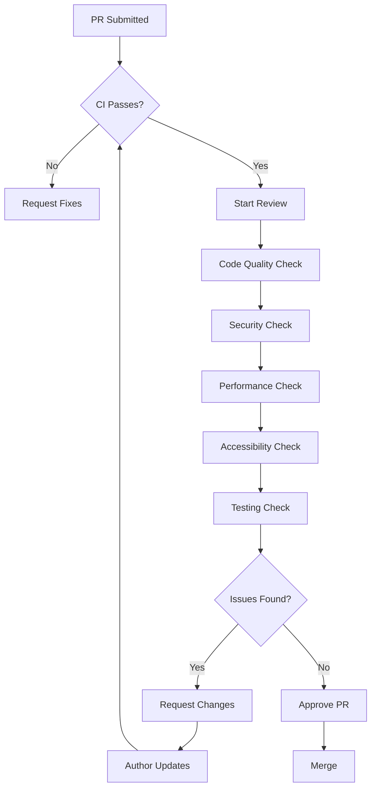

# Code Review Checklist & Guidelines

## Overview

This reference provides comprehensive checklists and guidelines for conducting thorough code reviews in the RUN Remix project.

---

## Pre-Review Checklist

Before starting a code review, verify:

- [ ] PR description clearly explains the change
- [ ] Related issue/ticket is linked
- [ ] CI/CD pipeline passes (build, tests, lint)
- [ ] Appropriate labels and reviewers assigned
- [ ] Breaking changes are documented

---

## Code Quality Checklist

### TypeScript Standards

```markdown
- [ ] No `any` types used (strict mode compliance)
- [ ] All functions have explicit return types
- [ ] Interfaces defined for all data structures
- [ ] Type guards used for runtime validation
- [ ] Generic types used appropriately
- [ ] No type assertions without validation
```

### React 19 Patterns

```markdown
- [ ] Functional components only (no class components)
- [ ] Named exports (no default exports)
- [ ] No `forwardRef` (use raw ref prop)
- [ ] Proper hook usage (rules of hooks)
- [ ] State initialized properly
- [ ] Effects have correct dependencies
- [ ] Cleanup functions provided where needed
```

### Express 5 Backend

```markdown
- [ ] Route handlers are thin (delegate to services)
- [ ] No try/catch in async handlers (Express 5 handles)
- [ ] Business logic in service layer
- [ ] Proper error classes used
- [ ] Request validation with Zod
- [ ] Response status codes correct
```

---

## Security Checklist

### Input Validation

```markdown
- [ ] All external inputs validated with Zod
- [ ] Schema validation before database operations
- [ ] File uploads validated (type, size)
- [ ] Query parameters sanitized
- [ ] Request body size limits enforced
```

### Authentication & Authorization

```markdown
- [ ] JWT validation in middleware
- [ ] Role-based access control implemented
- [ ] Sensitive routes protected
- [ ] Session management secure
- [ ] Password handling follows best practices
```

### Data Protection

```markdown
- [ ] Sensitive data encrypted at rest
- [ ] HTTPS enforced in production
- [ ] Secrets in environment variables (not code)
- [ ] No PII in logs
- [ ] GDPR compliance considered
```

---

## Performance Checklist

### Frontend Performance

```markdown
- [ ] Heavy components lazy loaded
- [ ] Images optimized (WebP, lazy loading)
- [ ] Bundle size impact considered
- [ ] Memoization used for expensive computations
- [ ] No unnecessary re-renders
- [ ] Virtualization for long lists
```

### Backend Performance

```markdown
- [ ] Database queries optimized (no N+1)
- [ ] Appropriate indexes exist
- [ ] Pagination implemented for list endpoints
- [ ] Caching strategy defined
- [ ] Response time acceptable
```

---

## Accessibility Checklist

### WCAG AA Compliance

```markdown
- [ ] All interactive elements keyboard accessible
- [ ] Focus indicators visible
- [ ] ARIA labels provided
- [ ] Color contrast meets 4.5:1 ratio
- [ ] Form inputs have associated labels
- [ ] Error messages announced to screen readers
- [ ] Modal focus trapped
```

### Semantic HTML

```markdown
- [ ] Correct HTML elements used (nav, main, article)
- [ ] Heading hierarchy correct (h1-h6)
- [ ] Lists use proper markup
- [ ] Tables have headers
- [ ] Images have alt text
```

---

## Testing Checklist

### Test Coverage

```markdown
- [ ] New code has corresponding tests
- [ ] Service layer coverage ≥80%
- [ ] Edge cases tested
- [ ] Error paths tested
- [ ] Integration tests for critical flows
```

### Test Quality

```markdown
- [ ] Tests are readable and maintainable
- [ ] Test names describe behavior
- [ ] No test interdependencies
- [ ] Mocks used appropriately
- [ ] Assertions are specific
```

---

## Documentation Checklist

```markdown
- [ ] JSDoc comments on public APIs
- [ ] Complex logic explained
- [ ] README updated if needed
- [ ] Environment variables documented
- [ ] Breaking changes noted in PR
```

---

## Review Severity Levels

### 🔴 Blocker (Must Fix Before Merge)

- Security vulnerabilities
- Data loss potential
- Breaking changes without migration
- Test failures
- Build failures

### 🟠 Major (Should Fix Before Merge)

- Performance regressions
- Accessibility violations
- Missing error handling
- Incomplete test coverage
- Type safety issues

### 🟡 Minor (Can Fix in Follow-up)

- Code style inconsistencies
- Minor refactoring opportunities
- Documentation improvements
- Non-critical optimizations

### 🟢 Suggestion (Optional)

- Alternative approaches
- Learning resources
- Future considerations

---

## Review Comment Templates

### Requesting Changes

```markdown
**Issue**: [Description of the problem]

**Location**: [File:line]

**Why it matters**: [Explanation of impact]

**Suggested fix**:
```typescript
// Code example
```

**Severity**: [Blocker/Major/Minor/Suggestion]
```

### Approving with Comments

```markdown
**Overall**: Great work on [specific aspect]!

**Minor suggestions** (non-blocking):
1. [Suggestion 1]
2. [Suggestion 2]

**Follow-up considerations**:
- [Item to address later]
```

---

## Common Anti-Patterns to Watch For

### TypeScript

| Anti-Pattern | Problem | Solution |
|-------------|---------|----------|
| `any` type | Loses type safety | Use proper types |
| Type assertion | Unsafe at runtime | Use type guards |
| Optional chaining overuse | Can hide bugs | Validate explicitly |

### React

| Anti-Pattern | Problem | Solution |
|-------------|---------|----------|
| Prop drilling | Hard to maintain | Use Context |
| useEffect for derived state | Unnecessary re-renders | Compute directly |
| Missing cleanup | Memory leaks | Return cleanup function |

### Express

| Anti-Pattern | Problem | Solution |
|-------------|---------|----------|
| Business logic in routes | Hard to test | Move to services |
| try/catch in handlers | Redundant in Express 5 | Remove |
| Missing validation | Security risk | Add Zod schemas |

---

## Review Workflow



---

## Quick Reference Card

```
┌─────────────────────────────────────────────────────────────┐
│                    CODE REVIEW QUICK CHECK                   │
├─────────────────────────────────────────────────────────────┤
│ □ No any types          □ No forwardRef                     │
│ □ Named exports         □ Thin routes                        │
│ □ Zod validation        □ Error boundaries                   │
│ □ Loading states        □ Keyboard accessible                │
│ □ Tests pass            □ Coverage ≥80%                      │
│ □ No security issues    □ Docs updated                       │
└─────────────────────────────────────────────────────────────┘
```

---

**Version:** 1.0.0 | **For:** RUN Remix @ RUN APPAREL (PVT) LTD
