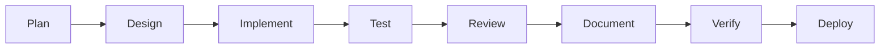
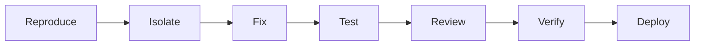

# AGENTS.md - Operational Intelligence Map (v3.0)

---

## 0. AntiGravity Project Constitution

**Primary Source of Truth (SSOT)**: [gemini.md](./gemini.md)

All agents MUST read and adhere to the architectural invariants and design laws defined in `gemini.md`. This file takes precedence over all other documentation.

---

## 1. System Identity & Mission

**Identity**: RUN Remix Ecosystem Pilot
**Mission**: Build deterministic, self-healing automation using the B.L.A.S.T. protocol and A.N.T. 3-layer architecture.
**North Star**: Reliability over speed. Deterministic business logic.

---

## 2. Directory Map (Context Boundaries)

| Path | Context | Constraints |
| :--- | :--- | :--- |
| `client/` | **Frontend Application** | Use `cn()` for styles. 5 Dimensions of Design. |
| `server/` | **Backend API** | Express 5 Async handlers. Stateless logic. |
| `shared/` | **Shared Library** | Universal Zod schemas and pure types. |
| `architecture/` | **Reasoning (L1)** | Technical SOPs. Read before coding. |
| `tools/` | **Engines (L3)** | Deterministic scripts (Python/JS). Atomic. |
| `scripts/` | **Handshaking** | API verification and build-time automation. |
| `.agent/skills/` | **Skills Library** | AntiGravity skills with SKILL.md format. |
| `.agent/agents/` | **Agent Configs** | Multi-agent orchestration definitions. |
| `.agent/orchestrators/` | **Workflows** | Complex multi-step automation workflows. |

---

## 2.1. Canonical Documentation Sources

| Topic | Primary Source (SSOT) |
| :--- | :--- |
| **Versions / Stack** | `package.json` |
| **Architecture** | `docs/architecture/system_diagrams.md` |
| **SDK Package** | `docs/core/sdk-workspace.md` |
| **Styles / UI** | `docs/guides/developer-workflow.md` |
| **Testing** | `docs/testing/testing-tiers.md` |
| **API Endpoints** | `docs/api/endpoints.md` |
| **3D Assets** | `docs/guides/3D_INTEGRATION.md` |
| **Developer Workflow** | `docs/guides/developer-workflow.md` |

---

## 3. Operational Commands (The Tool Belt)

Agents SHOULD prioritize these npm scripts over raw CLI commands.

| Action | Command | Expectation |
| :--- | :--- | :--- |
| **Verify** | `npm run verify:tech-integrity` | **MANDATORY** pre-commit check. |
| **Typecheck** | `npm run typecheck` | Validates TypeScript across all workspaces. |
| **Lint (Fix)** | `npm run check:apply` | Auto-fixes Biome linting issues. |
| **Port Audit** | `npm run verify-port` | Ensures port 5002 compliance. |

---

## 4. The B.L.A.S.T. Workflow

1.  **Blueprint**: Vision & Logic. Ask 5 Discovery questions if ambiguous. Update SOPs in `architecture/`.
2.  **Link**: Connectivity. Test credentials and API handshakes in `scripts/`.
3.  **Architect**: The Build.
    *   L1: Update SOPs.
    *   L2: Routing logic.
    *   L3: Implement atomic tools in `tools/`.
4.  **Stylize**: The WOW. Apply Glassmorphism, Aurora UI, and 60fps animations.
5.  **Trigger**: Deployment. Set up triggers and finalize Maintenance logs in `gemini.md`.

---

## 5. Development Workflow (Protocol 0)

1.  **Initialization**: Update `task_plan.md` and `findings.md`.
2.  **Modification**:
    *   Update SOPs in `architecture/` FIRST.
    *   Implement logic.
    *   Run linting and typechecks.
3.  **Self-Annealing**:
    *   Analyze failures, patch, and document in `progress.md`.
    *   Update architecture if logic changed.

---

## 6. Skills Library (AntiGravity Framework)

### 6.1. Skill Structure

All skills follow the universal SKILL.md format with progressive disclosure:

```
.agent/skills/
├── skill-name/
│   ├── SKILL.md           # Required: Metadata + Instructions
│   ├── references/        # Optional: Deep-dive documentation
│   │   └── patterns.md
│   └── examples/          # Optional: Code examples
│       └── example.ts
```

### 6.2. SKILL.md Format

```markdown
---
name: skill-name
description: When to activate this skill (triggers)
---

# Skill Title

## Goal
What this skill accomplishes

## Instructions
Step-by-step guidance

## Examples
Concrete usage scenarios

## Constraints
Limitations and edge cases
```

### 6.3. Available Skills (Representative List)

| Skill | Purpose | Location |
| :--- | :--- | :--- |
| **code-standards** | React 19, Express 5, Tailwind V4 patterns | `.agent/skills/code-standards/` |
| **development-workflow** | Testing standards and uncertainty protocol | `.agent/skills/development-workflow/` |
| **systematic-debugging** | Root cause analysis and troubleshooting | `.agent/skills/systematic-debugging/` |
| **test-driven-development** | Red-Green-Refactor logic | `.agent/skills/test-driven-development/` |
| **dispatching-parallel-agents** | Large scale task delegation | `.agent/skills/dispatching-parallel-agents/` |
| **executing-plans** | Step-by-step implementation tracking | `.agent/skills/executing-plans/` |
| **production-standards** | Performance, Security, Accessibility | `.agent/skills/production-standards/` |
| **advanced-debugging** | Deep system forensics | `.agent/skills/advanced-debugging/` |

### 6.4. Progressive Disclosure Architecture

Skills use a three-tier structure for token efficiency:

| Tier | Content | Purpose |
| :--- | :--- | :--- |
| **Tier 1** | YAML frontmatter | Quick activation decision |
| **Tier 2** | SKILL.md body | Step-by-step instructions |
| **Tier 3** | references/, examples/ | Deep-dive resources |

---

## 7. Multi-Agent Orchestration

### 7.1. Agent Architecture

```
.agent/agents/
├── orchestrator.yaml    # Workflow Coordination Agent
├── architect.yaml       # System Architecture Designer
├── developer.yaml       # Code Implementation Specialist
├── tester.yaml          # Quality Assurance Specialist
├── reviewer.yaml        # Code Quality Inspector
└── documenter.yaml      # Documentation Specialist
```

### 7.2. Agent Roles

| Agent | Role | Primary Skills |
| :--- | :--- | :--- |
| **Orchestrator** | Workflow coordination | writing-plans, executing-plans, verification |
| **Architect** | System design | api-design, writing-plans |
| **Developer** | Implementation | test-driven-development, refactoring |
| **Tester** | Quality assurance | webapp-testing, systematic-debugging |
| **Reviewer** | Code quality | code-review, error-handling |
| **Documenter** | Documentation | changelog-generator |

### 7.3. Agent Communication Protocol

```yaml
# Handoff Protocol
from: orchestrator
to: developer
task: implement-feature
context:
  plan: implementation_plan.md
  constraints: [no-any-types, use-cva]
  verification: [typecheck, test]
```

### 7.4. Error Recovery Strategies

| Error Type | Recovery Action |
| :--- | :--- |
| `validation_error` | Retry with corrected input |
| `test_failure` | Retry with fix |
| `review_rejection` | Retry with addressed feedback |
| `deployment_failure` | Rollback to previous state |

---

## 8. Workflow Orchestrators

### 8.1. Available Workflows

```
.agent/workflows/
├── feature-development.yaml   # Full feature lifecycle
├── bug-fix.yaml              # Systematic bug resolution
├── code-review.yaml          # Comprehensive review process
├── release.yaml              # Production release workflow
└── hotfix.yaml               # Emergency hotfix process
```

### 8.2. Feature Development Workflow



**Steps:**
1. **Plan**: Create implementation plan with `writing-plans` skill
2. **Design**: Architecture design with `architect` agent
3. **Implement**: TDD with `developer` agent
4. **Test**: Quality assurance with `tester` agent
5. **Review**: Code review with `reviewer` agent
6. **Document**: Update docs with `documenter` agent
7. **Verify**: Run `npm run verify:tech-integrity`
8. **Deploy**: Production deployment

### 8.3. Bug Fix Workflow



**Steps:**
1. **Reproduce**: Confirm bug exists
2. **Isolate**: Identify root cause with `systematic-debugging`
3. **Fix**: Implement fix with TDD
4. **Test**: Verify fix works
5. **Review**: Code review
6. **Verify**: Run verification suite
7. **Deploy**: Deploy fix

### 8.4. Workflow Activation

Workflows are activated by the orchestrator agent based on task type:

| Task Type | Workflow |
| :--- | :--- |
| New feature | `feature-development.yaml` |
| Bug report | `bug-fix.yaml` |
| Code review request | `code-review.yaml` |
| Release preparation | `release.yaml` |
| Emergency fix | `hotfix.yaml` |

---

## 9. Testing & Compliance

*   **Service Layer**: 80%+ coverage using Vitest.
*   **Port Compliance**: ALWAYS use port **5002**.
*   **Data-First**: Define inputs/outputs in `gemini.md` before building.
*   **Skill Activation**: Check skill descriptions before complex tasks.
*   **Workflow Adherence**: Follow orchestrator workflows for multi-step tasks.

---

## Version Compatibility

*   **Last Updated**: 2026-02-19
*   **Applies to**: `run-remix-monorepo` v3.0.0
*   **Agent Protocol**: System Pilot v3.0
*   **Skills Framework**: AntiGravity v2.0
