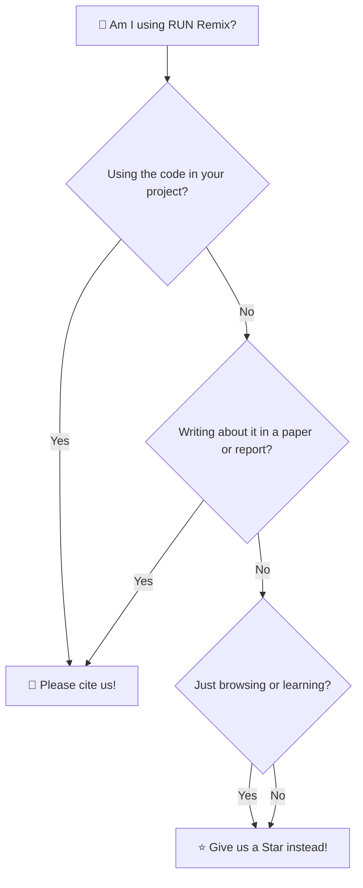

# How to Cite This Project

**Project:** RUN Remix (`run-remix`)  
**Creator:** RUN APPAREL (PVT) LTD / Durus Industries  
**Lead Author:** M. Hateem Jamshaid  

---

## 🎓 Giving Credit on Your School Science Project

Just like adding a bibliography at the end of a school science report to thank the authors who helped you discover cool facts, citing open-source software lets everyone know where your tools and inspiration came from.

If you use RUN Remix in your school project, research paper, 3D graphics demonstration, or manufacturing study, here is how you can cite us!

```
┌────────────────────────────────────────────────────────────────────────┐
│                   CITATION CHEAT SHEET (CHOOSE YOUR FORMAT)            │
├────────────────────────────────────────────────────────────────────────┤
│  APA:                                                                  │
│  Jamshaid, M. H. (2026). RUN Remix: The Agentic Sportswear Factory     │
│  & 3D Digital Manufacturing CMS (v4.1.2) [Computer software].         │
│  https://github.com/RUN-APPAREL/RUN                                     │
│                                                                        │
│  BibTeX:                                                               │
│  @software{run_remix_2026,                                             │
│    author = {Jamshaid, M. Hateem},                                     │
│    title = {RUN Remix: The Agentic Sportswear Factory},                │
│    year = {2026},                                                      │
│    url = {https://github.com/RUN-APPAREL/RUN},                          │
│    version = {4.1.2}                                                   │
│  }                                                                     │
└────────────────────────────────────────────────────────────────────────┘
```

---

## 🔘 Using GitHub's Built-In "Cite this repository" Button

On the main page of this GitHub repository, look at the right sidebar under **About**:

```
  ┌─────────────────────────────────┐
  │  About                          │
  │  The Agentic Sportswear Factory │
  │                                 │
  │  [ 🎓 Cite this repository ]    │ ◄── Click here for instant
  │                                 │     APA and BibTeX copies!
  │  [ ⭐ 0 stars ]  [ 🍴 0 forks ] │
  └─────────────────────────────────┘
```

When you click that button, GitHub reads our machine-friendly [`CITATION.cff`](./CITATION.cff) file and formats the citation for you automatically!

---

## 🤔 When Should You Cite

Not sure if you need to cite us? Follow this friendly flowchart:


