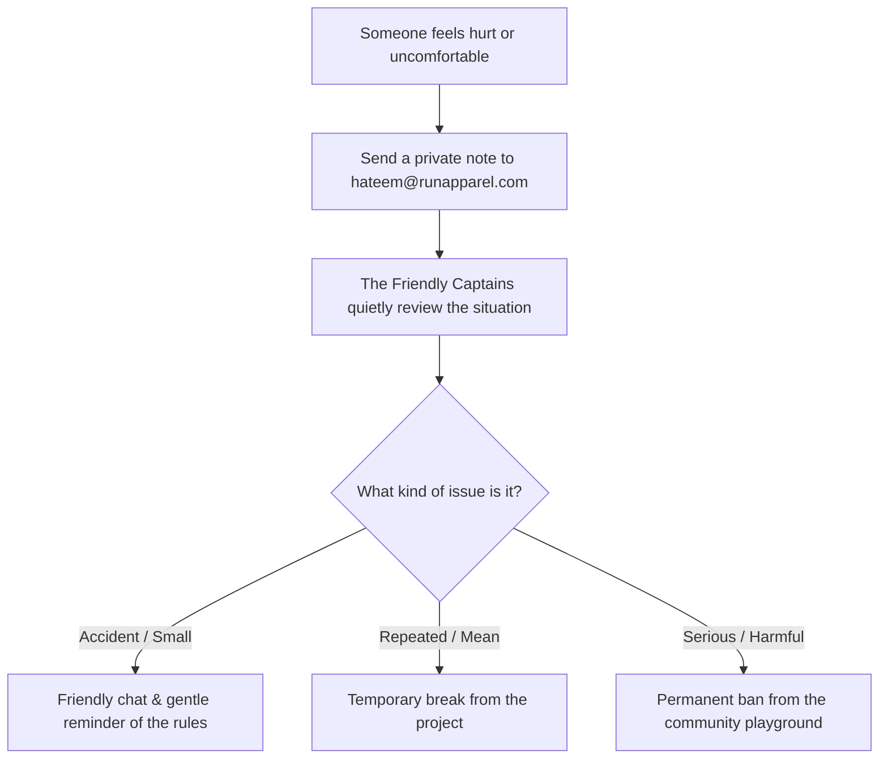

# Contributor Covenant Code of Conduct

**Community:** RUN Remix Open Source Project & RUN APPAREL (PVT) LTD  
**Standard:** Contributor Covenant v2.1  
**Motto:** "Play Fair, Be Kind, Build Together"  

---

## 🏆 The Good Sportsmanship Rulebook

Just like playing soccer on a school sports team, building great software works best when everyone respects their teammates, shares the ball, and cheers each other on.

Whether you are a 5th grader writing your very first line of code or an experienced engineer, you are welcome here!

```
┌────────────────────────────────────────────────────────────────────────┐
│                   THE GOOD SPORTSMANSHIP SCOREBOARD                    │
├───────────────────────────────────┬────────────────────────────────────┤
│  💚 GREEN CHEERS (Do More of This)│  🛑 RED CARDS (Never Do This)      │
├───────────────────────────────────┼────────────────────────────────────┤
│  • Say "thank you" and be helpful │  • Being mean, bullying, or insults│
│  • Listen to different ideas      │  • Teasing someone for being new   │
│  • Give kind and constructive tips│  • Sharing someone's private info  │
│  • Say "sorry" if a mistake happens│ • Inappropriate or rude language  │
│  • Celebrate everyone's hard work │  • Trolling or spamming channels   │
└───────────────────────────────────┴────────────────────────────────────┘
```

---

## 🤝 How We Handle Disagreements

If someone does something unkind or unfair, here is what happens:



---

## 📜 Official Contributor Covenant Pledge

### Our Pledge

We as members, contributors, and leaders pledge to make participation in our
community a harassment-free experience for everyone, regardless of age, body
size, visible or invisible disability, ethnicity, sex characteristics, gender
identity and expression, level of experience, education, socio-economic status,
nationality, personal appearance, race, caste, color, religion, or sexual identity
and orientation.

We pledge to act and interact in ways that contribute to an open, welcoming,
diverse, inclusive, and healthy community.

### Our Standards

Examples of behavior that contributes to a positive environment for our community include:

- Demonstrating empathy and kindness toward other people
- Being respectful of differing opinions, viewpoints, and experiences
- Giving and gracefully accepting constructive feedback
- Accepting responsibility and apologizing to those affected by our mistakes, and learning from the experience
- Focusing on what is best not just for us as individuals, but for the overall community

Examples of unacceptable behavior include:

- The use of sexualized language or imagery, and sexual attention or advances of any kind
- Trolling, insulting or derogatory comments, and personal or political attacks
- Public or private harassment
- Publishing others' private information, such as a physical or email address, without their explicit permission
- Other conduct which could reasonably be considered inappropriate in a professional setting

### Enforcement & Contact

Community leaders are responsible for clarifying and enforcing our standards of
acceptable behavior. If you experience or witness unacceptable behavior, please
report it privately by emailing:

📧 **Community Safety Lead:** M. Hateem Jamshaid (`hateem@runapparel.com`)

All reports will be treated with confidentiality, care, and fairness.
