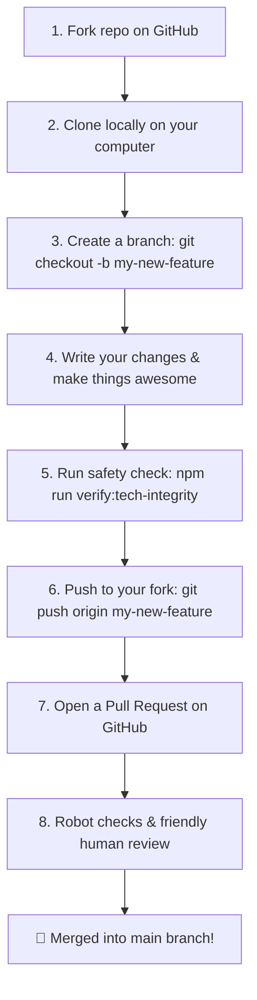

# Contributing to RUN Remix

Welcome to the **RUN Remix** community! We are excited that you want to help make our digital sportswear factory even better.

Whether you found a typo, want to fix a bug, or have a brilliant idea for a new 3D jersey design, this guide will walk you through every step in plain English.

---

## 🧱 How to Build a Lego Brick for the Factory

Think of contributing to RUN Remix like building a custom Lego brick and bringing it to the master building table:

```
┌────────────────────────────────────────────────────────────────────────┐
│                   THE 5-STEP CONTRIBUTOR COMIC STRIP                   │
├────────────────────────────────────────────────────────────────────────┤
│                                                                        │
│   [ 1. Fork Blueprint ] ──► [ 2. Open Workbench ] ──► [ 3. Build Brick]│
│     Click "Fork" to make      Install tools with         Add your code │
│     your personal copy        `npm install`              or fixes      │
│                                                                        │
│                                      │                                 │
│                                      ▼                                 │
│                                                                        │
│   [ 5. Master Review ]  ◄── [ 4. Test Safety ]                         │
│     Open a Pull Request       Run safety tests with                    │
│     for high-fives & merge    `npm run verify:tech-integrity`          │
│                                                                        │
└────────────────────────────────────────────────────────────────────────┘
```

---

## 🛠️ Step-by-Step Instructions



### Step 1: Make Your Own Copy (Fork)

Click the **Fork** button at the top right of the GitHub page. This gives you your very own copy of the factory blueprints to experiment with safely.

### Step 2: Download to Your Computer

Open your computer's terminal (or VS Code) and run:

```bash
# Download your personal copy
git clone <repository-url>
cd RUN

# Install all the building blocks (requires Node.js 24+)
npm install

# Copy the example settings
cp .env.example .env
```

### Step 3: Create a Clean Branch

Always create a new branch so your work stays organized:

```bash
git checkout -b feature/my-awesome-improvement
```

### Step 4: Start the Dev Server & Make Changes

```bash
# Start the factory on port 5002
npm run dev
```

Visit **`http://localhost:5002`** in your web browser. You will see your changes update instantly on the screen!

### Step 5: Run the Safety Inspection

Before sending your work for review, run our automated safety inspectors to make sure no wires got crossed:

```bash
# Runs TypeScript, Biome linter, Knip dead-code checks, and doc link checkers
npm run verify:tech-integrity
```

If the terminal turns green with 8/8 checks passed, you are ready for the grand finale!

### Step 6: Open a Pull Request (PR)

1. Save and push your changes:

   ```bash
   git add .
   git commit -m "Add my awesome improvement"
   git push origin feature/my-awesome-improvement
   ```

2. Visit the repository on GitHub and click the big green **Compare & pull request** button.
3. Fill out the friendly checklist in the [Pull Request Template](./.github/PULL_REQUEST_TEMPLATE.md).
4. Our friendly team will review your work, offer helpful tips, and merge your code!

---

## 🧭 Important Factory Golden Rules

To keep the factory running smoothly and safely, all contributors follow these 5 golden rules:

| Golden Rule | What It Means | Why It Matters |
|-------------|---------------|----------------|
| 🔌 **Port 5002 Only** | Never change the port to 3000 or use dynamic fallbacks. | Prevents port collisions with other local dev servers. |
| 🛡️ **No Raw Throws** | Backend services return safe `neverthrow` results. | Keeps the server from crashing when unexpected input arrives. |
| 🪟 **SSR Cleanliness** | Never touch `window` or `document` during initial module load. | Ensures super-fast page rendering on servers and mobile devices. |
| 🧱 **Shared Boundaries** | Data schemas live in `@run-remix/shared`. | Guarantees the frontend and backend always agree on data shapes. |
| 🎨 **Tailwind Tokens** | Use `@theme` tokens in `theme.css` (no arbitrary bracket values). | Maintains visual polish and consistent brand typography. |

---

## ❓ Need Help

If you ever get stuck or have questions:
- Open a friendly discussion in **GitHub Discussions** (`<repository-url>/discussions`).
- Check our [Support Guide](./SUPPORT.md) or [Illustrated Wiki](./docs/wiki/Home.md).
- Read the [Troubleshooting Runbook](./docs/TROUBLESHOOTING.md).
