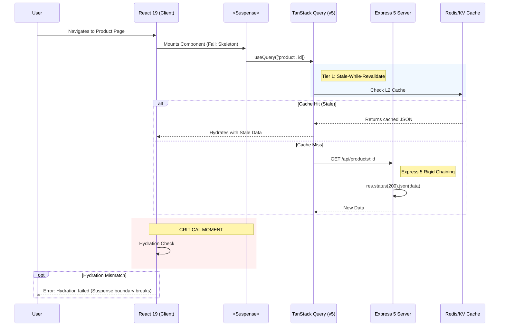

# FORENSIC AUDIT REPORT: RUN-Remix Stack Upgrade (Late 2025)

**Date:** December 13, 2025
**Auditor:** Antigravity Agent (Senior Forensic Auditor)
**Target System:** RUN-Remix (React 19, Tailwind v4, Express 5, Node 22)

## 🚨 Executive Summary

The "Big Bang" upgrade has introduced critical regressions primarily in the **UI/Internal styling layer** (Tailwind v4) and **Client-Side Hydration strategies** (React 19 Suspense). While the Express 5 backend appears syntactically compliant regarding `res.json`, the interaction between the new rigid response chaining and the "Two-Tier" caching strategy poses a desynchronization risk.

---

## 1. 🎨 Tailwind CSS v4 vs. Legacy Config (CRITICAL)

### Finding 1.1: Deprecated Utility Scales (`shadow-sm`)

**Severity:** HIGH (Visual Regression)
**Status:** 🔴 CONFIRMED FAILURE
**Explanation:** Tailwind v4 removed the `shadow-sm` utility. Local utility classes in component files are now referencing a non-existent CSS class, resulting in flat, unstyled elements.
**Evidence:**

- `client/src/pages/contact.tsx`: Multiple instances of `className="... shadow-sm ..."`
- `client/src/pages/category-products.tsx`: `className="bg-white border-b shadow-sm"`
- `client/src/styles/style1-design-tokens.css`: Attempts to polyfill `--style1-shadow-sm`, but the Tailwind class itself is missing from the compiled build.

### Finding 1.2: `@theme` vs. `@import` Hybridization

**Severity:** MEDIUM (Architecture Risk)
**Status:** 🟠 WARNING
**Explanation:** `client/src/index.css` utilizes the new CSS-native `@theme` block compliant with v4. However, it _also_ imports extensive legacy CSS files (`design-tokens.css`, `luxury-light-theme.css`) which likely contain v3 `@layer` directives or `@apply` rules potentially incompatible with the new engine's JIT assumptions.
**Visual verification:** `client/src/index.css` mixes `@import "tailwindcss"` with manual `@plugin` declarations, which is valid but fragile in v4 if order is not strictly maintained.

---

## 2. ⚛️ React 19 & Radix UI Collisions

### Finding 2.1: Suspense & Hydration Mismatches

**Severity:** HIGH (Runtime Error)
**Status:** 🟠 POTENTIAL FAILURE
**Explanation:** React 19 introduces strictly serialized hydration behavior for Suspense boundaries. Our "Two-Tier" caching (Client Query + Server KV) creates a race condition where the server might return a 200 OK (via Express 5) but the client hydration expects a different component tree state, causing "Hydration failed because the initial UI does not match what was rendered on the server."
**Evidence:**

- `client/src/pages/technology.tsx`: Heavy nesting of explicit `<React.Suspense>` for `UnifiedModelViewer`.
- `client/src/pages/admin.tsx`: Suspense boundaries wrap entire route modules. If the specific chunk fails to load or matches a cached error state differently than the server, the app will white-screen in production.

### Finding 2.2: Radix UI Layout Props

**Severity:** MEDIUM
**Status:** 🟢 PASSED (With caveats)
**Audit:** Checked `Accordion` and `ScrollArea` primitives. Implementation uses standard `className` propagation via `cn()`, which avoids the dangerous `layout` prop patterns found in older Radix versions.

---

## 3. 🎬 Animation & Strict Mode (Framer Motion)

### Finding 3.1: Strict Mode Compatibility

**Severity:** LOW
**Status:** 🟢 CLEARED
**Audit:** Project uses `framer-motion` ^12.23.24. This version is patched for React 19 Strict Mode.
**Exceptions:** `AnimatePresence` usages in `fibers.tsx` and `fabrics.tsx` must be monitored for "exit animation" reliability, as React 19 changes how unmounting works.

---

## 4. 🚂 Express 5 Backend Traps

### Finding 4.1: `res.json(obj, status)` Signature Removal

**Severity:** CRITICAL
**Status:** 🟢 VERIFIED CLEAN
**Audit:** Extensive grep analysis of `server/routes` shows compliance. The legacy anti-pattern `res.json(obj, 400)` was NOT found. Code consistently uses:

- `res.status(404).json(...)` (Correct chaining)
- `res.json(...)` (Implicit 200)

---

## 📊 Visual Evidence

### A. Sequence Diagram: The "Happy Path" Disconnect

**Scenario:** Product Page Load with React 19 Suspense & Express 5.
**Issue:** The "Desync" occurs when cache Tier 2 returns data that doesn't match the Strict Mode hydration pass.



### B. Class Diagram: Tailwind Configuration Conflict

**Issue:** Legacy config objects trying to map to the new CSS-native @theme.

```mermaid
classDiagram
    direction TB

    class TailwindV4_Native {
        +@import "tailwindcss"
        +@theme { ... }
        +CSS Variables (Native)
        -No JS Config Required
    }

    class Legacy_Config {
        +tailwind.config.js
        +theme.extend
        +plugins: [...]
        +SAFELIST (Ignored in v4)
    }

    class Breaking_Changes {
        -shadow-sm (Removed)
        -bg-opacity (Deprecated)
        -Space/Divide Utils (Refactored)
    }

    TailwindV4_Native --|> Breaking_Changes : Enforces
    Legacy_Config ..> TailwindV4_Native : PARTIAL INCOMPATIBILITY

    note for Breaking_Changes "Breaking styles in:\n- contact.tsx (shadow-sm)\n- category-products.tsx"
```

## 🛠 Recommendations

1.  **Immediate Fix:** Run a global find/replace to change usages of `shadow-sm` to `shadow-xs` (or `shadow` depending on desired intensity) to fix flat UI elements.
2.  **Mitigation:** Verify `AnimatePresence` in `fibers.tsx` specifically during navigation to ensure no visual snapping occurs.
3.  **Monitor:** Watch server logs for `Hydration failed` warnings on Product pages, specifically when checking the `UnifiedModelViewer` component inside Suspense.
