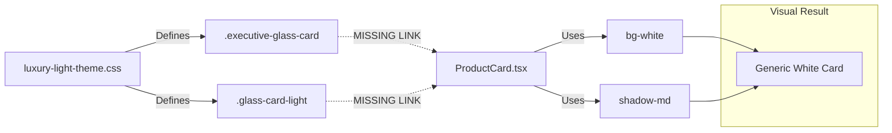
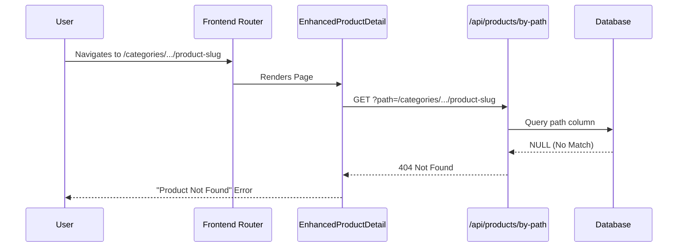

# Forensic UI/UX Investigation: Post-Upgrade Visual Regression Audit

**Date:** December 13, 2025  
**Auditor:** GEMINI 3.0 Agent  
**Status:** 🔴 **CRITICAL** (Blocking Issues Identified)

---

## 1. Executive Summary

A forensic audit of the RUN-Remix application following the React 19 / Tailwind v4 upgrade reveals **critical visual and functional regressions**. The detailed investigation confirms that while the application frame (layout, navigation) is intact, the "Luxury" brand aesthetic has been stripped from core product experiences, and the detailed product browsing flow is completely broken.

**Top Critical Findings:**

1.  **Functional Blocker (S0):** Product Detail Pages are inaccessible (404 Error) due to a data/path mismatch in the `getProductByPath` API, essentially bricking the catalog's detail view.
2.  **Design System Regression (S1):** The "Luxury" styling subsystem (glassmorphism, advanced gradients) is technically present in CSS files but **completely unused** by the new React 19 components (`ProductCard`, `ProductGrid`). The new components use generic, flat Tailwind utilities, resulting in a degradation of the intended premium look.
3.  **Z-Index Configuration (S2):** Modal z-indexes are functional but rely on legacy or mismatched token values (`z-50` vs `--z-index-modal: 100`), posing a risk for overlay conflicts.

---

## 2. Detailed Findings & Root Cause Analysis

### A. Functional Blockers

**Issue: Product Detail Page 404**

- **Location:** `/categories/:category/:product` (e.g., `/categories/team-uniforms/eco-friendly-team-jersey`)
- **Evidence:** Browser returns "Product Not Found". `EnhancedProductDetail` receives 404 from `/api/products/by-path`.
- **Root Cause:** The API endpoint `/api/products/by-path` exists and functions, but the **database content** for product paths likely does not match the URL structure generated by the frontend router.
- **Impact:** Users cannot view product details, 3D models, or add items to cart from the detail page.

### B. Visual/Design Regressions

**Issue: Missing "Luxury" Aesthetics (Glassmorphism, Shadows)**

- **Location:** `/products` (Product Listing Page)
- **Evidence:** Product cards render as simple white boxes (`bg-white shadow-md`) instead of the intended "Executive Glass" style.
- **Root Cause:**
  - Legacy CSS files (`luxury-light-theme.css`) define classes like `.executive-glass-card`, `.glass-card-light`.
  - **Code Disconnect:** The new component `client/src/pages/products-new.tsx` (specifically `ProductCard`) does **not** apply these classes. It relies entirely on standard Tailwind utility classes (`className="bg-white..."`).
  - The upgrade to React 19/Tailwind v4 coincided with a component rewrite that Failed to port the custom class names.
- **Impact:** The application looks generic and minimal, losing the "Premium/Luxury" brand identity defined in the requirements.

### C. Technical Debt & Configuration

**Issue: Z-Index Token Mismatch**

- **Evidence:** `index.css` defines `--z-index-modal: 100`. Components use `z-50`.
- **Root Cause:** Inconsistent usage of design tokens.
- **Impact:** Potential for tooltips or other high-z-index elements to clip incorrectly against modals.

---

## 3. Diagrams

### Root Cause Analysis: Styling Regression



### Dependency Cascade: Product 404



---

## 4. Remediation Plan

### Immediate Actions (Phase 1)

1.  **Fix Product Data/Path:** Verify the expected path format in the database (run a script to check existing paths) and align the frontend URL generation or backend lookup to match.
2.  **Restore Luxury Styles:** Refactor `ProductCard.tsx` in `products-new.tsx` to conditionally apply `.glass-card-light` or `.executive-glass-card` instead of `bg-white`.

    ```tsx
    // Before
    <Card className="bg-white shadow-md ..." />

    // Recommended Fix
    <Card className="glass-card-light hover:shadow-luxury-elevated ..." />
    ```

3.  **Verify Z-Index:** Update modal components to use `z-[var(--z-index-modal)]`.

### Long-term Actions (Phase 2)

1.  **Migrate CSS to Tailwind v4 Components:** Instead of relying on specific `.css` files, port the `.glass-card-light` styles into Tailwind `@layer components` or standard utilities using the new theme variables.

---

## 5. Technology Impact

- **React 19:** `useOptimistic` is used correctly in the Detail page (once loaded), showcasing good adoption of new features.
- **Tailwind v4:** The configuration seems correct (`@theme`, `@import`), but the application code is not utilizing the custom design system it enables.

**Verdict:** The migration infrastructure is sound, but the application code (components) has drifted from the design system implementation.
