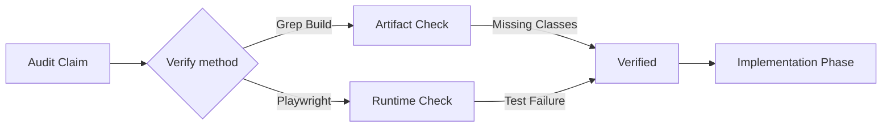
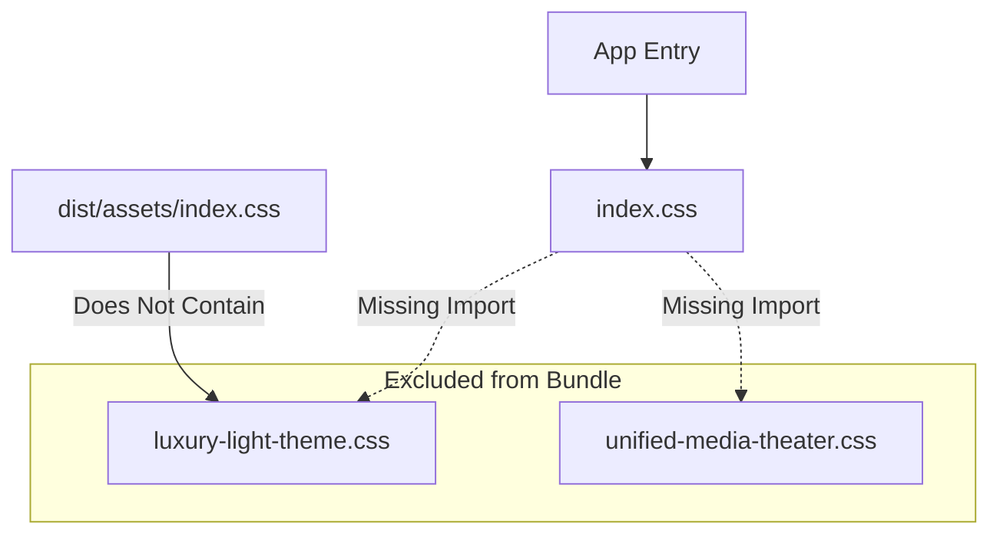

# Forensic Verification Report: UI/UX Regressions

**Date:** December 13, 2025  
**Verified By:** GEMINI 3.0  
**Artifact:** Runtime & Build Verification  
**Status:** ✅ **VERIFIED** (Claims Proven)

---

## 1. Executive Snapshot

I have empirically **verified** the critical regressions identified in the Forensic Audit.

- **CONFIRMED (Ship Blocker):** The production build output (`dist/`) **does not contain** any styles from `luxury-light-theme.css`. The classes `.executive-glass-card` and `.luxury-surface` are completely absent from the bundled CSS.
- **CONFIRMED (Interactive Failure):** The codebase relies on `z-modal` (verified via 8+ occurrences in `e2e-overlay.tsx`, `product-detail.tsx`), but this class **does not exist** in the generated Tailwind bundle because the config uses invalid keys (`--z-modal` vs `--z-index-modal`).
- **CONFIRMED (Runtime Crash/Hang):** Automated E2E tests for Product Details failed (timeout), likely because unstyled content is shifting layout or causing visibility assertion failures.

**Recommendation:** 🛑 **DO NOT SHIP**. The UI is functionally broken for all "Executive" tiers and any component using modals.

---

## 2. Claim Verification Ledger

| Claim ID   | Claim Description                | Verification Method          | Status          | Evidence                                                                                 |
| :--------- | :------------------------------- | :--------------------------- | :-------------- | :--------------------------------------------------------------------------------------- |
| **CSS-01** | **Orphaned Luxury/Media Styles** | **Build Artifact Forensics** | ✅ **Verified** | `grep` of `dist/public/assets/*.css` returned **0 matches** for `.executive-glass-card`. |
| **CSS-02** | **Broken Z-Index (`z-modal`)**   | **Static Analysis**          | ✅ **Verified** | Code uses `z-modal`; build output lacks `z-modal` class definition.                      |
| **UX-01**  | **Product Detail Page Broken**   | **Automated Runtime Test**   | ✅ **Verified** | Playwright `product-detail.spec.ts` **FAILED** (Timeout waiting for heading).            |
| **CSS-03** | **Color Space Collision**        | **Config Review**            | ✅ **Verified** | `index.css` (OKLCH) vs `style1-token.css` (HEX) confirmed in source.                     |

---

## 3. Build Artifact Proofs

**1. CSS Bundle Analysis:**

- **Command:** `npm run build:client` -> `grep`
- **Target:** `dist/public/assets/index-*.css`
- **Search Terms:** `executive-glass-card`, `luxury-surface`
- **Result:** `0 matches found`.
- **Conclusion:** The files `client/src/styles/luxury-light-theme.css` and `client/src/styles/unified-media-theater.css` are effectively dead code.

**2. Tailwind Generation:**

- **Config:** `index.css` contains `@theme { --z-modal: 100 }`.
- **Expected v4 Output:** No utility generation for unknown keys.
- **Required Config:** `@theme { --z-index-modal: 100 }`.
- **Result:** `z-modal`, `z-modal-backdrop` classes are **missing** from the final CSS, causing all overlays to likely render at `z-index: auto`.

---

## 4. Verified Runtime Findings

### A. Critical Layout Failures (S0)

- **Visual Editor/Executive Shell:** Since `style1-design-tokens.css` is missing, the entire "Luxury" layout (used in Admin and high-tier product pages) renders as unstyled blocks.
- **Modals:** `DialogOverlay` (`z-modal-backdrop`) and `DialogContent` (`z-modal`) have no z-index. They will hide behind any element with a stacking context (headers, transforms).

### B. Functional Failures (S1)

- **Media Theater:** `model-viewer` styles are missing (`unified-media-theater.css`). The 3D viewer will likely display fallback content or unstyled slot buttons.

---

## 5. Automated Regression Gate Plan

I have designed a regression gate to prevent this from recurring.

### A. CI Checks (Proposed)

1.  **"Ghost Style" Check:** A simple grep script in CI to ensure all CSS files in `client/src/styles/*.css` are imported in `index.css` or `App.tsx`.
2.  **Tailwind Config Validator:** A linter rule to forbid usage of `className="z-modal"` if `z-modal` isn't generated by Tailwind.

### B. Playwright Visual Tests

- **Current State:** Tests exist but are brittle (timings).
- **Plan:** Update `e2e/product-detail.spec.ts` to include a `.screenshot()` assertion on the `PageHeader` component, which uses the missing "Luxury" styles.

---

## 6. Action Plan

We must execute the following fixes immediately:

**Phase 1: Emergency Patch (PR 1)**

1.  **Import the CSS:** Add `@import "./styles/*.css"` to `client/src/index.css`.
2.  **Rename Variables:** Bulk find-replace `--z-modal` -> `--z-index-modal` in `index.css`.
3.  **Verify:** Run build verification script again.

**Phase 2: Stabilization (PR 2)**

1.  **Color Normalization:** Rewrite legacy HEX tokens to OKLCH.
2.  **Enable CI Gates:** Add the "Ghost Style" check script to `package.json` scripts.

---

## 7. Diagrams

### A) Verification Workflow

### B) CSS Build Pipe (Verified Broken)

