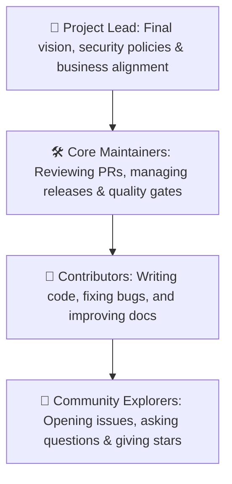
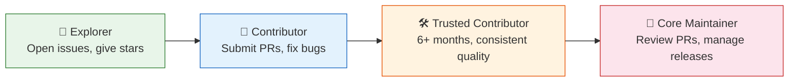

# Project Governance & Leadership

**Project:** RUN Remix (`run-remix`)  
**Parent Entity:** RUN APPAREL (PVT) LTD / Durus Industries  
**Model:** Benevolent Maintainer & Community Council  

---

## 🧭 The Factory Council & Ship Captains

Every sailing ship needs a captain, navigators, and skilled crew members to explore new waters without running aground.

This document explains how decisions are made, how new features get approved, and how anyone can rise from a curious explorer to a trusted captain of the RUN Remix codebase!

```
┌────────────────────────────────────────────────────────────────────────┐
│                   THE RUN REMIX CREW HIERARCHY                         │
├────────────────────────────────────────────────────────────────────────┤
│                                                                        │
│                      👑 PROJECT LEAD (BENEFACTOR)                      │
│                 M. Hateem Jamshaid (RUN APPAREL CEO)                   │
│                                   │                                    │
│                                   ▼                                    │
│                      🛠️ CORE MAINTAINER COUNCIL                         │
│               Security, Architecture & Release Engineers               │
│                                   │                                    │
│                                   ▼                                    │
│                      🧩 CODE & DOC CONTRIBUTORS                        │
│                Community Builders submitting Pull Requests             │
│                                   │                                    │
│                                   ▼                                    │
│                      🌟 COMMUNITY EXPLORERS & USERS                    │
│                 Athletes, designers, and students testing apps         │
│                                                                        │
└────────────────────────────────────────────────────────────────────────┘
```

---

## 👥 Roles & Responsibilities



### 🪜 How to Level Up in the Community



**How to climb the ladder:**

| From | To | What You Need |
|------|-----|---------------|
| 🌟 Explorer | 🧩 Contributor | Submit your first merged Pull Request |
| 🧩 Contributor | 🛠️ Trusted | 6+ months of consistent, high-quality contributions |
| 🛠️ Trusted | 👑 Maintainer | Invitation from the Project Lead after demonstrated expertise |

### 1. Project Lead (Lead Maintainer)

- **Current Lead:** M. Hateem Jamshaid (`hateem@runapparel.com`)
- **Responsibilities:** Sets strategic product direction, ensures compliance with textile manufacturing standards, and manages brand security.

### 2. Core Maintainers

- **Responsibilities:** Reviews pull requests, ensures automated test suites pass, maintains CI/CD pipelines, and manages releases.
- **How to Join:** Consistent, high-quality contributions across code, testing, or documentation over a sustained period (minimum 6 months).

### 3. Community Contributors

- Anyone who submits pull requests, files bug reports, improves documentation, or helps other members in discussions.

---

## 🗳️ How Decisions Are Made

```
┌────────────────────────────────────────────────────────────────────────┐
│                   THE DECISION-MAKING LADDER                           │
├───────────────────┬───────────────────┬────────────────────────────────┤
│  🟢 SMALL TWEAKS  │  🟡 NEW FEATURES  │  🔴 MAJOR ARCHITECTURE         │
├───────────────────┼───────────────────┼────────────────────────────────┤
│  Bug fixes, typos,│  New UI screens,  │  Database schema changes,      │
│  test updates     │  fabric types,    │  dependency swaps, API changes │
│                   │  tools            │                                │
│  ► 1 Maintainer   │  ► 2 Maintainers  │  ► Formal RFC / Plan Approval  │
│    Approval       │    Approval       │    & Project Lead sign-off     │
└───────────────────┴───────────────────┴────────────────────────────────┘
```

---

## 🤝 Community Feedback & Transparency

All architectural discussions and feature proposals happen openly in GitHub Discussions (`<repository-url>/discussions`) and GitHub Issues (`<repository-url>/issues`). Everyone's voice is heard and valued!
