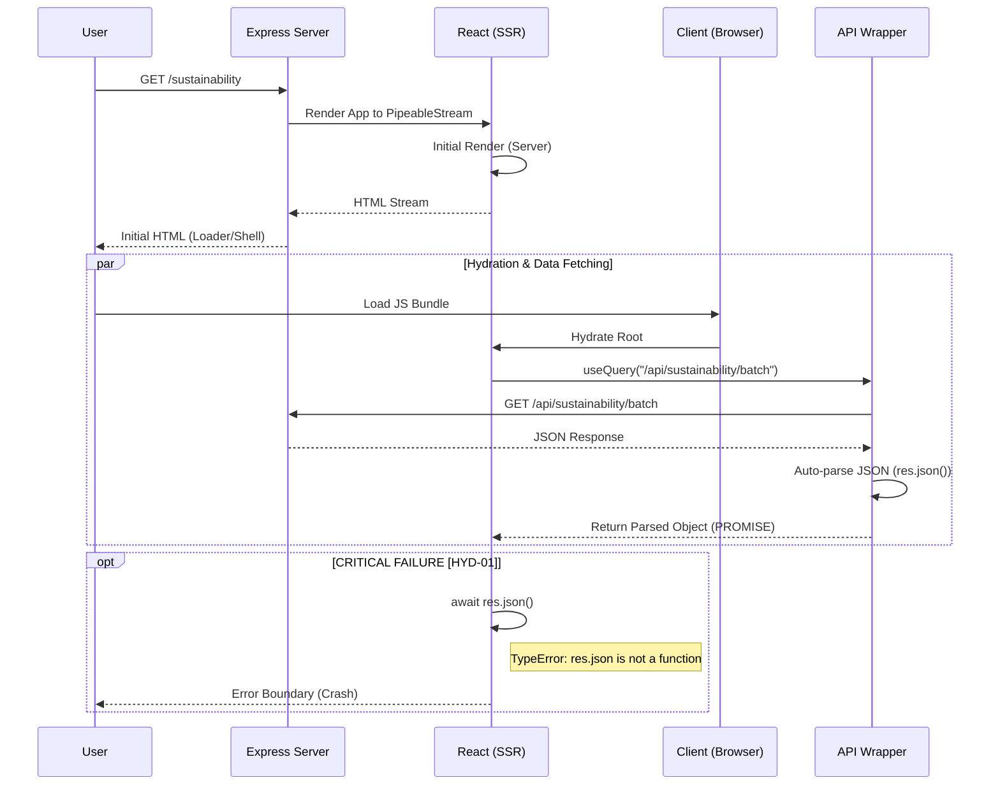

# Hydration Audit Report: RUN-Remix v2.0

## 1. Executive Summary

**Audit Date:** December 22, 2025
**Auditor:** Antigravity Agent
**Application Status:** React 19 + Express 5.1.0 (Full Stack)

### Key Findings

This audit identified **1 Critical Severity** issue causing a complete page crash upon hydration and **2 Medium Severity** issues related to SSR best practices. The application's core architecture is sound, but specific implementations in data fetching and effect management are causing runtime instability.

- **Total Issues Identified:** 3
- **Critical Issues:** 1 (Sustainability Page Crash)
- **Estimated Remediation Effort:** ~2 Hours
- **Overall Hydration Health:** Fair (Critical path blocked on one page, but Home/Products are stable)

### Critical Issue Highlight

The **Sustainability Page** fails immediately during hydration/loading due to a `TypeError: res.json is not a function`. This is caused by a redundant JSON parsing attempt in the component when the API wrapper has already parsed the response.

---

## 2. Hydration Issue Inventory

| Issue ID   | Component                | Application Layer | Type                 | Severity        | Description                                                                                                                                          |
| :--------- | :----------------------- | :---------------- | :------------------- | :-------------- | :--------------------------------------------------------------------------------------------------------------------------------------------------- |
| **HYD-01** | `Sustainability.tsx`     | Data Fetching     | Type D (Async Data)  | 🔴 **CRITICAL** | `TypeError: res.json is not a function`. The component attempts to parse JSON on an already-parsed object returned by `apiRequest`.                  |
| **HYD-02** | `SmoothScrollLayout.tsx` | Layout/UX         | Type C (Browser API) | 🟡 **MEDIUM**   | `useLayoutEffect` used without SSR guard. Causes warning: "useLayoutEffect does nothing on the server".                                              |
| **HYD-03** | `App.tsx`                | Core              | Type B (Conditional) | 🟢 **LOW**      | Extensive `typeof window` checks in render logic `client/src/App.tsx`. While currently safe, it risks hiding hydration mismatches if logic diverges. |

---

## 3. Root Cause Analysis

### HYD-01: Double JSON Parsing in Sustainability Page

- **Location:** `client/src/pages/sustainability.tsx` (Lines 32-34)
- **Mechanism:**
  1. The `useQuery` hook calls `queryFn`.
  2. `queryFn` calls `await apiRequest("/api/sustainability/batch")`.
  3. **Root Cause:** `client/src/lib/api.ts` (Line 102) _automatically_ calls `res.json()` and returns the plain object.
  4. The component receives the plain object as `res` and attempts to call `.json()` on it again.
  5. **Result:** Runtime Crash (`res.json` is undefined on a plain object).
- **Remediation:** Remove `.json()` call in `Sustainability.tsx`.

### HYD-02: Unsafe Layout Effect in Smooth Scroll

- **Location:** `client/src/components/layout/SmoothScrollLayout.tsx` (Line 22)
- **Mechanism:**
  1. `useLayoutEffect` is executed during the React render phase.
  2. On the server (SSR), there is no layout to measure.
  3. React logs a warning because this effect is skipped, potentially leading to a mismatch if the effect was supposed to modify the initial DOM.
- **Remediation:** Replace with `useEffect` or use a conditional helper like `useIsomorphicLayoutEffect`.

---

## 4. Visual Documentation (Mermaid.js)

### 4.1 Server-Client Rendering Pipeline & Error Flow



### 4.2 Defect Root Cause Fishbone

```mermaid
mindmap
  root((Hydration Crash))
    Data Fetching
      Double JSON Parse
        (sustainability.tsx)
          Calls .json() manually
        (api.ts)
          Calls .json() automatically
      Type Mismatch
        Expected: Response Object
        Received: Plain Object
    SSR Compatibility
      useLayoutEffect
        (SmoothScrollLayout.tsx)
          Runs on server (Warning)
      Browser APIs
        (request-manager.ts)
          Global listeners attached safely?
    Component Lifecycle
      Conditional Rendering
        (App.tsx)
          typeof window guards
```

---

## 5. Component Impact Assessment

### Critical Path Components

- **Products Page:** ✅ **Safe**. Verified via navigation test.
- **Home Page:** ✅ **Safe**. Verified via browser capture.
- **Sustainability Page:** ❌ **Broken**. The main data query fails, causing the entire page content to be replaced by the `AppErrorFallback`.
  - **Business Impact:** Users cannot view sustainability metrics or certificates. SEO impact is negative due to error state rendering.

### Performance Impact

- **LCP (Largest Contentful Paint):** The "Kinetic Framework" loader delays LCP until hydration completes.
- **CLS (Cumulative Layout Shift):** `SmoothScrollLayout` using `useLayoutEffect` might cause a shift if `Lenis` modifies DOM styles immediately after hydration.

---

## 6. Remediation Roadmap

### Phase 1: Immediate Fixes (Critical)

**Goal:** Restore functionality to Sustainability page.

1.  **Modify `client/src/pages/sustainability.tsx`**:

    ```typescript
    // BEFORE
    queryFn: async () => {
      const res = await apiRequest("/api/sustainability/batch");
      return res.json(); // ❌ CRASH: res is already JSON
    },

    // AFTER
    queryFn: async () => {
      return await apiRequest("/api/sustainability/batch"); // ✅ CORRECT
    },
    ```

### Phase 2: Best Practices (Medium)

**Goal:** Eliminate console warnings and ensure SSR stability.

1.  **Update `SmoothScrollLayout.tsx`**:

    - Change `useLayoutEffect` to `useEffect` (safe for this use case as Lenis initialization doesn't require synchronous blocking).

    ```typescript
    // client/src/components/layout/SmoothScrollLayout.tsx
    useEffect(() => { // Changed from useLayoutEffect
       const lenisInstance = new Lenis({...});
       // ...
    }, []);
    ```

### Phase 3: Testing Strategy

1.  **Manual Verification:**
    - Visit `/sustainability` in browser.
    - Verify `TypeError` is gone.
    - Verify content loads (metrics, hero).
2.  **Regression Test:**
    - Check Home and Products pages to ensure `apiRequest` works for them (they likely use it correctly already).
3.  **Console Monitor:**
    - Refresh page 5 times and checks for "mismatch" warnings in Console.

---
