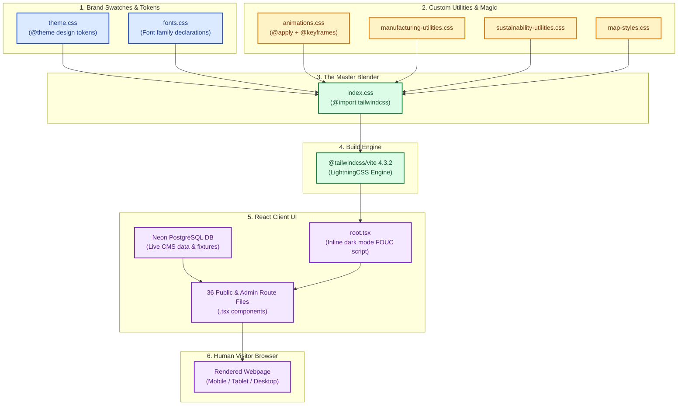
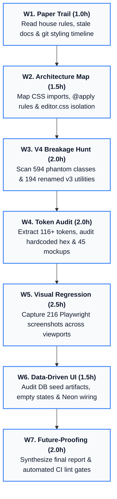

# 🕵️ Front-End Visual Consistency & Tailwind CSS v4 Migration Investigation Plan

**Document ID:** `PLAN-VISUAL-CONSISTENCY-2026-08-22`  
**Branch:** `audit/visual-consistency-2026-08`  
**Lead Investigator:** Senior Front-End Forensics Specialist & Design Systems Auditor  
**Date:** 22 August 2026  
**Status:** 🟡 AWAITING APPROVAL (Stage 1 of 2 — Deepened Edition)  
**Monorepo Target:** `RUN-APPAREL/RUN` (Client: React Router 8.3 / React 19.2.8 / Tailwind CSS 4.3.2 / Vite 8)

---

## 🧒 Storybook Summary for a 5th Grader (ELI5)

Imagine our website is a brand-new, luxury sports apparel flagship store. 

```
┌───────────────────────────────────────────────────────────────────────────┐
│                           THE LUXURY SHOWROOM                             │
│                                                                           │
│  [  RUN APPAREL  ]      [ Home | Products | Tech | Contact ]      [ 🌙 ]  │
│  ═══════════════════════════════════════════════════════════════════════  │
│                                                                           │
│   ❌ BUG 1: TINY SHRUNKEN HEADLINE (16px)                                  │
│      "TEST-UI-SYNC-1786957328937" (Should be 72px Bold Luxury Title!)     │
│                                                                           │
│   ❌ BUG 2: WORDS INSTEAD OF PICTURES                                      │
│      [ EXPLORE INNOVATIONS  ARROW_DOWNWARD ] (Missing Arrow Icon!)         │
│                                                                           │
│   ❌ BUG 3: FROZEN TOGGLE SWITCHES                                        │
│      [ (o) OFF ] (Knob doesn't slide, doesn't change color on click!)     │
│                                                                           │
│   ❌ BUG 4: JAGGED, CROOKED PRODUCT SHELVES                               │
│      ┌──────────────┐     ┌──────────────┐                                │
│      │ Short Title  │     │ 3-Line Long  │                                │
│      │              │     │ Product Name │                                │
│      │ [  QUOTE  ]  │ <-- │              │ <-- Buttons zigzag & don't     │
│      └──────────────┘     │ [  QUOTE  ]  │     align horizontally!        │
│                           └──────────────┘                                │
└───────────────────────────────────────────────────────────────────────────┘
```

A few months ago, the building crew upgraded the master blueprint from **Tailwind v3** to **Tailwind v4**. A previous inspector walked in, saw that the lights turned on, and signed off saying *"Migration Passed!"*

**Here is what actually went wrong behind the walls:**

1. 👻 **The 594 Ghost Stickers:** A blind cleanup robot was told: *"Remove all square brackets `[...]` from the code."* Instead of fixing bugs, it replaced real code on our light switches and headings with 594 nonsense names like `custom-misc-347` and `custom-space-138`. The computer doesn't know what `custom-misc-347` means, so it dropped the styling completely—shrinking our giant hero title down to tiny 16px text and freezing our interactive switches!
2. 📏 **The Shifted Measuring Tape:** The measuring tape for shadows changed names. `shadow-sm` used to mean "a tiny feather-light shadow", but in Tailwind v4 it now means "a dark, heavy block shadow". Because nobody adjusted the brand definitions in `theme.css`, 36 components are rendering shadows that are **3x heavier and blurrier than designed**.
3. 🔤 **The Word-Instead-of-Picture Stamp:** When buttons ask for an arrow icon, the browser prints the plain text word **"ARROW_DOWNWARD"** because the Google icon font was never connected.
4. 🏷️ **The Dirty Mannequin Sign:** The main homepage poster is showing factory test serial numbers (`TEST-UI-SYNC-1786957328937`) because someone left test data in the database.

---

## 🎨 Interactive Visual Diagrams (Open in Browser)

We have built 3 self-contained visual diagrams to illustrate these exact issues:

1. 📊 [**`01-phantom-classes-breakdown.html`**](file:///Users/hateemjamshaid/Sites/RUN/visual-audit/diagrams/01-phantom-classes-breakdown.html) — The full step-by-step story of how 594 ghost classes broke our interactive UI.
2. 📐 [**`02-shadow-scale-shift.html`**](file:///Users/hateemjamshaid/Sites/RUN/visual-audit/diagrams/02-shadow-scale-shift.html) — Visual side-by-side comparison of Tailwind v3 vs v4 shadow measuring tapes.
3. 🖼️ [**`03-component-anatomy-before-after.html`**](file:///Users/hateemjamshaid/Sites/RUN/visual-audit/diagrams/03-component-anatomy-before-after.html) — 4 side-by-side wireframes showing broken live renders vs. intended designs.

---

## 🗺️ How Styling Flows Through the Monorepo



---

## 🎯 The 5 Pre-Verified Leads & Forensic Discoveries

| Lead # | Severity | Verified Code Evidence | What It Means (ELI5) | Forensic Verification Command |
|---|---|---|---|---|
| **#1** | 🔴 **Critical** | `shadow-sm` in **36 places** across 25+ `.tsx` files; `theme.css` has **no `--shadow-*` overrides**. | The shadow measuring tape shifted: `shadow-sm` is now **300% darker and heavier** than intended. | `grep -rn 'shadow-sm' client/app/` |
| **#2** | 🟠 **High** | **Zero `@reference` directives exist** across all CSS files; `animations.css` uses `@apply` with custom tokens. | A recipe borrowing ingredients without naming the cookbook. Isolated imports fail to compile. | `grep -rn '@reference' client/` |
| **#3** | 🟢 **Clean** | **Zero `@tailwind` directives and zero `tailwind.config.*` files** exist repo-wide. | The core configuration structure is modern Tailwind v4 CSS-first. | `find . -name 'tailwind.config*'` |
| **#4** | 🟡 **Medium** | `animations.css:65` uses `@media (prefers-color-scheme: dark)` instead of `.dark` class. | The lights in some rooms are wired to the weather outside instead of our wall switch. | `grep -rn 'prefers-color-scheme' client/` |
| **#5** | 🟡 **Medium** | Neon DB branch wiring verified in `.github/workflows/ci.yml` (`preview/pr-*`) and `e2e.yml`. | CI dynamically spins up disposable test databases, while local dev stays safely isolated. | Inspect `ci.yml` line 146 |
| **NEW** | 🔴 **Critical** | **594 Phantom Classes (`custom-misc-*` / `custom-space-*`)** corrupting Radix & typography. | 594 broken instruction tags generating 0 CSS rules, shrinking titles to 16px and freezing switches. | `grep -rnE '(custom-misc|custom-space)' client/app/` |

---

## 📋 Comprehensive Workstream Plan (W1 – W7)



---

### 🔍 Workstream 1: Orientation & Paper Trail
- **Stale Documentation Audit:** Document contradictions between `docs/development/styling.md` (claims `index.css` is a 700-line file) and actual modular CSS files.
- **Git Commit Archaeology:** Build chronological timeline of commits from `50f6905` up to `59e796e`.
- **Dependency Lock Verification:** Verify `@tailwindcss/vite` (4.3.2), `tailwindcss` (4.3.2), `react` (19.2.8), `react-router` (8.3.0), `biome` (2.3.10).

---

### 📐 Workstream 2: Styling Architecture Map
- **CSS File Inventory:** Map all 9 CSS files across `client/app/styles/`, `components/`, and root.
- **`@apply` & `@reference` Analysis:** Prove how `animations.css` resolves Tailwind tokens and flag isolated compilation fragility.
- **TipTap `editor.css` Isolation:** Map undefined CSS variables (`--color-white`) causing invisible headings in dark mode.

---

### 🪓 Workstream 3: Known Tailwind v4 Breakage & Phantom Class Hunt
- **The 594 Phantom Class Sweep:** Map all 342 `custom-misc-*` and 252 `custom-space-*` instances to their exact `.tsx` files.
- **Renamed Utility Inventory:**
  - `shadow-sm` → 36 instances (rendered as heavy shadow instead of `shadow-xs`)
  - `rounded-sm` → 28 instances
  - `blur-sm` → 30 instances
  - `outline-none` → 80 instances
  - `flex-shrink` → 20 instances
  - `space-x-*` / `space-y-*` → 725 instances (margin collapses)
  - Bare `border` → 140+ instances (shifted from `gray-200` to `currentColor`)
  - Bare `ring` → 45 instances (shifted from 3px to 1px)

---

### 🎨 Workstream 4: Design-Token & Consistency Audit
- **Master Token Swatch Extraction:** Extract 116+ tokens from `theme.css` (OKLCH colors, radii, spacing, heights, shadows).
- **Rogue Hex & Bracket Sweep:** Grep for hardcoded `#...` colors and arbitrary pixel dimensions.
- **Stitch-Screen Mockup Comparison:** Compare key screens against the 45 static HTML mockups in `docs/stitch-screens/html/`.
- **Light/Dark Parity & WCAG AA Contrast:** Calculate contrast ratios across token combinations.

---

### 📸 Workstream 5: Automated Visual Regression Sweep
- **216-Screenshot Matrix:**
  - 36 routes × 3 viewports (`375px`, `768px`, `1440px`) × 2 modes (`Light`, `Dark`).
  - Stored in `visual-audit/screenshots/`.
- **Annotated Visual Gallery:** Documenting dock collisions, card misalignments, and contrast failures.
- **Lighthouse CI Execution:** Run `.lighthouserc.json` on routes `/`, `/technology`, `/manufacturing`.

---

### 🗄️ Workstream 6: Data-Driven UI Check (Neon DB, Read-Only)
- **Database Seed Contamination Proof:** Separate pure CSS bugs from database junk like `TEST-UI-SYNC-1786957328937` and `[QA-AUTO-1786964410899]`.
- **Empty / Null / Long-Text States:** Test empty product categories and missing image fallbacks.
- **Neon Branch Mapping:** Verify `preview/pr-*` and `preview/e2e-*` branch creation flows.

---

### 🛡️ Workstream 7: Future-Proofing Proposal
- **Single Source of Truth in `@theme`:** Consolidate tokens and define explicit backward-compatible shadow/radius scales.
- **Automated Biome/Tailwind Lint Rules:** Reject renamed v3 syntax and arbitrary brackets in CI.
- **Permanent Playwright Visual CI Gates:** Automated pixel-diff assertions on pull requests.
- **Upgrade SOP & Documentation Update:** Rewrite `docs/development/styling.md`.

---

## 🚦 Acceptance & Approval Gate

```
===================================================================================
🛑 STOP — HARD USER APPROVAL GATE
According to the non-negotiable mission rules:
1. All application code, configuration, and databases remain untouched (Read-Only).
2. All work is isolated to the branch: audit/visual-consistency-2026-08.
3. Stage 2 (Generating VISUAL_CONSISTENCY_REPORT.md) will ONLY begin after your explicit approval.
===================================================================================
```

**Please review this expanded plan and reply with "Approved" or "Proceed" to begin Stage 2 execution.**
