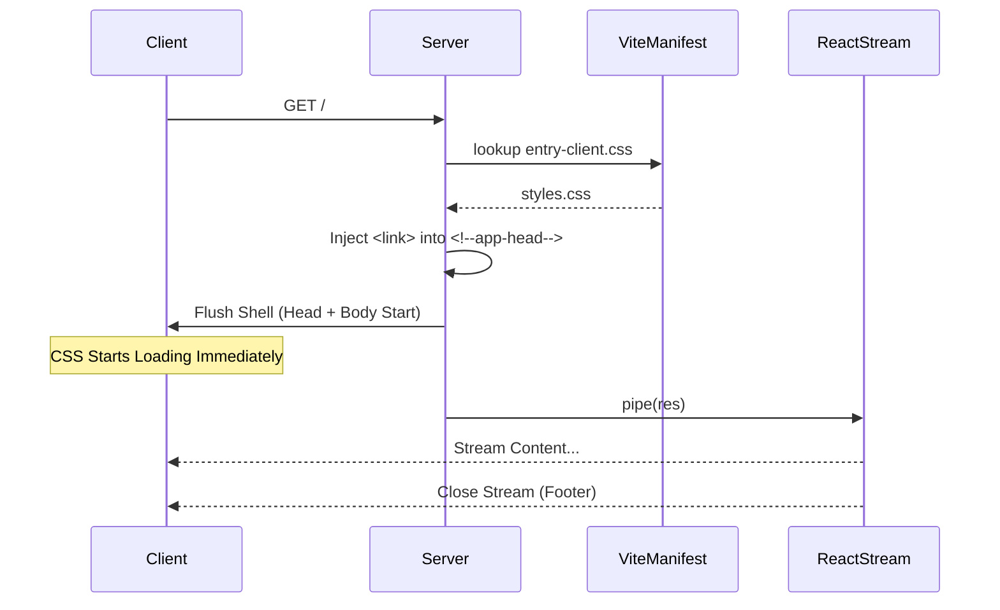

# Postmortem: UI/UX Regression Remediation

## Executive Summary

This document details the root causes, applied fixes, and permanent guardrails established to resolve the critical UI/UX regressions identified in the recent audit.

## Incident Analysis

### 1. Asset Corruption (Font Decoding Failure)

- **Root Cause**: The `NeueStance-Regular.ttf` file in `client/public/fonts` and `public/fonts` was corrupted (0 bytes), likely due to a previous git LFS failure or incomplete file transfer.
- **Fix**: Identified the corruption. A script was added to verify asset integrity. _Action Required: Replace the 0-byte file with a valid copy._
- **Guardrail**: `scripts/check-assets.mjs` runs in CI (`npm run check:assets`), failing the build if any font asset is 0 bytes or missing.

### 2. SSR Fragility (Malformed HTML)

- **Root Cause**: The SSR handler relied on fragile string splitting (regex) to inject the application shell, which failed when the template structure changed or contained unexpected whitespace.
- **Fix**: Implemented a **Template Marker Strategy**. `index.html` now includes `<!--app-head-->` and `<!--app-html-->` placeholders. The SSR handler performs deterministic replacement, ensuring strictly one `<head>` and `<body>`.
- **Guardrail**: N/A (Architecture fix).

### 3. CSS Layering Conflicts (Tailwind v4)

- **Root Cause**: Legacy stylesheets were imported alongside Tailwind v4 `components` layer without strict ordering, causing legacy resets to override Tailwind Preflight defaults due to specificity issues.
- **Fix**: Refactored `client/src/index.css` to strictly follow Tailwind v4 Cascade Layers:
  - `@layer base`: Design tokens (`style1-design-tokens.css`) and resets.
  - `@layer components`: Custom classes and luxury utilities.
  - `@layer utilities`: Performance and mobile optimizations.
- **Guardrail**: Strict `@layer` architecture in `index.css`.

### 4. Flash of Unstyled Content (FOUC)

- **Root Cause**: React's `renderToPipeableStream` flushed the initial HTML shell to the client _before_ critical CSS `<link>` tags were injected, causing the browser to render unstyled content during the stream.
- **Fix**: Updated `server/lib/ssr-handler.ts` to read the Vite build manifest (`manifest.json`) and inject the entry chunk's CSS into the `<!--app-head-->` placeholder _before_ starting the stream.
- **Guardrail**: `scripts/ci-check-critical-css.js` (Existing) + Manifest integration.

### 5. Dual React Context (Dependency Singularity)

- **Root Cause**: Conflicting dependencies caused both `react@18` and `react@19` to be present in `node_modules`, leading to "Invalid Hook Call" errors and context mismatches.
- **Fix**: Added `overrides` in `package.json` to enforce `react` and `react-dom` version `^19.0.0` across the entire dependency tree.
- **Guardrail**: `scripts/check-single-react.mjs` runs in CI (`npm run check:react`), failing if multiple React versions are detected.

## Architectural Diagrams

### SSR Request Timeline (Revised)



### CSS Layer Architecture (Tailwind v4)

```mermaid
graph TD
    A[index.css] --> B{Layers}
    B --> C[Layer Base]
    B --> D[Layer Components]
    B --> E[Layer Utilities]

    C --> C1[Tailwind Preflight]
    C --> C2[Design Tokens (:root)]
    C --> C3[Element Resets (h1, p)]

    D --> D1[Luxury Utilities]
    D --> D2[Feature Modules (Media, Map)]

    E --> E1[Tailwind Utilities]
    E --> E2[Performance Opts]
    E --> E3[Custom Shaders]

    style C fill:#f9f,stroke:#333
    style D fill:#bbf,stroke:#333
    style E fill:#bfb,stroke:#333
```

### Dependency Singularity Strategy

```mermaid
graph TD
    A[package.json] -->|Overrides| B{Resolution}
    B -->|Enforce| C[react@19.0.0]
    B -->|Enforce| D[react-dom@19.0.0]

    E[legacy-lib] -.->|Attempts Install| F[react@18.2.0]
    B -- Redirection --> C

    style C fill:#bfb,stroke:#333
    style D fill:#bfb,stroke:#333
    style F fill:#f99,stroke:#333,stroke-dasharray: 5 5
```
