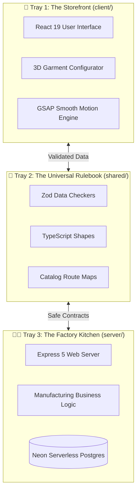

# RUN Remix — The Magical 3D Sportswear Factory

**Version:** 4.1.2 | **Port:** 5002 (Exclusively) | **Engine:** Antigravity AI & React 19 | **License:** MIT | **Heritage:** Durus Industries (Est. 1889)

[](./LICENSE)
[](https://nodejs.org)
[](https://react.dev)
[](https://www.typescriptlang.org)
[](https://vite.dev)
[](https://tailwindcss.com)
[](https://expressjs.com)
[](https://biomejs.dev)
[](https://scorecard.dev/viewer/?site=github.com/hateem2121/RUN)
[](./CONTRIBUTING.md)

---

## 📖 Welcome to the Digital Sportswear Factory

Imagine walking into a magical workshop where giant looms spin soft cotton into high-performance athletic jerseys, while friendly robots help design custom 3D team uniforms in real time.

That is **RUN Remix**! It is an open-source, AI-native digital manufacturing platform created for **RUN APPAREL (PVT) LTD** (a sustainable sportswear manufacturer based in Sialkot, Pakistan, carrying on a family textile heritage dating back to **1889** with Durus Industries).

This software connects the physical garment factory — with its solar-powered sewing machines, recycled water dyeing tubs, and master tailors — to the digital world so athletic brands across the globe can design, customize, and order high-performance sportswear with zero waste.

```
                  THE RUN REMIX FACTORY AT A GLANCE
  
   🧵 PHYSICAL CRAFT                         💻 DIGITAL MAGIC
  ┌─────────────────────────┐               ┌─────────────────────────┐
  │ • Sialkot Heritage 1889 │               │ • React 19 Frontend     │
  │ • 100,000+ Units/Month  │  ◄─────────►  │ • 3D Garment Config     │
  │ • 80% Solar Powered     │               │ • Express 5 API Server  │
  │ • 85% Recycled Water    │               │ • Neon Serverless SQL   │
  └─────────────────────────┘               └─────────────────────────┘
```

---

## 🪞 What Does the Website Look Like

When you turn on the server, you are greeted by an industrial, high-contrast storefront featuring an interactive 3D digital showroom:

```
┌─────────────────────────────────────────────────────────────────────────┐
│ [ RUN APPAREL ]    Products   Fabrics   Sustainability   About   [Quote]│
├─────────────────────────────────────────────────────────────────────────┤
│                                                                         │
│   ENGINEERING HIGH-PERFORMANCE                                          │
│   ATHLETIC SPORTSWEAR                                                   │
│                                                                         │
│   ┌─────────────────────────┐        ┌──────────────────────────────┐   │
│   │                         │        │  ⚡ 3D DIGITAL TWIN VIEWER   │   │
│   │   [ Explore Catalog ]   │        │                              │   │
│   │                         │        │      /$$$$$$  /$$            │   │
│   │   [ Fabric Library ]    │        │     | $$__  $$| $$           │   │
│   │                         │        │     | $$  \__/| $$  /$$$$$$  │   │
│   │   [ Sustainability ]    │        │     |  $$$$$$ | $$ /$$__  $$ │   │
│   │                         │        │      \____  $$| $$| $$  \ $$ │   │
│   │   • 80% Solar Powered   │        │      /$$  \ $$| $$| $$  | $$ │   │
│   │   • Zero Toxic Dyes     │        │     |  $$$$$$/| $$|  $$$$$$$ │   │
│   │   • Fast 4-Week Delivery│        │      \______/ |__/ \_______/ │   │
│   └─────────────────────────┘        │      [ Rotate ]  [ Zoom ]    │   │
│                                      └──────────────────────────────┘   │
├─────────────────────────────────────────────────────────────────────────┤
│ 🏆 Certified by SMETA (Sedex) • GOTS Organic • OEKO-TEX 100 • ISO 9001  │
└─────────────────────────────────────────────────────────────────────────┘
```

---

## 🏗️ How the System Fits Together

Think of RUN Remix like a giant LEGO project organized into **3 color-coded trays**:



### The 3 Big Building Trays

1. **Tray 1: The Storefront (`client/`)** — The colorful window display and dressing room where visitors browse products, zoom into fabric stitches, and spin 3D jerseys. Built with **React 19**, **Vite 8**, and **Tailwind CSS v4**.
2. **Tray 2: The Universal Rulebook (`shared/`)** — The shared dictionary that makes sure the storefront and the kitchen speak the exact same language. Written with **Zod** and **TypeScript**.
3. **Tray 3: The Factory Kitchen (`server/`)** — The quiet powerhouse where orders are checked, calculations are run, and information is safely stored in **Neon Serverless PostgreSQL** database.

---

## 🤖 Meet the Robot Assistant Crew

RUN Remix uses specialized AI agent assistants to build, check, and polish every feature before it reaches real athletes:

| Robot Assistant | Persona | What They Do |
|-----------------|---------|--------------|
| `/office-hours` | 👔 **The Big Boss (CEO)** | Sets big goals, listens to customer ideas, and guides company vision. |
| `/plan-ceo-review` | 🎯 **The Product Strategist** | Checks if a new feature makes sense for players and coaches. |
| `/plan-eng-review` | 📐 **The Master Builder (Lead Eng)** | Inspects blueprints, data pipes, and safety locks so nothing breaks. |
| `/plan-design-review` | 🎨 **The Creative Director (Design Lead)** | Makes sure screens look gorgeous, easy to tap, and fun to look at. |
| `/grill-me` | 🎙️ **The Friendly Interviewer** | Asks questions one by one until everyone is on the exact same page. |
| `/writing-plans` | 📝 **The Scribe** | Writes step-by-step checklists so work gets done without mistakes. |
| `/qa` | 🔍 **The Quality Inspector** | Tests the website in real browsers to make sure every button works. |

---

## ⚡ Quick Start: Turn On the Factory in 3 Steps

Want to run the factory on your own computer? It only takes a couple of minutes!

### Step 1: Download the Blueprints

```bash
# Clone the repository
git clone <repository-url>
cd RUN
```

### Step 2: Open the Tool Box

Make sure you have [Node.js v24+](https://nodejs.org) installed on your computer.

```bash
# Install all required building blocks
npm install

# Create your settings file
cp .env.example .env
```

### Step 3: Push the Green Start Button

```bash
# Verify all safety checks pass
npm run verify:tech-integrity

# Start the live development factory
npm run dev
```

Now open your web browser and navigate to **`http://localhost:5002`** (the factory always runs on port 5002)!

---

## 🌿 Sustainable & Green Manufacturing

RUN APPAREL believes that making great sportswear shouldn't harm our planet:

- ☀️ **80% Solar Powered:** Over 1,200 rooftop solar panels power the factory floor.
- 💧 **Zero Liquid Discharge:** 85% of dyehouse water is purified and recycled on-site.
- 🌿 **Organic & Recycled Fibers:** GOTS-certified organic cotton and GRS-certified recycled polyester.
- 🤝 **Fair & Safe Workplace:** SMETA 4-pillar certified social audits guaranteeing fair living wages and safe working conditions.

---

## 📚 Explore the Community & Documentation

Here are all the friendly guides to help you explore and contribute to RUN Remix:

| Document | What You Will Learn |
|----------|---------------------|
| [📜 **Playground License**](./LICENSE) | The friendly MIT rule: share freely, create awesome things, keep the credit tag. |
| [💖 **Code of Conduct**](./CODE_OF_CONDUCT.md) | How we treat each other with kindness, respect, and great sportsmanship. |
| [🧱 **How to Contribute**](./CONTRIBUTING.md) | Step-by-step guide to building a new Lego brick and submitting your first Pull Request. |
| [🛡️ **Security Policy**](./SECURITY.md) | How our safety watchdogs protect customer data and how to report bugs safely. |
| [💬 **Support & Clubhouse**](./SUPPORT.md) | Where to ask questions, chat with the maintainers, or inquire about B2B apparel. |
| [🎓 **Cite This Project**](./CITATION.cff) | How to give credit to RUN Remix in school projects, papers, or 3D research. |
| [🧭 **The Illustrated Wiki**](./docs/wiki/Home.md) | A complete 6-chapter visual storybook exploring every corner of the factory. |
| [🔭 **GitHub UI Guide**](./docs/github-guide/README.md) | Explains Stars, Watchers, Forks, Activity logs, and how GitHub works. |

---

## 🏢 Commercial Inquiries & Factory Visits

RUN Remix is maintained by the engineering and manufacturing teams at **RUN APPAREL (PVT) LTD**:

- **Headquarters:** 13 Km Daska Road, Sialkot, Punjab, Pakistan
- **Lead Maintainer:** M. Hateem Jamshaid (Business Development Director)
- **Official Email:** `hateem@runapparel.com`
- **WhatsApp Support:** `+92-336-1777313`
- **Website:** [wear-run.com](https://wear-run.com)
