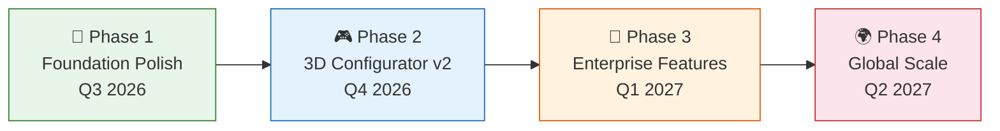

# 🗺️ RUN Remix Product Roadmap

**Project:** RUN Remix (`run-remix`)
**Maintained by:** RUN APPAREL (PVT) LTD / Durus Industries
**Last Updated:** August 2026

---

## 🎯 Vision

RUN Remix aims to become the world's most accessible open-source platform for B2B sportswear manufacturing — connecting physical factory floors with digital 3D design tools, AI-powered workflows, and sustainable supply chain transparency.

---

## 🛤️ The Road Ahead



---

## 🔧 Phase 1 — Foundation Polish (Q3 2026)

> **Theme:** Make everything rock-solid and beautifully documented

```
 Progress: ████████████████████░░░░ 85%
```

| Status | Feature | Description |
|--------|---------|-------------|
| ✅ Done | Community Health Files | All GitHub community docs refreshed with visual diagrams |
| ✅ Done | Security Hardening | Rate limiting, CSP headers, supply chain protection |
| ✅ Done | Accessibility Audit | WCAG 2.2 AA compliance across all public routes |
| ✅ Done | Semantic Search | AI-powered natural language product search (pgvector) |
| 🚧 In Progress | E2E Test Suite | Full 7-domain Playwright verification suite |
| 📋 Planned | Performance Optimization | Sub-2s LCP on mobile, image lazy loading |

---

## 🎮 Phase 2 — 3D Configurator v2 (Q4 2026)

> **Theme:** Next-generation interactive garment visualization

```
 Progress: ░░░░░░░░░░░░░░░░░░░░░░░░ 0%
```

| Status | Feature | Description |
|--------|---------|-------------|
| 📋 Planned | Real-time Fabric Preview | See how fabrics drape and move on 3D models |
| 📋 Planned | Color Customization | Pantone swatch palette for team color matching |
| 📋 Planned | Size Visualization | See how garments look across different body sizes |
| 💡 Exploring | AR Try-On | Augmented reality preview on mobile devices |

---

## 🏢 Phase 3 — Enterprise Features (Q1 2027)

> **Theme:** Tools for large-scale B2B manufacturing partners

```
 Progress: ░░░░░░░░░░░░░░░░░░░░░░░░ 0%
```

| Status | Feature | Description |
|--------|---------|-------------|
| 📋 Planned | Multi-tenant Dashboard | Brand-specific portals with order tracking |
| 📋 Planned | Automated RFQ Pipeline | Request-for-quote workflow with approval chains |
| 📋 Planned | Supply Chain Transparency | Real-time sustainability metrics dashboard |
| 💡 Exploring | EDI Integration | Electronic data interchange with enterprise systems |

---

## 🌍 Phase 4 — Global Scale (Q2 2027)

> **Theme:** Serving athletic brands worldwide

```
 Progress: ░░░░░░░░░░░░░░░░░░░░░░░░ 0%
```

| Status | Feature | Description |
|--------|---------|-------------|
| 💡 Exploring | Multi-language Support | i18n for Arabic, Urdu, Chinese, Spanish |
| 💡 Exploring | CDN Media Delivery | Global edge caching for 3D assets |
| 💡 Exploring | Mobile App | React Native companion app for factory floor |

---

## 📊 Status Legend

| Icon | Meaning |
|------|----------|
| ✅ Done | Shipped and available in the current release |
| 🚧 In Progress | Actively being worked on right now |
| 📋 Planned | Confirmed for the roadmap, work has not started yet |
| 💡 Exploring | Idea under consideration — may or may not happen |

---

## 💬 Have Suggestions?

We love hearing ideas from the community! If you have thoughts about what should be on our roadmap:

- Open a [💡 Feature Request](https://github.com/RUN-APPAREL/RUN/issues/new?template=feature_request.yml)
- Start a discussion (`<repository-url>/discussions`)
- Email us at `hateem@runapparel.com`
