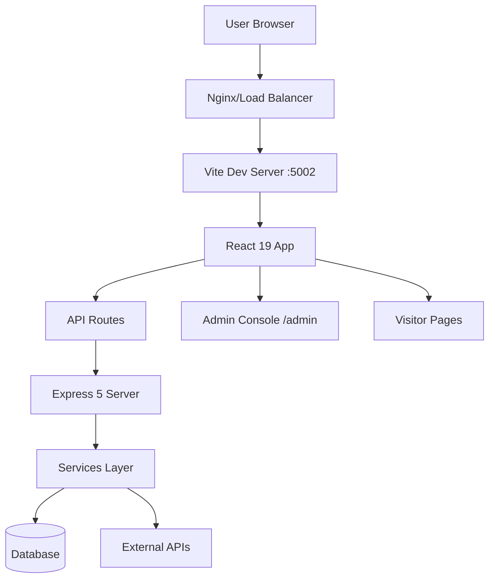
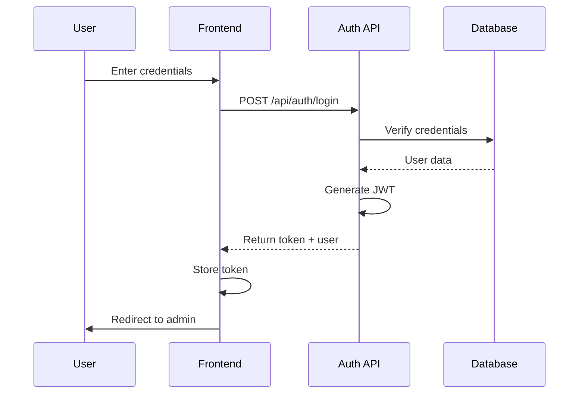
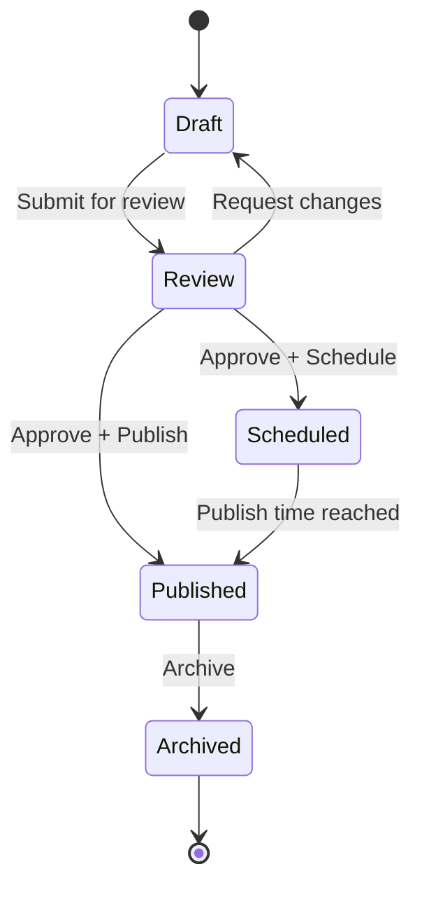
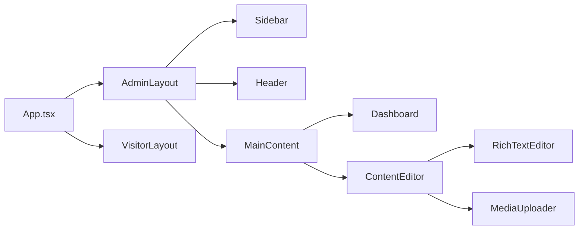
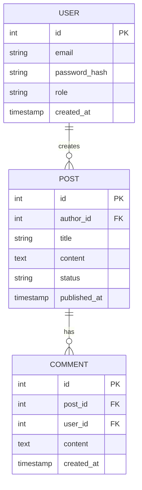

# CMS FORENSIC AUDIT - SCORING RUBRIC & QUICK REFERENCE

## Overview
This document provides detailed scoring criteria and quick reference checklists to accompany the main forensic audit prompt for the RUN Remix CMS Admin System.

---

## Detailed Scoring Methodology

### Overall Score Formula
```
TOTAL SCORE = (Security × 30%) + (Performance × 20%) + (Code Quality × 20%) + 
              (Accessibility × 15%) + (UI/UX × 10%) + (Architecture × 5%)
```

### Score Interpretation
| Range | Grade | Status | Action Required |
|-------|-------|--------|----------------|
| 90-100 | A+ | Excellent | Production-ready, minor enhancements |
| 75-89 | A | Good | Minor improvements, safe for production |
| 60-74 | B | Fair | Significant work before production |
| 40-59 | C | Poor | Major overhaul required |
| 0-39 | F | Critical | Not production-ready, blocking issues |

---

## 1. SECURITY SCORING (30% Weight)

### Score Calculation
```
Security Score = 100 - (Critical × 20) - (High × 10) - (Medium × 5) - (Low × 2)

Minimum Score: 0
Deductions capped at 100 points total
```

### Severity Definitions

#### 🔴 Critical (20 points each)
- Authentication bypass
- SQL Injection exploits
- Remote Code Execution (RCE)
- Exposed credentials in code
- Admin access without authentication
- Direct object reference manipulation
- XSS on admin pages allowing account takeover

#### 🟠 High (10 points each)
- CSRF on state-changing operations
- Weak password policies
- Missing rate limiting on authentication
- Insecure session management
- Missing security headers
- Path traversal vulnerabilities
- Sensitive data exposure

#### 🟡 Medium (5 points each)
- Missing input validation
- Verbose error messages
- Outdated dependencies with known CVEs
- Missing HTTPS enforcement
- Weak Content Security Policy
- Cookie security flags missing

#### 🟢 Low (2 points each)
- Information disclosure in headers
- Missing security.txt file
- Unused dependencies
- Debug mode enabled

### Security Checklist

**OWASP Top 10 Coverage:**
- [ ] A01: Broken Access Control - Tested
- [ ] A02: Cryptographic Failures - Verified encryption
- [ ] A03: Injection - All inputs sanitized
- [ ] A04: Insecure Design - Threat model exists
- [ ] A05: Security Misconfiguration - Hardened
- [ ] A06: Vulnerable Components - Up to date
- [ ] A07: Auth Failures - Multi-factor available
- [ ] A08: Integrity Failures - CI/CD secured
- [ ] A09: Logging Failures - Audit trail complete
- [ ] A10: SSRF - URL validation present

**Additional Checks:**
- [ ] Passwords hashed with bcrypt/Argon2
- [ ] API keys stored in environment variables
- [ ] CORS properly configured
- [ ] JWT tokens with expiration
- [ ] Admin routes protected with middleware
- [ ] File upload validation (type, size, content)
- [ ] Database queries parameterized
- [ ] XSS protection on all user input
- [ ] CSRF tokens on forms

---

## 2. PERFORMANCE SCORING (20% Weight)

### Score Calculation
```
Performance Score = (Lighthouse Performance × 40%) + 
                   (Core Web Vitals × 40%) + 
                   (Backend API Speed × 20%)
```

### Lighthouse Performance Targets
| Metric | Target | Points |
|--------|--------|--------|
| Performance | 90+ | 40 |
| Performance | 75-89 | 30 |
| Performance | 60-74 | 20 |
| Performance | <60 | 0 |

### Core Web Vitals Scoring

#### LCP (Largest Contentful Paint)
- <2.5s: 40 points
- 2.5-4s: 20 points
- >4s: 0 points

#### FID (First Input Delay)
- <100ms: 40 points
- 100-300ms: 20 points
- >300ms: 0 points

#### CLS (Cumulative Layout Shift)
- <0.1: 40 points
- 0.1-0.25: 20 points
- >0.25: 0 points

### Backend Performance
- Average API response <200ms: 20 points
- 200-500ms: 10 points
- >500ms: 0 points

### Performance Checklist
- [ ] Lighthouse score >90 (mobile)
- [ ] Lighthouse score >90 (desktop)
- [ ] LCP <2.5s
- [ ] FID <100ms
- [ ] CLS <0.1
- [ ] TTI <3.8s
- [ ] TBT <200ms
- [ ] Bundle size <250KB (gzipped)
- [ ] Images optimized (WebP/AVIF)
- [ ] Lazy loading implemented
- [ ] Code splitting active
- [ ] API responses cached
- [ ] Database indexes present
- [ ] No N+1 queries
- [ ] CDN configured

---

## 3. CODE QUALITY SCORING (20% Weight)

### Score Calculation
```
Code Quality = (TypeScript Strictness × 25%) + 
               (Test Coverage × 25%) + 
               (Code Duplication × 25%) + 
               (Linting Compliance × 25%)
```

### TypeScript Strictness (25 points)
- Strict mode enabled: +15
- No `any` types: +10
- Interfaces well-defined: +5
- Maximum: 25 points

**Deductions:**
- Each `any` type: -2 points
- Missing strict mode: -15 points
- Poor type definitions: -5 points

### Test Coverage (25 points)
| Coverage | Points |
|----------|--------|
| 80%+ | 25 |
| 60-79% | 18 |
| 40-59% | 10 |
| 20-39% | 5 |
| <20% | 0 |

### Code Duplication (25 points)
| Duplication % | Points |
|---------------|--------|
| 0-5% | 25 |
| 6-10% | 18 |
| 11-20% | 10 |
| 21-30% | 5 |
| >30% | 0 |

### Linting Compliance (25 points)
- 0 errors: 25 points
- 1-10 errors: 15 points
- 11-50 errors: 5 points
- >50 errors: 0 points

### Code Quality Checklist
- [ ] TypeScript strict mode enabled
- [ ] No `any` types used
- [ ] Biome configured and passing
- [ ] Code coverage >80%
- [ ] All tests passing
- [ ] No console.log in production
- [ ] No commented-out code blocks
- [ ] Functions <50 lines
- [ ] Files <300 lines
- [ ] Cyclomatic complexity <10
- [ ] DRY principles followed
- [ ] SOLID principles applied
- [ ] Documentation present
- [ ] No TODO/FIXME without tickets

---

## 4. ACCESSIBILITY SCORING (15% Weight)

### Score Calculation
```
Accessibility = (WCAG Compliance × 50%) + 
                (Keyboard Navigation × 30%) + 
                (Screen Reader × 20%)
```

### WCAG 2.2 Level AA Compliance (50 points)
- 0 violations: 50 points
- 1-5 violations: 35 points
- 6-15 violations: 20 points
- 16-30 violations: 10 points
- >30 violations: 0 points

### Keyboard Navigation (30 points)
- All features accessible: 30 points
- Most features accessible: 20 points
- Some features accessible: 10 points
- Keyboard traps present: 0 points

### Screen Reader Compatibility (20 points)
- Full compatibility: 20 points
- Mostly compatible: 12 points
- Partially compatible: 5 points
- Major issues: 0 points

### Accessibility Checklist
- [ ] Color contrast ≥4.5:1 (normal text)
- [ ] Color contrast ≥3:1 (large text)
- [ ] UI component contrast ≥3:1
- [ ] Alt text on all images
- [ ] ARIA labels where needed
- [ ] Semantic HTML used
- [ ] Heading hierarchy logical
- [ ] Focus indicators visible
- [ ] Keyboard navigation complete
- [ ] Skip links present
- [ ] Form labels associated
- [ ] Error messages descriptive
- [ ] No color-only indicators
- [ ] `prefers-reduced-motion` respected
- [ ] Screen reader tested

---

## 5. UI/UX SCORING (10% Weight)

### Score Calculation
```
UI/UX = (Dark/Light Mode × 40%) + 
        (Responsive Design × 30%) + 
        (Visual Consistency × 30%)
```

### Dark/Light Mode Parity (40 points)
```
Score = (Components Passing / Total Components) × 40
```

**Passing Criteria per Component:**
- Light mode contrast WCAG compliant
- Dark mode contrast WCAG compliant
- Theme toggle works
- Colors appropriate for both modes
- No visual bugs in either mode

### Responsive Design (30 points)
- Mobile (320-767px): 10 points
- Tablet (768-1023px): 10 points
- Desktop (1024px+): 10 points

**Deductions:**
- Horizontal scroll: -5 points
- Broken layout: -10 points per breakpoint
- Touch targets <44px: -2 points each

### Visual Consistency (30 points)
- Spacing consistent: 10 points
- Typography consistent: 10 points
- Colors from palette: 10 points

### UI/UX Checklist
- [ ] Dark mode implemented
- [ ] Light mode implemented
- [ ] Theme toggle functional
- [ ] Theme persists on reload
- [ ] Dark/light parity >90%
- [ ] Mobile responsive
- [ ] Tablet responsive
- [ ] Desktop responsive
- [ ] Touch targets ≥44px
- [ ] Spacing system consistent
- [ ] Typography scale consistent
- [ ] Color palette documented
- [ ] Loading states present
- [ ] Error states styled
- [ ] Empty states designed
- [ ] Animations smooth
- [ ] No FOUC

---

## 6. ARCHITECTURE SCORING (5% Weight)

### Score Calculation
```
Architecture = (Folder Structure × 30%) + 
               (Separation of Concerns × 30%) + 
               (Scalability × 40%)
```

### Folder Structure (30 points)
- RUN Remix conventions followed: 30 points
- Mostly consistent: 20 points
- Some inconsistencies: 10 points
- Poor structure: 0 points

### Separation of Concerns (30 points)
- Controllers thin, services thick: 30 points
- Some business logic in controllers: 15 points
- Most logic in controllers: 0 points

### Scalability (40 points)
- Horizontal scaling ready: 40 points
- Some refactoring needed: 25 points
- Major changes needed: 10 points
- Not scalable: 0 points

### Architecture Checklist
- [ ] `/client/app/components/ui/` for generic UI
- [ ] `/client/app/components/[domain]/` for specific
- [ ] `/server/routes/` thin controllers
- [ ] `/server/services/` business logic
- [ ] API versioning strategy
- [ ] Database migrations tracked
- [ ] Environment configs separated
- [ ] Dependency injection used
- [ ] Stateless design (where possible)
- [ ] Cache strategy defined
- [ ] Error handling centralized
- [ ] Logging strategy consistent

---

## Dark/Light Mode Detailed Checklist

### Implementation Checklist
- [ ] CSS Variables defined for colors
- [ ] `@media (prefers-color-scheme: dark)` implemented
- [ ] Manual toggle button present
- [ ] Toggle state persisted (localStorage)
- [ ] System preference respected
- [ ] Smooth transition between modes (<300ms)

### Color Palette Audit
- [ ] Pure black (#000) avoided in dark mode
- [ ] Dark gray (#121212 or similar) used instead
- [ ] Accent colors desaturated for dark mode
- [ ] Brand colors tested in both modes
- [ ] Status colors (success/warning/error) work in both
- [ ] Disabled states visible in both modes

### Component-by-Component Audit
For EACH component, verify:

**Buttons:**
- [ ] Light mode text contrast ≥4.5:1
- [ ] Dark mode text contrast ≥4.5:1
- [ ] Hover states visible in both
- [ ] Focus indicators visible in both
- [ ] Disabled state clear in both

**Forms:**
- [ ] Input backgrounds distinguishable
- [ ] Placeholder text readable
- [ ] Labels high contrast
- [ ] Error messages visible
- [ ] Success states clear

**Navigation:**
- [ ] Active state clear
- [ ] Hover state visible
- [ ] Text readable
- [ ] Background contrast sufficient

**Cards/Panels:**
- [ ] Elevation/shadows work in dark
- [ ] Border contrast sufficient
- [ ] Content readable
- [ ] No halation effect

**Data Tables:**
- [ ] Headers distinguishable
- [ ] Row separators visible
- [ ] Hover states work
- [ ] Selected rows clear

**Modals/Dialogs:**
- [ ] Overlay appropriate
- [ ] Content readable
- [ ] Close button visible
- [ ] Focus trap works

---

## Admin-to-Visitor Integration Scoring

### Coverage Formula
```
Coverage % = (Mapped Visitor Pages / Total Visitor Pages) × 100
```

### Scoring
- 100% coverage: Full points
- 90-99%: -5 points
- 80-89%: -10 points
- 70-79%: -20 points
- <70%: -30 points

### Integration Checklist
For each visitor page, verify:
- [ ] Corresponding admin page exists
- [ ] Content can be created
- [ ] Content can be edited
- [ ] Content can be deleted
- [ ] Preview functionality works
- [ ] Published state reflects immediately
- [ ] Draft state saved correctly
- [ ] Scheduled publishing works
- [ ] SEO metadata editable
- [ ] Media can be attached

### Admin Feature Audit
For each admin feature, verify:
- [ ] Has corresponding visitor page(s)
- [ ] Functional and tested
- [ ] Documented
- [ ] User permissions enforced

---

## Duplication Detection Guidelines

### Code Duplication Tools
```bash
# Install jscpd
npm install -g jscpd

# Run duplication detection
jscpd --min-lines 5 --min-tokens 50 ./src

# Output percentage
```

### Acceptable Duplication Thresholds
- **Excellent:** <5%
- **Good:** 5-10%
- **Needs Work:** 10-20%
- **Poor:** >20%

### Types of Duplication to Track

#### 1. Component Logic
- Similar useState patterns
- Repeated useEffect logic
- Duplicate API calls
- Redundant validation

#### 2. CSS/Styling
- Repeated Tailwind class combinations
- Duplicate @utility definitions
- Similar CSS-in-JS

#### 3. Configuration
- Repeated constants
- Duplicate environment checks
- Similar middleware stacks

#### 4. Database
- Duplicate queries
- Similar migrations
- Redundant indexes

### Remediation Strategies
| Duplication Type | Solution |
|------------------|----------|
| Component logic | Custom hook |
| API calls | Service layer |
| Validation | Shared schemas (Zod) |
| CSS | CVA variants |
| Constants | Config file |
| Queries | Repository pattern |

---

## Priority Matrix

### Severity vs Effort
```
HIGH IMPACT, LOW EFFORT (Do First)
┌─────────────────────────┐
│ - Critical security     │
│ - Broken auth           │
│ - XSS on admin          │
│ - Missing validation    │
└─────────────────────────┘

HIGH IMPACT, HIGH EFFORT (Schedule)
┌─────────────────────────┐
│ - Architecture refactor │
│ - Database redesign     │
│ - Complete rewrite      │
└─────────────────────────┘

LOW IMPACT, LOW EFFORT (Nice to Have)
┌─────────────────────────┐
│ - Code formatting       │
│ - Comment cleanup       │
│ - Minor UX tweaks       │
└─────────────────────────┘

LOW IMPACT, HIGH EFFORT (Defer)
┌─────────────────────────┐
│ - Migration to new lib  │
│ - Gold-plating features │
│ - Premature optimization│
└─────────────────────────┘
```

---

## Recommended Mermaid Diagrams

### 1. System Architecture Overview


### 2. Authentication Flow


### 3. Content Publishing Flow


### 4. Component Dependency Graph


### 5. Database ERD


---

## Quick Reference: Issue Templates

### Security Issue Template
```markdown
**[SEC-001]: SQL Injection in User Search**
- **Severity:** Critical
- **Category:** OWASP A03 - Injection
- **Location:** `/server/routes/users.ts:45`
- **Description:** User search endpoint concatenates user input directly into SQL query
- **Impact:** Attacker can execute arbitrary SQL, dump database, or gain admin access
- **Proof of Concept:**
  ```bash
  curl 'http://localhost:5002/api/users/search?q=' OR '1'='1'
  ```
- **Remediation:**
  ```typescript
  // ❌ Vulnerable
  const query = `SELECT * FROM users WHERE name LIKE '%${req.query.q}%'`;
  
  // ✅ Fixed
  const query = 'SELECT * FROM users WHERE name LIKE ?';
  const results = await db.execute(query, [`%${req.query.q}%`]);
  ```
- **Effort:** 1 hour
- **Priority:** P0 (Immediate)
```

### Performance Issue Template
```markdown
**[PERF-002]: N+1 Query in Posts List**
- **Severity:** High
- **Category:** Performance
- **Location:** `/server/services/postService.ts:120`
- **Description:** Loading posts list triggers separate query for each author
- **Impact:** 
  - Page load time: 3.2s (should be <500ms)
  - Database load: 100+ queries for 100 posts
- **Proof of Concept:** Check network tab when loading /admin/posts
- **Remediation:**
  ```typescript
  // ❌ Inefficient
  const posts = await db.query('SELECT * FROM posts');
  for (const post of posts) {
    post.author = await db.query('SELECT * FROM users WHERE id = ?', [post.author_id]);
  }
  
  // ✅ Optimized
  const posts = await db.query(`
    SELECT p.*, u.name as author_name, u.email as author_email
    FROM posts p
    LEFT JOIN users u ON p.author_id = u.id
  `);
  ```
- **Effort:** 2 hours
- **Priority:** P1 (This sprint)
```

### Accessibility Issue Template
```markdown
**[A11Y-005]: Missing Alt Text on Gallery Images**
- **Severity:** Medium
- **Category:** WCAG 2.2 - 1.1.1 Non-text Content
- **Location:** `/client/app/components/Gallery.tsx:67`
- **Description:** Image gallery renders without alt attributes
- **Impact:** Screen reader users cannot understand image content
- **Remediation:**
  ```tsx
  // ❌ Inaccessible
  
  
  // ✅ Accessible
  
  ```
- **Effort:** 30 minutes
- **Priority:** P2 (This month)
```

---

## Continuous Monitoring Recommendations

### Post-Audit Monitoring Setup

#### 1. Security Monitoring
```javascript
// Add to CI/CD pipeline
{
  "scripts": {
    "security:audit": "npm audit --audit-level=moderate",
    "security:dependency-check": "npx audit-ci --moderate"
  }
}
```

#### 2. Performance Monitoring
```javascript
// Lighthouse CI configuration
{
  "ci": {
    "collect": {
      "url": ["http://localhost:5002/admin"],
      "numberOfRuns": 3
    },
    "assert": {
      "assertions": {
        "categories:performance": ["error", {"minScore": 0.9}],
        "categories:accessibility": ["error", {"minScore": 0.9}]
      }
    }
  }
}
```

#### 3. Code Quality Monitoring
```bash
# Pre-commit hook
npm run lint
npm run type-check
npm test -- --coverage --coverageThreshold='{"global":{"branches":80,"functions":80,"lines":80,"statements":80}}'
```

---

## Final Notes

### Document Version
- **Version:** 1.0
- **Last Updated:** February 2026
- **Created for:** RUN APPAREL (PVT) LTD
- **Optimized for:** RUN Remix CMS Admin System

### Usage Instructions
1. Use this rubric alongside the main audit prompt
2. Reference scoring criteria during audit execution
3. Apply templates for consistency in issue reporting
4. Use checklists to ensure comprehensive coverage
5. Generate Mermaid diagrams as specified
6. Calculate final score using formulas provided

### Contact
For questions or updates to this rubric:
- **Email:** team@wear-run.com
- **WhatsApp:** +92-336-1777313
- **Name:** M. Hateem Jamshaid (Business Development Director)

---

**This rubric is a living document and should be updated as new best practices emerge in 2026 and beyond.**
