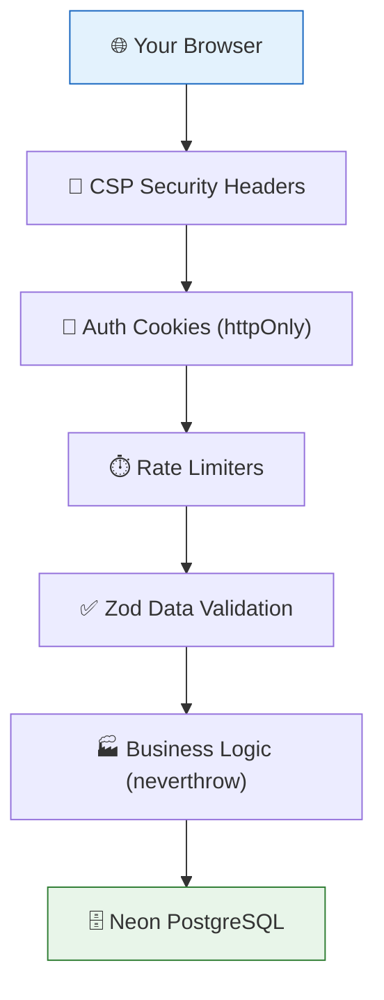
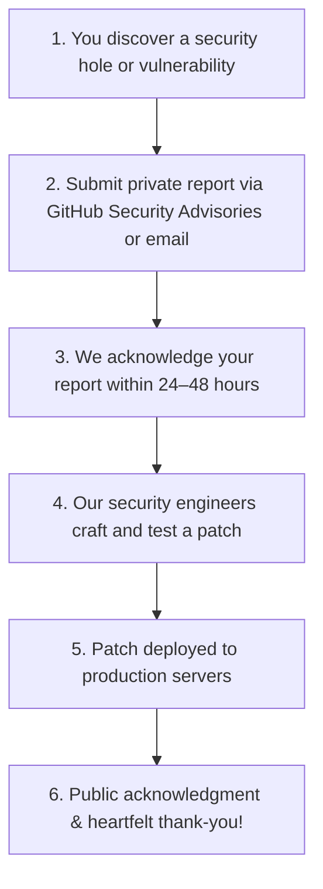

# Security Policy & Safe Guard Dog

**Project:** RUN Remix (`run-remix`)  
**Maintained by:** RUN APPAREL (PVT) LTD / Durus Industries  
**Security Lead:** M. Hateem Jamshaid (`hateem@runapparel.com`)  

---

## 🐕 The Town Watch & Safe Guard Dog

Think of cybersecurity like having a trusty, vigilant guard dog stationed at the factory gates.

We take the safety of our customers, our manufacturing blueprints, and our web application very seriously. If you find a broken lock, a loose fence board, or a secret trapdoor (a security vulnerability) in our system, we want to hear about it right away so we can fix it before any bad actors notice!

### 🛡️ Security Shield Layers

Our factory has multiple layers of protection, just like a medieval castle with walls, a moat, and guards:



```
┌────────────────────────────────────────────────────────────────────────┐
│                   HOW TO SAFELY REPORT A SECURITY HOLE                 │
├───────────────────────────────────┬────────────────────────────────────┤
│  ✅ DO THIS (Responsible Alert):  │  ❌ NEVER DO THIS (Dangerous):     │
├───────────────────────────────────┼────────────────────────────────────┤
│  • Tell us privately through      │  • Post about the bug in public    │
│    GitHub Private Advisories      │    issues or social media          │
│  • Email hateem@runapparel.com    │  • Try to delete or steal real     │
│  • Give us time to patch the hole │    customer data                   │
│  • Share steps to reproduce it    │  • Attack server hosting infrastructure│
└───────────────────────────────────┴────────────────────────────────────┘
```

---

## 🚨 How Responsible Disclosure Works



---

## 📬 How to Report Privately

### Option A: GitHub Private Vulnerability Reporting (Recommended)

1. Click on the **Security** tab at the top of the repository.
2. Click **Report a vulnerability** under the Advisories menu.
3. Fill in the description, steps to reproduce, and severity estimate.

### Option B: Direct Confidential Email

If private advisory reporting is not available, send a confidential email directly to our security officer:

📧 **Contact:** M. Hateem Jamshaid (`hateem@runapparel.com`)  
📍 **Subject:** `[SECURITY DISCLOSURE] Vulnerability in RUN Remix`

Please include:
- A clear description of the issue
- The affected URL, route, or file path
- Step-by-step instructions or sample payload showing how it happens
- Suggested fix or patch if you have one

---

## ⏱️ Response Times (Our Promise to You)

| Severity | What It Means | Acknowledgment | Target Fix Time |
|----------|---------------|----------------|-----------------|
| 🔴 **Critical** | Anyone can access private data or break the server | Within 24 hours | Within 7 days |
| 🟠 **High** | Important feature broken or bypasses security checks | Within 48 hours | Within 14 days |
| 🟡 **Medium** | Minor leak or specific edge-case weakness | Within 5 days | Within 30 days |
| 🟢 **Low** | Small improvement or theoretical concern | Within 10 days | Next release |

---

## 📦 Supported Versions

| Version | Supported | Notes |
|---------|-----------|-------|
| 4.1.x   | ✅ Active | Current release — receives all security patches |
| 4.0.x   | ⚠️ Limited | Critical security fixes only |
| 3.x and below | ❌ End of Life | Please upgrade to 4.1.x |

---

## 🎯 What Is In Scope

```
┌────────────────────────────────────────────────────────────────────────┐
│                        SECURITY AUDIT BOUNDARIES                       │
├───────────────────────────────────┬────────────────────────────────────┤
│  🎯 IN SCOPE (We Want Reports):   │  🚫 OUT OF SCOPE:                  │
├───────────────────────────────────┼────────────────────────────────────┤
│  • Server APIs (server/)          │  • Third-party cloud providers     │
│  • Authentication & OAuth cookies │  • DDoS or network flood attacks   │
│  • Database queries & injection   │  • Phishing or social engineering  │
│  • Admin panel access controls    │  • Physical access to computers    │
│  • Client data exposure (client/) │  • Outdated browser vulnerabilities│
└───────────────────────────────────┴────────────────────────────────────┘
```

Thank you for helping us keep the sportswear factory safe for everyone!
