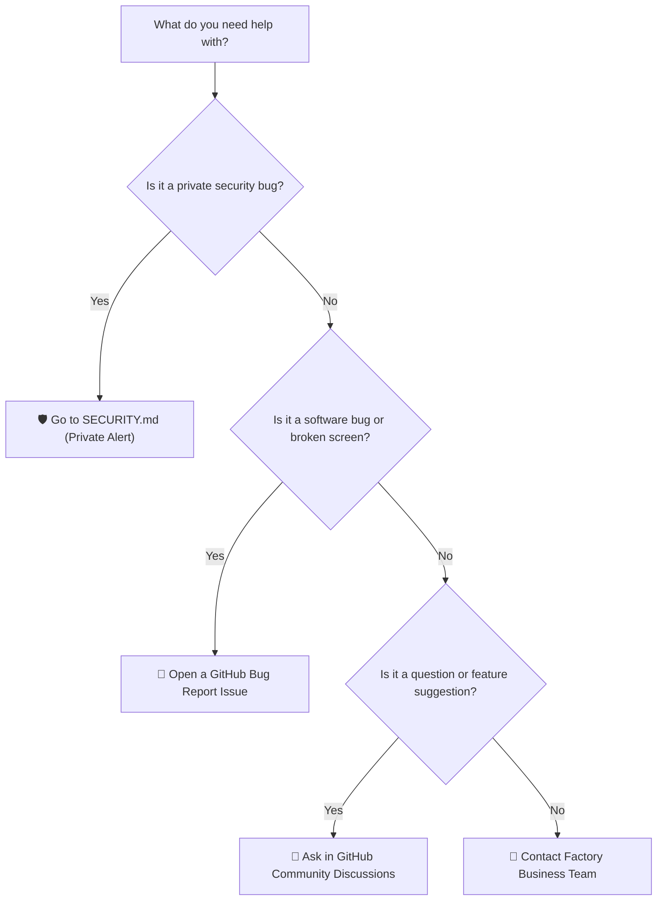

# Support & Community Clubhouse

Welcome to the **RUN Remix** Help Desk and Community Clubhouse!

Whenever you run into a question, encounter an unexpected error, or want to talk about custom sportswear manufacturing, here is the friendly guide to finding the right door.

---

## 🚪 Choose the Right Door in the Clubhouse

```
┌────────────────────────────────────────────────────────────────────────┐
│                   WHICH DOOR SHOULD YOU KNOCK ON?                      │
├───────────────────┬───────────────────┬────────────────────────────────┤
│  🐛 DOOR 1: BUGS  │  💡 DOOR 2: IDEAS │  🏢 DOOR 3: BUSINESS & ORDERS  │
├───────────────────┼───────────────────┼────────────────────────────────┤
│  Something broke? │  Have an idea or  │  Want to manufacture real      │
│  Buttons not      │  question? Chat   │  sportswear with our factory   │
│  clicking?        │  in Discussions   │  in Sialkot, Pakistan?         │
│                   │                   │                                │
│  ► Open Bug Report│  ► Discussions    │  ► Email hateem@runapparel.com │
└───────────────────┴───────────────────┴────────────────────────────────┘
```

---

## 🧭 Navigation Directory



---

## 💬 Community Channels

### 1. GitHub Community Discussions

Join other creators, developers, and sportswear designers in **GitHub Discussions** (`<repository-url>/discussions`):
- Ask questions about how the 3D configurator works
- Share cool things you built with the code
- Suggest new feature ideas

### 2. GitHub Issues (Bug Reports & Fixes)

If you find a broken button, unexpected error code, or broken link:
- Search existing open issues in the repository.
- Open a new [Bug Report](./.github/ISSUE_TEMPLATE/bug_report.yml).

### 3. Commercial & Manufacturing Partnerships

For enterprise athletic brands, team sportswear procurement, fabric sourcing, or factory audits:

- **Lead Director:** M. Hateem Jamshaid (Business Development Director)
- **Company:** RUN APPAREL (PVT) LTD / Durus Industries (Est. 1889)
- **Factory Address:** 13 Km Daska Road, Sialkot, Punjab, Pakistan
- **Email:** `hateem@runapparel.com`
- **WhatsApp:** `+92-336-1777313`
- **Website:** [wear-run.com](https://wear-run.com)

---

## 📚 Handy Documentation Shelf

| Topic | Guide Link |
|-------|------------|
| 🚀 Quick Start & Setup | [`README.md`](./README.md) |
| 🧱 How to Contribute | [`CONTRIBUTING.md`](./CONTRIBUTING.md) |
| 🛡️ Security Policy | [`SECURITY.md`](./SECURITY.md) |
| 💖 Code of Conduct | [`CODE_OF_CONDUCT.md`](./CODE_OF_CONDUCT.md) |
| 📖 Complete 6-Page Wiki | [`docs/wiki/Home.md`](./docs/wiki/Home.md) |
| 🔧 Troubleshooting Runbook | [`docs/TROUBLESHOOTING.md`](./docs/TROUBLESHOOTING.md) |
