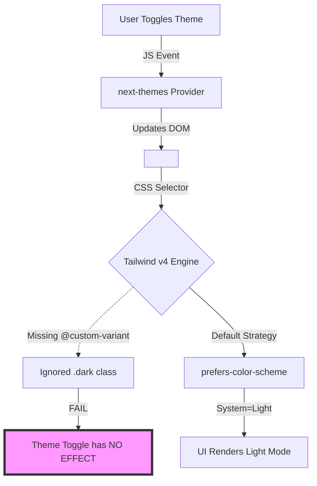
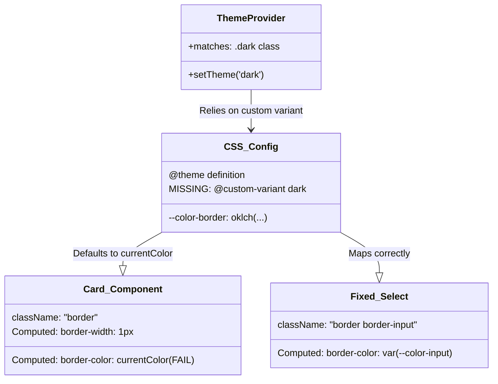

# Tailwind v4 Migration Forensic Audit Report

**Date:** 2025-12-11
**Project:** RUN-Remix
**Scope:** Forensic System Audit for Tailwind CSS v4 Upgrade

## 1. Configuration & Build Analysis

| Component         | Status  | Finding                                                                                                                                                                          |
| :---------------- | :-----: | :------------------------------------------------------------------------------------------------------------------------------------------------------------------------------- |
| **Vite Config**   | ❌ FAIL | **CRITICAL:** Duplicate configuration detected. `vite.config.ts` (Active) exists alongside `vite.config.js` (Likely Stale/Generated). This creates ambiguity for the build tool. |
| **Legacy Config** | ✅ PASS | `tailwind.config.js` is correctly removed.                                                                                                                                       |
| **PostCSS**       | ✅ PASS | `postcss.config.js` is absent (correct for v4 Vite plugin).                                                                                                                      |
| **CSS Entry**     | ⚠️ WARN | `client/src/index.css` uses `@import "tailwindcss";` and `@theme` block correctly, BUT is missing critical variant definitions for the theme provider.                           |

**Critical Finding:**
The build pipeline is compromised by conflicting Vite configurations. `vite.config.js` must be removed to ensure `vite.config.ts` (with the Tailwind v4 plugin) is the single source of truth.

---

## 2. Component & Theme Forensics

### ❌ Dark Mode Architecture (BROKEN)

- **The Artifact:** `client/src/components/theme-provider.tsx` uses `next-themes` to toggle the `.dark` class on the `<html>` element.
- **The Failure:** Tailwind v4 defaults to `prefers-color-scheme` media queries. It **ignores** the `.dark` class unless a custom variant is defined.
- **Evidence:** `client/src/index.css` contains `@theme` but lacks:
  ```css
  @custom-variant dark (&:where(.dark, .dark *));
  ```
- **Impact:** Manual theme toggling in the UI will persist the state in localStorage and add the class to HTML, but the UI **will not change appearance**.

### ⚠️ Shadcn/Radix "Ghosting" (Ghost Borders)

- **The Artifact:** Multiple primitives use `border` without a color modifier.
  - **BROKEN:** `client/src/components/ui/card.tsx`
  - **BROKEN:** `client/src/components/ui/popover.tsx`
  - **BROKEN:** `client/src/components/ui/dialog.tsx`
  - **BROKEN:** `client/src/components/ui/select.tsx` (Content Panel only)
  - **SAFE:** `client/src/components/ui/select.tsx` (Trigger) - explicitly uses `border-input`.
- **The Failure:** In v4, the `border` utility resets the border width to 1px but defaults the color to `currentColor`.
- **Impact:** Components will render with **invisible or high-contrast borders** depending on text color context.
- **Remediation:** Explicitly add `border-border` to map to the variable declared in `index.css`.

---

## 3. Syntax & Utility Migration List

The following deprecated or renamed utilities were found in the codebase and must be migrated:

| Deprecated Utility | v4 Replacement       | Location Examples (Sample)                                                                                                     |
| :----------------- | :------------------- | :----------------------------------------------------------------------------------------------------------------------------- |
| `outline-none`     | **`outline-hidden`** | `client/src/components/ui/input.tsx` (Line 10)<br>`client/src/components/ui/tabs.tsx`<br>`client/src/components/ui/select.tsx` |
| `shadow-sm`        | **`shadow-xs`**      | `client/src/components/ui/card.tsx` (Line 8)<br>`client/src/components/ui/tabs.tsx`                                            |
| `flex-grow`        | **`grow`**           | `client/src/components/homepage/certificate-display.tsx`<br>`client/src/pages/products-new.tsx`                                |
| `ring-offset-*`    | **(Check)**          | `client/src/components/ui/input.tsx`. v4 changes ring mechanics; verify `ring-offset` behavior with new variables.             |

---

## 4. Visual Reference

### The "Cascade of Failure" (Dark Mode)



### Theme & Border Architecture



## Recommended Next Steps

1.  **Cleanup Configuration:** **DELETE** `vite.config.js` immediately to prevent build process ambiguity.
2.  **Patch CSS:** Add `@custom-variant dark (&:where(.dark, .dark *));` to `client/src/index.css`.
3.  **Global Replace:** Run find/replace for `outline-none` -> `outline-hidden` and `flex-grow` -> `grow`.
4.  **Fix Primitives:**
    - Update `Card`, `Popover`, `Dialog`, `SelectContent` to use `border-border`.
