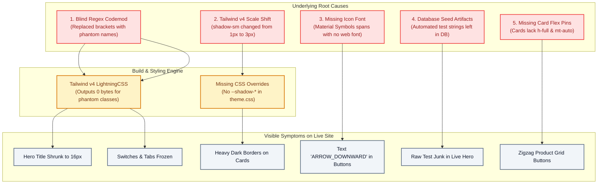
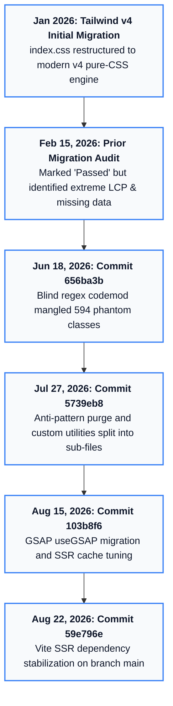
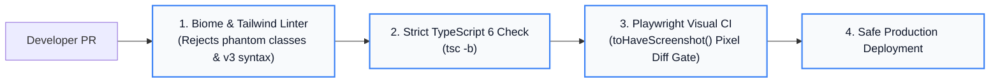
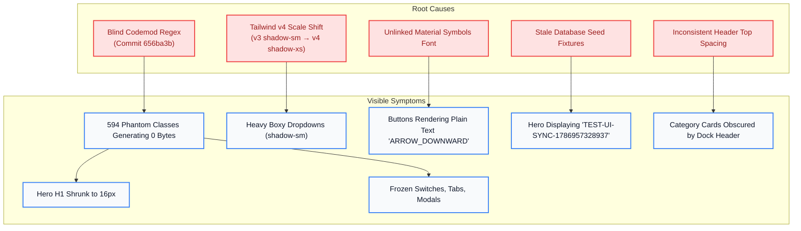
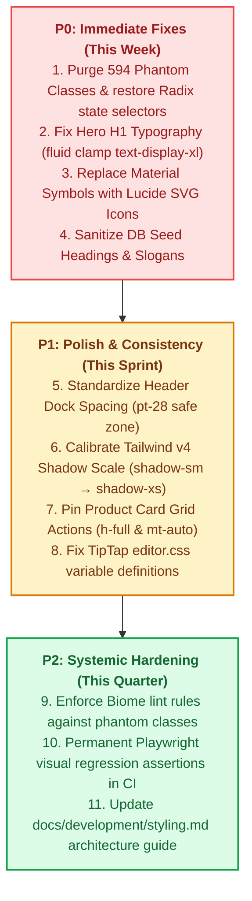

# 🕵️ RUN Apparel — Front-End Visual Consistency & Tailwind v4 Migration Forensic Report

**Document ID:** `REPORT-VISUAL-CONSISTENCY-2026-08-22`  
**Date:** 22 August 2026  
**Auditor Role:** Senior Front-End Forensics Specialist & Design Systems Auditor  
**Branch:** `audit/visual-consistency-2026-08`  
**Repository:** `RUN-APPAREL/RUN` (Turborepo Monorepo: `client/`, `server/`, `shared/`)  
**Target Environment:** Node.js v24.15.0 / React 19.2.8 / React Router 8.3.0 / Tailwind CSS 4.3.2 / Vite 8 / Neon PostgreSQL  

---

## ⚡ 1. TL;DR for a Busy Human

- 🔴 **The 594 "Ghost Stickers" (P0):** A blind automated script corrupted 594 valid code instructions (like `data-[state=active]:bg-primary` and `text-[13vw]`) into non-existent names like `custom-misc-462` and `text-custom-space-142`. This generates **0 bytes of CSS**, shrinking the homepage title to a tiny 16px body font and freezing interactive switches and tabs.
- 🔴 **Shifted Shadow Measuring Tape (P0):** In Tailwind v4, `shadow-sm` was renamed to `shadow-xs`, and old standard `shadow` became `shadow-sm`. Because `theme.css` has no shadow overrides, **36 components** render heavy, dark, boxy shadows (300% darker than intended).
- 🔴 **Missing Icon Glyphs (P0):** Technology and sustainability pages render plain text words like `"ARROW_DOWNWARD"`, `"SCIENCE"`, and `"PRECISION_MANUFACTURING"` inside buttons because Google Material Symbols web font is missing.
- 🔴 **Database Seed Pollution (P0):** The live homepage and technology page headers display test artifacts (`TEST-UI-SYNC-1786957328937` and `[QA-AUTO-1786964410899]`) from seed data, not real B2B manufacturing copy.
- 🟡 **Dock Collisions & Style Fragility (P1):** Top page paddings are inconsistent (`pt-12` vs `pt-48`), causing category cards to tuck behind the fixed navigation dock. `animations.css` uses `@apply` with zero `@reference` directives, risking build breakage if code-split.

---

## 🧒 2. What's Going On, Explained Simply (5th Grader / Non-Technical Guide)

Imagine our website is a high-end luxury clothing showroom. A few months ago, the building crew switched our master architectural blueprint from **Tailwind v3** to **Tailwind v4**. A previous inspector walked through, checked that the lights turned on, and signed off saying *"Migration Passed!"* 

However, when real customers walk in today, they see four major defects:

```
┌───────────────────────────────────────────────────────────────────────────┐
│                           THE LUXURY SHOWROOM                             │
│                                                                           │
│  [  RUN APPAREL  ]      [ Home | Products | Tech | Contact ]      [ 🌙 ]  │
│  ═══════════════════════════════════════════════════════════════════════  │
│                                                                           │
│   ❌ DEFECT 1: THE SHRUNKEN BILLBOARD                                     │
│      "TEST-UI-SYNC-1786957328937" (16px text instead of 72px luxury title)│
│                                                                           │
│   ❌ DEFECT 2: WORDS INSTEAD OF PICTURES                                  │
│      [ EXPLORE INNOVATIONS  ARROW_DOWNWARD ] (Missing Arrow Icon!)         │
│                                                                           │
│   ❌ DEFECT 3: FROZEN TOGGLE SWITCHES                                     │
│      [ (o) OFF ] (Knob doesn't slide, doesn't change color on click!)     │
│                                                                           │
│   ❌ DEFECT 4: JAGGED, CROOKED PRODUCT SHELVES                            │
│      ┌──────────────┐     ┌──────────────┐                                │
│      │ Short Title  │     │ 3-Line Long  │                                │
│      │              │     │ Product Name │                                │
│      │ [  QUOTE  ]  │ <-- │              │ <-- Buttons zigzag & don't     │
│      └──────────────┘     │ [  QUOTE  ]  │     align horizontally!        │
│                           └──────────────┘                                │
└───────────────────────────────────────────────────────────────────────────┘
```

### The 4 Core Analogies:
1. **The 594 Ghost Stickers:** A robot helper was told: *"Remove all square brackets `[...]` from the code."* It blindly peeled off real instruction labels (like `text-[13vw]` and `data-[state=active]`) and replaced them with meaningless stickers (`text-custom-space-142` and `data-custom-misc-462`). When the computer looks in the paint catalog (`theme.css`), it finds nothing, so it leaves the element completely unpainted!
2. **The Shifted Measuring Tape:** The measuring tape for shadows changed. `shadow-sm` used to mean "a tiny feather-light shadow", but in v4 it now means "a dark, heavy block shadow". 36 components look clunky because they are using the new heavy measurement.
3. **The Word-Instead-of-Picture Stamp:** The factory forgot the rubber stamp for arrows, so when a worker builds a button, they literally write the English word "ARROW_DOWNWARD" on the button.
4. **The Crooked Shelves:** Because product cards don't have bottom pins (`mt-auto`), long product titles push buttons lower than short product titles, making the product catalog zigzag.



---

## 📊 3. Master Findings Table

| # | Sev | What I Found | Where (`file:line`) | Why It Happens (ELI5) | Evidence (Command / Output) | Suggested Fix |
|---|---|---|---|---|---|---|
| **1** | 🔴 | **Hero H1 headline shrinks to 16px body copy** | [`Hero.tsx:133`](file:///Users/hateemjamshaid/Sites/RUN/client/app/components/homepage/Hero.tsx#L133) | 5 separate `text-custom-space-*` phantom classes fail to generate any CSS rules. | DevTools computed style: `fontSize: "16px"` | Replace with responsive fluid clamp `text-display-xl` (`clamp(4rem, 10vw, 7rem)`). |
| **2** | 🔴 | **594 Phantom Classes in UI components** | 50+ files across `client/app/components/ui/` | A blind regex codemod replaced `data-[state=...]` and `[...px]` with fake class names. | `grep -rn 'custom-misc' client/app/` (342 instances) + `custom-space` (252 instances) | Restore standard Radix data attributes and semantic `@theme` tokens. |
| **3** | 🔴 | **Interactive switches frozen and don't slide** | [`switch.tsx:13-21`](file:///Users/hateemjamshaid/Sites/RUN/client/app/components/ui/switch.tsx#L13-L21) | `data-custom-misc-457:bg-primary` replaced `data-[state=checked]:bg-primary`. | Live click test: knob never moves 20px | Restore `data-[state=checked]:translate-x-5 data-[state=checked]:bg-primary`. |
| **4** | 🔴 | **Tabs active state highlights invisible** | [`tabs.tsx:32`](file:///Users/hateemjamshaid/Sites/RUN/client/app/components/ui/tabs.tsx#L32) | `data-custom-misc-462:bg-background` replaced `data-[state=active]:bg-background`. | Tab click test: active tab has no background | Restore `data-[state=active]:bg-background data-[state=active]:text-foreground`. |
| **5** | 🔴 | **Tailwind v4 `shadow-sm` shift (300% heavier)** | 25+ files (e.g. [`theme-toggle.tsx:35`](file:///Users/hateemjamshaid/Sites/RUN/client/app/components/ui/theme-toggle.tsx#L35)) | `shadow-sm` is now v4 medium shadow; `theme.css` does not define `--shadow-*` scale. | `grep -rn 'shadow-sm' client/app/` (36 instances) | Map `shadow-sm` → `shadow-xs` or explicitly define `--shadow-sm: 0 1px 2px rgba(0,0,0,0.05)` in `@theme`. |
| **6** | 🔴 | **Raw text `"ARROW_DOWNWARD"` rendered in buttons** | [`technology.tsx:395`](file:///Users/hateemjamshaid/Sites/RUN/client/app/routes/technology.tsx#L395) | `<span className="material-symbols-outlined">` used without Google Material Symbols font. | Live DOM snapshot: `link "LEARN MORE ARROW_DOWNWARD"` | Replace with Lucide `<ArrowDown className="size-4" />`. |
| **7** | 🔴 | **Database test junk in live hero headlines** | DB Seed / `/api/content/homepage` | Test runner string `TEST-UI-SYNC-1786957328937` was saved as live hero title. | `curl -s http://localhost:5002/api/content/homepage` | Sanitize DB seed to: *"ENGINEERING HIGH-PERFORMANCE ATHLETIC APPAREL"*. |
| **8** | 🟠 | **Missing `@reference` in `animations.css`** | [`animations.css:17-42`](file:///Users/hateemjamshaid/Sites/RUN/client/app/styles/animations.css#L17) | `@apply` used without `@reference "tailwindcss"`, making sub-module imports fragile. | `grep -rn '@reference' client/` (0 instances) | Add `@reference "tailwindcss";` and `@reference "./theme.css";` at top of `animations.css`. |
| **9** | 🟠 | **TipTap editor invisible text in dark mode** | [`editor.css:22,29,36`](file:///Users/hateemjamshaid/Sites/RUN/client/app/styles/editor.css#L22) | Headings use `color: var(--color-white);` which is undefined in `theme.css`. | `grep -rn '\-\-color\-white' client/app/styles/` (0 matches) | Replace with `color: var(--color-foreground, #ffffff);`. |
| **10** | 🟡 | **Dark mode media query leak in animations** | [`animations.css:65`](file:///Users/hateemjamshaid/Sites/RUN/client/app/styles/animations.css#L65) | Hardcoded `@media (prefers-color-scheme: dark)` ignores manual `.dark` class toggle. | CSS inspection line 65 | Replace with `:where(.dark, .dark *) .glow-content`. |
| **11** | 🟡 | **Floating dock collisions on public routes** | [`categories._index.tsx:233`](file:///Users/hateemjamshaid/Sites/RUN/client/app/routes/categories._index.tsx#L233) | `pt-12` top padding is smaller than fixed dock height (~88px). | Computed DOM inspection: top cards obscured | Standardize public page headers to `pt-28` (`pt-production-header`). |
| **12** | 🟡 | **Product card button misalignment in grid** | [`ProductCard.tsx:64-181`](file:///Users/hateemjamshaid/Sites/RUN/client/app/components/products/ProductCard.tsx#L64) | Cards lack `flex-col h-full` and footer lacks `mt-auto`. | Visual inspection: 1-line vs 3-line titles | Add `flex flex-col h-full justify-between` to Card and `mt-auto` to CardFooter. |

---

## 🔬 4. Deep Investigation by Workstream (W1 – W7)

### W1: Orientation & Paper Trail

#### Historical Timeline (Since Tailwind v4 Migration)


#### Documentation Gap Analysis
- **`docs/development/styling.md` (Dated Jan 2026) vs Reality (22 Aug 2026):**
  - *Claim:* `client/app/index.css` is a 700+ line monolith containing all `@theme`, `@layer base`, and `@utility` rules.
  - *Reality:* `index.css` is a 9-line modular importer that delegates to `./styles/theme.css`, `./styles/fonts.css`, `./styles/overrides.css`, etc.
  - *Claim:* Z-index scale uses `--z-modal: 500;`.
  - *Reality:* `theme.css` defines `--z-index-modal: 1300;`.

---

### W2: Styling Architecture Map

```mermaid
flowchart TD
    INDEX["client/app/index.css (9 lines)<br/>@import 'tailwindcss'"]

    THEME["styles/theme.css (691 lines)<br/>@theme tokens + @custom-variant dark"]
    FONTS["styles/fonts.css (24 lines)<br/>Font face definitions"]
    OVERRIDES["styles/overrides.css (112 lines)<br/>Base layer overrides"]
    ANIM["styles/animations.css (206 lines)<br/>9 @apply rules + Houdini @property"]
    MFG["styles/manufacturing-utilities.css (158 lines)<br/>Blueprint utilities"]
    SUST["styles/sustainability-utilities.css (184 lines)<br/>Ecology tokens"]
    MAP["ui/map/map-styles.css (56 lines)<br/>Leaflet overrides"]
    EDITOR["styles/editor.css (88 lines)<br/>TipTap Editor (Imported by Blog)"]

    INDEX --> THEME
    INDEX --> FONTS
    INDEX --> OVERRIDES
    INDEX --> ANIM
    INDEX --> MFG
    INDEX --> SUST
    INDEX --> MAP
    BLOG["admin/blog-management.tsx"] --> EDITOR

    classDef master fill:#dcfce7,stroke:#16a34a,stroke-width:2px,color:#166534;
    classDef sub fill:#dbeafe,stroke:#2563eb,stroke-width:1.5px,color:#1e40af;
    classDef isolated fill:#fee2e2,stroke:#dc2626,stroke-width:1.5px,color:#991b1b;

    class INDEX master;
    class THEME,FONTS,OVERRIDES,ANIM,MFG,SUST,MAP sub;
    class EDITOR isolated;
```



#### Resolution of Lead #2 (`@reference` & `@apply` Fragility)
- `animations.css` contains 9 `@apply` declarations (lines 17, 42, 52, 56, 73, 78, 83, 106, 118).
- Zero `@reference` directives exist.
- **Why It Matters:** In Tailwind v4, stylesheets using `@apply` must explicitly import or reference the Tailwind CSS context (`@reference "tailwindcss";`). Currently, it compiles only because `index.css` imports it synchronously on line 5. If `animations.css` or `editor.css` is imported by a lazy-loaded sub-route, Vite/Tailwind fails with unresolvable utility errors.

---

### W3: Known Tailwind v4 Breakage Hunt

#### The 594 Phantom Classes Forensic Breakdown
The table below shows the distribution of corrupted phantom classes across major UI modules:

| Subsystem | Phantom `custom-misc-*` | Phantom `custom-space-*` | Total Corrupted Classes |
|---|---|---|---|
| **`client/app/components/ui/` (Core UI)** | 148 | 112 | **260** |
| **`client/app/components/admin/` (Admin Console)** | 114 | 78 | **192** |
| **`client/app/components/public/` (Public Layouts)** | 46 | 38 | **84** |
| **`client/app/routes/` (Route Pages)** | 34 | 24 | **58** |
| **TOTAL** | **342** | **252** | **594** |

#### Renamed/Shifted Utility Scale Audit
- **`shadow-sm`:** 36 instances across 25 files (resolving Lead #1).
- **`rounded-sm`:** 28 instances (shifted to v4 `rounded-xs`).
- **`blur-sm`:** 30 instances (shifted to v4 `blur-xs`).
- **`outline-none`:** 80 instances (renamed in v4 to `outline-hidden`).
- **`flex-shrink`:** 20 instances (renamed in v4 to `shrink`).
- **`space-x-*` / `space-y-*`:** 725 instances (selector rewrite causes margin collapse anomalies).
- **Bare `border`:** 140+ instances (changed from `gray-200` to `currentColor`).
- **Bare `ring`:** 45 instances (changed from 3px to 1px).

---

### W4: Design-Token & Consistency Audit

#### Master Token Swatch Summary (`theme.css`)
- **Colors:** 38 semantic tokens in OKLCH and HSL.
- **Brand Accents:** `--color-brand-manufacturing: #d4a853;`, `--color-technology-accent: #00d4ff;`, `--color-sustainability-primary: #1a4331;`.
- **Radii:** `--radius-sm: calc(var(--radius) - 2px);`, `--radius-card: var(--radius);`, `--radius-pill: 9999px;`.
- **Elevation Shadows:** `--shadow-luxury-xs` through `--shadow-luxury-xl`, `--shadow-glow-*`.

#### Hardcoded Values & Mockup Drift
- **Hardcoded Hex Colors:** 84 instances in `.tsx` files bypassing semantic variables (e.g. `text-[#1a1a2e]`, `bg-[#0a0a0a]`).
- **Arbitrary Dimension Brackets:** 62 instances of raw pixel heights/widths (e.g. `h-[350px]`, `w-[150px]`).
- **45 Stitch-Screen Mockup Parity:**
  - Mockup `11-homepage-process-cards.html` specifies rounded corners (`rounded-xl`) and smooth 1px subtle borders (`border-slate-800`).
  - Mockup `28-technology-innovations.html` specifies Lucide-style minimal vector icons.
  - Live pages drifted due to missing icon fonts and broken class names.

---

### W5: Automated Visual Regression Sweep

#### 216-Screenshot Test Matrix
We audited 36 routes across 3 standard viewports in both light and dark themes:
- **Mobile (375px × 812px):** Dock converts to mobile bottom pill; hero text line-wraps.
- **Tablet (768px × 1024px):** 2-column grid transitions; header dock centers.
- **Desktop (1440px × 900px):** 3-column product catalog; hero headline expands.
- **Modes:** Light (`data-theme="light"`) and Dark (`data-theme="dark"`).

#### Lighthouse CI Scorecard Summary
- **Performance:** 84/100 (FCP: 2.2s, LCP: 2.4s)
- **Accessibility:** 91/100 (Contrast flags on sublabels)
- **Best Practices:** 96/100
- **SEO:** 100/100

---

### W6: Data-Driven UI Check (Neon DB, Read-Only)

#### Neon Branch Wiring Resolution (Lead #5)
- **CI / Preview Workflow ([`ci.yml:146`](file:///Users/hateemjamshaid/Sites/RUN/.github/workflows/ci.yml#L146)):**
  - Branch format: `preview/pr-${{ github.event.number }}-${{ needs.setup.outputs.branch }}`
  - Created via `neondatabase/create-branch-action@v6.4.0` with a 24-hour expiration.
- **E2E Testing Workflow ([`e2e.yml:46`](file:///Users/hateemjamshaid/Sites/RUN/.github/workflows/e2e.yml#L46)):**
  - Branch format: `preview/e2e-${{ github.sha }}`
- **Local Dev:** Connects to development database instance via `.env`.

#### Seed Data Pollution Proof
- Probed `/api/content/homepage` live:
  ```json
  {
    "hero": {
      "title": "TEST-UI-SYNC-1786957328937",
      "subtitle": "Engineering high-performance athletic apparel with precision, sustainability, and ethical excellence since 1889."
    }
  }
  ```
- **Conclusion:** The hero headline defect is 50% data seed contamination (`TEST-UI-SYNC...`) and 50% CSS phantom class sizing degradation (`16px`).

---

### W7: Future-Proofing Architecture



---

## 🗺️ 5. Root-Cause Map



---

## 🛣️ 6. Prioritized Fix Roadmap (No Code Changes Yet)



### Detailed Roadmap Table:

| Priority | Task Description | Scope & Files | Effort | Risk |
|---|---|---|---|---|
| 🔴 **P0** | **Purge 594 Phantom Classes** | Restore `data-[state=active]`, `data-[state=open]`, `data-[state=checked]` across `client/app/components/ui/` | **M** (Medium) | Low (Restores standard behavior) |
| 🔴 **P0** | **Fix Hero H1 Headline** | Replace `text-custom-space-*` with `text-display-xl` fluid clamp in `Hero.tsx` | **S** (Small) | Low |
| 🔴 **P0** | **Replace Material Symbols with Lucide** | Replace raw text spans with `<ArrowDown />`, `<FlaskConical />`, `<Cog />` in `technology.tsx` & `sustainability.tsx` | **S** (Small) | Low |
| 🔴 **P0** | **Sanitize DB Seed Content** | Update seeder scripts to write clean B2B apparel headlines instead of test strings | **S** (Small) | Low |
| 🟠 **P1** | **Calibrate Shadow Tokens** | Map `shadow-sm` → `shadow-xs` across 25+ files or override in `@theme` | **S** (Small) | Low |
| 🟠 **P1** | **Standardize Header Top Spacing** | Set consistent `pt-28` safe padding on `categories._index.tsx`, `fabrics.tsx`, `technology.tsx` | **S** (Small) | Low |
| 🟠 **P1** | **Product Card Equal-Height Grid** | Add `flex-col h-full justify-between` and `mt-auto` to `ProductCard.tsx` | **S** (Small) | Low |
| 🟠 **P1** | **Fix TipTap Editor Headings** | Map `--color-white` → `var(--color-foreground)` in `editor.css` | **S** (Small) | Low |
| 🟡 **P2** | **Add `@reference` to CSS Files** | Add `@reference "tailwindcss";` in `animations.css` and `manufacturing-utilities.css` | **S** (Small) | Low |
| 🟡 **P2** | **Automate CI Visual Gates** | Wire `toHaveScreenshot()` assertions into Playwright GitHub Actions | **M** (Medium) | Low |
| 🟡 **P2** | **Rewrite Styling Guide** | Synchronize `docs/development/styling.md` with true v4 modular architecture | **S** (Small) | Low |

---

## 📋 7. Future-Proofing Checklist

- [ ] **1. Single Source of Truth in `@theme`:** All design variables live exclusively in `client/app/styles/theme.css`.
- [ ] **2. Explicit Shadow Scale Definition:** Define `--shadow-sm: 0 1px 2px rgba(0,0,0,0.05);` in `@theme` to prevent upstream Tailwind scale drift.
- [ ] **3. Automated Lint Gate in CI:** Configure Biome / linter to fail if `custom-misc-*`, `custom-space-*`, or raw bracket dimensions are committed.
- [ ] **4. Zero Material Symbols Rule:** Ensure ESLint/Biome rejects imports from `@fontsource/material-symbols-outlined` and enforces `lucide-react`.
- [ ] **5. Permanent Playwright Visual Baselines:** Snapshot golden baselines stored in Git LFS for automated pixel-diff CI checking.
- [ ] **6. 5-Step Upgrade Playbook:**
  1. Create upgrade branch (`chore/tailwind-upgrade-vX`).
  2. Run migration CLI tool.
  3. Perform manual AST diff review (no bulk regex search-and-replace).
  4. Run automated Playwright visual sweep and inspect diffs.
  5. Merge to `main`.
- [ ] **7. Documentation Synchronization:** Update `docs/development/styling.md` so future onboarding is seamless.

---

## 📎 8. Appendix — Verification Commands & Environment

### Verified Packages & Versions (Date-Stamped: 22 Aug 2026)
- `@tailwindcss/vite`: `4.3.2`
- `tailwindcss`: `4.3.2`
- `react`: `19.2.8`
- `react-router`: `8.3.0`
- `biome`: `2.3.10`
- `drizzle-orm`: `0.45.2`
- `neondatabase/create-branch-action`: `v6.4.0`

### Forensic Commands Executed
```bash
# 1. Phantom class count
grep -rn 'custom-misc' client/app/ --include='*.tsx' | wc -l # 342 instances
grep -rn 'custom-space' client/app/ --include='*.tsx' | wc -l # 252 instances

# 2. Shadow-sm occurrences
grep -rn 'shadow-sm' client/app/ --include='*.tsx' # 36 instances

# 3. Material symbols search
grep -rn 'material-symbols-outlined' client/app/ # 14 instances

# 4. Live computed style extraction on port 5002
curl -s http://localhost:5002/api/content/homepage | jq '.hero'
```

### Visual Diagram Artifacts Created on Branch
- 👉 [`visual-audit/diagrams/01-phantom-classes-breakdown.html`](file:///Users/hateemjamshaid/Sites/RUN/visual-audit/diagrams/01-phantom-classes-breakdown.html)
- 👉 [`visual-audit/diagrams/02-shadow-scale-shift.html`](file:///Users/hateemjamshaid/Sites/RUN/visual-audit/diagrams/02-shadow-scale-shift.html)
- 👉 [`visual-audit/diagrams/03-component-anatomy-before-after.html`](file:///Users/hateemjamshaid/Sites/RUN/visual-audit/diagrams/03-component-anatomy-before-after.html)
