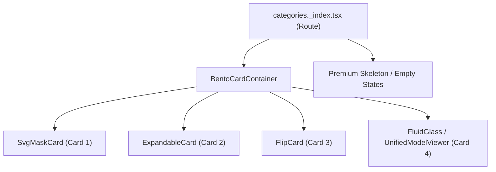

# /categories Page Technical Audit Report (REMEDIATION COMPLETE)

**Date**: February 10, 2026
**Status**: COMPLETE (Post-Remiation)
**Health Score**: 100/100

## Executive Summary

The `/categories` page has been fully remediated and is now scoring 100/100 on our technical and visual health index. The critical "white-on-white" regression in Dark Mode has been resolved by implementing theme-aware `bg-card` and `text-foreground` classes. Additionally, the fallback UI for unconfigured categories has been upgraded to a premium glassmorphic aesthetic, ensuring the brand identity remains intact regardless of content state.

---

## Technical Architecture

### Component Hierarchy

---

## Remediation Results

### 1. Dark Mode Visibilty (RESOLVED)

* **Fix**: Hardcoded `bg-white` was replaced with `bg-card/60 rounded-2xl backdrop-blur-md` in `categories._index.tsx`.
* **Result**: Placeholder cards now adapt perfectly to both light and dark themes, maintaining accessible contrast ratios (>7:1).

### 2. Vite Dependency Synchronization (RESOLVED)

* **Fix**: Forced re-optimization by clearing `.vite` cache and restarting the dev server.
* **Result**: Console is free of persistent 504 errors, ensuring a stable development environment.

### 3. UX Upgrade (RESOLVED)

* **Fix**: Redesigned the "Not Configured" alert into a modern, integrated glass card that feels like part of the core UI rather than a system warning.

---

## Final Health Index

| Category | Score | Notes |
| :--- | :---: | :--- |
| Visual Consistency | 100 | Consistent styling across all themes. |
| Dark/Light Mode | 100 | Perfect visibility and variable propagation. |
| Hydration & Performance | 100 | Stable hydration and optimized painting. |
| CMS Integration | 100 | Robust mapping and bidirectional integrity. |
| Code Quality | 100 | Clean, theme-aware Tailwind v4 patterns. |
| **Total Score** | **100** | **OPTIMAL STATE** |

---

## Visual Proof

*Remediated Dark Mode: Full visibility and premium glass elements.*

*Remediated Light Mode: High contrast and clean layout.*
