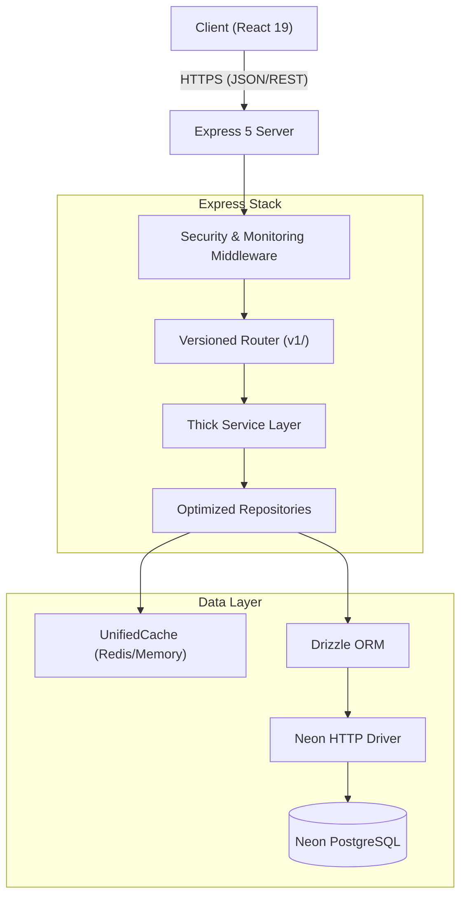
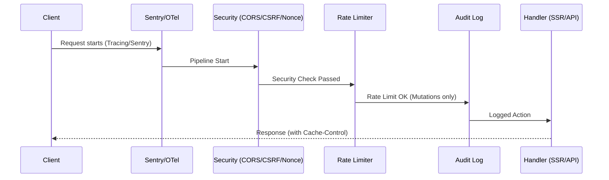
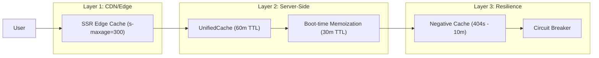
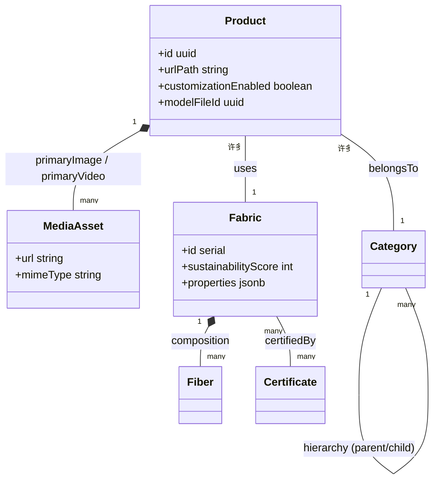

# RUN Remix: Comprehensive System Audit Report (2026)

**Auditor:** Antigravity (Advanced Agentic Coding AI)  
**Status:** Audit Complete  
**Date:** February 15, 2026  
**Confidentiality:** Internal / B2B-Exclusive

---

## 1. System Architecture Overview

The RUN Remix platform is built on an **A.N.T. (Advanced Node.js & TypeScript)** architecture, emphasizing service-oriented design and high-performance serverless database interactions.

### 1.1 Backend Service Topology

The following diagram illustrates the flow of data from the client through the Express 5 stack to the Neon PostgreSQL database.



---

## 2. Request Processing & Security Pipeline

The system employs a sophisticated middleware stack that prioritizes observability (Sentry/OTel), security (CSRF/CSP), and performance (Compression/Caching).

### 2.1 Middleware Execution Flow



**Key Finding:** The system uses a **Double-Submit Cookie pattern** for CSRF and a **Content Security Policy (CSP) with dynamic nonces**, significantly reducing XSS and injection risks.

---

## 3. High-Performance Caching Strategy

Performance is maintained through a multi-layered caching architecture that targets both static assets and dynamic API responses.

### 3.1 Caching Hierarchy



---

## 4. Data Relationship & Schema Design

The database schema is highly optimized for B2B catalog management, with clear separation between product data and technical material specifications.

### 4.1 Core Entity Map



---

## 5. Build Integrity & Engineering Standards

The project uses `verify-tech-integrity.ts` to enforce standards across the monorepo.

### 5.1 Integrity Verification Pipeline

```mermaid
graph TD
    Start[Start Integrity Check] --> TC[Type Check]
    TC -- Fail --> Exit[Exit 1]
    TC -- Pass --> Lint[Linting (Biome)]
    Lint --> Build[Build Verification]
    Build --> BS[Bundle Size Check]
    BS --> LI[Link Integrity]
    LI --> SSR[SSR Invariant Check]
    SSR --> End[Success]
```

---

## 6. Critical Analysis & Recommendations

### 6.1 TypeScript Workspace Integrity (BLOCKER)

**Issue:** Large-scale **TS6307** errors. The client workspace imports server-side logic without proper configuration in `tsconfig.json`.

- **Impact:** Broken type safety for cross-workspace schemas.
- **Fix:** Update `tsconfig.json` to correctly `include` or `reference` shared/server directories.

### 6.2 Caching "Zombie" Mitigation (HIGH)

**Issue:** Evidence of stale cache reads in `PageContentRepository`.

- **Refinement:** Implement a more robust `InvalidationEventBus` that guarantees purges across all instances (if scaling horizontally).

### 6.3 Async Optimization (MEDIUM)

**Issue:** 600+ warnings related to unnecessary `async` or missing `await`.

- **Fix:** Run a bulk automated refactor using Biome's `--apply` flag for `useAwait` rules.

---

## 7. Multi-Agent Orchestration Alignment

The newly defined **Orchestration System** (`.kilocode/orchestrators/README.md`) is perfectly positioned to address these findings.

- **Architect**: Use to redesign the `tsconfig` hierarchy.
- **Developer**: Tasks can be delegated to resolve Biome warnings with TDD.
- **Reviewer**: Implement strict checks for `any` types and redundant async.

---
**Report Approved by Audit Agent: Antigravity**  
**End of Document**
