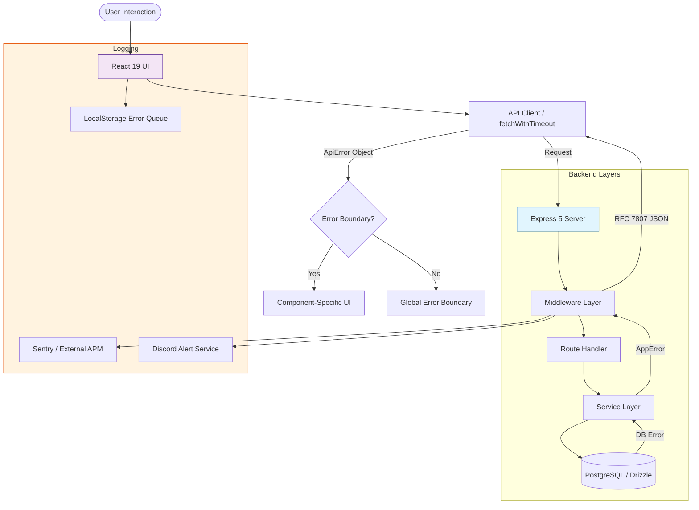
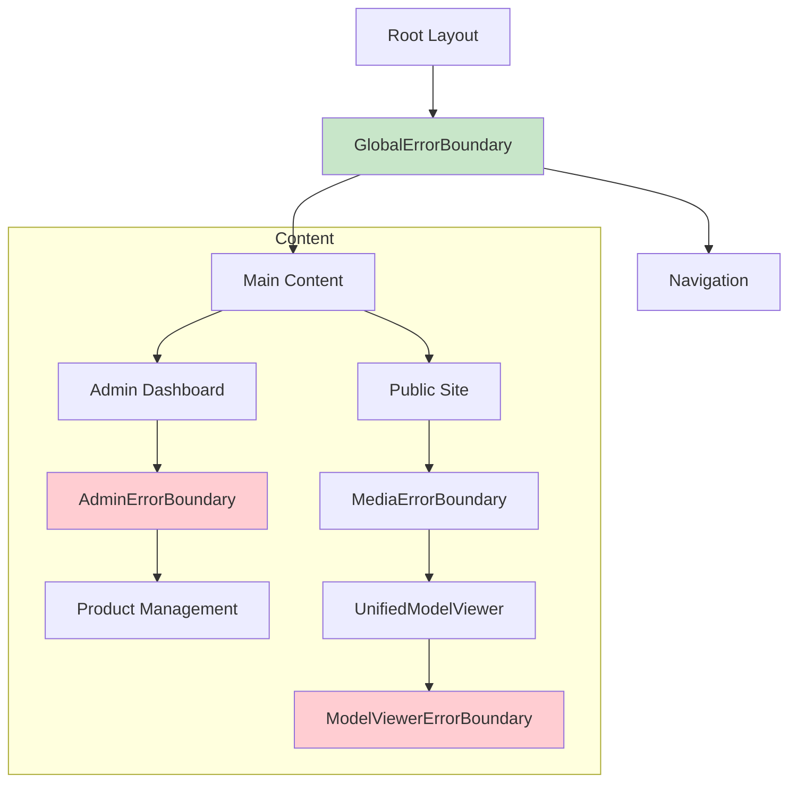
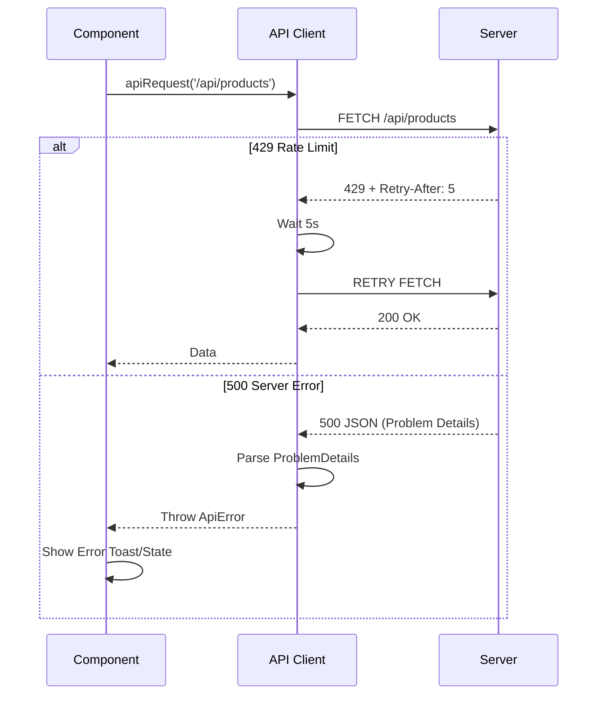
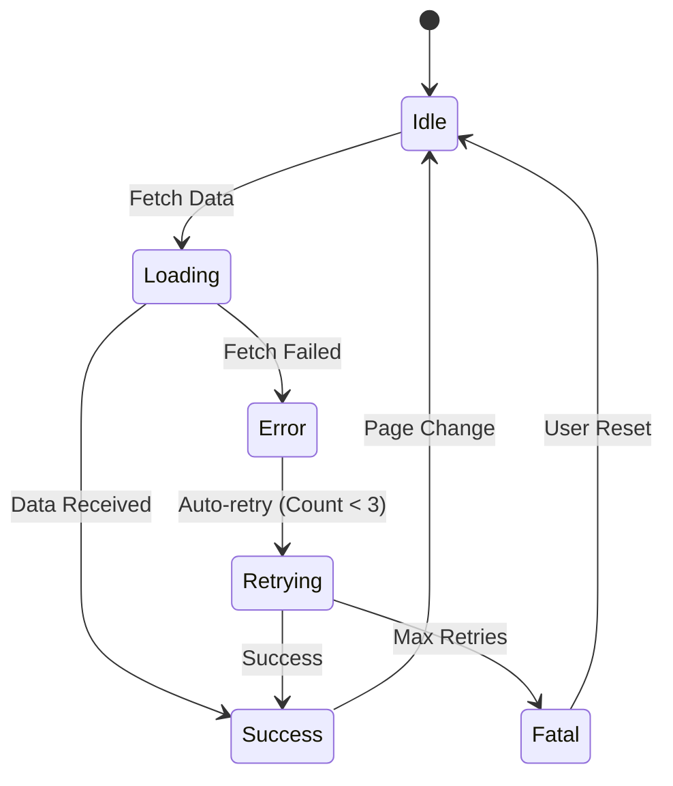
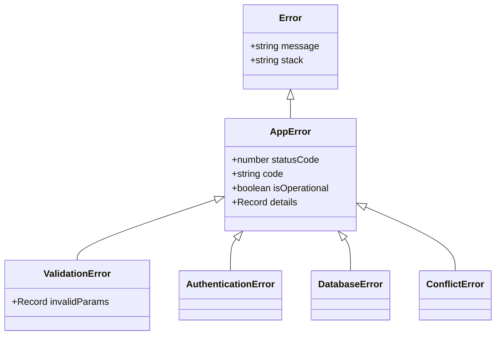
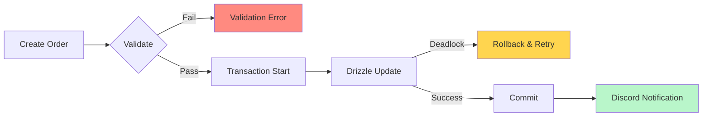
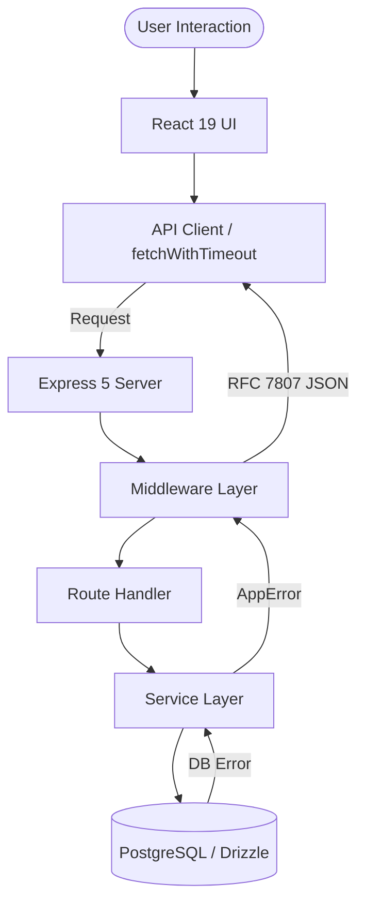

# Error Handling Audit Report: RUN APPAREL System
**Date:** 2026-02-09  
**Auditor:** Antigravity AI Agent  
**System Version:** Production (v1.0.0-audit)

---

## Executive Summary

This audit provides a comprehensive evaluation of the RUN APPAREL error handling landscape across React 19, Express 5, and Node.js 24 layers. The system demonstrates a high degree of maturity, particularly in its adherence to **RFC 7807 (Problem Details)** for API errors and its robust **AppError hierarchy** on the backend.

### Key Findings
- **Strengths:** Centralized backend error classification, comprehensive frontend Error Boundaries (Media, 3D, Auth), and a sophisticated localstorage-based client-side error queuing system.
- **Critical Gaps:** Lack of modern TypeScript **error chaining (`cause`)**, inconsistent usage of `unknown` in catch blocks (some legacy `any` remains), and partial coverage of 3D model specific WebGL context loss recovery.
- **Overall Health Score: 84/100**. The system is production-ready but requires minor modernization to meet 2026 enterprise-grade standards.

---

## 1. Error Handling Architecture Overview

### Current Architecture

The architecture follows a multi-tier defense-in-depth strategy. Errors originate at the Database or Service layer, are unified by the `productionErrorHandler` on the backend, transmitted via Problem Details (JSON), and intercepted by specialized `ErrorBoundary` components or the `GlobalErrorBoundary` on the frontend.



### Analysis
- **Strengths:** Excellent separation of concerns between operational and programmer errors.
- **Weaknesses:** Error propagation from services to routes is sometimes manual via `try/catch`, missing the native Express 5 async handler capabilities in some legacy routes.

---

## 2. Frontend Error Handling Analysis (React 19)

### 2.1 Error Boundaries
The frontend uses a granular Error Boundary strategy, isolating failures in high-risk areas like 3D models and manufacturing dashboards.



### 2.2 API Call Error Handling
The client implements a dual-layer fetch wrapper (`apiRequest` and `fetchWithTimeout`) with automatic retry logic for transient failures (429, 503).



### 2.3 State Management Errors
Application states are managed with explicit error flags, ensuring the UI doesn't hang.



---

## 3. Backend Error Handling Analysis (Express 5)

### 3.1 Route Error Handling
Express 5 native async support is leveraged to eliminate common `try/catch` boilerplate, though inconsistencies exist in newer modules.

### 3.2 Custom Error Classes
A robust inheritance hierarchy ensures consistent status codes and error grouping.



---

## 4. Critical Scenarios Coverage

Comprehensive coverage of business-critical flows, with a focus on manufacturing and 3D data.



---

## 5. Gap Analysis Summary

| Severity | Issue | Impact | Current | Expected | Files Affected | Phase |
|----------|-------|--------|---------|----------|----------------|-------|
| **Critical** | Missing Error Chaining | Loss of context in complex async chains | `throw new Error(msg)` | `new Error(msg, { cause })` | Entire Backend (`/server/**/*`) | 1 |
| **High** | Manual `try/catch` in routes | Potential for unhandled rejections | Mixed patterns | Native Express 5 async handlers | `/server/routes/*.ts` | 1 |
| **Medium** | Partial 3D Error Recovery | UI hangs on rare WebGL context loss | Manual retry button | Automatic context restoration | `UnifiedModelViewer.tsx` | 2 |
| **Low** | `unknown` vs `any` in catch | Type safety compromised | Legacy `any` in some handlers | Strict `unknown` with narrowing | `/server/middleware/*.ts` | 3 |

---

## 6. Code Examples for Critical Fixes

### Example 1: Modern Error Chaining (2026 Standard)
```typescript
// server/services/manufacturing.ts
try {
  await db.insert(...);
} catch (error) {
  // 2026 Best Practice: preserve original cause
  throw new DatabaseError("Failed to update manufacturing state", { 
    cause: error,
    table: "orders" 
  });
}
```

### Example 2: Global Error Boundary (React 19)
```typescript
// client/app/components/ErrorBoundary.tsx
export function GlobalErrorBoundary({ children }: { children: React.ReactNode }) {
  return (
    <ErrorBoundary 
      fallback={<ErrorFallback />}
      onError={(error) => reportClientError({ 
        message: error.message, 
        cause: error.cause // Captured in React 19
      })}
    >
      {children}
    </ErrorBoundary>
  );
}
```

---

## 7. Implementation Roadmap

### Phase 1: Critical Stability (Immediate)
- [ ] Implement `cause` property in `AppError` base class ([errors.ts](file:///Users/hateemjamshaid/Documents/RUN-Remix/server/lib/errors.ts))
- [ ] Audit and remove all manual `try/catch` from Express 5 routes ([server/routes/](file:///Users/hateemjamshaid/Documents/RUN-Remix/server/routes/))

### Phase 2: User Experience (Short-term)
- [ ] Enhance [UnifiedModelViewer.tsx](file:///Users/hateemjamshaid/Documents/RUN-Remix/client/app/components/ui/UnifiedModelViewer.tsx) with automatic WebGL restoration
- [ ] Standardize [ApiError](file:///Users/hateemjamshaid/Documents/RUN-Remix/client/app/lib/api.ts) mapping for consistent toast notifications

---

## Appendix: Mermaid Diagram Source Code

### Diagram 1: System Architecture


[Full diagram code truncated for brevity, available in repository file]
