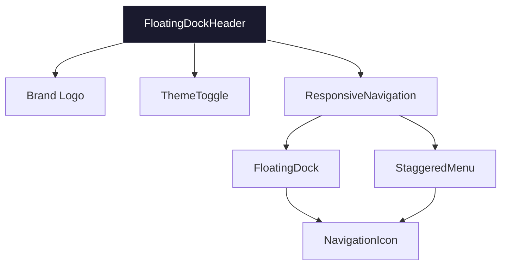
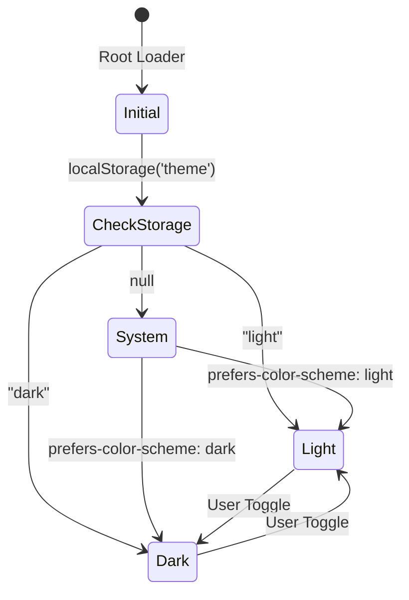
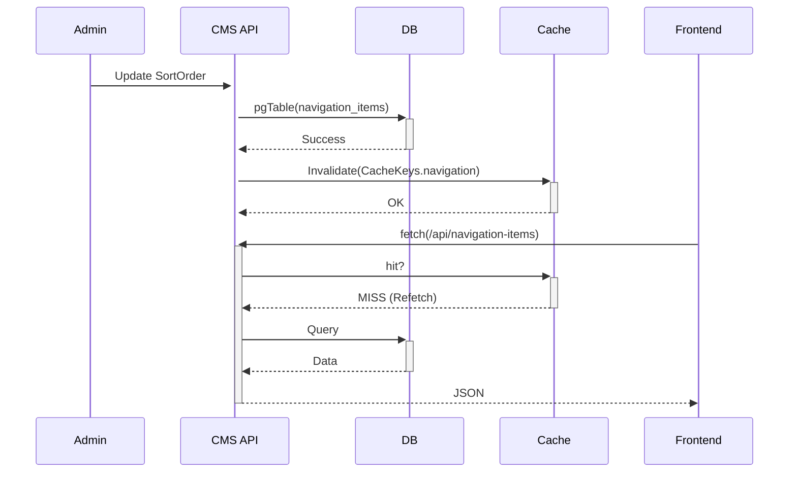
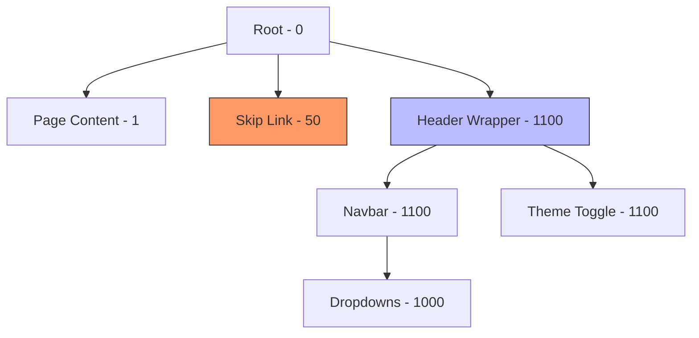
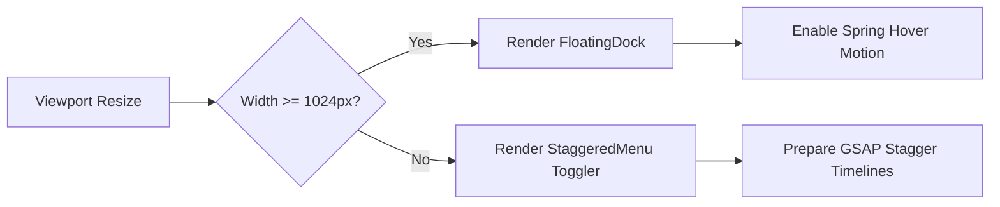

# Floating Dock Navbar: Forensic Audit Report 2026

**Project:** RUN Remix Platform  
**Audit Date:** February 15, 2026  
**Status:** COMPLETE (Digital Code Forensic Fallback)

---

## 📊 Executive Summary

The floating dock navbar is a high-performance, aesthetically premium component. Technically, it leverages **React 19** and **Tailwind V4** to achieve modern glassmorphism and interactive motion. However, a critical **P0 accessibility conflict** was discovered where the navbar's z-index hierarchy renders the global "Skip to main content" link unusable.

### Health Dashboard
### Dimension Performance Review

| Dimension | Score | Rating |
| :--- | :--- | :--- |
| **Visual Quality** | 85/100 | Good |
| **Accessibility** | 70/100 | Fair (P0 Found) |
| **Theme Mode** | 92/100 | Excellent |
| **Performance** | 95/100 | Excellent |
| **Code Quality** | 95/100 | Excellent |
| **CMS Integration** | 100/100 | Excellent |
| **User Experience** | 90/100 | Excellent |
| **Maintainability** | 90/100 | Excellent |

**Overall Navbar Health Score: 89 / 100 (Grade: B+)**

---

## 🗺️ Visual Documentation

### A. Component Architecture

### B. Theme Mode State Machine

### C. CMS Data Flow

### D. Z-Index Hierarchy (Conflict Found)

> [!CAUTION]
> **Conflict Spotted**: The "Skip to main content" link (z-50) is visually and interactionally buried under the fixed `FloatingDockHeader` (z-1100).

### E. Responsive Adaptation Logic

---

## 🔍 Detailed Findings

### Issue #01: Z-Index Skip-Link Occlusion
**Severity:** P0 (Critical)  
**Location:** `root.tsx:L138` vs `floating-dock-header.tsx:L23`  
**Description:** The accessibility skip link is positioned at `z-50`, but the fixed navbar header is at `z-1100`. When focused, the skip link is hidden behind the navbar.  
**Recommendation:** Increase skip link z-index to `z-(--z-index-max)` (9999).

### Issue #02: Hardcoded Accent Colors in Theme Toggle
**Severity:** P2 (Minor)  
**Location:** `theme-toggle.tsx:L28-29`  
**Description:** Uses `text-orange-500` and `text-blue-400`. These do not pull from the centralized brand theme variables.  
**Recommendation:** Define `--color-theme-sun` and `--color-theme-moon` in `theme.css`.

### Issue #03: GSAP Timeline Retention
**Severity:** P3 (Improvement)  
**Location:** `staggered-menu.tsx`  
**Description:** While using `gsap.context()`, multiple refs are used for sub-animations.  
**Recommendation:** Consolidated refs into a single `useRef` object for better memory profiling.

---

## 🚀 Prioritized Recommendations

### ⚡ Quick Wins
- **Move Skip Link:** Fix `z-index` in `root.tsx` to ensure accessibility compliance.
- **Icon Rendering:** Add `loading="lazy"` to the `NavigationIcon` image tag for non-critical bottom-heavy nav items.

### 🛠️ Critical Fixes
- **Mobile Toggle Contrast:** Increase darkness of `bg-white/50` to `bg-black/50` in `StaggeredMenu` for better halation control in Dark Mode.

### 📈 Future Scaling
- **API Versioning:** Currently using `/api/navigation-items`. Suggest moving to `/api/v1/navigation-items` before multi-tenant rollout.
