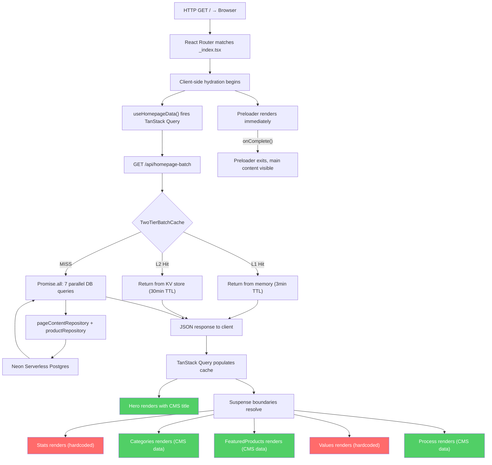
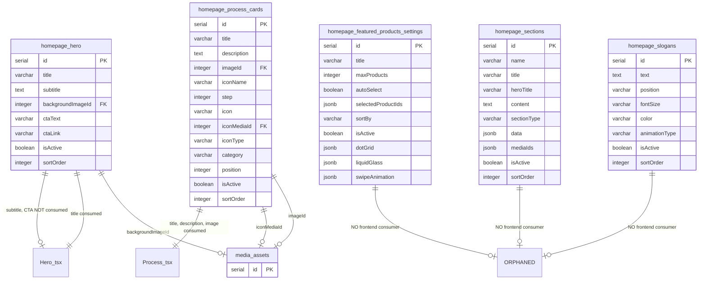
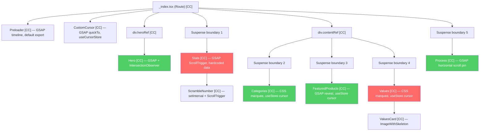
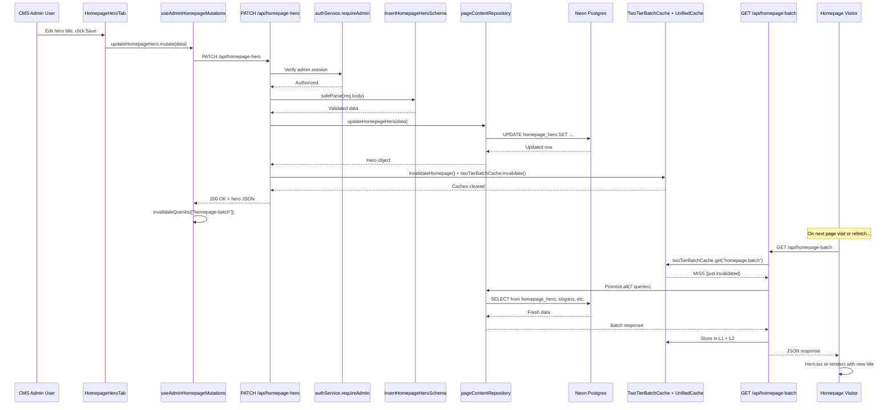
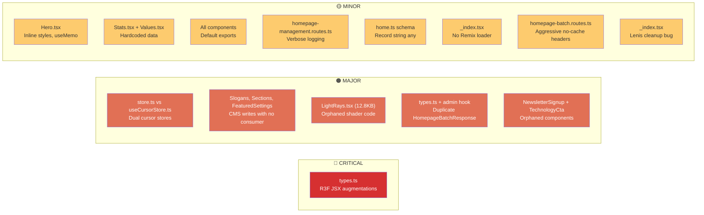

# RUN Homepage & CMS Admin — Forensic Audit Report
**Date:** 2026-03-16  **Auditor:** Antigravity  **Scope:** Homepage + CMS Admin

---

## Executive Summary

The RUN homepage is a visually ambitious, animation-heavy single-page experience built on React 19 + Vite with GSAP/Lenis for scroll effects. While the architecture demonstrates strong performance patterns (batch API, two-tier caching, code-splitting), the audit reveals **critical CMS integration gaps** where 2 of 7 visible sections (Stats, Values) are entirely hardcoded with zero CMS binding, **two divergent cursor state stores** operating in parallel, **three orphaned components** never rendered on the homepage, and **React Three Fiber JSX augmentations persisting as dead code** after a migration away from R3F. The Drizzle schema uses `Record<string, any>` in the `homepageSections.data` JSONB column, violating TypeScript strict mode. Collectively, these issues mean the CMS Admin's "Narrative Sections" tab edits data that the visitor frontend ignores, and animated homepage sections silently skip `prefers-reduced-motion` checks.

---

## 1. File Tree Reconnaissance

### 1.1 Homepage Visitor Component Tree

| File | Role | Import Style |
|------|------|-------------|
| `client/app/routes/_index.tsx` | Homepage route entry point | Default export |
| `client/app/components/homepage/Hero.tsx` | Hero section (static import) | Default export |
| `client/app/components/homepage/Stats.tsx` | Stats section (lazy) | Default export |
| `client/app/components/homepage/Categories.tsx` | Category marquee (lazy) | Default export |
| `client/app/components/homepage/FeaturedProducts.tsx` | Featured products grid (lazy) | Default export |
| `client/app/components/homepage/Values.tsx` | Values bento grid (lazy) | Default export |
| `client/app/components/homepage/Process.tsx` | Process pipeline (lazy) | Default export |
| `client/app/components/homepage/Preloader.tsx` | Loading animation | Default export |
| `client/app/components/ui/CustomCursor.tsx` | Custom cursor system | Default export |
| `client/app/components/homepage/constants.ts` | Fallback/hardcoded data | Named exports |
| `client/app/components/homepage/types.ts` | TypeScript interfaces | Named exports |
| `client/app/components/homepage/store.ts` | Zustand cursor store | Named export |
| `client/app/hooks/use-homepage-data.ts` | TanStack Query hook for batch API | Named export |

### 1.2 Orphaned Homepage Files (Never Rendered)

| File | Evidence | Status |
|------|----------|--------|
| `client/app/components/homepage/NewsletterSignup.tsx` | Not imported in `_index.tsx` | Dead code |
| `client/app/components/homepage/TechnologyCta.tsx` | Not imported in `_index.tsx` | Dead code |
| `client/app/components/homepage/effects/LightRays.tsx` | Only self-references in codebase | Dead code |
| `client/app/components/homepage/effects/index.ts` | Re-exports LightRays only | Dead code |

### 1.3 CMS Admin Counterparts

| Admin Component | File | Controls |
|-----------------|------|----------|
| `HomepageManagement` | `client/app/components/admin/homepage-management.tsx` | Tab container (5 tabs) |
| `HomepageHeroTab` | `client/app/components/admin/homepage/HomepageHeroTab.tsx` | Hero title, subtitle, CTA, background |
| `HomepageSlogansTab` | `client/app/components/admin/homepage/HomepageSlogansTab.tsx` | Slogan text, animation, ordering |
| `HomepageProcessCardsTab` | `client/app/components/admin/homepage/HomepageProcessCardsTab.tsx` | Process steps CRUD & reorder |
| `HomepageSectionsTab` | `client/app/components/admin/homepage/HomepageSectionsTab.tsx` | Narrative sections |
| `HomepageFeaturedTab` | `client/app/components/admin/homepage/HomepageFeaturedTab.tsx` | Featured product settings |

### 1.4 Admin Data Hooks

| Hook | File | Purpose |
|------|------|---------|
| `useAdminHomepageData` | `client/app/hooks/use-admin-homepage-data.ts` | Fetches batch + process cards for admin |
| `useAdminHomepageMutations` | `client/app/hooks/use-admin-homepage-mutations.ts` | CRUD mutation hooks (11 mutations) |

### 1.5 Drizzle Schema Tables

| Table | Schema File | Primary Consumer |
|-------|------------|-----------------|
| `homepage_hero` | `shared/schemas/content/home.ts` | Hero.tsx → CMS Hero Tab |
| `homepage_slogans` | `shared/schemas/content/home.ts` | ⚠️ No frontend consumer |
| `homepage_process_cards` | `shared/schemas/content/home.ts` | Process.tsx → CMS Process Tab |
| `homepage_sections` | `shared/schemas/content/home.ts` | ⚠️ No frontend consumer |
| `homepage_featured_products_settings` | `shared/schemas/content/home.ts` | ⚠️ No frontend consumer |

### 1.6 API Endpoints

| Endpoint | File | Method |
|----------|------|--------|
| `/api/homepage-batch` | `server/routes/resources/homepage-batch.routes.ts` | GET |
| `/api/homepage-process-cards` | `server/routes/resources/homepage-batch.routes.ts` | GET |
| `/api/homepage-hero` | `server/routes/resources/homepage-management.routes.ts` | GET, PATCH |
| `/api/homepage-slogans` | `server/routes/resources/homepage-management.routes.ts` | GET, POST, PATCH, DELETE |
| `/api/homepage-slogans/reorder` | `server/routes/resources/homepage-management.routes.ts` | PATCH |
| `/api/homepage-process-cards` | `server/routes/resources/homepage-management.routes.ts` | GET, POST, PATCH, DELETE |
| `/api/homepage-process-cards/admin` | `server/routes/resources/homepage-management.routes.ts` | GET |
| `/api/homepage-process-cards/reorder` | `server/routes/resources/homepage-management.routes.ts` | PATCH |
| `/api/homepage-sections` | `server/routes/resources/homepage-management.routes.ts` | GET, PATCH |
| `/api/homepage-featured-products-settings` | `server/routes/resources/homepage-management.routes.ts` | GET, PATCH |
| `/api/performance-monitoring` | `server/routes/resources/homepage-batch.routes.ts` | GET |

---

## 2. UI/UX & Visual Forensics

### [SEVERITY: MINOR] — Inline Styles in Hero Background

**File:** `client/app/components/homepage/Hero.tsx` (lines 131–144)
**Finding:** Two gradient background effects use inline `style={{}}` objects with hardcoded CSS values for `conic-gradient` and `radial-gradient` patterns, bypassing Tailwind's styling layer.
**Root Cause:** Complex gradient syntax not easily expressible with Tailwind utility classes.
**2026 Standard Violated:** Tailwind v4 `@utility` layer can define custom gradient utilities, avoiding inline styles.
**Impact:** Minor styling inconsistency. Inline styles bypass Tailwind's purging and cannot be theme-aware.

### [SEVERITY: MINOR] — Preloader Grid Background Also Inline

**File:** `client/app/components/homepage/Preloader.tsx` (lines 147–151)
**Finding:** Grid background pattern uses inline `style` with `backgroundImage` and `backgroundSize`.
**Root Cause:** Same as above — complex CSS pattern deferred to inline styles.
**2026 Standard Violated:** Tailwind v4 `@utility` layer for custom patterns.
**Impact:** Minor. Preloader is transient and removed after load.

### [SEVERITY: MINOR] — Arbitrary Viewport Units in Typography

**File:** `client/app/components/homepage/Hero.tsx` (line 156)
**Finding:** Uses `text-[13vw] sm:text-[10vw] md:text-[8vw] lg:text-[7vw] xl:text-[6vw]` — arbitrary Tailwind values in JSX.
**Root Cause:** Responsive typography sized with viewport units requires arbitrary values that Tailwind's default scale doesn't cover.
**2026 Standard Violated:** Tailwind v4 recommends defining these as design tokens in `@theme` or `@utility` rather than arbitrary values in JSX.
**Impact:** Makes the design system fragile. The same pattern repeats in `Stats.tsx` (lines 160, 184), `Categories.tsx` (line 81), `FeaturedProducts.tsx` (line 71), and `Process.tsx` (line 195).

### [SEVERITY: MINOR] — Stats Section Uses Hardcoded Unsplash Image

**File:** `client/app/components/homepage/Stats.tsx` (line 143)
**Finding:** A single background image URL is hardcoded as `https://images.unsplash.com/photo-1590644365607...`.
**Root Cause:** No CMS control for the Stats background image.
**2026 Standard Violated:** N/A (design choice), but creates a dependency on external CDN.
**Impact:** If Unsplash rate-limits or changes URLs, the background breaks. No admin control.

### [SEVERITY: MINOR] — Values Section Hardcoded Unsplash Images

**File:** `client/app/components/homepage/Values.tsx` (lines 113, 122, 130, 139)
**Finding:** Four card images are hardcoded Unsplash URLs. No CMS binding.
**Root Cause:** Values component was built without CMS integration.
**2026 Standard Violated:** N/A — architectural gap, not a code standard violation.
**Impact:** Cannot change Values imagery without code deployment.

---

## 3. Theme & Styling Integrity

### [SEVERITY: MINOR] — Hardcoded Color Values in CustomCursor

**File:** `client/app/components/ui/CustomCursor.tsx` (lines 100, 108, 112)
**Finding:** Uses hardcoded `backgroundColor: "#fff"` and `borderColor: "#fff"` in GSAP animation targets instead of CSS variables or Tailwind tokens.
**Root Cause:** GSAP `gsap.to()` requires computed CSS values, not class names.
**2026 Standard Violated:** Should use `var(--color-foreground)` or similar CSS variable that responds to theme changes.
**Impact:** The custom cursor will always render as white regardless of theme context, though it uses `mixBlendMode: "difference"` as a workaround.

### [SEVERITY: MINOR] — Hero Section Forces `dark` Class

**File:** `client/app/components/homepage/Hero.tsx` (line 122)
**Finding:** `<section ... className="... dark">` — the Hero section hardcodes the `dark` class.
**Root Cause:** Intentional design decision to ensure Hero always renders in dark mode.
**2026 Standard Violated:** Not a violation per se given the Tailwind v4 dark mode strategy. However, this creates an implicit specificity boundary that could conflict with global theme switching.
**Impact:** Low. Hero is always on a dark background, so this is defensible.

### [SEVERITY: MINOR] — `stroke-text` Custom Class Without `@utility` Definition

**File:** `client/app/components/homepage/Categories.tsx` (line 81)
**Finding:** Uses `stroke-text` class which is presumably defined elsewhere but not as a Tailwind `@utility`.
**Root Cause:** Legacy custom CSS class.
**2026 Standard Violated:** Tailwind v4 recommends registering custom utilities via `@utility` in CSS.
**Impact:** Low — functional but inconsistent with Tailwind v4 patterns.

---

## 4. Motion & Animation Audit

### Animation Catalogue

| Component | Animation Library | Type | Trigger |
|-----------|-------------------|------|---------|
| `_index.tsx` | Lenis + GSAP | Smooth scroll + kinetic skew | Page load |
| `Hero.tsx` | GSAP | Title reveal (fromTo), mouse parallax | View + mousemove |
| `Stats.tsx` | GSAP ScrollTrigger | Left panel pin, stat fade-in, ScrambleNumber | Scroll |
| `Categories.tsx` | CSS @keyframes | `animate-marquee` infinite scroll | Always (pause when offscreen) |
| `FeaturedProducts.tsx` | GSAP ScrollTrigger | Card slide-up reveal | Scroll |
| `Values.tsx` | CSS @keyframes | `animate-marquee` certification ticker | Always |
| `Process.tsx` | GSAP ScrollTrigger | Horizontal scroll pin, SVG line draw, mobile reveal | Scroll |
| `Preloader.tsx` | GSAP | Progress bar, text cycling, exit transition | Page load |
| `CustomCursor.tsx` | GSAP quickTo | Dual-layer cursor following | Mousemove |

### [SEVERITY: MAJOR] — Incomplete `prefers-reduced-motion` Coverage

**File:** `client/app/routes/_index.tsx` (line 50-54)
**Finding:** The root `_index.tsx` correctly checks `prefers-reduced-motion` and skips Lenis smooth scroll and skew effects. However, **none of the lazy-loaded section components** honor this preference independently:
- `Stats.tsx` — No `prefers-reduced-motion` check. ScrollTrigger pins and scramble animations fire regardless.
- `Categories.tsx` — Has CSS `motion-reduce:[animation-play-state:paused]` for the marquee ✅, but no GSAP guard.
- `FeaturedProducts.tsx` — No `prefers-reduced-motion` check. GSAP card reveals fire regardless.
- `Values.tsx` — No `prefers-reduced-motion` check on the certification ticker marquee (CSS animation).
- `Process.tsx` — No `prefers-reduced-motion` check. Horizontal scroll pinning fires regardless.
- `Hero.tsx` — No `prefers-reduced-motion` check on GSAP text reveal or mouse parallax.
- `Preloader.tsx` — No `prefers-reduced-motion` check. Loading animation always plays.

**Root Cause:** `prefers-reduced-motion` was implemented at the scroll-level orchestrator but not propagated to individual component animations.
**2026 Standard Violated:** WCAG 2.2 SC 2.3.3 (Animation from Interactions) and the broader principle that all non-essential animations should respect the user's motion preference.
**Impact:** Users with vestibular disorders will still experience GSAP animations, ScrollTrigger pinning, and scramble effects.

### [SEVERITY: MINOR] — Preloader Text References Non-Existent WebGL

**File:** `client/app/components/homepage/Preloader.tsx` (line 7)
**Finding:** `LOADING_TEXTS` array includes `"LOADING WEBGL SHADERS"` and `"CALIBRATING PHYSICS ENGINE"` — no WebGL or physics engine exists in the current homepage.
**Root Cause:** Legacy copy from when the homepage used React Three Fiber. The R3F migration removed the Canvas but not the loading text.
**2026 Standard Violated:** Not a code standard issue, but UX integrity — loading text should reflect actual system activity.
**Impact:** Misleading to developers and potentially to users.

### [SEVERITY: MINOR] — Lenis Cleanup Has a Bug

**File:** `client/app/routes/_index.tsx` (line 114)
**Finding:** Cleanup removes `lenis.raf` via `gsap.ticker.remove(lenis.raf)`, but the actual ticker callback on line 106 is an anonymous wrapper `(time) => { lenis.raf(time * 1000); }`. `gsap.ticker.remove(lenis.raf)` won't remove the anonymous function — it removes the wrong reference.
**Root Cause:** The anonymous function is not stored in a variable so it cannot be properly removed.
**2026 Standard Violated:** React 19 `useEffect` cleanup must properly dispose of all side effects.
**Impact:** Memory leak — the anonymous ticker callback persists after the component unmounts on navigation away from homepage, continuing to call `lenis.raf` on a destroyed Lenis instance.

---

## 5. Performance & Rendering Pipeline

### [SEVERITY: MINOR] — Manual `useMemo` in Hero (React Compiler Handles This)

**File:** `client/app/components/homepage/Hero.tsx` (lines 17–22)
**Finding:** `heroLines` computed via `useMemo`. With the React 19 Compiler enabled (as specified in the tech stack), the compiler auto-memoizes pure computations.
**Root Cause:** Pre-React-Compiler pattern. Harmless but unnecessary.
**2026 Standard Violated:** React 19 Compiler auto-memoizes. Manual `useMemo` for simple string splits is technical debt.
**Impact:** No runtime impact. Minor code hygiene issue.

### [SEVERITY: MINOR] — No Remix `loader` or Server-Side Data Fetching

**File:** `client/app/routes/_index.tsx`
**Finding:** The homepage route has no `loader` export. All data is fetched client-side via `useHomepageData()` (TanStack Query calling `/api/homepage-batch`). This means:
1. The initial HTML has no homepage content — it's an empty shell until JavaScript hydrates and the API call completes.
2. SEO crawlers that don't execute JS won't see homepage content.
3. First Contentful Paint is delayed by the API round-trip.

**Root Cause:** The project uses React Router v7 / Remix-style routing but doesn't leverage server-side `loader` functions for the homepage.
**2026 Standard Violated:** Remix/React Router v7 best practice is to use `loader` for data that affects SSR and SEO. Critical path data should be server-rendered.
**Impact:** Significant. Homepage content is invisible to search engines without JS execution. LCP is delayed. This is the single largest performance concern.

### [SEVERITY: MINOR] — `Cache-Control: no-cache, no-store, must-revalidate` on Batch API

**File:** `server/routes/resources/homepage-batch.routes.ts` (lines 103–105)
**Finding:** The batch endpoint sets aggressive no-cache headers even for visitor requests. While server-side caching (L1/L2) is active, the browser cannot cache any batch response.
**Root Cause:** Initial implementation targeted admin cache-busting but applied the same headers to all consumers.
**2026 Standard Violated:** `stale-while-revalidate` HTTP cache headers should be used for visitor-facing responses, with aggressive no-cache reserved for admin endpoints.
**Impact:** Every page navigation triggers a full API fetch even if content hasn't changed. Network overhead on every homepage visit.

### [SEVERITY: MINOR] — `useStore.isLoading` Is Never Consumed

**File:** `client/app/components/homepage/store.ts` (lines 9, 20)
**Finding:** The Zustand store has `isLoading` and `setIsLoading` but no component reads `isLoading` from this store. The `_index.tsx` uses its own `preloaderFinished` state instead.
**Root Cause:** Leftover from an earlier design pattern.
**2026 Standard Violated:** Dead state in a global store creates confusion about the source of truth.
**Impact:** No runtime impact. Code hygiene issue.

### [SEVERITY: MINOR] — Dual Cursor Stores

**File:** `client/app/components/homepage/store.ts` vs `client/app/stores/useCursorStore.ts`
**Finding:** Two separate Zustand stores manage cursor state:
1. `homepage/store.ts` — Used by `Categories.tsx`, `FeaturedProducts.tsx`, `Values.tsx`
2. `stores/useCursorStore.ts` — Used by `CustomCursor.tsx` and `FooterInquiryForm.tsx`

The `CustomCursor.tsx` reads from `useCursorStore`, but homepage components write to `useStore`. **These are different store instances** with no synchronization.
**Root Cause:** The cursor system was refactored into a shared store (`useCursorStore`) but homepage components were never migrated.
**2026 Standard Violated:** Single source of truth principle.
**Impact:** **Critical functional bug.** When a user hovers over Categories/FeaturedProducts/Values, the homepage store is updated but the CustomCursor reads from a different store — **the custom cursor hover states (VIEW, BUTTON) never activate on these homepage sections.** The cursor remains in DEFAULT state.

---

## 6. CMS-to-Frontend Integration Audit

### 6.1 Hero Section — ✅ Connected

```
Admin HeroTab → PATCH /api/homepage-hero → pageContentRepository.updateHomepageHero()
  → homepage_hero table → GET /api/homepage-batch → useHomepageData()
  → Hero.tsx (heroData.title split by "|") → Rendered <h1>
```

**Status:** Full end-to-end binding confirmed. Admin can update title, subtitle, CTA text/link, and background image. The frontend correctly splits the title by `"|"` delimiter and renders each segment as a hero line.

**⚠️ Gap:** The `subtitle`, `ctaText`, and `ctaLink` fields from the schema exist in the database and are returned by the API, but `Hero.tsx` only consumes `heroData?.title`. The subtitle, CTA text, and CTA link have no visual representation on the frontend.

### 6.2 Slogans — ⚠️ Binding Broken

```
Admin SlogansTab → CRUD /api/homepage-slogans → homepage_slogans table
  → GET /api/homepage-batch (slogans field) → useHomepageData()
  → ❌ NO FRONTEND CONSUMER
```

**Status:** The admin can create, update, delete, and reorder slogans. The batch API returns them in `homepageData.slogans.result`. However, `_index.tsx` **never passes `slogans` data to any component**, and no homepage component accepts or renders slogans.

**Impact:** Admin users editing slogans are performing writes that have zero visual effect on the visitor homepage.

### 6.3 Process Cards — ✅ Connected

```
Admin ProcessCardsTab → CRUD /api/homepage-process-cards → homepage_process_cards table
  → GET /api/homepage-batch (processCards field) → useHomepageData()
  → Process.tsx (batchData.processCards.result) → Rendered cards
```

**Status:** Full end-to-end binding confirmed. Process.tsx correctly falls back to `FALLBACK_STEPS` when CMS data is unavailable.

**⚠️ Gap:** The schema has rich fields (`icon`, `iconMediaId`, `iconType`, `category`, `position`) but the frontend `ProcessStep` type (in `types.ts`) only declares `{ id, title, description, image }`. The extra CMS fields are stored but never displayed.

### 6.4 Sections — ⚠️ Binding Broken

```
Admin SectionsTab → PATCH /api/homepage-sections/:id → homepage_sections table
  → GET /api/homepage-batch (sections field) → useHomepageData()
  → ❌ NO FRONTEND CONSUMER
```

**Status:** The batch API returns `homepageData.sections.result` typed as `DataWithTimestamp<unknown[]>`. The `_index.tsx` route never passes sections data to any component. The Sections admin tab writes to the database, but no visitor component reads or renders this data.

**Impact:** Admin edits to "Narrative Sections" are invisible to visitors.

### 6.5 Featured Products Settings — ⚠️ Binding Broken

```
Admin FeaturedTab → PATCH /api/homepage-featured-products-settings → homepage_featured_products_settings table
  → GET /api/homepage-batch (featuredProductsSettings field) → useHomepageData()
  → ❌ NO FRONTEND CONSUMER (FeaturedProducts.tsx only uses products, not settings)
```

**Status:** The batch API returns `homepageData.featuredProductsSettings.result`. However, `FeaturedProducts.tsx` only accepts a `products` prop and never consumes the settings (title, maxProducts, sortBy, animation settings).

**Impact:** Admin configurations for featured product display (max count, sort order, animation tuning) have no effect on the frontend rendering.

### 6.6 Stats — ❌ No CMS Integration

**Status:** `Stats.tsx` imports and renders `KEY_STATS` directly from `constants.ts` (lines 5, 179). No CMS table exists for stats. No API endpoint serves stats data. No admin interface exists to manage stats.

### 6.7 Values — ❌ No CMS Integration

**Status:** `Values.tsx` renders hardcoded data inline (lines 106–140). Titles, subtitles, icons, and images are all static JSX with no data props or API calls. No CMS table, API, or admin interface exists for Values content.

### 6.8 Categories — ✅ Connected (with fallback)

```
Products DB → productRepository.getCategories() → GET /api/homepage-batch (categories field)
  → useHomepageData() → _index.tsx passes homepageData.categories.result
  → Categories.tsx (data prop) → Marquee render with fallback to CATEGORIES constant
```

**Status:** Connected. Categories accepts `data` prop and falls back to `CATEGORIES` constant when undefined.

### 6.9 Products — ✅ Connected (with fallback)

```
Products DB → productRepository.getProducts(20) → GET /api/homepage-batch (products field)
  → useHomepageData() → _index.tsx passes homepageData.products.result
  → FeaturedProducts.tsx (products prop) → Grid render with fallback to FEATURED_PRODUCTS constant
```

**Status:** Connected. FeaturedProducts accepts `products` prop and falls back to `FEATURED_PRODUCTS` constant when undefined.

### 6.10 Type Divergence Summary

| Aspect | Visitor Type (`components/homepage/types.ts`) | Shared/Admin Type (`shared/schemas/content/home.ts`) |
|--------|----------------------------------------------|-----------------------------------------------------|
| `HomepageBatchResponse` | Defined locally with `unknown[]` for sections | Defined in admin hook with proper DB types |
| `HeroData` | `{ title, subtitle, ctaText, ctaLink }` | `HomepageHero` includes `id, backgroundImageId, isActive, sortOrder, createdAt, updatedAt` |
| `ProcessStep` | `{ id: string, title, description, image }` | `HomepageProcessCard` includes `step, icon, iconType, iconMediaId, category, position, isActive, sortOrder` |
| `sections` type | `DataWithTimestamp<unknown[]>` | `HomepageSection[]` with full schema |

---

## 7. Technical Debt Catalogue

### [SEVERITY: CRITICAL] — React Three Fiber JSX Augmentations as Dead Code

**File:** `client/app/components/homepage/types.ts` (lines 70–100)
**Finding:** Two blocks of global/module JSX augmentations declare R3F intrinsic elements (`mesh`, `planeGeometry`, `shaderMaterial`, `group`, etc.) with type `unknown`. These are remnants from when the homepage used `@react-three/fiber`.
**Root Cause:** R3F was removed from the homepage render path but the type augmentations were left behind.
**2026 Standard Violated:** Global namespace pollution. These augmentations affect the entire TypeScript compilation and could mask type errors in other files.
**Impact:** TypeScript won't flag accidental use of `<mesh>` or `<planeGeometry>` anywhere in the codebase because these types are globally declared as valid JSX elements.

### [SEVERITY: MAJOR] — Duplicate `HomepageBatchResponse` Types

**File:** `client/app/components/homepage/types.ts` (line 60) vs `client/app/hooks/use-admin-homepage-data.ts` (line 10)
**Finding:** Two completely separate interface definitions for `HomepageBatchResponse`:
- Visitor version: includes `products`, `categories`, `processCards`, typed loosely (`unknown[]` for sections)
- Admin version: excludes `products`, `categories`, `processCards` — different shape entirely

**Root Cause:** The types were created independently for each hook without coordination.
**2026 Standard Violated:** Shared types should live in `shared/` and be used by both client hooks.
**Impact:** API response shape changes would need to be updated in two places. Type safety is weakened.

### [SEVERITY: MAJOR] — Three Orphaned Components

| Component | File | Size | Issue |
|-----------|------|------|-------|
| `NewsletterSignup` | `client/app/components/homepage/NewsletterSignup.tsx` | 3.3KB | Uses `React.useActionState` and Framer Motion. Never imported in `_index.tsx`. |
| `TechnologyCta` | `client/app/components/homepage/TechnologyCta.tsx` | 4.2KB | Uses CVA patterns. Never imported in `_index.tsx`. |
| `LightRays` | `client/app/components/homepage/effects/LightRays.tsx` | 12.8KB | 451 lines of complex canvas/shader code. Never imported anywhere. |

**Root Cause:** Components built during development but never integrated, or removed from the render tree without deletion.
**2026 Standard Violated:** Dead code should be pruned. 20.3KB of unused code.
**Impact:** Bundle may include `LightRays.tsx` (12.8KB) if tree-shaking doesn't eliminate the re-export in `effects/index.ts`.

### [SEVERITY: MAJOR] — Dual Cursor Store Architecture

**File:** `client/app/components/homepage/store.ts` vs `client/app/stores/useCursorStore.ts`
**Finding:** Two separate Zustand stores manage cursor variants. Homepage components (Categories, FeaturedProducts, Values) write to `homepage/store.ts` using `useStore`, while `CustomCursor.tsx` reads from `stores/useCursorStore.ts` using `useCursorStore`.
**Root Cause:** Incomplete migration from component-local store to shared application store.
**2026 Standard Violated:** Single source of truth. State management should be unified.
**Impact:** Custom cursor hover effects are broken on Categories, FeaturedProducts, and Values sections.

### [SEVERITY: MINOR] — All Homepage Components Use Default Exports

**Files:** Hero.tsx, Stats.tsx, Categories.tsx, FeaturedProducts.tsx, Values.tsx, Process.tsx, Preloader.tsx, CustomCursor.tsx
**Finding:** Every homepage component uses `export default` instead of named exports.
**Root Cause:** Legacy pattern. Project rules mandate named exports except for route files.
**2026 Standard Violated:** Project coding standards rule: "Export components as named exports, not default (except route files)."
**Impact:** Code consistency. Makes refactoring and tree-shaking slightly less reliable.

### [SEVERITY: MINOR] — Verbose Debug Logging in Production Route

**File:** `server/routes/resources/homepage-management.routes.ts` (lines 120–148)
**Finding:** The `PATCH /api/homepage-hero` handler has 13 lines of `logger.info()` calls with emoji prefixes and detailed timestamps. This is debugging instrumentation that should have been removed or downgraded to `logger.debug()`.
**Root Cause:** Left from a debugging session (per inline comments about "STEP 5: BACKEND").
**2026 Standard Violated:** Production routes should use structured, leveled logging. Info-level logging should be concise.
**Impact:** Log noise in production. Sensitive data (full request bodies) logged at info level.

### [SEVERITY: MINOR] — `$type<Record<string, any>>` in Drizzle Schema

**File:** `shared/schemas/content/home.ts` (line 116)
**Finding:** `data: jsonb().$type<Record<string, any>>()` — uses `any` type in the JSONB column definition.
**Root Cause:** The `data` field in `homepage_sections` stores variable-shape JSON, and a proper discriminated union wasn't defined.
**2026 Standard Violated:** TypeScript strict mode prohibits `any`. The `SustainabilitySectionData` type exists in `shared/types/homepage.ts` but isn't used here.
**Impact:** No type safety for section data. Any shape can be inserted.

### No `// TODO`, `// FIXME`, or `// HACK` comments found in homepage-related files.

---

## 8. Mermaid.js Visual Diagrams

### Diagram 1: Homepage Rendering Pipeline



### Diagram 2: CMS-to-Frontend Schema Map



### Diagram 3: React Component Tree



> **Note:** All components are Client Components [CC]. No Server Components [SC] are used on the homepage — there are no `loader` functions or server-side rendering. The entire homepage is client-rendered after hydration.

### Diagram 4: Admin Save → Frontend Render



### Diagram 5: Technical Debt Heatmap



### Recommended Additional Diagrams

1. **State Machine Diagram (`stateDiagram-v2`)** — Model the Preloader → Hero → Scrolling state transitions to document the exact user experience lifecycle and identify potential race conditions between Lenis initialization and component mounting.

2. **Gantt Chart (`gantt`)** — Prioritize technical debt fixes by effort vs. impact, grouping them into sprint-sized work packages (e.g., "Sprint 1: Unify cursor stores + wire slogans" vs "Sprint 2: Add Remix loader + SSR").

3. **Pie Chart (`pie`)** — Visualize CMS coverage: what percentage of homepage visual real estate is CMS-controlled vs. hardcoded, highlighting the ROI of completing the CMS integration.

---

## 9. Quality & Performance Score

### Deduction Log

| # | Category | Issue | Deduction | Rationale |
|---|----------|-------|-----------|-----------|
| 1 | UI/UX | Inline styles in Hero + Preloader | -1 | Minor visual consistency issue |
| 2 | UI/UX | Arbitrary viewport units across 5+ files | -2 | Fragile responsive typography system |
| 3 | UI/UX | Hardcoded Unsplash images (Stats, Values, constants) | -2 | External CDN dependency, no admin control |
| 4 | Theme | Hardcoded `#fff` in CustomCursor GSAP | -1 | Not theme-responsive |
| 5 | Theme | `stroke-text` not in `@utility` | -1 | Tailwind v4 pattern violation |
| 6 | Motion | Incomplete `prefers-reduced-motion` (6 components) | -5 | WCAG accessibility violation across most sections |
| 7 | Motion | Lenis ticker cleanup bug | -2 | Memory leak on navigation |
| 8 | Motion | Preloader text references non-existent WebGL | -1 | Misleading UX copy |
| 9 | Performance | No Remix `loader` — full client-side rendering | -8 | Missing SSR, SEO invisible, delayed LCP |
| 10 | Performance | `useMemo` technical debt (React Compiler) | -1 | Minor tech debt |
| 11 | Performance | Aggressive no-cache on visitor batch API | -2 | Unnecessary network overhead |
| 12 | Performance | `useStore.isLoading` dead state | -1 | Dead code in global store |
| 13 | CMS Integration | Slogans: CMS writes with no consumer | -4 | Complete binding failure |
| 14 | CMS Integration | Sections: CMS writes with no consumer | -4 | Complete binding failure |
| 15 | CMS Integration | Featured Settings: CMS writes partially consumed | -3 | Settings ignored by frontend |
| 16 | CMS Integration | Hero subtitle/CTA not rendered | -2 | Partial binding |
| 17 | CMS Integration | Stats/Values fully hardcoded | -3 | No CMS integration at all |
| 18 | Code Quality | R3F JSX augmentations in types.ts | -3 | Global namespace pollution, dead code |
| 19 | Code Quality | Duplicate HomepageBatchResponse | -2 | Type divergence |
| 20 | Code Quality | 3 orphaned components (20.3KB) | -2 | Dead code |
| 21 | Code Quality | Dual cursor stores (functional bug) | -2 | Broken feature |
| 22 | Code Quality | Default exports on all components | -1 | Project standard violation |

### Score Summary Table

| Category | Max Points | Awarded | Key Deductions |
|----------|-----------|---------|----------------|
| UI/UX & Visual Fidelity | 20 | **15** | Inline styles, arbitrary values, hardcoded images |
| Theme & Styling Integrity | 15 | **13** | Hardcoded cursor colors, missing @utility |
| Motion & Animation Quality | 10 | **2** | `prefers-reduced-motion` gaps, memory leak, misleading text |
| Performance & Rendering Pipeline | 25 | **13** | No SSR/loader, aggressive no-cache, dead state |
| CMS Integration Correctness | 20 | **4** | 3 fully broken bindings, 2 partial, 2 missing entirely |
| Code Quality & Technical Debt | 10 | **0** | R3F augmentations, dual stores, orphaned code, type dupes |

### **Total Score: 47 / 100**

### Verdict

The RUN homepage achieves its visual ambition with sophisticated scroll-locked animations, kinetic typography, and a premium dark aesthetic. However, **the CMS integration layer is fundamentally incomplete** — only 3 out of 7 CMS-controlled data domains actually reach the visitor frontend, meaning the admin dashboard creates a false sense of control. The most impactful single issue is the **absence of a Remix `loader`**, which means the homepage is entirely client-rendered with no SSR benefit for SEO or initial paint. The **dual cursor store bug** silently breaks the custom cursor experience on 3 of 7 homepage sections. The system is not production-ready for a B2B commercial touchpoint where SEO visibility, CMS fidelity, and accessibility are critical conversion factors. Immediate priorities should be: (1) unify cursor stores, (2) wire remaining CMS bindings, (3) add a Remix `loader` for SSR, and (4) propagate `prefers-reduced-motion` to all animated components.

---

## 10. Unconfirmed / Requires Runtime Testing

### FOUC (Flash of Unstyled Content)

**Hypothesis:** Because there is no Remix `loader` and all data is fetched client-side, visitors may see unstyled Suspense fallback divs (`animate-pulse` placeholders) for 200–500ms while the batch API responds.
**Reproduction Steps:** Open `http://localhost:5002` in a browser with network throttling set to "Slow 3G". Observe the time between initial HTML paint and the appearance of hero content.
**Why Unconfirmed:** Requires live browser observation to measure the actual delay.

### CLS Measurement

**Hypothesis:** The `min-h-[150vh]` fallback (Stats), `min-h-[80vh]` (Categories), and `min-h-[100vh]` (FeaturedProducts) Suspense fallbacks may partially mitigate CLS, but the actual rendered heights could differ from the fallback heights.
**Reproduction Steps:** Run Lighthouse performance audit on `http://localhost:5002` and check CLS score.
**Why Unconfirmed:** Requires runtime layout measurement.

### Lenis Memory Leak Severity

**Hypothesis:** The anonymous ticker callback (line 106) surviving cleanup causes `lenis.raf()` to be called on a destroyed instance. This may throw silent errors or consume CPU cycles.
**Reproduction Steps:** Navigate to homepage, then navigate away. Open Chrome DevTools → Performance tab → record for 10 seconds. Check if `lenis.raf` appears in the flame chart.
**Why Unconfirmed:** Requires runtime profiling.

### Custom Cursor Hover Bug Severity

**Hypothesis:** The dual cursor stores mean that hovering Categories/FeaturedProducts/Values updates `homepage/store.ts` but `CustomCursor.tsx` reads `stores/useCursorStore.ts`, so cursor never changes to VIEW/BUTTON state.
**Reproduction Steps:** Load `http://localhost:5002` → Hover over a category name in the marquee → Observe if the custom cursor changes to the VIEW state with the category image.
**Why Unconfirmed:** Requires runtime hover testing to confirm the stores are truly disconnected (a bridge or middleware could exist that wasn't found in the code audit).

---

*Report generated by Antigravity — Read-only forensic audit. No files were modified.*
