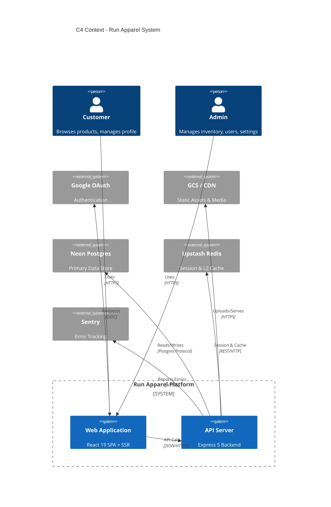
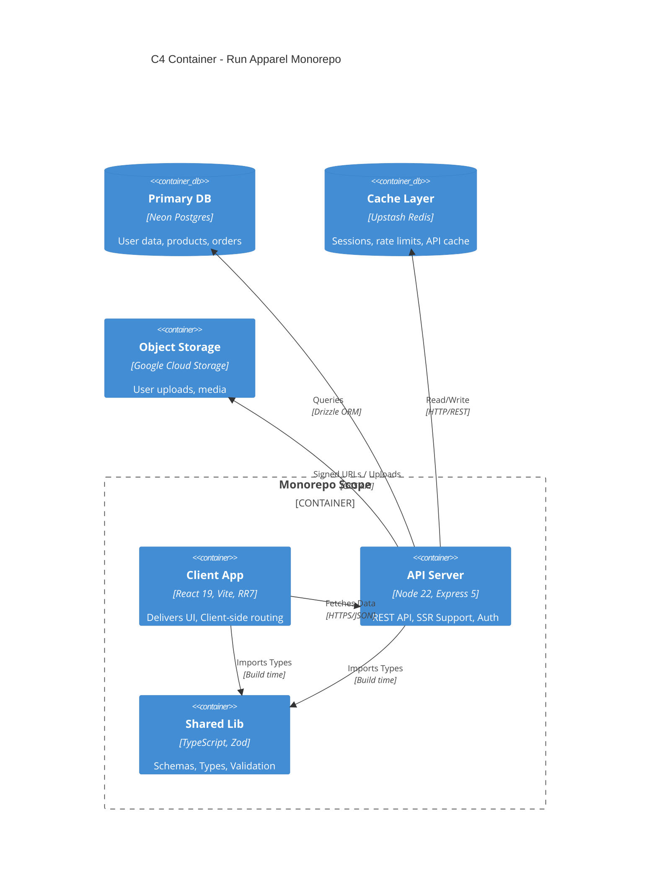
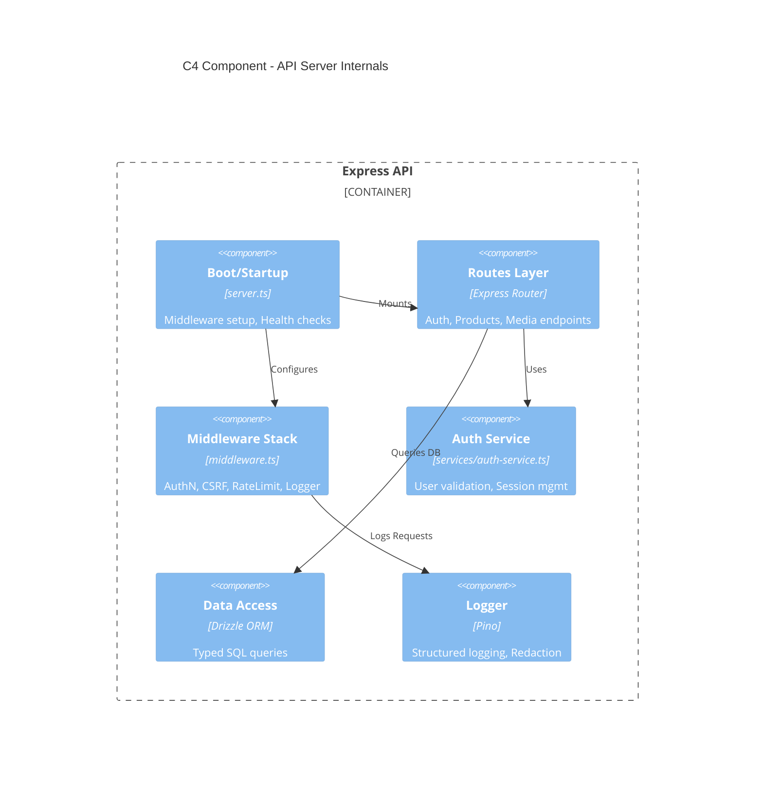
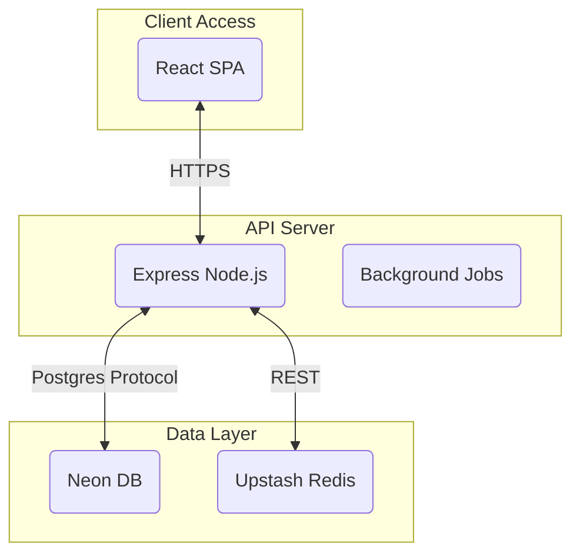
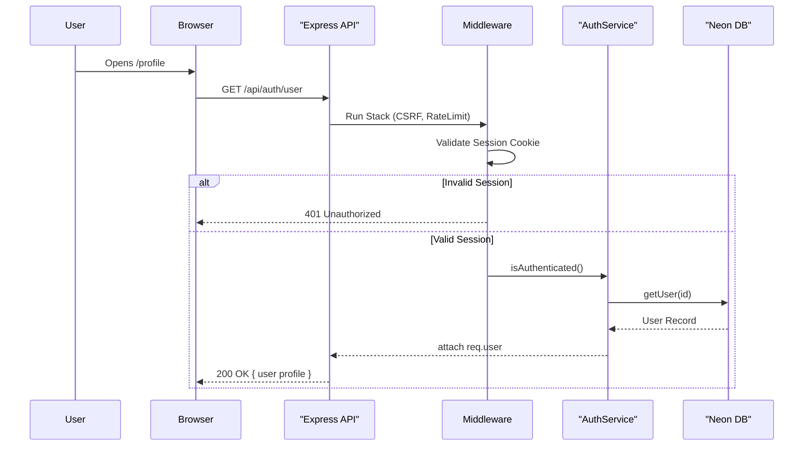
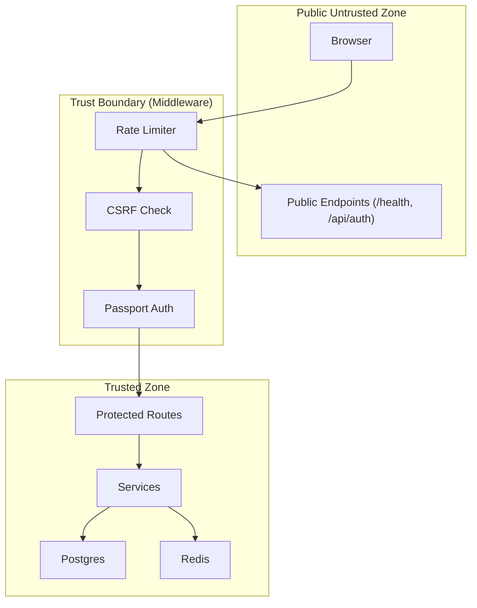
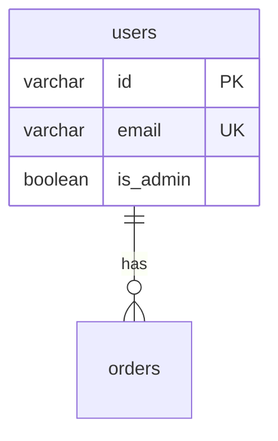

```mermaid
C4Context
    title C4 Context - Run Apparel System

    Person(customer, "Customer", "Browses products, manages profile")
    Person(admin, "Admin", "Manages inventory, users, settings")

    System_Boundary(run_system, "Run Apparel Platform") {
        System(web_app, "Web Application", "React 19 SPA + SSR")
        System(api, "API Server", "Express 5 Backend")
    }

    System_Ext(auth_provider, "Google OAuth", "Authentication")
    System_Ext(cdn, "GCS / CDN", "Static Assets & Media")
    System_Ext(db_neon, "Neon Postgres", "Primary Data Store")
    System_Ext(redis_upstash, "Upstash Redis", "Session & L2 Cache")
    System_Ext(sentry, "Sentry", "Error Tracking")

    Rel(customer, web_app, "Uses", "HTTPS")
    Rel(admin, web_app, "Uses", "HTTPS")
    Rel(web_app, api, "API Calls", "JSON/HTTPS")
    Rel(web_app, auth_provider, "Redirects", "OIDC")
    Rel(api, db_neon, "Reads/Writes", "Postgres Protocol")
    Rel(api, redis_upstash, "Session & Cache", "REST/HTTP")
    Rel(api, cdn, "Uploads/Serves", "HTTPS")
    Rel(api, sentry, "Reports Errors", "HTTPS")
```

```mermaid
C4Container
    title C4 Container - Run Apparel Monorepo

    Container_Boundary(monorepo, "Monorepo Scope") {
        Container(client, "Client App", "React 19, Vite, RR7", "Delivers UI, Client-side routing")
        Container(server, "API Server", "Node 22, Express 5", "REST API, SSR Support, Auth")
        Container(shared, "Shared Lib", "TypeScript, Zod", "Schemas, Types, Validation")
    }

    ContainerDb(postgres, "Primary DB", "Neon Postgres", "User data, products, orders")
    ContainerDb(redis, "Cache Layer", "Upstash Redis", "Sessions, rate limits, API cache")
    Container(storage, "Object Storage", "Google Cloud Storage", "User uploads, media")

    Rel(client, server, "Fetches Data", "HTTPS/JSON")
    Rel(server, postgres, "Queries", "Drizzle ORM")
    Rel(server, redis, "Read/Write", "HTTP/REST")
    Rel(server, storage, "Signed URLs / Uploads", "GCS API")
    Rel(client, shared, "Imports Types", "Build time")
    Rel(server, shared, "Imports Types", "Build time")
```

```mermaid
C4Component
    title C4 Component - API Server Internals

    Container_Boundary(api, "Express API") {
        Component(boot, "Boot/Startup", "server.ts", "Middleware setup, Health checks")
        Component(routes, "Routes Layer", "Express Router", "Auth, Products, Media endpoints")
        Component(middleware, "Middleware Stack", "middleware.ts", "AuthN, CSRF, RateLimit, Logger")
        Component(auth_svc, "Auth Service", "services/auth-service.ts", "User validation, Session mgmt")
        Component(drizzle, "Data Access", "Drizzle ORM", "Typed SQL queries")
        Component(logger, "Logger", "Pino", "Structured logging, Redaction")
    }

    Rel(boot, middleware, "Configures")
    Rel(boot, routes, "Mounts")
    Rel(routes, auth_svc, "Uses")
    Rel(routes, drizzle, "Queries DB")
    Rel(middleware, logger, "Logs Requests")
```

```mermaid
flowchart TB
    subgraph Client["Client Access"]
        browser("React SPA")
    end

    subgraph API["API Server"]
        server("Express Node.js")
        worker("Background Jobs")
    end

    subgraph DB["Data Layer"]
        postgres("Neon DB")
        redis("Upstash Redis")
    end

    browser <-->|HTTPS| server
    server <-->|Postgres Protocol| postgres
    server <-->|REST| redis
```

```mermaid
sequenceDiagram
    participant User
    participant Browser
    participant Express as "Express API"
    participant Middleware
    participant AuthSvc as "AuthService"
    participant DB as "Neon DB"

    User->>Browser: Opens /profile
    Browser->>Express: GET /api/auth/user
    Express->>Middleware: Run Stack (CSRF, RateLimit)
    Middleware->>Middleware: Validate Session Cookie
    alt Invalid Session
        Middleware-->>Browser: 401 Unauthorized
    else Valid Session
        Middleware->>AuthSvc: isAuthenticated()
        AuthSvc->>DB: getUser(id)
        DB-->>AuthSvc: User Record
        AuthSvc-->>Express: attach req.user
        Express-->>Browser: 200 OK { user profile }
    end
```

```mermaid
flowchart TB
    subgraph Public["Public Untrusted Zone"]
        Browser
        PublicAPI["Public Endpoints (/health, /api/auth)"]
    end

    subgraph DMZ["Trust Boundary (Middleware)"]
        Firewall["Rate Limiter"]
        CSRF["CSRF Check"]
        AuthGuard["Passport Auth"]
    end

    subgraph Private["Trusted Zone"]
        ProtectedAPI["Protected Routes"]
        Services
        DB["Postgres"]
        Redis
    end

    Browser --> Firewall
    Firewall --> PublicAPI
    Firewall --> CSRF
    CSRF --> AuthGuard
    AuthGuard --> ProtectedAPI
    ProtectedAPI --> Services
    Services --> DB
    Services --> Redis
```

```mermaid
flowchart LR
    Git["GitHub Repo"] -->|Push| Build["Cloud Build"]
    Build -->|Docker Build| Registry["GCR"]
    Registry -->|Deploy canary| CloudRun["Cloud Run (Managed)"]
    
    subgraph Rollout["Canary Strategy"]
        Step1["Deploy 0% Traffic"]
        Step2["Health Check /health"]
        Step3["Route 10%"]
        Step4["Wait 30s & Verify"]
        Step5["Route 50%"]
        Step6["Wait 30s & Verify"]
        Step7["Route 100%"]
    end
    
    CloudRun --> Step1
    Step1 --> Step2
    Step2 -->|Pass| Step3
    Step3 --> Step4
    Step4 -->|Pass| Step5
    Step5 --> Step6
    Step6 -->|Pass| Step7
```

```mermaid
erDiagram
    users ||--o{ orders : "has"
    users {
        varchar id PK
        varchar email UK
        boolean is_admin
    }
```
