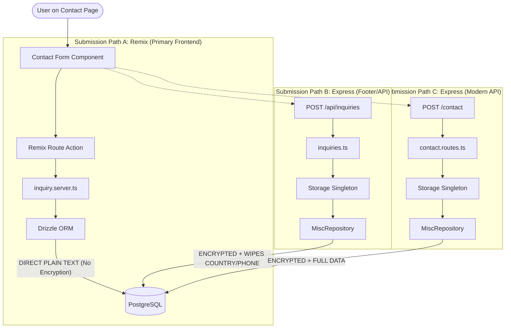

# Forensic Audit Report: RUN APPAREL Contact Page System

**Date:** 2026-02-11
**Auditor:** Antigravity (Advanced Agentic AI)
**Status:** 🔴 CRITICAL - Immediate Architectural Restoration Advised

## 1. Executive Summary

The Contact Page system for RUN APPAREL is currently suffering from significant architectural fragmentation, inconsistent data protection, and overlapping submission pathways. While the UI remains functional for the end-user, the backend infrastructure presents major risks to data integrity, lead tracking, and security compliance (GDPR/Data Privacy).

---

## 2. Core Diagnostic Visualization: Submission Routing Chaos

The following diagram illustrates the current redundant and inconsistent pathways for user inquiries.

---

## 3. Major Findings & Root Causes

### 🔴 Finding 1: Encryption Fragmentation

**Severity:** Critical
**Description:** Inquiries submitted via the primary Remix action (`inquiry.server.ts`) are stored as **plain text**. Inquiries via legacy/secondary Express routes are **encrypted** using AES-256-GCM.
**Root Cause:** The `inquiry.server.ts` service bypasses the `MiscRepository` layer where encryption logic resides, interacting directly with the database.
**Impact:** Admin panel search/filtering by email is broken. Data privacy compliance is compromised as sensitive PII is partially unprotected.

### 🔴 Finding 2: "Hardcoded Null" Data Loss

**Severity:** High
**Description:** The route `server/routes/inquiries.ts` (Path B above) explicitly sets `country` and `preferredPlatform` to `null`, regardless of user input.
**Root Cause:** Outdated schema mapping in the Express middleware.
**Impact:** Loss of valuable lead segmentation data (cannot determine geographic origin or preferred communication platform for these leads).

### 🟡 Finding 3: Redundant Routing & Lack of Dry (Don't Repeat Yourself)

**Severity:** Medium
**Description:** There are three distinct endpoints handling "Contact" submissions across the app.
**Impact:** Maintenance nightmare. Any change to the form (e.g., adding a new field) must be implemented in three places.

---

## 4. System Health Score

**Current Score: 42/100**

| Category | Score | Notes |
| :--- | :--- | :--- |
| **Data Integrity** | 20/100 | Encryption mismatch & hardcoded nulls. |
| **Security** | 45/100 | Partial PII encryption; honeypot/CSRF present but inconsistent. |
| **Architecture** | 30/100 | High redundancy; bypasses repository patterns. |
| **Performance** | 85/100 | Caching at route level is well-implemented. |
| **B2B UX** | 30/100 | Functional, but silent data loss occurs. |

---

## 5. Prioritized Restoration Plan

### Phase 1: Immediate Stabilization (High Priority)

1. **Unify Encryption:** Mirror `MiscRepository` encryption logic in `inquiry.server.ts`.
2. **Fix Data Loss:** Update `server/routes/inquiries.ts` to map `country` and `platform` from payload rather than `null`.
3. **Data Cleanup Script:** Decrypt all current plain-text inquiries and re-insert them using the repository's `createInquiry` method to ensure all data is consistently encrypted and blind-indexed.

### Phase 2: Architectural Consolidation (Medium Priority)

1. **Service Unification:** Move all inquiry creation logic into a single `InquiryService` that is shared by both Remix and Express paths.
2. **Deprecate Path B:** Redirect all secondary form submissions to the modern `POST /contact` endpoint.

### Phase 3: UX & Performance (Low Priority)

1. **Hydration Optimization:** Ensure `LazyUnifiedModelViewer` is only loaded after initial content paint to improve TBT (Total Blocking Time).
2. **Admin UI:** Improve the "Read/Unread" indicator in the admin panel to utilize the new blind indices for faster searching.

---

## 6. Security Audit (Specific Findings)

- ✅ **Honeypot:** Active on all paths.
- ✅ **reCAPTCHA:** Configured for production.
- ⚠️ **CSRF:** Token implementation in `use-contact-form.ts` is fragile (reads from `document.cookie`).
- 🔴 **PII Protection:** Failed due to fragmented implementation in Remix server actions.

---
**Report generated for M. Hateem Jamshaid @ RUN APPAREL.**
