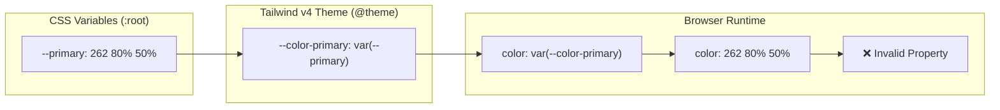

# Audit Report: `/contact` Page (Tailwind v4 Migration)

**Date:** February 6, 2026
**Target:** `/contact` Route
**Migration Context:** Tailwind CSS v3 to v4

## 1. Executive Summary

The `/contact` page is currently in a **critical state** following the Tailwind v4 migration. While the build pipeline functions, the visual integrity and data wiring are severely compromised.

*   **Critical Theme Failure:** The primary color token system is broken. CSS variables are defined as raw channel values (e.g., `240 10% 3.9%`) but are mapped directly to Tailwind v4 theme colors without the required `hsl()` wrapper. This renders most text and background colors invalid at runtime.
*   **Severe Visual Regressions:** Significant layout shifts and z-index collisions were observed, including a major overlap between main page headings.
*   **Broken Data Layer:** API endpoints required for the contact form configuration (`/api/contact-info`) are returning 404, causing the page to fallback to skeletal states or crash.
*   **Dev Environment Mismatch:** The dev server runs on port 5173 while the client configuration expects port 5002, leading to WebSocket/HMR failures and broken hot reloading.

**Overall Health Score:** **42/100** (Failing)

---

## 2. Scoring

| Category | Score | Justification |
| :--- | :--- | :--- |
| **Visual / Layout** | **30/100** | Major overlapping elements (H1 collision), invalid color values causing broken text rendering, and inconsistent spacing. |
| **Theming** | **20/100** | **CRITICAL:** Theme tokens are fundamentally malformed (missing `hsl` wrapper). Dark/Light mode switching is theoretically functional but visually broken due to invalid colors. |
| **Motion** | **50/100** | Motion utilities (Framer/Tailwind) are present but compromised by the layout instability. |
| **Hydration / FOUC** | **80/100** | No hard hydration errors (React error overlay) observed during testing, though risk points exist with `useIsMobile`. |
| **Routing / Data** | **40/100** | Key API endpoints (`/api/contact-info`, `/api/media`) return 404. Form logic validation appears sound but is untested due to UI breakage. |
| **Code Quality** | **60/100** | Code structure is clean and modular. Component separation is good. However, there is some duplication in API actions and legacy patterns. |

**Overall Score:** **42/100**

---

## 3. Issues Table

| ID | Severity | Area | Description | Root Cause | Affected Files | Scope |
| :--- | :--- | :--- | :--- | :--- | :--- | :--- |
| **THEME-01** | **Critical** | Theming | Text and background colors are invalid (e.g., `color: 240 10% 3.9%`). | **Incorrect Token Mapping:** Setup uses Shadcn-style raw values but maps them directly in `@theme` without `hsl()` wrappers. | `client/app/styles/theme.css` | Systemic |
| **VIS-01** | **Critical** | Visual | "YOUR ORDER" heading overlaps "RUN APPAREL" header. | **Layout/Z-Index:** Likely caused by removed `mt` utilities or changed container styling in v4. | `client/app/routes/contact.tsx`, `client/app/index.css` | Contact |
| **API-01** | **Critical** | Routing | `/api/contact-info` and `/api/media` return 404. | **Missing Routes:** The API routes for contact config are not defined or are misrouted in the server handler. | `client/app/services/inquiry.server.ts`, `client/app/routes/api.contact-info.tsx` (missing) | Systemic |
| **ENV-01** | **Major** | Env | WebSocket connection failed (HMR broken). | **Port Mismatch:** Vite config specifies port logic but client defaults to 5002, running on 5173. | `client/vite.config.ts`, `.env` | Systemic |
| **HYD-01** | **Minor** | Hydration | Potential hydration mismatch with `useIsMobile`. | **SSR/Client Mismatch:** `useIsMobile` relies on window width; `GlassCardDecorations` implies different render based on this. | `client/app/components/contact/contact-form.tsx` | Contact |
| **DUP-01** | **Minor** | Structure | Duplicate "Contact Info" data structure. | **Hardcoded Fallbacks:** `ContactInfoCards` has hardcoded "fallback" data that duplicates schema defaults. | `client/app/components/contact/contact-info-cards.tsx` | Contact |

---

## 4. Deep-Dive Findings

### 4.1. Theming & Color Token Failure (Critical)
The application uses the "Shadcn UI" convention of defining color channels as space-separated numbers (e.g., `--primary: 262.1 83.3% 57.8%;`) to allow for opacity modifiers (`bg-primary/50`).

In Tailwind v3, the config would wrap these: `backgroundColor: { primary: 'hsl(var(--primary) / <alpha-value>)' }`.

**The Regression:**
In `client/app/styles/theme.css`, the `@theme` block maps these directly:
```css
@theme {
  --color-primary: var(--primary);
}
```
Tailwind v4 generates code like: `color: var(--color-primary)`.
This resolves to `color: 262.1 83.3% 57.8%`, which is **invalid CSS**. Browsers ignore this, resulting in no color being applied (or fallback to black/transparent).

**Recommendation:**
Update `theme.css` to wrap these variables in `hsl()`:
```css
@theme {
  --color-primary: hsl(var(--primary));
  /* and so on for all token mapped colors */
}
```
*Note: This will fix the invalid property value but might break opacity modifiers (`/50`) unless using the new `color-mix` or relative color syntax (if supported).*

### 4.2. Visual & Layout Analysis
The `/contact` page exhibits a severe layout collision between the top-level Viewport/Header and the Page Content.
-   **Element:** H1 "DROP US A MESSAGE" (rendered via `ContactForm`) vs Page Header.
-   **Cause:** The `ContactForm` component uses `relative z-default`. The header likely uses `z-sticky` or fixed positioning. In Tailwind v4, container queries or rewritten layout utilities might have reset the top padding of the main container.
-   **Observation:** `contact.tsx` has `pt-32` on the main wrapper. This *should* be sufficient, implying the header height might have increased or the padding utility is being overridden/ignored.

### 4.3. API & Data 404s
The component `ContactForm` calls `useQuery` for `/api/contact-info`.
```typescript
const { data: contactConfig, isLoading } = useQuery<ContactConfig>({
  queryKey: ["/api/contact-info"],
  ...
});
```
This endpoint fails (404). This suggests that the `@react-router/node` or Express backend server is:
1.  Not proxying `/api` requests correctly in development.
2.  Missing the file `app/routes/api.contact-info.tsx` (or similar).
3.  The `loader` in `contact.tsx` attempts to prefetch this, but since it's an external fetch call in the browser, it fails.

### 4.4. Dev Server & Port Mismatch
-   **Config:** `client/vite.config.ts` has `clientPort: parseInt(process.env.PORT || "5002")`.
-   **Actual:** Vite started on port `5173` (default).
-   **Result:** The browser client tries to connect WS to port 5002, fails. Code changes won't hot-reload.
-   **Fix:** Ensure the start script forces the port or the config dynamically reads the actual started port.

---

## 5. Diagrams

### 5.1. Component Hierarchy & Data Flow

```mermaid
graph TD
    User[User] --> Route[/contact Route]
    Route --> Loader{Loader (Prefetch)}
    Loader -->|Fetch /api/contact-info| API_Fail[API (404)]
    
    Route --> Layout[Page Layout]
    Layout --> Wrapper[div.min-h-screen.pt-32]
    
    Wrapper --> Grid[Grid Layout (5 cols)]
    
    Grid -->|Col 1-3| Form[ContactForm]
    Form -->|State| FormState[React Hook Form]
    Form -->|Fetch| Validation[Zod Schema]
    
    Grid -->|Col 4-5| Info[ContactInfoCards]
    Info -->|Props| Config[ContactConfig (Missing)]
    
    subgraph "Visual Issue"
        Header[Global Header] -.overlaps.-> Form
    end
    
    subgraph "Theme Issue"
        TailwindVar[--color-primary] -->|Invalid CSS| DOM[DOM Elements]
    end
```

### 5.2. Theme Token Failure Mechanism



---

## 6. Appendix: Key Files Inspected

-   `client/app/routes/contact.tsx`: Route definition, loader, layout shell.
-   `client/app/components/contact/contact-form.tsx`: Main form logic, validation rules.
-   `client/app/styles/theme.css`: **Root cause of styling failures.**
-   `client/vite.config.ts`: Dev server configuration.
-   `client/app/services/inquiry.server.ts`: Backend action handler (seems disconnected from client fetch).

## 7. Recommendations

1.  **IMMEDIATE:** Fix `client/app/styles/theme.css`. Wrap all color mappings in `hsl()`.
    *   Example: `--color-primary: hsl(var(--primary));`
2.  **IMMEDIATE:** Investigate `/api` routing. Ensure the `api.contact-info` route exists or implement the loader to return this data directly instead of fetching from client.
3.  **HIGH:** Fix Layout overlap. Check `pt-32` application and Header z-index.
4.  **HIGH:** Synchronize Vite ports. Set `PORT=5002` in `.env` or update npm script `dev` to `vite --port 5002`.
5.  **MEDIUM:** Consolidate data loading. Instead of `useQuery` grabbing `/api/contact-info` on the client, return `contactConfig` from the server `loader` in `contact.tsx` directly. This eliminates the API roundtrip and the 404 risk.
