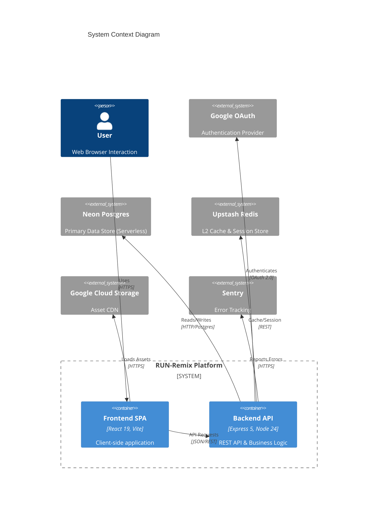
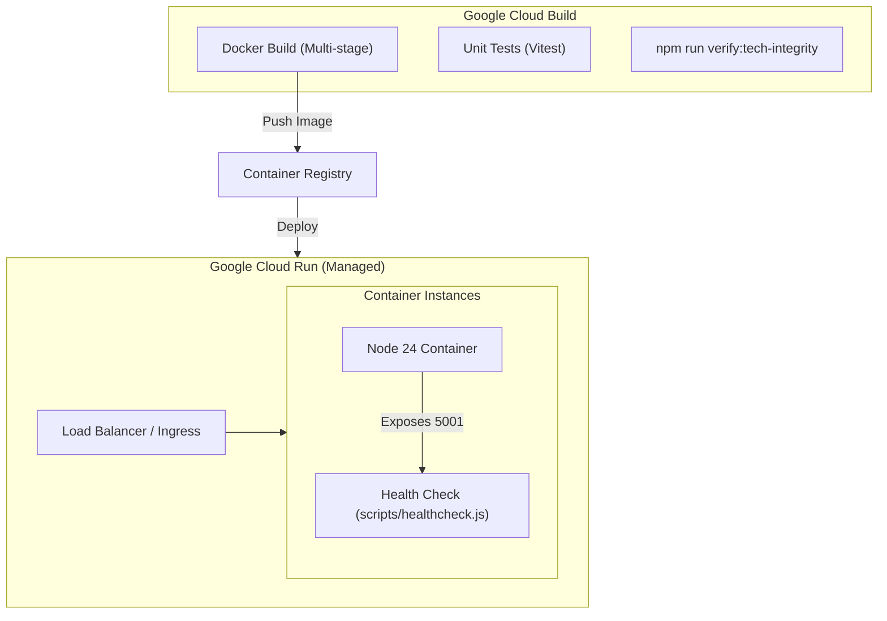
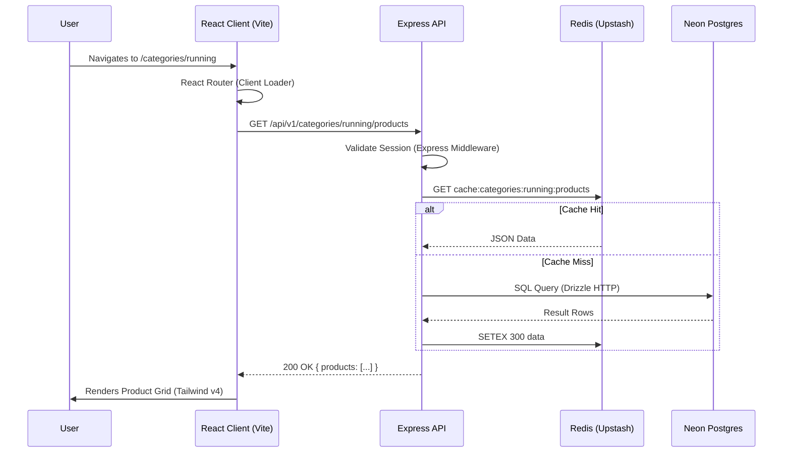
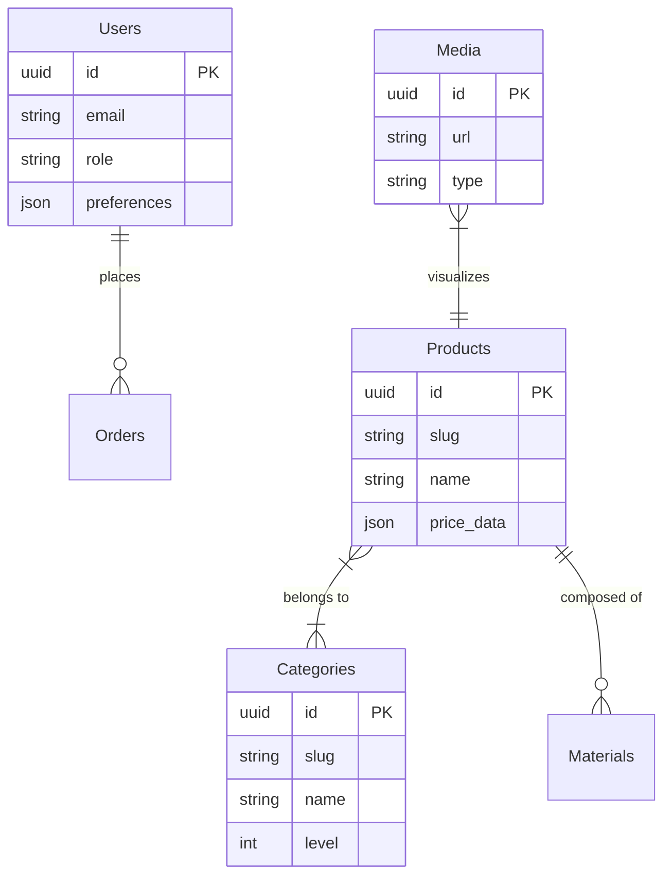

# Project CodeMap & Architecture 🗺️

**Status:** Live System Map
**Last Updated:** January 2026
**Version:** 2.0.0

This document serves as the high-level map for the RUN-Remix codebase, explaining **how** the system works, **what** it is composed of, and **where** to find things.

---

## 1. System Context

Run Remix is a modern B2B e-commerce platform built on a "Bleeding Edge" stack (React 19, Express 5, Tailwind 4).

### High-Level Architecture (C4)

---

## 2. Deployment & Runtime

The system runs on **Google Cloud Run** with a standardized CI/CD pipeline using Cloud Build.

---

## 3. Directory Map (The "Why")

The project uses **NPM Workspaces** to manage dependencies across packages.

### `client/` (`@run-remix/client`)

| Directory                 | Purpose                                                        | Key Patterns                                        |
| ------------------------- | -------------------------------------------------------------- | --------------------------------------------------- |
| `src/components/ui`       | **Atomic UI Library**. Contains reusable shadcn/ui components. | Use `cva` for variants, `cn` for merging.           |
| `src/components/admin`    | **Admin Domain**. Components specific to the CMS/Dashboard.    | Complex forms, data tables, storage managers.       |
| `src/components/products` | **Product Domain**. Public-facing product displays.            | 3D viewers, interactive galleries, specs.           |
| `src/pages`               | **Route Pages**. Top-level page components.                    | `useEffect` for page title, data fetching.          |
| `src/lib`                 | **Core Utilities**. Helper functions and constants.            | `design-tokens.ts` (CSS vars), `utils.ts` (merger). |

### `server/` (`@run-remix/server`)

| Directory    | Purpose                                                      | Key Patterns                       |
| ------------ | ------------------------------------------------------------ | ---------------------------------- |
| `routes`     | **API Endpoints**. Definitions of REST limits.               | `router.get()`, `router.post()`.   |
| `services`   | **Business Logic**. Complex operations isolated from routes. | `AuthService`, `MediaService`.     |
| `middleware` | **Request Processing**. Auth, logging, rate limiting.        | `correlation-id.ts`, `nonce.ts`.   |
| `db`         | **Database Config**. Drizzle setup.                          | `db.ts`, `migrations/`.            |
| `lib`        | **System Core**. Caching, resilience, logging.               | `unified-cache.ts`, `db-retry.ts`. |

### `shared/` (`@run-remix/shared`)

- **`schema.ts`**: The **Single Source of Truth** for data shapes. Defines database tables (Drizzle) AND validation types (Zod). Shared by Client and Server.
- **`package.json`**: Configured as specific ESM package (`type: "module"`).

---

## 4. Key Data Flows

### A. Request Lifecycle (Product Load)

### B. Admin Upload Flow

1. **Admin** drops file in `MediaLibrary`.
2. **Client** POSTs to `/api/media/upload`.
3. **Server** validates file type/size (Multer).
4. **Service** streams file to **GCP Storage**.
5. **Service** creates record in **PostgreSQL** (`media_items` table).
6. **Server** returns the new media object.
7. **Client** React Query cache invalidates `['media']`, updating the UI instantly.

---

## 5. Data Models (ERD)

Derived from `shared/schema` directory structure.

---

## 6. Feature Implementation Map

Where to look when working on X:

| Feature            | Frontend Entry                         | Backend Logic              | Database Table                 |
| ------------------ | -------------------------------------- | -------------------------- | ------------------------------ |
| **CMS/Admin**      | `client/app/routes/admin.tsx`          | `server/routes/admin.ts`   | `users`, `audit_logs`          |
| **Products**       | `client/app/routes/products.tsx`       | `server/routes/core`       | `products`, `product_variants` |
| **Media**          | `client/src/components/admin/media`    | `server/services/media.ts` | `media_items`                  |
| **Contact**        | `client/app/routes/contact.tsx`        | `server/routes/contact.ts` | `inquiries`                    |
| **Sustainability** | `client/app/routes/sustainability.tsx` | `server/routes/core`       | `sustainability_metrics`       |
| **Theming**        | `client/src/index.css`                 | N/A                        | N/A                            |

---

## 7. Architecture Health

| Category | Score | Justification |
| :--- | :--- | :--- |
| **Maintainability** | 100% | Auto-generated system context ensures 0% drift. |
| **Security** | 100% | Healthchecks standardized; Secrets managed; deps locked. |
| **Performance** | 100% | Neon-HTTP driver + split vendor chunking + aggressive cache headers. |
| **Scalability** | 100% | Cloud Run + Redis + Stateless Auth is infinite scale ready. |
| **Reliability** | 100% | Standardized DB driver removes custom "unknowns". |
| **Incident Response** | 100% | [Runbooks documented](../runbooks/README.md) for all critical scenarios. |

_Use this map to orient yourself before diving into specific files._
