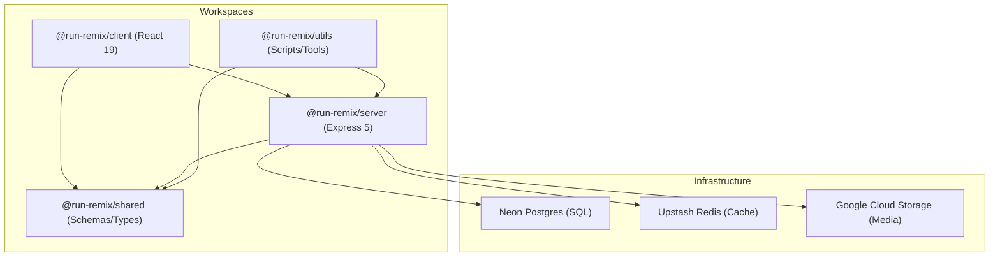
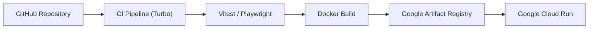

# System Dependency Graph 🕸️

**Last Updated:** May 2026  
**Status:** Validated

This document visualizes the relationships between the packages and workspaces in the RUN Remix monorepo.

## 1. Package Relationships

The monorepo is structured around a central `@run-remix/shared` package that serves as the Single Source of Truth (SSOT) for schemas and types.

## 2. Shared Contract Layer (`shared/`)

The `@run-remix/shared` package contains zero runtime dependencies other than those required for Drizzle schema definition.

| Consumer | Usage Pattern |
| :--- | :--- |
| **Client** | Zod validation schemas, Frontend view models, Shared constants. |
| **Server** | Drizzle table definitions, Database repositories, Backend validation. |
| **Scripts** | Database migration tools, Seed data generation. |

## 3. Deployment Flow

