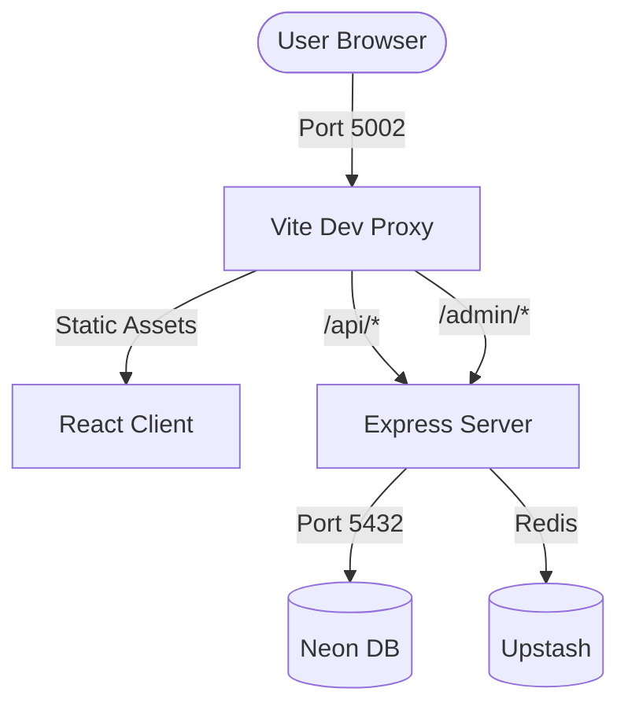

# Antigravity Architecture Report (2026 Baseline)

**Version:** 2.0.0
**Date:** 2026-01-05
**Status:** Live Baseline

---

## 1. Executive Summary

This document defines the architectural hard-deck for the RUN Apparel B2B Platform as of January 2026. It supersedes all previous architectural notes.

**Core Thesis**: A strongly typed, monorepo-based B2B platform leveraging the latest stable React ecosystem (React 19) served by a robust Node.js backend (Express 5), prioritizing developer experience (Vite 7) and data integrity (Drizzle/Zod).

---

## 2. Tech Stack Verification

> [!IMPORTANT]
> For exact version numbers, see the **[System Overview](../overview.md#2-stack--critical-versions)** which is the Single Source of Truth.

**Key Technologies:**
- **Frontend**: React 19, Vite 7, Tailwind CSS v4
- **Backend**: Express 5, Node.js 24+
- **Data**: PostgreSQL (Neon), Drizzle ORM, Upstash Redis
- **Testing**: Vitest, Playwright

---

## 3. System Architecture

### 3.1. Monorepo Structure (NPM Workspaces)

The codebase is split into three tightly coupled workspaces:

1. **`@run-remix/client`** (`client/`)
- **Responsibility**: UI rendering, client-side routing, assets.
- **Dev Mode**: Does **NOT** run its own server. It is consumed as middleware by the server.
- **Build**: Outputs to `dist/public` (assets) and `dist/server` (SSR).

2. **`@run-remix/server`** (`server/`)
- **Responsibility**: API, Auth, Database access, and serving the Client.
- **Dev Mode**: Runs `tsx watch index.ts`. Orchestrates Vite middleware to serve the client with HMR.
- **Prod Mode**: Runs compiled `dist/index.js`. Serves static assets from `dist/public`.

3. **`@run-remix/shared`** (`shared/`)
- **Responsibility**: Type definitions, Zod schemas, Database schemas.
- **Constraint**: Zero runtime dependencies (except Zod/Drizzle-ORM types). Pure TS/JSON.

### 3.2. Server-Side Rendering (SSR) Strategy
- **Approach**: Custom Express + Vite SSR implementation.
- **Dev Flow**: Request -> Express -> Vite Dev Middleware -> Transforms `entry-server.tsx` -> Renders Stream.
- **Prod Flow**: Request -> Express -> Imports `dist/server/entry-server.js` -> Renders Stream.
- **Hydration**: React 19 partial hydration capabilities are enabled.

### 3.3. Navigation Architecture
- **Source**: `/api/navigation-items` (Required for Header/Footer).
- **Format**: JSON array of `NavigationItem` with optional `mediaIcon` relation.
- **Cache**: Prefetched in `root.tsx` via TanStack Query for LCP optimization.

---

## 4. React 19 Coding Standards (Ref Pattern)

> [!IMPORTANT]
> React 19 deprecates `forwardRef`. Always use the `ref` prop directly.

```tsx
// ✅ CORRECT (React 19)
export function CustomInput({ ref, ...props }: { ref?: React.Ref<HTMLInputElement> }) {
  return <input ref={ref} {...props} />;
}

// ❌ WRONG (Legacy)
export const CustomInput = forwardRef((props, ref) => {
  return <input ref={ref} {...props} />;
});
```

---

## 5. Data Layer Architecture

### 4.1. Schema Authority

- **Source of Truth**: `shared/schema.ts`
- **Mechanism**: Drizzle ORM defines tables and Zod schemas in one place.
- **Migration**: Managed by Drizzle Kit (`npm run db:push` or `migrate`).

### 4.2. Access Patterns

- **Queries**: Written in `server/` services using Drizzle query builder.
- **Validation**: Inputs validated via Zod schemas imported from `shared/`.
- **Safety**: Strict separation—Client never imports DB code; only types/schemas.

---

## 5. Deployment & Operations

### 5.1. Artifacts

- **Build Command**: `npm run build` (Roots triggers workspace builds).
- **Output**:
  - `dist/index.js` (Server bundle)
  - `dist/public/` (Client static assets)
  - `dist/server/` (Client SSR bundle)

### 5.2. Runtime

- **Entry Point**: `node dist/index.js`
- **Port Enforcement (The 5002 Law)**:
  - **Development**: Both Express and Vite are configured for port `5002`. Express serves as the primary gateway, proxying to the Vite dev server for client-side assets.
  - **Production**: The Node.js process listens strictly on port `5002`. Upstream reverse proxies (Nginx/Cloud Run) handle SSL termination (80/443) and forward to `5002`.
  - **Strict Mode**: `server.strictPort: true` in Vite config prevents fallback to other ports.

- **Health Checks**:
  - `/api/health` (Liveness)
  - `/api/health/db` (Readiness)

### 5.3. Network Topology & Request Flow



**Route-Based Separation:**

- `http://localhost:5002/` → Public frontend
- `http://localhost:5002/api/v1/` → Public API
- `http://localhost:5002/admin/` → Admin panel UI
- `http://localhost:5002/admin/api/` → Admin management API

---

## 6. Architecture Constraints (Hard Rules)

1. **Port 5002 Absolute Compliance**: Never use environment variables for the port without defaulting to `5002`. This is verified by `npm run verify-port`.
2. **No "Client" Dev Script**: Attempting to run `vite` directly in `client/` will fail to proxy API requests correctly. Always start via Server.
3. **Shared Schema**: Never define DB types manually in Client. Import from `@run-remix/shared`.
4. **Tailwind 4**: Do not create `tailwind.config.js`. Use CSS variables in `@theme` block in `index.css`.
5. **Admin Parity**: Every public route MUST have an associated admin route for content management (see `docs/ROUTE_MAPPING.md`).

---

**Author**: Antigravity Agent
**Verified Against**: Repo State @ Feb 11, 2026
