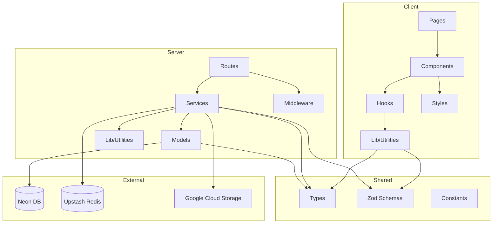
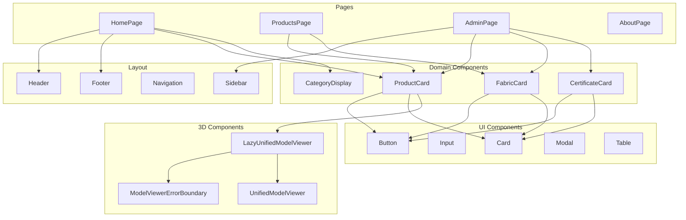
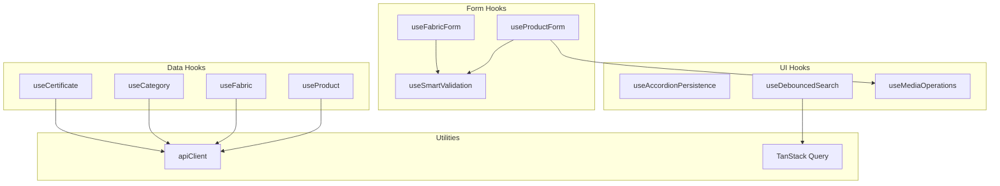
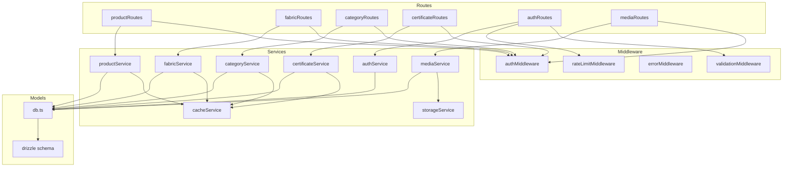
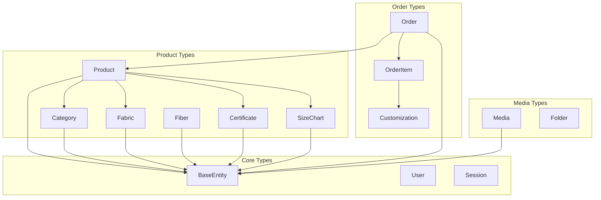
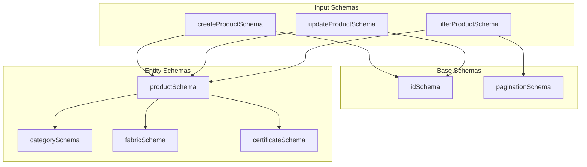

# Dependency Graph Documentation

## Overview

This document provides a comprehensive view of the RUN Remix module dependencies, helping developers understand the relationships between components, services, and shared code.

**Status:** Current State Documented  
**Last Updated:** February 2026  
**Architecture Pattern:** Monorepo with NPM Workspaces

---

## High-Level Architecture



---

## Workspace Dependencies

### Package Dependency Graph

```mermaid
graph LR
    ROOT[run-remix-monorepo]
    CLIENT[client]
    SERVER[server]
    SHARED[shared]
    
    ROOT --> CLIENT
    ROOT --> SERVER
    ROOT --> SHARED
    
    CLIENT -->|@run-remix/shared| SHARED
    SERVER -->|@run-remix/shared| SHARED
```

### Import Rules

| From | To | Allowed | Example |
|------|-----|---------|---------|
| `client/` | `shared/` | ✅ Yes | `import { Product } from '@run-remix/shared'` |
| `client/` | `server/` | ❌ No | Use API calls instead |
| `server/` | `shared/` | ✅ Yes | `import { ProductSchema } from '@run-remix/shared'` |
| `server/` | `client/` | ❌ No | Never import from client |
| `shared/` | `client/` | ❌ No | Shared has no dependencies |
| `shared/` | `server/` | ❌ No | Shared has no dependencies |

---

## Client-Side Dependencies

### Component Hierarchy



### Hook Dependencies



---

## Server-Side Dependencies

### Service Layer Dependencies



### Service Dependency Matrix

| Service | Depends On | Database | Cache | External |
|---------|------------|----------|-------|----------|
| `productService` | `cacheService`, `storageService` | ✅ | ✅ | GCS |
| `fabricService` | `cacheService` | ✅ | ✅ | - |
| `categoryService` | `cacheService` | ✅ | ✅ | - |
| `certificateService` | `cacheService` | ✅ | ✅ | - |
| `authService` | - | ✅ | ✅ | - |
| `mediaService` | `storageService` | ✅ | - | GCS |
| `cacheService` | - | - | ✅ | Upstash Redis |
| `storageService` | - | - | - | GCS |

---

## Shared Code Dependencies

### Type Dependencies



### Zod Schema Dependencies



---

## External Dependencies

### Production Dependencies

```mermaid
graph TB
    subgraph Frontend
        F_REACT[React 19]
        F_VITE[Vite 8]
        F_TAILWIND[Tailwind CSS v4]
        F_ROUTER[React Router 7]
        F_QUERY[TanStack Query v5]
        F_ZOD[Zod]
        F_CVA[class-variance-authority]
        F_LUCIDE[Lucide React]
        F_HOOK[React Hook Form]
    end
    
    subgraph Backend
        B_EXPRESS[Express 5]
        B_NODE[Node.js 24]
        B_DRIZZLE[Drizzle ORM]
        B_NEON[Neon Serverless]
        B_REDIS[Upstash Redis]
        B_GOOGLE[@google-cloud/storage]
    end
    
    subgraph Build Tools
        T_TURBO[TurboRepo]
        T_BIOME[Biome]
        T_VITEST[Vitest]
        T_TS[TypeScript 5.x]
    end
    
    F_QUERY --> F_REACT
    F_ROUTER --> F_REACT
    F_HOOK --> F_REACT
    F_CVA --> F_TAILWIND
```

### Critical Version Constraints

| Package | Version | Constraint Reason |
|---------|---------|-------------------|
| React | 19.x | No forwardRef, new ref prop pattern |
| Express | 5.x | Native async error handling |
| Tailwind CSS | 4.x | @utility syntax, @theme tokens |
| Node.js | ≥24.x | Latest LTS features |
| Vite | 7.x | Build performance |
| TypeScript | 5.x | Strict mode support |

---

## Dependency Analysis Commands

### Generate Dependency Graph

```bash
# Generate full dependency graph
npm run deps:graph

# Check for circular dependencies
npm run deps:circular

# Analyze bundle size
npm run analyze

# Check for unused dependencies
npm run deps:check
```

### Manual Analysis

```bash
# List all dependencies
npm list --depth=0

# Check outdated packages
npm outdated

# Audit for vulnerabilities
npm audit

# View dependency tree
npm ls <package-name>
```

---

## Circular Dependency Prevention

### Rules

1. **Never import from child to parent directory** in a way that creates cycles
2. **Shared code must have zero dependencies** on client or server
3. **Services should not import from routes**
4. **Components should not import from pages**

### Detection

```bash
# Using madge for circular dependency detection
npx madge --circular ./client/app
npx madge --circular ./server
```

### Common Circular Dependency Patterns to Avoid

```typescript
// ❌ WRONG: Creates circular dependency
// client/app/components/ui/Button.tsx
import { useProductPage } from '@/pages/ProductPage';

// ✅ CORRECT: Use props or context
// client/app/components/ui/Button.tsx
interface ButtonProps {
  onClick?: () => void;
}

// ❌ WRONG: Service importing from route
// server/services/productService.ts
import { productRouter } from '@/routes/productRoutes';

// ✅ CORRECT: Route imports service, not vice versa
// server/routes/productRoutes.ts
import * as productService from '@/services/productService';
```

---

## Dependency Update Strategy

### Update Frequency

| Type | Frequency | Process |
|------|-----------|---------|
| Security patches | Immediate | `npm audit fix` |
| Minor versions | Monthly | Review changelog, test |
| Major versions | Quarterly | Plan migration, update docs |

### Before Updating

1. Check changelog for breaking changes
2. Run full test suite: `npm run test`
3. Verify build: `npm run build`
4. Check type safety: `npm run typecheck`
5. Run integrity check: `npm run verify:tech-integrity`

---

## References

- [Architecture Documentation](../core/architecture.md) - System architecture
- [Developer Workflow](../guides/developer-workflow.md) - Development standards

---

**Version:** 1.0.0 | **For:** M. Hateem Jamshaid @ RUN APPAREL (PVT) LTD
