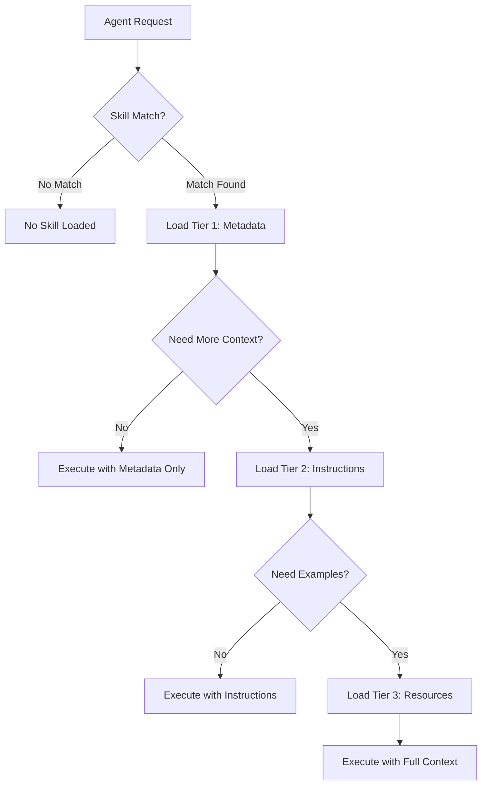
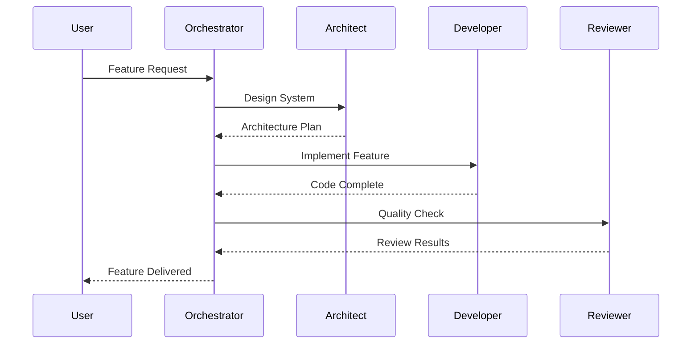

# AntiGravity Full Alignment Implementation Plan

## Executive Summary

This plan outlines the comprehensive alignment of RUN Remix with the AntiGravity methodology ecosystem. The goal is to achieve "perfect" integration with techniques, style, structure, and workflow from the AntiGravity Master Prompt, GitHub repositories (ui-ux-pro-max-skill, skillx, agents, superpowers, antigravity-awesome-skills, antigravity-skills), and Google Codelabs.

**Current State:**
- 7 existing skills in `.kilocode/skills/`
- 4 rule files in `.kilocode/rules/`
- 3 workflow files in `.kilocode/workflows/`
- Strong foundation with `gemini.md` and `AGENTS.md`

**Target State:**
- 50+ high-value skills with progressive disclosure
- Multi-agent orchestration capabilities
- Workflow orchestrators for complex processes
- Full alignment with AntiGravity patterns

---

## Phase 1: Skills Library Expansion

### 1.1 High-Priority Skills to Add

Based on analysis of AntiGravity ecosystem, these skills provide the highest value:

#### Core Development Skills
| Skill | Source | Purpose |
|-------|--------|---------|
| `test-driven-development` | obra/superpowers | TDD workflow with verification gates |
| `systematic-debugging` | obra/superpowers | Structured debugging approach |
| `verification-before-completion` | obra/superpowers | Quality gates before task completion |
| `writing-plans` | obra/superpowers | Implementation planning methodology |
| `executing-plans` | obra/superpowers | Plan execution tracking |

#### Architecture & Design Skills
| Skill | Source | Purpose |
|-------|--------|---------|
| `architecture-design` | wshobson/agents | System design patterns |
| `api-design` | wshobson/agents | RESTful API design standards |
| `database-design` | wshobson/agents | Database schema design |
| `security-architecture` | wshobson/agents | Security-first design patterns |

#### Code Quality Skills
| Skill | Source | Purpose |
|-------|--------|---------|
| `code-review-receiver` | obra/superpowers | Receiving and implementing code review feedback |
| `code-review-requester` | obra/superpowers | Requesting effective code reviews |
| `refactoring` | nextlevelbuilder/skillx | Safe refactoring patterns |
| `performance-optimization` | nextlevelbuilder/skillx | Performance tuning workflow |

#### UI/UX Skills
| Skill | Source | Purpose |
|-------|--------|---------|
| `ui-component-creation` | nextlevelbuilder/ui-ux-pro-max-skill | Component development workflow |
| `accessibility-audit` | nextlevelbuilder/ui-ux-pro-max-skill | WCAG compliance checking |
| `responsive-design` | nextlevelbuilder/ui-ux-pro-max-skill | Responsive implementation |
| `design-system-alignment` | nextlevelbuilder/ui-ux-pro-max-skill | Design system consistency |

#### Documentation Skills
| Skill | Source | Purpose |
|-------|--------|---------|
| `documentation-writing` | guanyang/antigravity-skills | Technical documentation standards |
| `api-documentation` | guanyang/antigravity-skills | API documentation patterns |
| `changelog-writing` | sickn33/antigravity-awesome-skills | Changelog generation |

### 1.2 Skill Directory Structure

Each skill will follow the progressive disclosure architecture:

```
.kilocode/skills/{skill-name}/
├── SKILL.md                 # Required: Core skill definition
├── references/              # Optional: External references
│   ├── best-practices.md
│   └── external-docs.md
├── examples/                # Optional: Code examples
│   ├── example-1.tsx
│   └── example-2.ts
└── scripts/                 # Optional: Automation scripts
    └── helper-script.sh
```

### 1.3 SKILL.md Template

```markdown
---
name: skill-name
description: Use this skill when [specific trigger condition]. Use this for [purpose].
---

# Skill Title

## Goal
[Clear statement of what the skill achieves]

## Instructions
1. [Step-by-step instruction 1]
2. [Step-by-step instruction 2]
3. [Step-by-step instruction 3]

## Examples

### Example 1: [Scenario]
**Input:**
```
[Example input]
```

**Output:**
```
[Example output]
```

## Constraints
- [Do not rule 1]
- [Do not rule 2]
- [Required practice]

## Anti-Gravity Alignment
- **B.L.A.S.T.**: [How this skill aligns with B.L.A.S.T. methodology]
- **Progressive Disclosure**: [How this skill uses progressive disclosure]
```

---

## Phase 2: Progressive Disclosure Optimization

### 2.1 Current Skills Enhancement

Enhance existing 7 skills with progressive disclosure:

#### artifacts-builder
```
.kilocode/skills/artifacts-builder/
├── SKILL.md                 # EXISTS - Update with YAML frontmatter
├── references/              # ADD
│   ├── react-patterns.md
│   ├── tailwind-utilities.md
│   └── shadcn-components.md
├── examples/                # ADD
│   ├── dashboard-artifact.tsx
│   ├── form-artifact.tsx
│   └── landing-page-artifact.tsx
└── scripts/                 # EXISTS - Keep
```

#### changelog-generator
```
.kilocode/skills/changelog-generator/
├── SKILL.md                 # EXISTS - Update with YAML frontmatter
├── references/              # ADD
│   ├── conventional-commits.md
│   └── changelog-templates.md
└── examples/                # ADD
    ├── sample-commits.md
    └── sample-changelog.md
```

#### create-pull-request
```
.kilocode/skills/create-pull-request/
├── SKILL.md                 # EXISTS - Update with YAML frontmatter
├── references/              # ADD
│   ├── pr-templates.md
│   └── review-checklist.md
└── examples/                # ADD
    ├── sample-pr-description.md
    └── sample-pr-diff.md
```

#### file-organizer
```
.kilocode/skills/file-organizer/
├── SKILL.md                 # EXISTS - Update with YAML frontmatter
├── references/              # ADD
│   ├── naming-conventions.md
│   └── directory-structure.md
└── examples/                # ADD
    ├── before-organization.md
    └── after-organization.md
```

#### langsmith-fetch
```
.kilocode/skills/langsmith-fetch/
├── SKILL.md                 # EXISTS - Update with YAML frontmatter
├── references/              # ADD
│   ├── langsmith-api.md
│   └── trace-analysis.md
└── examples/                # ADD
    ├── sample-trace.json
    └── analysis-output.md
```

#### vercel-react-best-practices
```
.kilocode/skills/vercel-react-best-practices/
├── SKILL.md                 # EXISTS - Update with YAML frontmatter
├── AGENTS.md                # EXISTS - Keep
├── rules/                   # EXISTS - Keep
├── references/              # ADD
│   ├── vercel-docs.md
│   └── react-19-features.md
└── examples/                # ADD
    ├── optimized-component.tsx
    └── streaming-example.tsx
```

#### webapp-testing
```
.kilocode/skills/webapp-testing/
├── SKILL.md                 # EXISTS - Update with YAML frontmatter
├── examples/                # EXISTS - Keep
├── scripts/                 # EXISTS - Keep
└── references/              # ADD
    ├── playwright-best-practices.md
    └── test-patterns.md
```

### 2.2 Progressive Disclosure Tiers



---

## Phase 3: Multi-Agent Orchestration

### 3.1 Agent Directory Structure

Create new agent coordination capabilities:

```
.kilocode/
├── agents/                  # NEW: Agent definitions
│   ├── orchestrator.md      # Master orchestrator
│   ├── architecture/        # Architecture agents
│   │   ├── system-designer.md
│   │   └── api-architect.md
│   ├── development/         # Development agents
│   │   ├── frontend-dev.md
│   │   ├── backend-dev.md
│   │   └── fullstack-dev.md
│   ├── quality/             # Quality agents
│   │   ├── code-reviewer.md
│   │   ├── security-auditor.md
│   │   └── performance-analyst.md
│   └── documentation/       # Documentation agents
│       ├── api-doc-writer.md
│       └── technical-writer.md
├── plugins/                 # NEW: Agent plugins
│   ├── context-awareness.md
│   ├── memory-management.md
│   └── skill-routing.md
└── orchestrators/           # NEW: Workflow orchestrators
    ├── feature-development.md
    ├── bug-fix-workflow.md
    └── release-process.md
```

### 3.2 Agent Definition Template

```markdown
---
agent_id: agent-name
role: [Role Description]
capabilities:
  - capability_1
  - capability_2
triggers:
  - trigger_condition_1
  - trigger_condition_2
collaborates_with:
  - agent_1
  - agent_2
---

# Agent: [Name]

## Role
[Detailed role description]

## Capabilities
1. **Capability 1**: [Description]
2. **Capability 2**: [Description]

## Trigger Conditions
- When [condition], activate this agent
- When [condition], collaborate with [other agent]

## Collaboration Patterns
- With [Agent A]: [Collaboration description]
- With [Agent B]: [Collaboration description]

## Skill Dependencies
- Required: [skill_1], [skill_2]
- Optional: [skill_3], [skill_4]

## Output Format
[Expected output format]
```

### 3.3 Orchestration Patterns

From wshobson/agents analysis:



---

## Phase 4: Workflow Orchestrators

### 4.1 Feature Development Orchestrator

```markdown
# Orchestrator: Feature Development

## Trigger
When user requests a new feature implementation

## Workflow Steps
1. **Planning Phase**
   - Activate: writing-plans skill
   - Output: Implementation plan
   
2. **Design Phase**
   - Activate: architecture-design skill
   - Collaborate: system-designer agent
   - Output: Technical design
   
3. **Implementation Phase**
   - Activate: test-driven-development skill
   - Collaborate: fullstack-dev agent
   - Output: Working code with tests
   
4. **Review Phase**
   - Activate: code-review-requester skill
   - Collaborate: code-reviewer agent
   - Output: Review feedback
   
5. **Completion Phase**
   - Activate: verification-before-completion skill
   - Output: Verified feature

## Rollback Handling
If any phase fails, rollback to previous stable state
```

### 4.2 Bug Fix Workflow Orchestrator

```markdown
# Orchestrator: Bug Fix Workflow

## Trigger
When user reports a bug or issue

## Workflow Steps
1. **Triage Phase**
   - Activate: systematic-debugging skill
   - Output: Bug classification
   
2. **Investigation Phase**
   - Activate: verification-before-completion skill
   - Output: Root cause analysis
   
3. **Fix Phase**
   - Activate: test-driven-development skill
   - Output: Fix with regression tests
   
4. **Verification Phase**
   - Activate: code-review-requester skill
   - Output: Verified fix

## Escalation Handling
If bug is critical, escalate to security-auditor agent
```

### 4.3 Release Process Orchestrator

```markdown
# Orchestrator: Release Process

## Trigger
When user requests a release or version bump

## Workflow Steps
1. **Pre-Release Phase**
   - Activate: verification-before-completion skill
   - Run: npm run verify:tech-integrity
   - Output: Quality gate results
   
2. **Documentation Phase**
   - Activate: changelog-writing skill
   - Activate: documentation-writing skill
   - Output: Updated docs and changelog
   
3. **Version Phase**
   - Activate: create-pull-request skill
   - Output: Release PR
   
4. **Post-Release Phase**
   - Activate: changelog-generator skill
   - Output: Published changelog
```

---

## Phase 5: Documentation Alignment

### 5.1 AGENTS.md Updates

Add new sections to AGENTS.md:

```markdown
## 8. Skills Library

### 8.1 Skill Activation
Agents MUST check for applicable skills before starting any task:
1. Parse task description for trigger keywords
2. Match against skill descriptions in SKILL.md frontmatter
3. Load appropriate skill tier based on task complexity

### 8.2 Progressive Disclosure
Skills follow three-tier progressive disclosure:
- **Tier 1**: YAML frontmatter (always loaded)
- **Tier 2**: SKILL.md body (loaded when skill matches)
- **Tier 3**: references/, examples/, scripts/ (loaded when needed)

### 8.3 Skill Categories
| Category | Skills | Priority |
|----------|--------|----------|
| Core Development | test-driven-development, systematic-debugging, verification-before-completion | HIGH |
| Architecture | architecture-design, api-design, database-design | HIGH |
| Code Quality | code-review-receiver, code-review-requester, refactoring | MEDIUM |
| UI/UX | ui-component-creation, accessibility-audit, responsive-design | MEDIUM |
| Documentation | documentation-writing, api-documentation, changelog-writing | LOW |

## 9. Multi-Agent Orchestration

### 9.1 Agent Activation
Complex tasks may require multiple agents:
1. Orchestrator evaluates task complexity
2. Activates appropriate specialist agents
3. Coordinates collaboration between agents
4. Aggregates outputs into final result

### 9.2 Available Agents
| Agent | Role | Activation Trigger |
|-------|------|-------------------|
| orchestrator | Master coordination | Complex multi-step tasks |
| system-designer | Architecture design | New features, refactoring |
| code-reviewer | Quality assurance | Code changes |
| security-auditor | Security review | Auth, data handling |
| technical-writer | Documentation | Doc updates |
```

### 5.2 gemini.md Updates

Add skill integration to gemini.md:

```markdown
## 5. Skills Integration

### 5.1 Skill-First Approach
Before implementing any solution:
1. **Check Skills**: Query `.kilocode/skills/` for applicable skills
2. **Load Context**: Use progressive disclosure to load relevant context
3. **Follow Instructions**: Execute skill instructions step-by-step
4. **Verify Output**: Use verification-before-completion skill

### 5.2 Skill Development
When creating new skills:
1. Follow SKILL.md template exactly
2. Include YAML frontmatter with name and description
3. Provide clear trigger conditions
4. Include at least 2 examples
5. List all constraints

### 5.3 Skill Maintenance
Skills should be:
- Reviewed quarterly for accuracy
- Updated when tech stack changes
- Enhanced with new examples as patterns emerge
- Archived when no longer relevant
```

---

## Phase 6: Verification

### 6.1 Verification Checklist

Before declaring alignment complete:

```markdown
## Skills Library
- [ ] All 50+ skills created with SKILL.md
- [ ] YAML frontmatter present in all skills
- [ ] Progressive disclosure structure implemented
- [ ] Examples provided for complex skills
- [ ] References documented for external resources

## Multi-Agent Orchestration
- [ ] Agent definitions created
- [ ] Orchestrator workflows defined
- [ ] Collaboration patterns documented
- [ ] Trigger conditions specified

## Documentation
- [ ] AGENTS.md updated with skills section
- [ ] gemini.md updated with skill integration
- [ ] All SKILL.md files follow template

## Technical Integrity
- [ ] `npm run verify:tech-integrity` passes
- [ ] `npm run typecheck` passes
- [ ] `npm run check:apply` passes
- [ ] All tests pass
```

### 6.2 Validation Commands

```bash
# Verify technical integrity
npm run verify:tech-integrity

# Type checking
npm run typecheck

# Linting
npm run check:apply

# Run tests
npm run test

# Verify skill structure
find .kilocode/skills -name "SKILL.md" | wc -l
# Expected: 50+
```

---

## Implementation Order

### Week 1: Foundation
1. Create directory structure for agents/, orchestrators/, plugins/
2. Update existing 7 skills with YAML frontmatter
3. Add references/ and examples/ to existing skills

### Week 2: Core Skills
4. Create test-driven-development skill
5. Create systematic-debugging skill
6. Create verification-before-completion skill
7. Create writing-plans skill
8. Create executing-plans skill

### Week 3: Architecture Skills
9. Create architecture-design skill
10. Create api-design skill
11. Create database-design skill
12. Create security-architecture skill

### Week 4: Quality Skills
13. Create code-review-receiver skill
14. Create code-review-requester skill
15. Create refactoring skill
16. Create performance-optimization skill

### Week 5: UI/UX Skills
17. Create ui-component-creation skill
18. Create accessibility-audit skill
19. Create responsive-design skill
20. Create design-system-alignment skill

### Week 6: Documentation Skills
21. Create documentation-writing skill
22. Create api-documentation skill
23. Create changelog-writing skill

### Week 7: Agents & Orchestrators
24. Create orchestrator agent
25. Create architecture agents
26. Create development agents
27. Create quality agents
28. Create workflow orchestrators

### Week 8: Documentation & Verification
29. Update AGENTS.md
30. Update gemini.md
31. Run verification commands
32. Final validation

---

## Success Metrics

| Metric | Current | Target |
|--------|---------|--------|
| Skills Count | 7 | 50+ |
| Skills with Progressive Disclosure | 0 | 100% |
| Agent Definitions | 0 | 10+ |
| Workflow Orchestrators | 0 | 5+ |
| Documentation Coverage | Partial | Complete |

---

## Risk Mitigation

| Risk | Mitigation |
|------|------------|
| Skill overload | Prioritize high-value skills first |
| Token bloat | Use progressive disclosure |
| Inconsistency | Follow strict templates |
| Maintenance burden | Quarterly review schedule |
| Breaking changes | Version skills with changelog |

---

## Conclusion

This implementation plan provides a comprehensive roadmap for achieving full AntiGravity alignment. The phased approach ensures systematic progress while maintaining system stability. Each phase builds upon the previous, creating a robust foundation for AI-assisted development excellence.

**Next Step**: Switch to Code mode to begin Phase 1 implementation.
