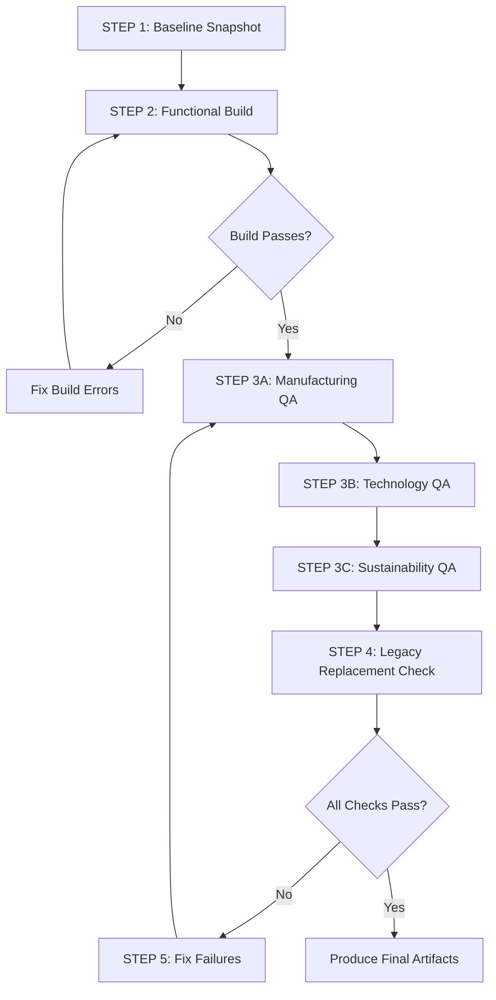

# QA Validation Plan: Manufacturing, Technology, Sustainability Pages

**Project:** RUN Remix Platform  
**Role:** QA Lead + Front-end Verification Specialist  
**Date:** 2026-02-24  
**Status:** Planning Phase

---

## Executive Summary

This plan outlines the comprehensive QA validation approach for verifying that the redesigned Manufacturing, Technology, and Sustainability pages are implemented exactly as intended, with full legacy UI replacement and no usability regressions.

---

## 1. Code Analysis Summary

### 1.1 Manufacturing Page (`client/app/routes/manufacturing.tsx`)

**Components Identified:**
- `PublicHeroSection` - Hero with word-by-word scroll-trigger reveal
- `MarqueeStrip` - Ticker/marquee after hero with amber accent
- `PublicProcessSection` - **Horizontal scroll-locked journey** with Lock/Unlock toggle
- `PublicCapabilitySection` - Capabilities display
- `FactoryGallery` - Photo gallery with captions
- `PublicQualitySection` - Quality metrics with animation
- `CaseStudySection` - Case studies (placeholders)
- `CallToAction` - CTA section

**Key Implementation Details:**
- Dark mode background: `bg-[#0A0A0A]`
- Amber accent: `#D4A853` via CSS classes
- Scroll-lock: GSAP ScrollTrigger with "Sticky View" / "Release Scroll" buttons
- Mobile fallback: Disables scroll-lock on screens < 768px
- Progress indicator at top of process journey
- Skip link for keyboard accessibility

### 1.2 Technology Page (`client/app/routes/technology.tsx`)

**Components Identified:**
- `GradientBlinds` - WebGL gradient background for hero
- `InteractiveExperienceSection` - **Dedicated 3D model section** (NOT in hero)
- `TechnologyStackSection` - Consolidated innovations + equipment
- `RoadAheadTimeline` - Consolidated research + roadmap
- `MarqueeStrip` - Ticker with cyan accent

**Key Implementation Details:**
- Cyan accent: `#00D4FF` consistently applied
- 3D model moved to dedicated "Interactive Experience" section
- Framed container with instructions and controls
- Progressive enhancement with "Engage Viewer" button
- Uses `UnifiedModelViewer` with `ModelViewerErrorBoundary`

### 1.3 Sustainability Page (`client/app/routes/sustainability.tsx`)

**Components Identified:**
- `HeroSection` - GSAP word-by-word reveal
- `CertificatesSection` - **Interactive logo wall** with hexagonal cards
- `FabricPortfolioSection` - Horizontal showcase with interaction
- `GoalsSection` - Progress tracker behavior
- `InitiativesSection` - Initiatives display

**Key Implementation Details:**
- Emerald accent: `#00C97B` consistently applied
- Certifications: Hexagonal cards with hover reveal + floating detail card
- Dark mode background: `bg-[#0A0A0A]`
- Glass morphism effects with `backdrop-blur-xl`

---

## 2. Critical Gate Requirements (FAIL if Missing)

| # | Requirement | Page | Status from Code |
|---|-------------|------|------------------|
| G1 | Dark mode on all three pages | All | ✅ Implemented (`bg-[#0A0A0A]`) |
| G2 | Manufacturing scroll-lock journey with "Back to scroll" | Manufacturing | ✅ Implemented (Lock/Unlock buttons) |
| G3 | Technology 3D model moved out of hero to dedicated section | Technology | ✅ Implemented (`InteractiveExperienceSection`) |
| G4 | Sustainability certifications interactive logo wall | Sustainability | ✅ Implemented (hexagonal cards + hover) |
| G5 | Animated page transitions working without scroll breakage | All | ⚠️ Needs browser verification |

---

## 3. Verification Workflow

---

## 4. Detailed Verification Checklist

### 4.1 Common Checks (All Pages)

#### Dark Mode Consistency
- [ ] Backgrounds truly dark (no random light sections)
- [ ] Text contrast readable (no grey-on-grey)
- [ ] Cards use consistent glass style
- [ ] Accent colors visible against dark backgrounds

#### Motion Correctness
- [ ] Scroll-trigger reveals trigger at sensible times
- [ ] No jitter/re-trigger on scroll
- [ ] Hover states exist for cards/buttons (lift + accent glow)
- [ ] Marquee/ticker present where designed; smooth movement

#### Usability
- [ ] Buttons look clickable with hover + focus states
- [ ] Sections are scannable (clear headings, spacing, hierarchy)
- [ ] Mobile: interactions degrade gracefully
- [ ] No broken scroll, no overlapping UI

#### CMS Resilience
- [ ] Sections render with variable counts (0, 1, many)
- [ ] Empty states are graceful (no blank dead zones)

#### Page Transitions
- [ ] Transition animations run between pages
- [ ] Scroll position doesn't jump incorrectly
- [ ] Locomotive integration doesn't double-init

#### No Regressions
- [ ] Home page unchanged visually & functionally
- [ ] About page unchanged visually & functionally
- [ ] Contact page unchanged visually & functionally

### 4.2 Manufacturing Page Specific Checks

| # | Requirement | Expected Behavior |
|---|-------------|-------------------|
| M1 | Full-viewport hero with word-by-word scroll-trigger reveal | Hero text animates word-by-word on scroll |
| M2 | Industrial/editorial feel with amber accents | `#D4A853` used consistently |
| M3 | Marquee strip after hero | Ticker shows content, smooth animation |
| M4 | Horizontal scroll-locked process journey | Panels snap horizontally on scroll |
| M5 | "Tap to lock" present | Button visible to lock scroll |
| M6 | "Back to scroll" present and works | Button releases scroll lock |
| M7 | Progress indicator exists | Shows current panel position |
| M8 | Snap/lock behavior feels intentional | No buggy scroll behavior |
| M9 | Mobile: NO scroll-lock | Vertical scroll on mobile instead |
| M10 | Factory floor photo gallery exists | Gallery with captions/interaction |
| M11 | Case study section exists | Placeholders acceptable |
| M12 | Quality section has visible metrics with animation | Rings/bars animate |

### 4.3 Technology Page Specific Checks

| # | Requirement | Expected Behavior |
|---|-------------|-------------------|
| T1 | Hero is editorial/cinematic, NOT dominated by 3D model | Hero has WebGL gradient, not 3D |
| T2 | 3D model in dedicated "Interactive Experience" section | `InteractiveExperienceSection` component |
| T3 | Framed container for 3D | Border, backdrop blur, instructions |
| T4 | Instructions visible | Rotate/Zoom controls shown |
| T5 | Optional fullscreen control if implemented | Check for fullscreen button |
| T6 | Innovations + Equipment consolidated into Tech Stack | `TechnologyStackSection` |
| T7 | Research + Roadmap consolidated into Road Ahead | `RoadAheadTimeline` |
| T8 | WebGL background retained or replaced | `GradientBlinds` component |
| T9 | Cyan accent consistent and tasteful | `#00D4FF` used throughout |

### 4.4 Sustainability Page Specific Checks

| # | Requirement | Expected Behavior |
|---|-------------|-------------------|
| S1 | Hero uses scroll-trigger animated reveal | GSAP word-by-word animation |
| S2 | Hero feels organic/editorial in dark mode | Dark background, readable text |
| S3 | No content removed (sections may be merged) | All legacy content present |
| S4 | Certifications as interactive logo wall | Hexagonal cards with hover |
| S5 | Hover reveal on certifications | `FloatingDetailCard` appears |
| S6 | Goals section shows progress tracker | Visual progress indicators |
| S7 | Fabric portfolio has horizontal showcase | Horizontal scroll/interaction |
| S8 | Fabric portfolio has interaction | Hover/flip/filter as implemented |
| S9 | Emerald accent consistent | `#00C97B` used throughout |

---

## 5. Artifacts to Produce

### 5.1 QA Checklist Results (Markdown)
- Pass/fail status for each line item
- Evidence references (screenshot/video timestamps)
- Notes on partial passes

### 5.2 UI Proof Pack
**Desktop Screenshots (1440px):**
- `manufacturing-desktop-baseline.png`
- `manufacturing-desktop-dark.png`
- `technology-desktop-baseline.png`
- `technology-desktop-dark.png`
- `sustainability-desktop-baseline.png`
- `sustainability-desktop-dark.png`

**Mobile Screenshots (375px):**
- `manufacturing-mobile-baseline.png`
- `technology-mobile-baseline.png`
- `sustainability-mobile-baseline.png`

### 5.3 Interaction Proof Pack
**Browser Recordings:**
- `manufacturing-interaction.webm` - Marquee + reveal + hover + scroll-lock
- `technology-interaction.webm` - Hero + 3D interaction + timeline
- `sustainability-interaction.webm` - Hero + certifications hover + fabric portfolio
- `manufacturing-scroll-lock.webm` - Dedicated scroll-lock journey demo

### 5.4 Legacy Replacement Report
- Components/behaviors replaced
- Components/behaviors kept (with rationale)
- Usability regressions found + fix status

### 5.5 Scorecard
**Scoring Categories (Total /100):**
| Category | Weight | Criteria |
|----------|--------|----------|
| Visual fidelity to intended design | 25 | Accent colors, dark mode, layout |
| Interactions & motion correctness | 20 | Scroll-trigger, hover, marquee |
| Dark mode consistency | 15 | True dark, contrast, glass style |
| CMS/data integrity & resilience | 15 | Variable data, empty states |
| Performance & stability | 15 | No errors, smooth animations |
| Accessibility basics | 10 | Focus states, keyboard nav |

**PASS/FAIL Gate:**
- FAIL if any critical gate requirement missing
- PASS requires score ≥ 70/100 AND all gates passed

---

## 6. Execution Steps

### STEP 1: Baseline Snapshot
1. Start dev server on port 5002
2. Open each page in browser
3. Capture desktop screenshot (1440px)
4. Record 15-25s video scrolling hero to CTA

### STEP 2: Functional Build Verification
1. Run `npm run typecheck`
2. Run `npm run build`
3. Open browser console on each page
4. Verify NO console errors on load, scroll, hover, route transitions

### STEP 3: Page-by-Page Verification
Use Browser Sub-Agent to:
1. Navigate to each page
2. Execute checklist items
3. Capture evidence (screenshots/videos)
4. Document pass/fail status

### STEP 4: Legacy Replacement Check
1. Compare against known legacy patterns
2. Verify no CMS data surfaces removed
3. Verify no CTA pathways removed
4. Test navigation findability
5. Test mobile usability

### STEP 5: Fix What Fails
1. Create Fix Plan artifact
2. Implement fixes
3. Re-verify affected items
4. Update evidence

---

## 7. Tools Required

| Tool | Purpose |
|------|---------|
| Browser Sub-Agent | Page navigation, interaction testing |
| Playwright MCP | Screenshots, recordings |
| `npm run typecheck` | TypeScript validation |
| `npm run build` | Build verification |
| Browser DevTools | Console error checking |

---

## 8. Risk Mitigation

| Risk | Mitigation |
|------|------------|
| Dev server not running | Verify port 5002 availability before starting |
| Console errors from API | Check API endpoints, use mock data if needed |
| Scroll-lock issues on desktop | Test with mouse wheel, trackpad, keyboard |
| Mobile emulation issues | Use proper device emulation in browser |
| Video recording failures | Take multiple screenshots as backup |

---

## 9. Next Actions

1. **Switch to Code mode** to execute commands and browser testing
2. Start dev server: `npm run dev`
3. Use Playwright MCP to navigate and capture evidence
4. Document all findings in real-time
5. Produce final artifacts upon completion

---

**Plan Status:** Ready for Approval  
**Awaiting:** User confirmation to proceed with execution
