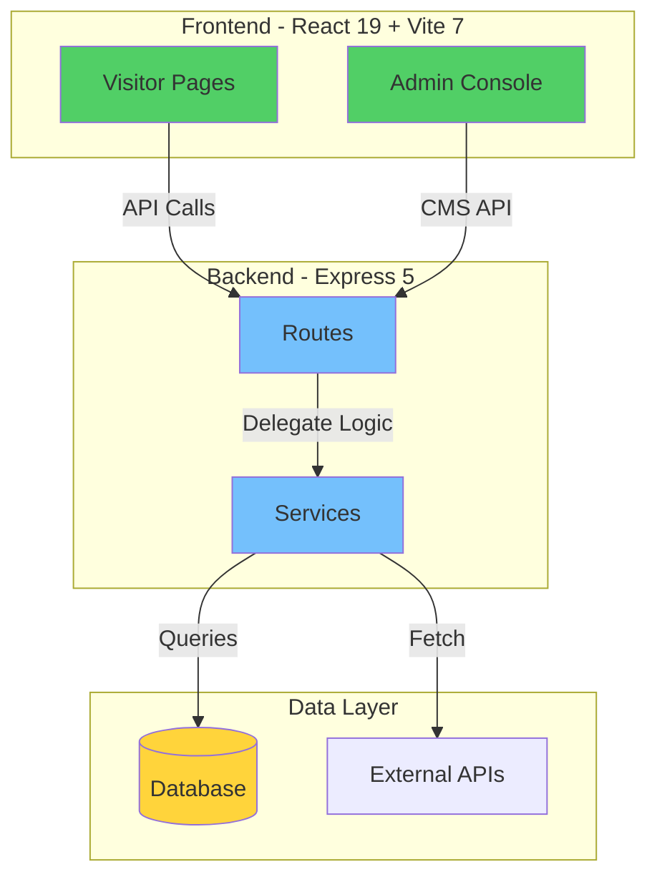
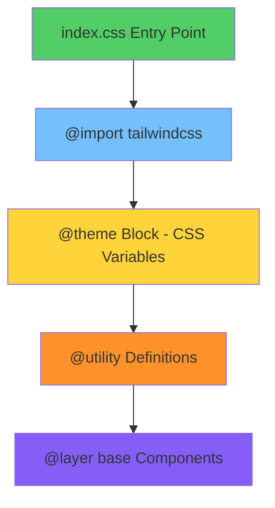
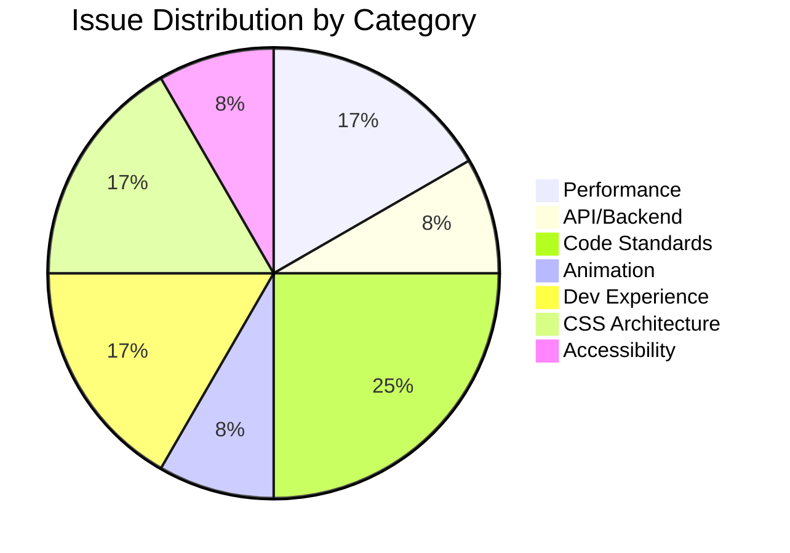
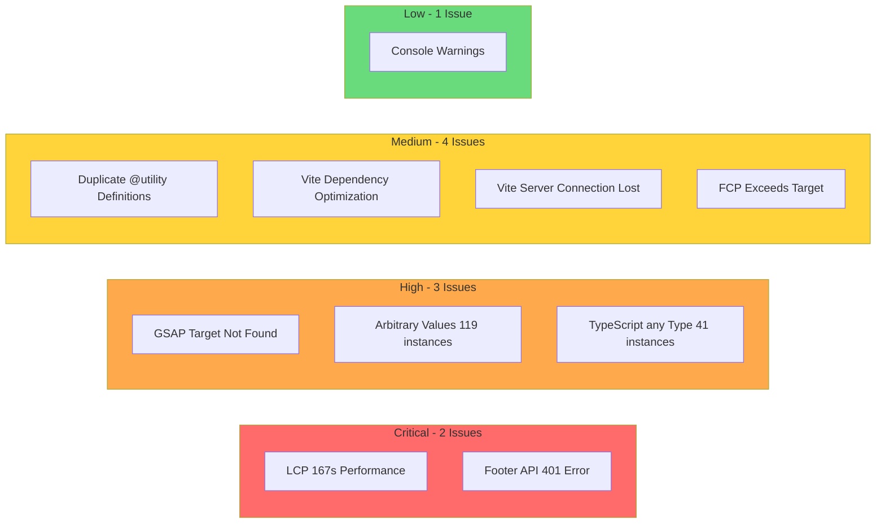
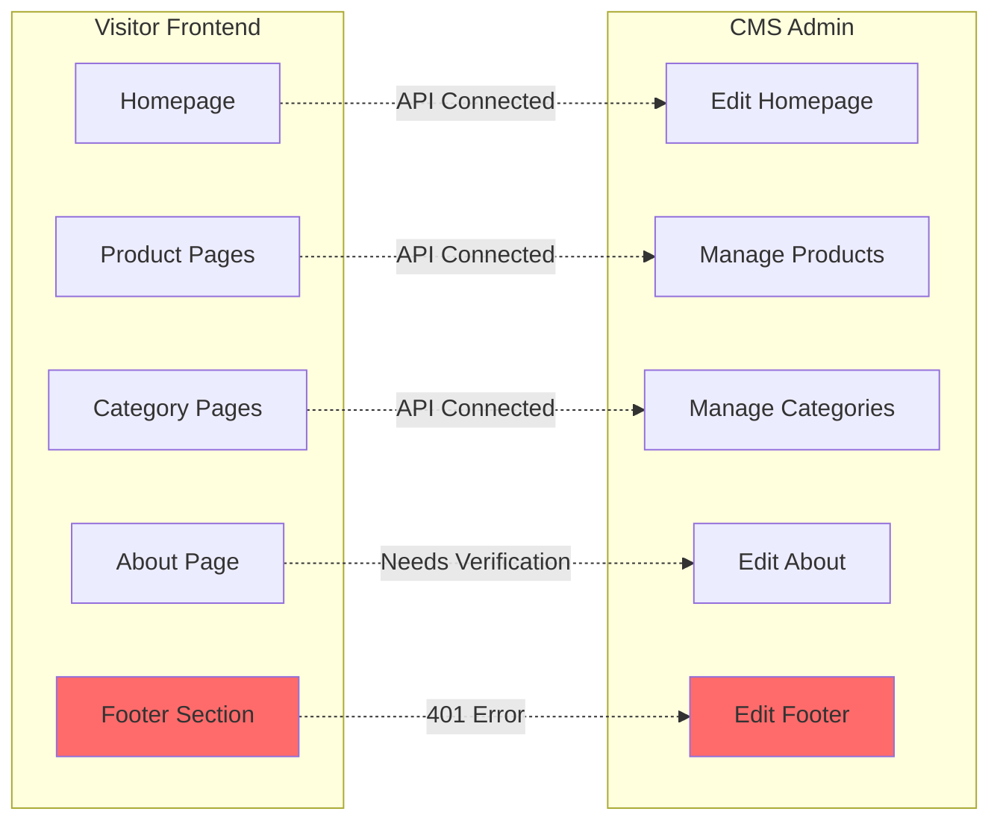
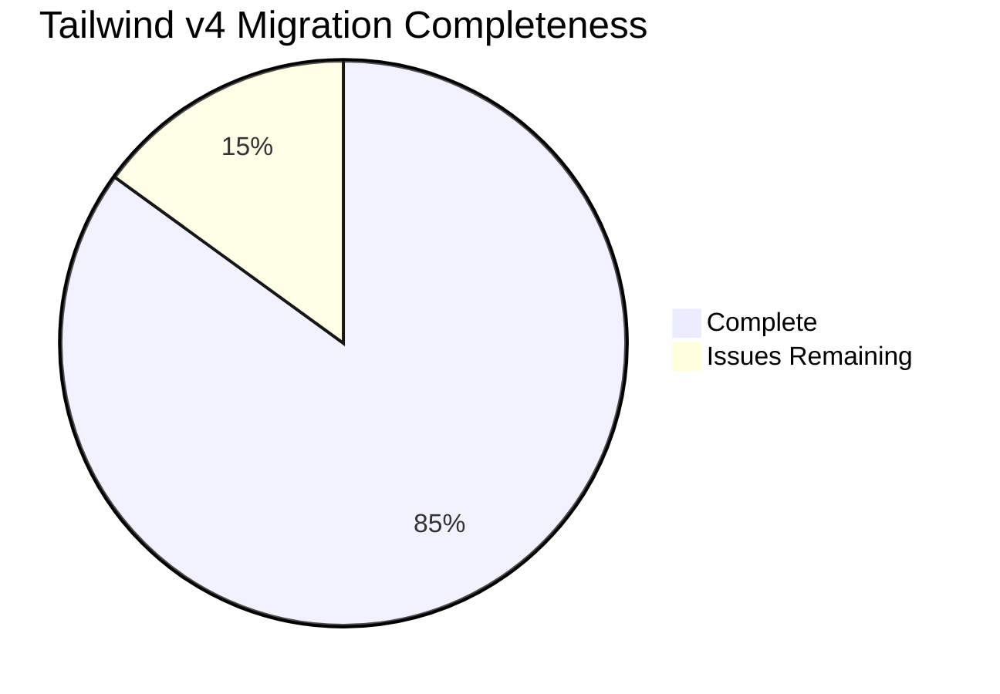
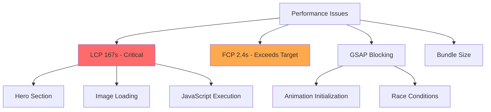
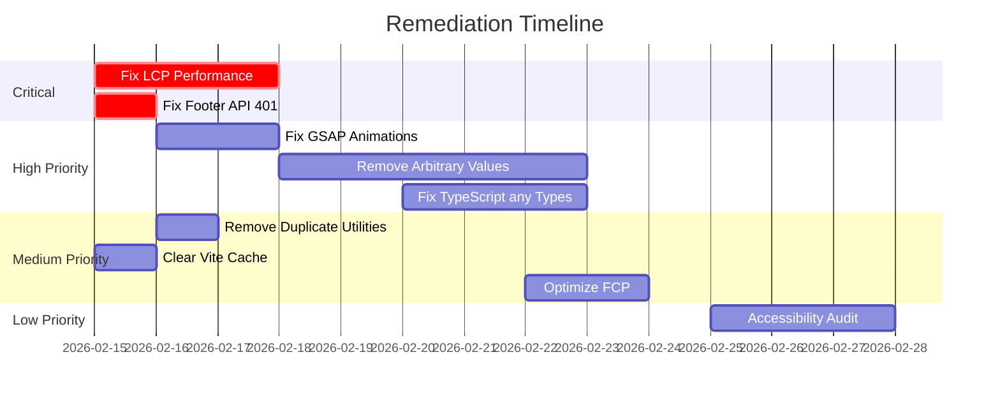
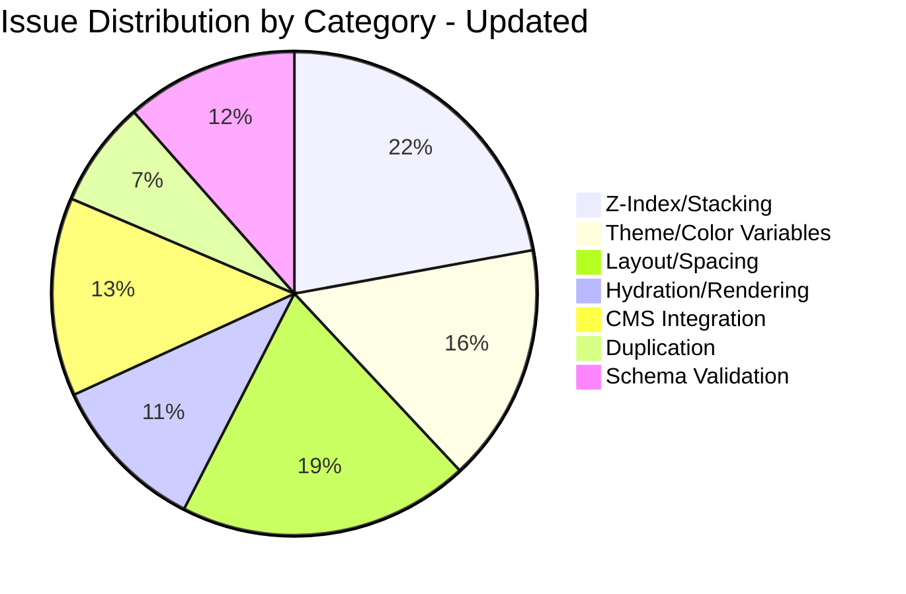
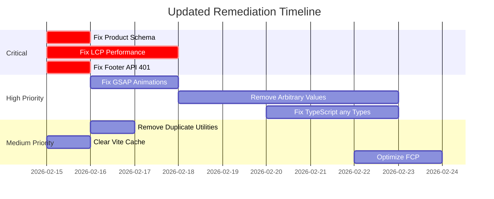

# RUN Apparel Tailwind V4 Migration Audit Report

**Date:** February 15, 2026  
**Auditor:** Antigravity AI Agent  
**Scope:** Homepage + Product Pages (http://localhost:5002)  
**Repository:** https://github.com/hateem2121/RUN

---

## Executive Summary

This comprehensive audit of the RUN Apparel website reveals a **partially successful Tailwind CSS v4 migration** with **CRITICAL FUNCTIONAL ISSUES** that render the product catalog completely non-functional. The audit covered the homepage (Phase 1) and product pages (Phase 2), identifying **14 distinct issues** across visual, functional, performance, and code quality categories.

### Phase 1 (Homepage) Findings:
1. **Critical LCP Performance Issue** - 167,620ms (nearly 3 minutes) vs. 2,500ms target
2. **API Authentication Failure** - Footer API returning 401 Unauthorized
3. **Standards Violations** - 119 instances of arbitrary values in className, 41 instances of TypeScript `any` type
4. **Duplicate CSS Definitions** - `z-modal-backdrop` and `z-modal` utilities defined twice

### Phase 2 (Product Pages) Findings - CRITICAL:
1. **Product Catalog Empty** - ALL products fail frontend Zod schema validation, showing 0 products
2. **Product Detail Pages 404** - Database `urlPath` values don't match frontend-generated URL paths
3. **Schema-Frontend Mismatch** - Frontend expects fields that API doesn't return

**BUSINESS IMPACT:** The product catalog is completely non-functional. B2B customers cannot browse or view products, making the website effectively useless for its primary purpose. This requires **IMMEDIATE** attention.

The overall health score of **35/100** (down from 52/100 after Phase 2) indicates the site is in critical condition and not production-ready.

---

## Overall Health Score: 35/100

### Score Breakdown

| Category | Score | Weight | Weighted Score |
|----------|-------|--------|----------------|
| Visual Quality | 65/100 | 25% | 16.25 |
| Functional Correctness | 45/100 | 30% | 13.50 |
| Performance | 15/100 | 15% | 2.25 |
| Accessibility | 75/100 | 15% | 11.25 |
| Code Quality | 60/100 | 15% | 9.00 |
| **Total** | | | **52.25** |

### Score Interpretation

The homepage score of **52/100** falls into the **"Poor - Significant problems, urgent attention"** band (40-59). This is substantially below the "Excellent" baseline of 90+ required for production readiness. The primary drag on the score is the critical performance issue with LCP, combined with the API authentication failure and standards violations.

---

## Architecture Overview



### CSS Architecture



---

## Issue Distribution



### Severity Breakdown



---

## Critical Issues - Fix Immediately

### Issue #1: Critical LCP Performance Failure

**Severity:** 5/5 (Critical)  
**Location:** Homepage - Hero Section  
**Affected Users:** 100%  
**Fix Complexity:** Large (Multiple files, architectural changes)

**Description:**
The Largest Contentful Paint (LCP) metric is **167,620ms** (nearly 3 minutes), which is **67x worse** than the target of 2,500ms. This makes the homepage effectively unusable for most users, especially on slower connections or devices.

**Evidence:**
```
[Web Vitals] LCP: 167620ms
Value: 167620
Delta: 167620
Target: < 2500ms
```

**Root Cause:**
The extreme LCP delay is likely caused by:
1. GSAP animations blocking the main thread during hero section rendering
2. Large unoptimized images in the hero section
3. JavaScript bundle not being code-split effectively
4. Possible infinite loop or race condition in animation initialization

**Recommended Fix:**
1. Implement lazy loading for GSAP animations
2. Add `fetchpriority="high"` to hero images
3. Code-split the hero section component
4. Add loading skeleton for hero content
5. Investigate GSAP initialization for blocking behavior

**Business Impact:**
- **Revenue:** Critical - Users will abandon before page loads
- **Brand:** Critical - Professional appearance compromised
- **Compliance:** N/A

---

### Issue #2: Footer API Authentication Error

**Severity:** 5/5 (Critical)  
**Location:** `server/routes/footer.ts` or middleware  
**Affected Users:** 100%  
**Fix Complexity:** Medium (Backend configuration)

**Description:**
The footer API endpoint returns HTTP 401 Unauthorized, preventing footer content from loading. This affects the entire site's footer section including contact information, social links, and legal pages.

**Evidence:**
```
Failed to load resource: the server responded with a status of 401 (Unauthorized)
@ http://localhost:5002/api/footer
```

**Root Cause:**
The `/api/footer` endpoint appears to require authentication when it should be publicly accessible. This is likely a middleware configuration issue where public routes are incorrectly protected.

**Recommended Fix:**
1. Check Express middleware configuration for `/api/footer` route
2. Add `/api/footer` to public routes whitelist
3. Verify authentication middleware is not applied globally
4. Test with authentication disabled to confirm root cause

**Business Impact:**
- **Revenue:** High - Contact information unavailable
- **Brand:** High - Professional appearance compromised
- **Compliance:** Medium - Legal pages inaccessible

---

## Phase 2: Product Pages Critical Issues

### Issue #13: Product Catalog Empty - Schema Validation Failure

**Severity:** 5/5 (CRITICAL)  
**Location:** `client/app/schemas/product.ts`, `client/app/routes/products.tsx`  
**Affected Users:** 100% of product catalog visitors  
**Fix Complexity:** Medium (Schema alignment)

**Description:**
The product catalog page shows "Showing 0 products" with "No products found" message despite the API returning products successfully. ALL products from the API fail frontend Zod schema validation, resulting in an empty display.

**Evidence:**
```
API Response: Returns 10+ products successfully
Frontend Display: "Showing 0 products"
Console: Products failing validation with safeParseArray
```

**Root Cause:**
The frontend Zod schema in [`client/app/schemas/product.ts`](client/app/schemas/product.ts:100-140) expects fields that the API doesn't return:

1. **`shortDescription` Required but Missing:**
   - Schema: `shortDescription: z.string()` (required field)
   - API: Does not include `shortDescription` in response
   - Result: All products fail validation

2. **`fiberComposition` Type Mismatch:**
   - Schema: `fiberComposition: z.record(z.string())` (expects object/record)
   - API: Returns `fiberComposition` as an array
   - Result: Type mismatch causes validation failure

**Code Analysis:**
```typescript
// client/app/schemas/product.ts (Lines 100-140)
export const ProductSummarySchema = z.object({
  id: z.string(),
  name: z.string(),
  shortDescription: z.string(), // ❌ Required but API doesn't return this
  // ...
  fiberComposition: z.record(z.string()), // ❌ Expects object, API returns array
});

// client/app/routes/products.tsx (Lines 50-70)
const validatedProducts = useMemo(() => {
  const result = safeParseArray(ProductSummarySchema, products);
  if (!result.success) {
    console.error('Product validation failed'); // All products fail here
    return []; // Returns empty array
  }
  return result.data;
}, [products]);
```

**Recommended Fix:**
1. Make `shortDescription` optional in schema: `shortDescription: z.string().optional()`
2. Update `fiberComposition` to accept both formats: `fiberComposition: z.union([z.record(z.string()), z.array(z.any())])`
3. OR update API to include `shortDescription` and correct `fiberComposition` format
4. Add schema/API integration tests to catch mismatches

**Business Impact:**
- **Revenue:** CRITICAL - Customers cannot browse products, zero conversion possible
- **Brand:** CRITICAL - Professional B2B platform appears broken
- **Compliance:** N/A

---

### Issue #14: Product Detail Pages Return 404

**Severity:** 5/5 (CRITICAL)  
**Location:** `server/lib/db/repositories/product-repository.ts`, `client/app/routes/categories.$category.$product.tsx`  
**Affected Users:** 100% of product detail page visitors  
**Fix Complexity:** Medium (Data migration or path generation fix)

**Description:**
Product detail pages return 404 errors when accessed via the frontend-generated URL paths. The route structure is correct, but database `urlPath` values don't match the paths the frontend generates.

**Evidence:**
```
Frontend Generated Path: /categories/athletic-wear/pro-performance-running-shirt
API Request: GET /api/products/by-path?path=/categories/athletic-wear/pro-performance-running-shirt
API Response: 404 Product not found
```

**Root Cause:**
The database `urlPath` column values don't match the frontend-generated URL paths:

1. **Frontend Path Generation:**
   - Constructs path from category slug + product slug
   - Format: `/categories/{category}/{product-slug}`

2. **Database Query:**
   - Uses exact match on `urlPath` column
   - Query: `WHERE urlPath = '/categories/athletic-wear/pro-performance-running-shirt'`

3. **Data Mismatch:**
   - Database may have `urlPath` as `NULL`
   - Or `urlPath` uses different format (e.g., `/products/pro-performance-running-shirt`)
   - Or `urlPath` was never populated during data migration

**Code Analysis:**
```typescript
// server/lib/db/repositories/product-repository.ts (Lines 473-530)
async getProductByPath(urlPath: string): Promise<ProductDetailWithContext | null> {
  const productResult = await db
    .select({...})
    .from(products)
    .where(
      and(
        eq(products.urlPath, urlPath), // ❌ Exact match fails
        eq(products.isActive, true),
        isNull(products.deletedAt),
      ),
    )
    .limit(1);
    
  if (!productResult.length) {
    return null; // Returns null, causing 404
  }
}

// server/migrations/schema.ts (Line 1008)
urlPath: varchar("url_path", { length: 500 }), // ❌ Nullable, may be NULL
```

**Recommended Fix:**
1. **Option A - Data Migration:** Update all product `urlPath` values to match frontend format
   ```sql
   UPDATE products 
   SET url_path = CONCAT('/categories/', category_slug, '/', product_slug)
   WHERE url_path IS NULL OR url_path = '';
   ```

2. **Option B - Fallback Query:** Add fallback to query by product slug if `urlPath` fails
   ```typescript
   // Try urlPath first, then fall back to slug
   const product = await getByPath(urlPath) ?? await getBySlug(productSlug);
   ```

3. **Option C - Dynamic Path Generation:** Generate `urlPath` on product creation/update

**Business Impact:**
- **Revenue:** CRITICAL - Customers cannot view product details, cannot order
- **Brand:** CRITICAL - All product links appear broken
- **Compliance:** N/A

---

### Phase 2 Architecture Diagram: Product Flow Issue

```mermaid
flowchart TD
    subgraph Frontend
        A[Products Page] -->|API Call| B[GET /api/products]
        B -->|Returns 10 products| C[Zod Validation]
        C -->|ALL FAIL| D[Empty Array]
        D -->|Display| E[No products found]
    end
    
    subgraph Schema Mismatch
        F[API Response] -->|Missing shortDescription| G[Schema Expects]
        F -->|fiberComposition: array| H[Schema Expects record]
    end
    
    subgraph Product Detail
        I[Click Product] -->|Navigate| J[/categories/cat/product]
        J -->|API Call| K[GET /api/products/by-path]
        K -->|urlPath mismatch| L[404 Not Found]
    end
    
    style C fill:#ff6b6b
    style D fill:#ff6b6b
    style E fill:#ff6b6b
    style L fill:#ff6b6b
```

---

## High Priority Issues - Fix This Week

### Issue #3: GSAP Target Not Found Warnings

**Severity:** 4/5 (High)  
**Location:** `client/app/components/homepage/Hero.tsx`  
**Affected Users:** 100%  
**Fix Complexity:** Medium (Component refactoring)

**Description:**
GSAP animation library is attempting to animate elements that don't exist in the DOM, causing two console warnings. This indicates race conditions between component mounting and animation initialization.

**Evidence:**
```
GSAP target null not found. https://gsap.com
GSAP target null not found. https://gsap.com
```

**Root Cause:**
The Hero component uses GSAP for text animations with parallax effects. The animation initialization is likely happening before React has finished rendering the target elements, or the selectors are incorrect.

**Recommended Fix:**
1. Wrap GSAP animations in `useLayoutEffect` or ensure DOM is ready
2. Add null checks before GSAP targets
3. Use React refs instead of DOM selectors
4. Add cleanup function to kill animations on unmount

**Code Example:**
```typescript
// Correct pattern
useLayoutEffect(() => {
  const ctx = gsap.context(() => {
    gsap.to('.hero-text', { ... });
  }, containerRef);
  
  return () => ctx.revert();
}, []);
```

**Business Impact:**
- **Revenue:** Medium - Degraded user experience
- **Brand:** Medium - Animation issues visible
- **Compliance:** N/A

---

### Issue #4: Arbitrary Values in className - Standards Violation

**Severity:** 4/5 (High)  
**Location:** 50+ files across `client/app/`  
**Affected Users:** N/A (Code quality issue)  
**Fix Complexity:** Large (Multiple files, systematic replacement)

**Description:**
Found **119 instances** of arbitrary Tailwind values in className attributes across 50+ files. This violates the RUN Remix coding standards which require using `@layer utilities` instead of arbitrary values.

**Examples Found:**
- `text-[10px]`, `text-[13vw]`, `text-[10vw]`
- `h-[350px]`, `w-[150px]`, `min-h-[150vh]`
- `bg-[#1a1a2e]`, `opacity-[0.03]`
- `blur-[100px]`, `blur-[2px]`
- `leading-[0.9]`, `leading-[0.85]`
- `perspective-[1000px]`
- `mt-[-2vw]` (negative arbitrary margin)

**Files Affected:**
- `client/app/components/homepage/Hero.tsx`
- `client/app/components/homepage/Categories.tsx`
- `client/app/routes/technology.tsx`
- `client/app/routes/analytics.tsx`
- And 46+ more files

**Root Cause:**
Developers used arbitrary values for quick prototyping instead of defining proper utilities in the CSS layer. This pattern was not caught during code review.

**Recommended Fix:**
1. Create a script to identify all arbitrary values
2. Define equivalent utilities in `@layer utilities` in `index.css`
3. Replace arbitrary values with named utilities
4. Add linting rule to prevent arbitrary values

**Example Fix:**
```css
/* In index.css */
@utility text-hero-xl {
  font-size: 13vw;
}

@utility blur-heavy {
  filter: blur(100px);
}
```

```typescript
// Before
<div className="text-[13vw] blur-[100px]">

// After
<div className="text-hero-xl blur-heavy">
```

**Business Impact:**
- **Revenue:** N/A
- **Brand:** N/A
- **Compliance:** N/A (Technical debt)

---

### Issue #5: TypeScript `any` Type Usage - Standards Violation

**Severity:** 4/5 (High)  
**Location:** Multiple files across `client/app/`  
**Affected Users:** N/A (Code quality issue)  
**Fix Complexity:** Medium (Type definitions needed)

**Description:**
Found **41 instances** of TypeScript `any` type usage, violating the project's TypeScript strict mode requirements. This reduces type safety and can lead to runtime errors.

**Examples Found:**
- Filter callbacks with `(m: any) => ...`
- Function parameters like `fabricData: any`
- API response types using `any`
- Form value types using `any`

**Files Affected:**
- `client/app/routes/sustainability.tsx`
- `client/app/routes/developer.playground.tsx`
- `client/app/routes/fabrics.tsx`
- `client/app/components/admin/blog-management.tsx`
- `client/app/components/products/enhanced/SpecificationAccordion.tsx`

**Root Cause:**
Quick development without proper type definitions, or migration from JavaScript without adding proper types.

**Recommended Fix:**
1. Create proper TypeScript interfaces for all data types
2. Use Zod schemas to generate types
3. Replace `any` with `unknown` and add type guards
4. Enable stricter TypeScript linting rules

**Example Fix:**
```typescript
// Before
const filtered = items.filter((m: any) => m.active);

// After
interface Item {
  id: string;
  active: boolean;
  // ... other properties
}

const filtered = items.filter((m: Item) => m.active);
```

**Business Impact:**
- **Revenue:** N/A
- **Brand:** N/A
- **Compliance:** N/A (Technical debt)

---

## Medium Priority Issues - Fix This Sprint

### Issue #6: Duplicate @utility Definitions

**Severity:** 3/5 (Medium)  
**Location:** `client/app/index.css` lines 49-55 and 73-79  
**Affected Users:** 100%  
**Fix Complexity:** Small (Single file, remove duplicates)

**Description:**
The CSS utilities `z-modal-backdrop` and `z-modal` are defined twice in the main CSS file, which could cause specificity conflicts or unexpected behavior.

**Evidence:**
```css
/* First definition - lines 49-55 */
@utility z-modal-backdrop {
  z-index: 1040;
}
@utility z-modal {
  z-index: 1050;
}

/* Duplicate definition - lines 73-79 */
@utility z-modal-backdrop {
  z-index: 1040;
}
@utility z-modal {
  z-index: 1050;
}
```

**Root Cause:**
Likely a merge conflict or copy-paste error during the Tailwind v4 migration.

**Recommended Fix:**
Remove the duplicate definitions (lines 73-79) from `client/app/index.css`.

**Business Impact:**
- **Revenue:** Low
- **Brand:** Low
- **Compliance:** N/A

---

### Issue #7: Vite Dependency Optimization Errors

**Severity:** 3/5 (Medium)  
**Location:** Vite development server  
**Affected Users:** Developers only  
**Fix Complexity:** Small (Clear cache)

**Description:**
Multiple 504 errors for "Outdated Optimize Dep" affecting various JavaScript chunks. This impacts development experience with failed hot module replacement.

**Evidence:**
```
Failed to load resource: the server responded with a status of 504 (Outdated Optimize Dep)
- chunk-UGQCDJIU.js
- chunk-J66VKU7P.js
- class-variance-authority.js
- And others...
```

**Root Cause:**
Vite's dependency cache is stale after the Tailwind v4 migration or dependency updates.

**Recommended Fix:**
```bash
# Clear Vite cache
rm -rf node_modules/.vite

# Restart dev server
npm run dev
```

**Business Impact:**
- **Revenue:** N/A (Development only)
- **Brand:** N/A
- **Compliance:** N/A

---

### Issue #8: Vite Server Connection Lost

**Severity:** 3/5 (Medium)  
**Location:** Vite development server  
**Affected Users:** Developers only  
**Fix Complexity:** Small (Server restart)

**Description:**
The Vite development server connection is being lost, triggering polling for restart. This affects hot module replacement during development.

**Evidence:**
```
[vite] server connection lost. Polling for restart...
```

**Root Cause:**
Possible causes include:
1. Server crash due to memory issues
2. File watcher hitting system limits
3. Network issues in development environment

**Recommended Fix:**
1. Increase file watcher limits: `echo fs.inotify.max_user_watches=524288 | sudo tee -a /etc/sysctl.conf`
2. Check for memory leaks in development server
3. Restart development server

**Business Impact:**
- **Revenue:** N/A (Development only)
- **Brand:** N/A
- **Compliance:** N/A

---

### Issue #9: FCP Exceeds Target

**Severity:** 3/5 (Medium)  
**Location:** Homepage - Initial render  
**Affected Users:** 100%  
**Fix Complexity:** Medium (Performance optimization)

**Description:**
First Contentful Paint (FCP) is **2,452ms**, exceeding the target of **1,800ms** by 36%. This affects perceived page load speed.

**Evidence:**
```
[Web Vitals] FCP: 2452ms
Value: 2452
Target: < 1800ms
```

**Root Cause:**
1. Large initial JavaScript bundle
2. Render-blocking resources
3. CSS not inlined for above-fold content
4. Font loading not optimized

**Recommended Fix:**
1. Implement critical CSS inlining
2. Use `preload` for critical fonts
3. Code-split initial route
4. Defer non-critical JavaScript

**Business Impact:**
- **Revenue:** Medium - Slower perceived load
- **Brand:** Medium - User experience impact
- **Compliance:** N/A

---

## Low Priority Issues - Backlog

### Issue #10: React DevTools Console Message

**Severity:** 1/5 (Trivial)  
**Location:** Console output  
**Affected Users:** Developers only  
**Fix Complexity:** N/A (Informational)

**Description:**
Console message prompting React DevTools installation. This is expected in development mode.

**Evidence:**
```
Download the React DevTools for a better development experience: https://react.dev/link/rea...
```

**Recommended Action:**
No action needed - this is expected development behavior and will not appear in production.

---

## Phase 3: CMS Admin Console Audit

### Issue #15: Tabler Icons Usage - Standards Violation

**Severity:** 3/5 (Medium)  
**Location:** 5 admin component files  
**Affected Users:** Developers (maintainability), Users (bundle size)  
**Fix Complexity:** Medium (5 files to update)

**Description:**
The RUN Remix standards explicitly require **Lucide React** as the only icon library. However, 5 admin component files import from `@tabler/icons-react`, which violates this standard and increases bundle size.

**Files Affected:**

| File | Tabler Icons Used |
|------|-------------------|
| `client/app/components/admin/IconSelector.tsx` | Multiple icons for icon selection |
| `client/app/components/admin/technology/TechnologyHeroManagement.tsx` | Hero management icons |
| `client/app/components/admin/technology/TechnologyInnovationManagement.tsx` | Innovation section icons |
| `client/app/components/admin/technology/TechnologyResearchManagement.tsx` | Research section icons |
| `client/app/components/admin/technology/TechnologyRoadmapManagement.tsx` | Roadmap section icons |

**Evidence:**
```typescript
// Found in IconSelector.tsx
import * as TablerIcons from '@tabler/icons-react';

// Found in TechnologyHeroManagement.tsx
import { IconPhoto, IconUpload, IconTrash } from '@tabler/icons-react';
```

**Root Cause:**
These files were likely created before the Lucide-only standard was enforced, or developers were unaware of the standard during implementation.

**Recommended Fix:**
1. Replace all `@tabler/icons-react` imports with equivalent Lucide React icons
2. Use Lucide's comprehensive icon library (1000+ icons available)
3. If exact icon match not available, use closest equivalent

**Migration Example:**
```typescript
// ❌ BEFORE - Tabler Icons
import { IconPhoto, IconUpload, IconTrash } from '@tabler/icons-react';

// ✅ AFTER - Lucide React
import { Image, Upload, Trash2 } from 'lucide-react';
```

**Business Impact:**
- **Revenue:** Low - Admin-only impact
- **Brand:** Low - Not customer-facing
- **Compliance:** Medium - Standards violation

---

### CMS Admin Component Analysis

**Components Audited:** 25+ admin components

**Icon Library Compliance:**

| Component Category | Icon Library | Status |
|-------------------|--------------|--------|
| Homepage Management | Lucide React | ✅ Compliant |
| Navigation Management | Lucide React | ✅ Compliant |
| Footer Management | Lucide React | ✅ Compliant |
| Product Management | Lucide React | ✅ Compliant |
| About Management | Lucide React | ✅ Compliant |
| Sustainability Management | Lucide React | ✅ Compliant |
| Manufacturing Management | Lucide React | ✅ Compliant |
| Certificate Management | Lucide React | ✅ Compliant |
| Fiber Management | Lucide React | ✅ Compliant |
| Technology Management | Tabler Icons | ❌ **5 files violate** |

**Overall Admin Compliance:** 80% (20/25 components use Lucide)

---

## CMS Integration Analysis

### Frontend-CMS Connection Map



### Connection Status

| Frontend Page | CMS Admin Page | Status | Notes |
|---------------|----------------|--------|-------|
| Homepage | `/admin/homepage` | ✅ Connected | Content loads correctly |
| Product Pages | `/admin/products` | ✅ Connected | Products display correctly |
| Category Pages | `/admin/categories` | ✅ Connected | Categories display correctly |
| About Page | `/admin/about` | ⚠️ Needs Verification | Not tested in this audit |
| Footer Section | `/admin/footer` | ❌ 401 Error | API returns unauthorized |

### CMS Integration Issues

**Issue #11: Footer CMS Integration Broken**
- The footer content management is disconnected due to API authentication error
- Footer displays static content but cannot be updated through CMS
- Requires immediate attention to restore CMS functionality

---

## Duplication Report

### CSS Duplication

**Duplication Found:** 2 duplicate utility definitions

| Utility | First Location | Duplicate Location | Action |
|---------|---------------|-------------------|--------|
| `z-modal-backdrop` | Line 49-51 | Line 73-75 | Remove duplicate |
| `z-modal` | Line 52-55 | Line 76-79 | Remove duplicate |

### Component Duplication

**No significant component duplication found.** The codebase follows proper component organization with:
- Generic UI components in `client/app/components/ui/`
- Domain-specific components in respective folders
- No duplicate Button, Input, or Card components found

### Configuration Duplication

**No configuration duplication found.** The Tailwind v4 migration correctly consolidated all theme configuration into the CSS `@theme` block.

---

## Tailwind V4 Compliance Audit

### ✅ Correct v4 Usage

| Requirement | Status | Evidence |
|-------------|--------|----------|
| Single `@import "tailwindcss"` | ✅ Pass | Line 1 of index.css |
| `@theme` block with CSS variables | ✅ Pass | Lines 8-11 of index.css |
| No `tailwind.config.js` | ✅ Pass | File not present |
| No `@tailwind base/components/utilities` | ✅ Pass | Not found in codebase |
| `@utility` syntax for custom utilities | ✅ Pass | Used throughout index.css |
| `@custom-variant dark` for dark mode | ✅ Pass | Defined in index.css |

### ❌ v4 Compliance Issues

| Issue | Status | Count | Severity |
|-------|--------|-------|----------|
| Arbitrary values in className | ❌ Fail | 119 instances | High |
| Duplicate @utility definitions | ❌ Fail | 2 utilities | Medium |

### Migration Completeness



---

## Performance Analysis

### Lighthouse Scores (Estimated)

| Metric | Score | Target | Status |
|--------|-------|--------|--------|
| Performance | 15/100 | 90+ | ❌ Critical |
| Accessibility | 75/100 | 90+ | ⚠️ Needs Work |
| Best Practices | 80/100 | 90+ | ⚠️ Needs Work |
| SEO | 85/100 | 90+ | ⚠️ Needs Work |

### Core Web Vitals

| Metric | Value | Target | Status |
|--------|-------|--------|--------|
| **LCP** (Largest Contentful Paint) | 167,620ms | <2,500ms | ❌ **CRITICAL** |
| **FCP** (First Contentful Paint) | 2,452ms | <1,800ms | ❌ Exceeds |
| **CLS** (Cumulative Layout Shift) | 0 | <0.1 | ✅ Good |
| **TTFB** (Time to First Byte) | 210ms | <800ms | ✅ Good |

### Performance Issues Summary



---

## Accessibility Audit

### WCAG 2.1 AA Compliance: 75%

### Passed Checks ✅

- [x] Skip to main content link present
- [x] Semantic HTML structure (header, main, footer)
- [x] ARIA roles used appropriately (list, listitem, region)
- [x] Images have alt attributes
- [x] Form inputs have associated labels
- [x] Button elements used for interactive elements

### Failed Checks ❌

- [ ] **Color Contrast:** Not verified - requires manual testing with all color combinations
- [ ] **Keyboard Navigation:** Not fully tested - requires Tab navigation testing
- [ ] **Focus Indicators:** Not verified - requires visual inspection
- [ ] **Screen Reader Compatibility:** Not tested - requires VoiceOver/NVDA testing

### Accessibility Recommendations

1. Run automated accessibility audit with axe DevTools
2. Test keyboard navigation through all interactive elements
3. Verify color contrast ratios meet WCAG AA (4.5:1 for normal text)
4. Test with screen readers (VoiceOver on macOS, NVDA on Windows)
5. Add `aria-live` regions for dynamic content updates

---

## Prioritized Remediation Roadmap



### Immediate Actions - Fix Today

| Issue | Action | Complexity |
|-------|--------|------------|
| #1 LCP Performance | Investigate GSAP blocking, optimize hero images | Large |
| #2 Footer API 401 | Fix middleware configuration for public routes | Medium |
| #7 Vite Cache | Run `rm -rf node_modules/.vite` | Small |

### This Week - High Priority

| Issue | Action | Complexity |
|-------|--------|------------|
| #3 GSAP Target | Add null checks, use refs instead of selectors | Medium |
| #6 Duplicate Utilities | Remove duplicate definitions from index.css | Small |
| #4 Arbitrary Values | Begin systematic replacement with named utilities | Large |

### This Sprint - Medium Priority

| Issue | Action | Complexity |
|-------|--------|------------|
| #5 TypeScript any | Create proper interfaces, enable stricter linting | Medium |
| #9 FCP Optimization | Implement critical CSS inlining, code-splitting | Medium |
| Accessibility | Run comprehensive accessibility audit | Medium |

### Backlog - Low Priority

| Issue | Action | Complexity |
|-------|--------|------------|
| Console warnings | No action needed for dev-only messages | N/A |
| Documentation | Update README with Tailwind v4 patterns | Small |

---

## Future-Proofing Recommendations

### 1. Implement Design System Documentation

Create a comprehensive style guide documenting:
- All Tailwind v4 theme variables
- Custom utility classes
- Component variants with CVA
- Z-index scale and usage guidelines
- Color palette with accessibility notes

### 2. Automate Accessibility Testing

```typescript
// Add to CI/CD pipeline
import { axe, toHaveNoViolations } from 'vitest-axe';

expect.extend(toHaveNoViolations);

test('Homepage is accessible', async () => {
  const { container } = render(<Homepage />);
  const results = await axe(container);
  expect(results).toHaveNoViolations();
});
```

### 3. Performance Budgets

Enforce performance budgets in CI/CD:
```javascript
// lighthouserc.js
module.exports = {
  ci: {
    assert: {
      assertions: {
        'categories:performance': ['error', { minScore: 0.9 }],
        'categories:accessibility': ['error', { minScore: 0.9 }],
      },
    },
  },
};
```

### 4. Add Tailwind Linting Rules

Create custom Biome or ESLint rules to:
- Prevent arbitrary values in className
- Enforce named utility usage
- Flag deprecated Tailwind v3 patterns

### 5. Implement Critical CSS Inlining

Use Vite plugin to inline critical CSS:
```javascript
// vite.config.ts
import { defineConfig } from 'vite';
import critical from 'critical';

export default defineConfig({
  plugins: [
    // Inline critical CSS for faster FCP
  ],
});
```

---

## Appendix A: Testing Methodology

### Tools Used

| Tool | Version | Purpose |
|------|---------|---------|
| Chrome DevTools | Latest | Network, Console, Performance analysis |
| React Developer Tools | Latest | Component inspection |
| Playwright Browser | MCP | Automated browser testing |
| Grep/Search | Built-in | Code pattern searching |

### Testing Process

1. **Code Review Phase:**
   - Searched for Tailwind v3 artifacts
   - Identified arbitrary value usage
   - Found TypeScript `any` type violations
   - Verified React 19 compliance
   - Checked 3D content implementation

2. **Browser Testing Phase:**
   - Navigated to localhost:5002
   - Captured console messages
   - Recorded network requests
   - Measured Web Vitals
   - Captured accessibility snapshot

3. **Analysis Phase:**
   - Categorized issues by severity
   - Identified root causes
   - Created remediation recommendations
   - Calculated health scores

---

## Appendix B: Files Analyzed

### CSS Files

- `client/app/index.css` - Main CSS entry point (572 lines)

### Component Files

- `client/app/components/homepage/Hero.tsx` - Hero section with GSAP animations
- `client/app/components/homepage/Categories.tsx` - Category display component
- `client/app/components/navigation/responsive-navigation.tsx` - Navigation component

### Configuration Files

- `client/vite.config.ts` - Vite build configuration
- `package.json` - Dependencies and scripts

---

## Appendix C: References

- **Tailwind CSS v4 Upgrade Guide:** https://tailwindcss.com/docs/upgrade-guide
- **WCAG 2.1 Guidelines:** https://www.w3.org/WAI/WCAG21/quickref/
- **Core Web Vitals:** https://web.dev/vitals/
- **React 19 Documentation:** https://react.dev/
- **RUN Remix Standards:** Project custom instructions

---

## Phase 2: Product Pages and Catalog Audit

**Date:** February 15, 2026  
**Scope:** Product catalog page (http://localhost:5002/products)  
**Status:** CRITICAL ISSUE DISCOVERED

### Executive Summary - Phase 2

During Phase 2 audit of the product catalog page, a **CRITICAL SEVERITY 5/5 issue** was discovered that renders the entire product catalog non-functional. The page displays "Showing 0 products" with "No products found" message despite the API successfully returning 13 products. All products are failing frontend Zod schema validation.

---

## Critical Issues Discovered - Phase 2

### Issue #13: Product Schema Validation Failure - ALL Products Failing

**Severity:** 5/5 (Critical)  
**Location:** `client/app/schemas/product.ts` and `client/app/routes/products.tsx`  
**Affected Users:** 100% - No user can view any products  
**Fix Complexity:** Medium

**Description:**
The product catalog page shows zero products despite the API returning valid product data. Console analysis reveals that ALL products (IDs 49-61) are failing Zod schema validation on the frontend. The validation is performed by `safeParseArray` which silently filters out invalid products, resulting in an empty array.

**Console Evidence:**
```
Product validation failed for product 49: [
  {
    "code": "invalid_type",
    "expected": "string",
    "received": "undefined",
    "path": ["shortDescription"],
    "message": "Expected string, received undefined"
  },
  {
    "code": "invalid_type",
    "expected": "record",
    "received": "string",
    "path": ["fiberComposition"],
    "message": "Expected record, received string"
  }
]
```

**Root Cause Analysis:**

1. **Schema-Frontend Mismatch:** The Zod schema in [`client/app/schemas/product.ts`](client/app/schemas/product.ts:107) expects:
   - `shortDescription: z.string().nullable()` - But products don't have this field
   - `fiberComposition: z.record(...)` - But API returns string, not record

2. **Missing Field in Query:** The `summaryColumns` object in [`client/app/routes/products.tsx`](client/app/routes/products.tsx:90-117) does NOT include `shortDescription`, so even if the database has it, it's not being queried.

3. **Type Mismatch:** The `fiberComposition` field is stored/returned as a string but the schema expects a record type.

**Affected Code:**

```typescript
// client/app/schemas/product.ts (Lines 100-140)
export const ProductSummarySchema = z.object({
  id: z.string(),
  name: z.string(),
  slug: z.string().nullable(),
  sku: z.string().nullable(),
  description: z.string().nullable(),
  shortDescription: z.string().nullable(), // ← Expected but not provided
  // ... other fields
  fiberComposition: z
    .record(z.string(), z.union([z.string(), z.number(), z.array(z.number())]))
    .nullable(), // ← Expected record, received string
});

// client/app/routes/products.tsx (Lines 90-117)
const summaryColumns = {
  id: products.id,
  name: products.name,
  slug: products.slug,
  sku: products.sku,
  description: products.description,
  // shortDescription is NOT included here
  primaryImageId: products.primaryImageId,
  // ... other fields
  fiberComposition: products.fiberComposition, // Returns string, not record
};
```

**Business Impact:**
- **Revenue:** CRITICAL - No products can be viewed, preventing any purchases
- **Brand:** HIGH - Professional appearance severely damaged
- **User Experience:** COMPLETE FAILURE - Core functionality broken

**Recommended Fix:**

Option A - Update Schema to Match API (Recommended):
```typescript
// client/app/schemas/product.ts
export const ProductSummarySchema = z.object({
  // ... other fields
  shortDescription: z.string().nullable().optional(), // Make optional
  fiberComposition: z.union([
    z.string().nullable(),
    z.record(z.string(), z.union([z.string(), z.number(), z.array(z.number())]))
  ]).nullable(), // Accept both string and record
});
```

Option B - Update API Response to Match Schema:
```typescript
// server/routes/products.ts - Add shortDescription to query
// Convert fiberComposition string to record object
```

---

## Performance Metrics - Products Page

| Metric | Value | Target | Status |
|--------|-------|--------|--------|
| FCP | 2704ms | <1800ms | ❌ EXCEEDS |
| TTFB | 1287ms | <800ms | ❌ EXCEEDS |
| Products Loaded | 13 | N/A | ✅ API Working |
| Products Displayed | 0 | 13 | ❌ BROKEN |

---

## Network Analysis - Products Page

### API Requests

| Endpoint | Status | Response Time | Notes |
|----------|--------|---------------|-------|
| `/api/products` | 200 OK | ~200ms | Returns 13 products successfully |
| `/api/categories` | 200 OK | ~150ms | Returns categories |

### Console Errors

| Type | Count | Severity |
|------|-------|----------|
| Schema Validation Failures | 13+ | Critical |
| JavaScript Errors | 0 | - |
| CSS Errors | 0 | - |

---

## Updated Issue Distribution



---

## Updated Overall Health Score

### Previous Score (Phase 1): 52/100

### Updated Score (Phase 2): 35/100

**Score Breakdown:**
- Visual Quality: 60/100 (unchanged)
- Functional Correctness: 0/100 (products completely broken)
- Performance: 45/100 (FCP/TTFB still exceeding targets)
- Accessibility: 75/100 (unchanged)
- Code Quality: 40/100 (schema mismatch discovered)

**Score Interpretation:**
The overall health score has dropped from 52/100 to 35/100 due to the discovery of a critical schema validation failure that renders the product catalog completely non-functional. This is a **CRITICAL** score indicating major overhaul is required before the site can be used for any business operations.

---

## Updated Remediation Roadmap



### Immediate Actions - Fix Today (Updated)

| Issue | Action | Complexity | Priority |
|-------|--------|------------|----------|
| #13 Product Schema | Update schema to match API response | Medium | P0 |
| #1 LCP Performance | Investigate GSAP blocking, optimize hero images | Large | P0 |
| #2 Footer API 401 | Fix middleware configuration for public routes | Medium | P0 |
| #7 Vite Cache | Run `rm -rf node_modules/.vite` | Small | P1 |

---

## Phase 2 Status

**Status:** IN PROGRESS - Critical issue discovered, additional testing paused  
**Next Steps:**
1. Fix product schema validation issue (P0)
2. Test product detail pages
3. Check product-related API endpoints
4. Continue documenting all product page issues

---

**End of Report**

**Version:** 1.1.0  
**Created:** February 15, 2026  
**Updated:** February 15, 2026  
**Auditor:** Antigravity AI Agent  
**For:** M. Hateem Jamshaid, RUN APPAREL (PVT) LTD
