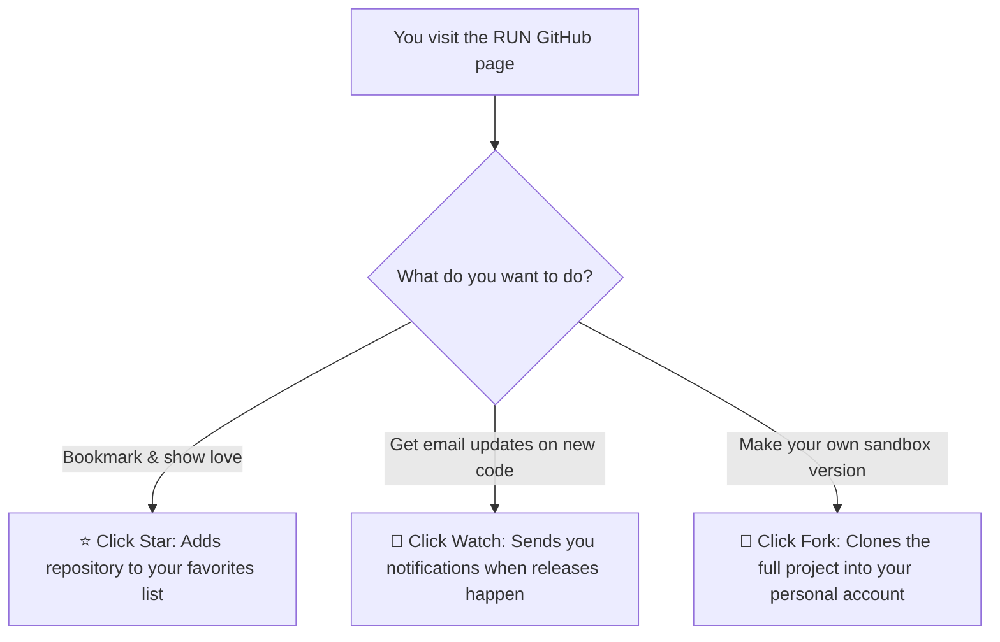

# Stars, Watchers & Forks Explained

**Topic:** GitHub Community Metrics & Interactions  
**Metaphor:** "Gold Star Stickers, Lookout Binoculars & Blueprint Photocopies"  

---

## 🌟 The Top-Right Magic Trio

At the very top right of every GitHub repository, you will see three little buttons with numbers next to them:

```
┌────────────────────────────────────────────────────────────────────────┐
│                   THE GITHUB REACTION BUTTONS                          │
├───────────────────┬───────────────────┬────────────────────────────────┤
│  ⭐ STAR (0)      │  👀 WATCH (0)     │  🍴 FORK (0)                   │
├───────────────────┼───────────────────┼────────────────────────────────┤
│  "I love this!"   │  "Keep me posted!"│  "Give me a copy to play with!"│
│  (Fan Club Gold   │  (Lookout Tower   │  (Blueprint Photocopy          │
│   Sticker)        │   Binoculars)     │   Machine)                     │
└───────────────────┴───────────────────┴────────────────────────────────┘
```

---

## 🔍 How Each Button Works



### 1. ⭐ Stargazers (Stars)

- **5th-Grader Analogy:** Putting a shiny gold star sticker next to your favorite drawing on the classroom bulletin board.
- **What it does:** It bookmarks the project in your personal GitHub account and tells the creators that you appreciate their hard work.
- **How to use it:** Just click **Star**! It is 100% free and takes 1 second.

### 2. 👀 Watchers (Watch Notifications)

- **5th-Grader Analogy:** Standing in a treehouse lookout tower with a pair of binoculars to watch for arriving supply ships.
- **What it does:** GitHub will send you email alerts whenever someone releases a new version, posts a major announcement, or opens new discussions.
- **Options:**
  - *All Activity:* Alerts for every commit and discussion.
  - *Participating and @mentions:* Only alerts when someone talks directly to you.
  - *Ignore:* Never send emails.

### 3. 🍴 Forks (Forking)

- **5th-Grader Analogy:** Taking the master LEGO building instructions and running them through a magical color photocopy machine.
- **What it does:** Creates an exact duplicate of the entire codebase inside your own GitHub profile (`<repository-url>/fork`).
- **Why it's awesome:** You can freely change colors, experiment with new 3D models, or break things without affecting the main factory!

---

## 📊 Where to See the Community Numbers

In the top right navigation bar of the repository:
- **Stargazers:** Click on the star count to see all the friendly people who gave a star.
- **Watchers:** Click on the watch count to see who is actively keeping an eye on updates.
- **Forks Tree:** Click on the fork count to see all community copies and remixes across GitHub.
