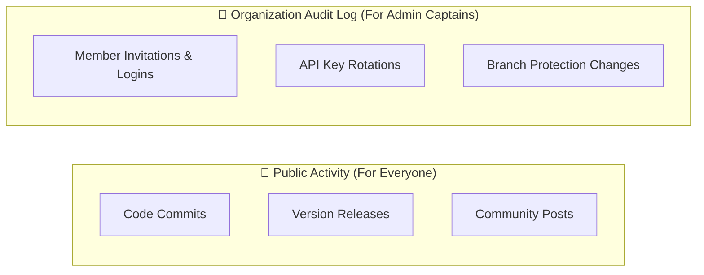

# Activity Stream & Organization Audit Logs

**Topic:** Repository History, Insights & Governance Logs  
**Metaphor:** "The Factory Diary & High-Security Footstep Tracker"  

---

## 🕵️ The Footstep Tracker & Factory Diary

Every time a tailor cuts a piece of fabric, a master builder adds a Lego brick, or a guard locks a gate, they write down what they did in the **Factory Diary**.

On GitHub, this is called the **Activity Stream** and the **Organization Audit Log**. They make sure that nothing ever happens in secret, every change can be verified, and mistakes can always be undone!

```
┌────────────────────────────────────────────────────────────────────────┐
│                   THE GITHUB ACTIVITY STREAM SCREEN                    │
├────────────────────────────────────────────────────────────────────────┤
│  📅 TODAY                                                              │
│  ├── 🟢 hateem2121 pushed commit `82ae602` to `main`                   │
│  ├── 🤖 GitHub Actions verified all 8 CI check runs (100% Green)       │
│  ├── 🔀 Merged Pull Request #42: "Add 3D Speed Suit Configurator"     │
│  └── 🛡️ CodeQL Security Scanner completed weekly code audit (0 alerts) │
└────────────────────────────────────────────────────────────────────────┘
```

---

## 🔍 Activity Stream vs Organization Audit Log



### 1. The Public Activity Stream

- **What it shows:** Every code change, branch merge, and release published to the world.
- **Where to see it:** Click on [Activity](https://github.com/hateem2121/RUN/activity) in the repository menu or right sidebar.
- **Why it matters:** It lets community members see that the project is actively alive, well-maintained, and constantly improving.

### 2. The Organization Audit Log

- **What it shows:** High-security events such as permission changes, secret rotations, billing updates, and security team actions.
- **Where to see it:** Located in organization settings (`settings/audit-log`).
- **Why it matters:** Guarantees enterprise compliance and ensures that no unauthorized changes can ever be made to production systems.
