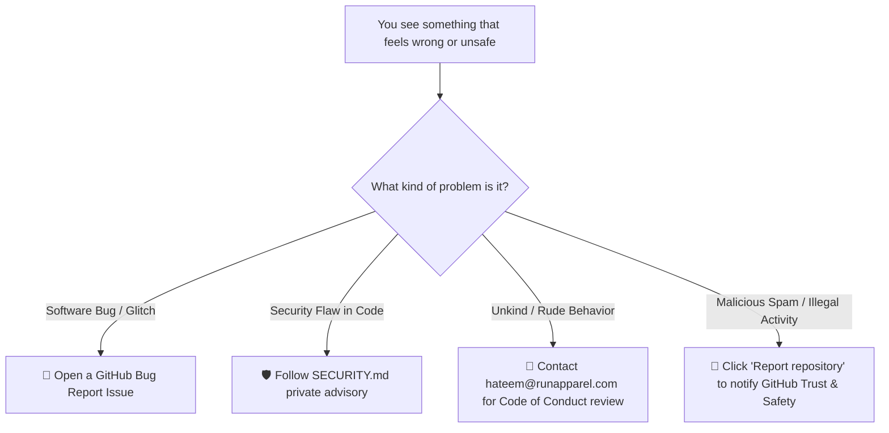

# Reporting a Repository & Trust & Safety

**Topic:** Safety, Compliance & Emergency Reporting  
**Metaphor:** "The Emergency Red Button & The Whistleblower Box"  

---

## 🚨 The Emergency Red Button

Just like every train car and school hallway has a red emergency alarm for urgent safety situations, GitHub provides a direct reporting line called **"Report repository"** in the bottom right of every project sidebar.

```
┌────────────────────────────────────────────────────────────────────────┐
│                   THE EMERGENCY REPORTING DECISION TREE                │
├───────────────────────────────────┬────────────────────────────────────┤
│  🟢 TALK TO US FIRST:             │  🔴 HIT THE RED BUTTON (GitHub):   │
├───────────────────────────────────┼────────────────────────────────────┤
│  • You found a code bug           │  • Someone posted illegal content  │
│  • You found a security flaw      │  • Malicious malware / viruses     │
│  • Someone was mean in discussions│  • Severe copyright infringement   │
│  • General questions or feedback  │  • Dangerous spam or hate speech   │
│                                   │                                    │
│  ► Email: hateem@runapparel.com   │  ► Click "Report repository" link  │
└───────────────────────────────────┴────────────────────────────────────┘
```

---

## 🧭 How to Handle Concerns



### When to Use "Report repository"

If you ever encounter content on GitHub that violates international law, contains malicious malware, or engages in abusive spam:
1. Click [Report repository](https://github.com/contact/report-content?content_url=https%3A%2F%2Fgithub.com%2FRUN-APPAREL%2FRUN&report=RUN-APPAREL+%28user%29).
2. Choose the specific violation category.
3. Submit the report directly to GitHub's Trust & Safety officers for swift review.

For all other everyday software questions and friendly community concerns, our team is always ready to help you directly in our community channels or via email!
