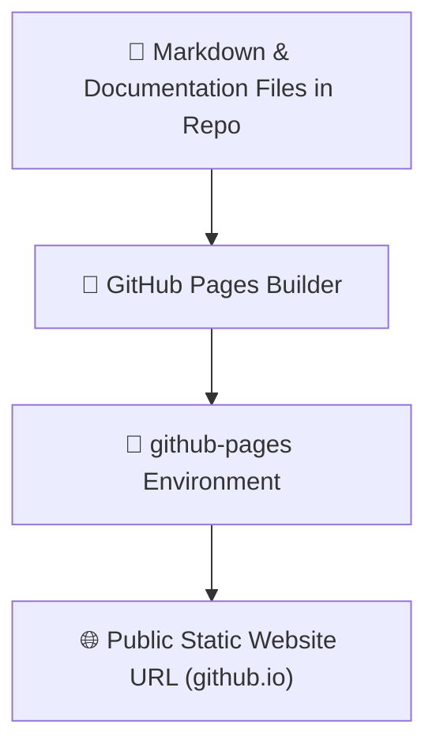

# Deployments, Environments & GitHub Pages Explained

**Topic:** GitHub Deployments, Environment Tracking & GitHub Pages  
**Metaphor:** "The Public Display Stage, The Testing Sandbox & The Magical Printing Press"  

---

## 🚀 What Is a Deployment in GitHub

When software engineers write code, it lives inside files like recipes in a cookbook. But a recipe isn't dinner until you cook it and serve it on a table!

A **Deployment** is the process of taking the code from the repository workshop and putting it on a live web server (the dinner table) where real people across the world can open their browsers and use it!

```
┌────────────────────────────────────────────────────────────────────────┐
│                   THE WORKSHOP TO LIVE STAGE JOURNEY                   │
├────────────────────────────────────────────────────────────────────────┤
│                                                                        │
│   [ 💻 The Code Workshop ] ────────► [ 🤖 The Build Factory ]          │
│   Raw code & 3D models               Automated tests & bundling        │
│                                                     │                  │
│                                                     ▼                  │
│                                                                        │
│   [ 🌍 The Public Web ]    ◄──────── [ 🚀 The Live Deployment ]        │
│   Athletes & team managers           Placed on a live server stage     │
│   visit the website                  (Environment: production / pages) │
│                                                                        │
└────────────────────────────────────────────────────────────────────────┘
```

---

## 🌐 What Is `github-pages`

When you see a deployment named **`github-pages`** (at `https://github.com/RUN-APPAREL/RUN/deployments/github-pages`), you are looking at GitHub's built-in, free web-hosting machine!



### 5th-Grader Analogy: The School Newspaper Printing Press

- **The Code:** The articles, drawings, and comic strips written by students.
- **GitHub Pages:** A magical printing press in the library that turns those articles into a colorful school newspaper and hangs it on the school's public bulletin board for everyone to read!

---

## 🔍 How to Read the Deployments Screen

On the right sidebar of the GitHub repository (under **Deployments**) or at `<repository-url>/deployments`, you can see the history of every time the website was updated:

```
┌────────────────────────────────────────────────────────────────────────┐
│                   GITHUB DEPLOYMENTS DASHBOARD                         │
├────────────────────────────────────────────────────────────────────────┤
│  🟢 ACTIVE DEPLOYMENT                                                  │
│  Environment: github-pages                                             │
│  Status: Deployed 2 hours ago by github-actions[bot]                   │
│  Commit: `82ae602` — "docs(wiki): update visual diagrams"             │
│                                                                        │
│  📜 DEPLOYMENT ACTIVITY LOG                                            │
│  ├── 🟢 Deployed version v4.1.2 to production                          │
│  ├── 🟢 Deployed docs preview to staging                               │
│  └── 🟢 Deployed static handbook to github-pages                       │
└────────────────────────────────────────────────────────────────────────┘
```

---

## 🏢 Static Pages vs Full-Stack Factory App

It helps to understand the two different kinds of deployments in the RUN Remix world:

| Deployment Type | Example | What It Runs On | Who Uses It |
|-----------------|---------|-----------------|-------------|
| 📄 **Static Docs (`github-pages`)** | Handbooks, Wiki exports, API specifications | GitHub's global static web servers | Readers, students, and open-source contributors |
| 🏬 **Full-Stack App (Production)** | Live 3D Garment Configurator, Express API, Neon DB | Google Cloud Run / Kubernetes / Port 5002 | Real B2B sports teams placing 10,000+ garment orders |

---

## 💡 Key Takeaway

Whenever you click on **Deployments** or `github-pages` on GitHub:
- You are checking the **health and history** of where the project's web pages are running.
- A green checkmark 🟢 means the live website is up and running happily with zero hiccups!
