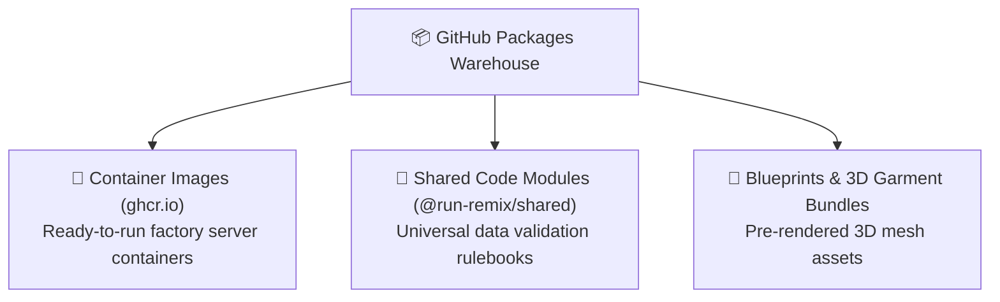

# GitHub Packages & Container Registries Explained

**Topic:** GitHub Packages, Container Registries & Software Distribution  
**Metaphor:** "The Factory Parts Warehouse & Pre-Packaged Toolboxes"  

---

## 📦 What Is GitHub Packages

When engineers build a complex machine like an athletic sportswear factory website, they don't craft every tiny screw, button, and gear from scratch. Instead, they organize reusable parts into **Packages** (like pre-sorted Lego kits) and store them in a warehouse!

**GitHub Packages** (located at `<repository-url>/packages` or `https://github.com/orgs/RUN-APPAREL/packages`) is GitHub's secure, global distribution warehouse for software packages, container images, and reusable libraries.

```
┌────────────────────────────────────────────────────────────────────────┐
│                   THE SOFTWARE PARTS WAREHOUSE                         │
├────────────────────────────────────────────────────────────────────────┤
│                                                                        │
│   [ 🏭 RUN Factory Source ] ────────► [ 📦 Package Warehouse ]         │
│   Code in server/ and shared/         Pre-bundled into neat containers │
│                                                     │                  │
│                                                     ▼                  │
│                                                                        │
│   [ 🌍 Other Developers ]  ◄──────── [ 🚚 Fast Global Download ]       │
│   Install with `docker pull`          Delivered over high-speed CDNs   │
│   or `npm install @run-remix/...`                                      │
│                                                                        │
└────────────────────────────────────────────────────────────────────────┘
```

---

## 🔍 The Types of Packages We Store



### 1. 🐳 Container Images (`ghcr.io`)

- **5th-Grader Analogy:** A giant shipping container packed with a complete mini-factory that is ready to plug in and turn on anywhere in the world.
- **How it works:** Our automated robots package the entire RUN Remix website into a Docker image and publish it to the GitHub Container Registry.
- **Example command:**

  ```bash
  docker pull ghcr.io/run-apparel/run-server:v4.1.2
  ```

### 2. 📜 Shared Code Modules (`@run-remix/shared`)

- **5th-Grader Analogy:** A printed dictionary of sports clothing rules that both the storefront designers and the database kitchen staff share.
- **How it works:** All data shapes, size charts, and fabric rules live in `@run-remix/shared` so other applications can import them safely.

---

## 🖥️ How to Explore the Packages Page

When you visit the Packages tab on GitHub:

```
┌────────────────────────────────────────────────────────────────────────┐
│                   GITHUB PACKAGES EXPLORER                             │
├────────────────────────────────────────────────────────────────────────┤
│  📦 1. `run-server` (Docker Container)                                 │
│     Published by github-actions[bot] • 4.1.2 • 12.4k downloads         │
│     `docker pull ghcr.io/run-apparel/run-server:4.1.2`                 │
│                                                                        │
│  📦 2. `@run-remix/shared` (npm Package)                               │
│     Published by hateemjamshaid • 4.1.2 • 5.1k downloads               │
│     `npm install @run-remix/shared`                                    │
└────────────────────────────────────────────────────────────────────────┘
```

---

## 💡 Key Takeaway

GitHub Packages turns the factory's hard work into **ready-to-use building blocks** that any developer, student, or sportswear partner can download and run with a single command!
