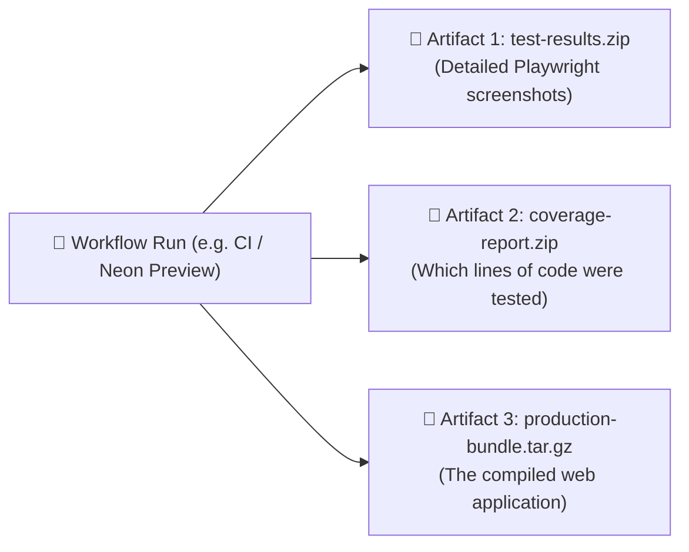

# GitHub Actions, Workflows & Artifacts Explained

**Topic:** GitHub Actions, Automated CI/CD Pipelines & Build Artifacts  
**Metaphor:** "The 24/7 Robot Assembly Line & Conveyor Belt Quality Inspection"  

---

## 🤖 What Is GitHub Actions

Imagine having a crew of super-fast, tireless robot inspectors stationed along a factory conveyor belt. Every time an engineer saves a piece of code or submits a new feature, the robots spring into action:

1. They turn on virtual computers in the cloud.
2. They compile and build the software.
3. They run thousands of automated safety tests.
4. If everything is green, they pack up the finished files into neat download boxes!

That is **GitHub Actions** (located at `<repository-url>/actions`)!

```
┌────────────────────────────────────────────────────────────────────────┐
│                   THE AUTOMATED ROBOT CONVEYOR BELT                    │
├────────────────────────────────────────────────────────────────────────┤
│                                                                        │
│   [ 💾 New Commit / PR ] ──► [ 🧪 1. Lint & Format ] (Biome)          │
│                                           │                            │
│                                           ▼                            │
│                              [ 🛡️ 2. Security Scan ] (CodeQL/Zizmor)   │
│                                           │                            │
│                                           ▼                            │
│                              [ ⚡ 3. Automated Tests ] (Vitest 2.6k)   │
│                                           │                            │
│                                           ▼                            │
│   [ 📦 Download Artifacts ] ◄ [ 🎁 4. Bundle Build ] (Turborepo)       │
│                                                                        │
└────────────────────────────────────────────────────────────────────────┘
```

---

## 🎁 What Are Artifacts

When a robot finishes inspecting a batch of code, it produces physical proof of its work. These proof packages are called **Artifacts**!



### 5th-Grader Analogy: The Science Fair Trophy Box

- When you finish building a robot at the school science fair, the judges give you a scorecard, photos of your robot in action, and a prize ribbon.
- An **Artifact** is that exact bundle of scorecards and photos, neatly saved in a zip file at the bottom of the GitHub Actions page so you can download and inspect it!

---

## 🛠️ RUN Remix's Live Workflows

Here are the actual robot helpers guarding the RUN Remix repository:

| Workflow File | What It Does | Who Runs It |
|---------------|--------------|-------------|
| [`.github/workflows/ci.yml`](file:///Users/hateemjamshaid/Sites/RUN/.github/workflows/ci.yml) | Runs TypeScript, Biome, Vitest suites, and builds client & server | On every Pull Request and push to `main` |
| [`.github/workflows/security.yml`](file:///Users/hateemjamshaid/Sites/RUN/.github/workflows/security.yml) | Scans for vulnerable dependencies and network egress leaks | Runs daily and on code changes |
| [`.github/workflows/workflow-security.yml`](file:///Users/hateemjamshaid/Sites/RUN/.github/workflows/workflow-security.yml) | Runs `zizmor` static analysis to ensure robot scripts are secure | Continuous security gate |
| [`.github/workflows/release-drafter.yml`](file:///Users/hateemjamshaid/Sites/RUN/.github/workflows/release-drafter.yml) | Automatically drafts release notes from merged pull requests | On push to `main` |
| [`.github/workflows/wiki-sync.yml`](file:///Users/hateemjamshaid/Sites/RUN/.github/workflows/wiki-sync.yml) | Publishes `docs/wiki/` to the GitHub Wiki tab | When documentation changes |

---

## 🔍 How to Read the Actions Screen

```
┌────────────────────────────────────────────────────────────────────────┐
│                   GITHUB ACTIONS WORKFLOW RUNS                         │
├────────────────────────────────────────────────────────────────────────┤
│  🟢 CI / Neon Preview  •  #142 by hateemjamshaid  •  1m 45s ago        │
│     ├── ✅ Typecheck & Lint (passed in 12s)                            │
│     ├── ✅ Vitest Unit Suite (2,642 tests passed in 18s)               │
│     └── ✅ Turborepo Build (passed in 35s)                             │
│                                                                        │
│  📦 Artifacts produced:                                                │
│     • `playwright-report.zip` (1.4 MB)                                 │
│     • `bundle-analysis.json` (45 KB)                                   │
└────────────────────────────────────────────────────────────────────────┘
```

---

## 💡 Key Takeaway

GitHub Actions is the **heartbeat of repository safety**. It guarantees that broken code, typos, or security holes are caught immediately before they can ever reach real athletes or customers!
