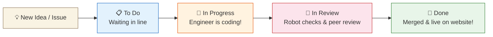

# GitHub Projects & Kanban Boards Explained

**Topic:** GitHub Projects, Kanban Boards & Agile Sprint Tracking  
**Metaphor:** "The Magnetic Whiteboard & Colorful Sticky Note Planning Table"  

---

## 📋 What Is GitHub Projects

Building a giant 3D garment factory software platform involves hundreds of tasks — from designing 3D jersey collars to configuring solar panel energy calculators. If everyone tried to remember their tasks in their head, things would get lost!

**GitHub Projects** (located at `<repository-url>/projects` or `https://github.com/orgs/RUN-APPAREL/projects`) is GitHub's visual project planning table. It organizes tasks, bug fixes, and feature ideas into colorful cards on a magnetic whiteboard.

```
┌────────────────────────────────────────────────────────────────────────┐
│                   THE 3-COLUMN KANBAN WHITEBOARD                       │
├───────────────────┬───────────────────┬────────────────────────────────┤
│  📋 TO DO (12)    │  🚧 IN PROGRESS(3)│  🎉 DONE (45)                  │
├───────────────────┼───────────────────┼────────────────────────────────┤
│  • Add rugby ball │  • 3D jersey zoom │  • React 19 migration          │
│    3D model       │    animations     │  • Express 5 rate limits       │
│  • Urdu language  │  • Dark mode logo │  • Neon database indexing      │
│    translation    │    contrast calibration│ • WCAG 2.2 AAA accessibility │
└───────────────────┴───────────────────┴────────────────────────────────┘
```

---

## 🧭 How Tasks Move Across the Board



---

## 🎨 Why Projects Are So Helpful

1. **Clear Ownership:** Every card shows who is currently building it (e.g. `@hateemjamshaid`).
2. **Prioritization:** The most important tasks sit right at the very top of the column.
3. **Roadmap Alignment:** Tasks link directly to milestones in our [`ROADMAP.md`](file:///Users/hateemjamshaid/Sites/RUN/ROADMAP.md) (e.g., Phase 1: Foundation Polish vs Phase 2: 3D Configurator v2).
4. **Automated Movement:** When an engineer opens a Pull Request that says `Fixes #42`, GitHub automatically slides the card from **In Progress** to **Done** the moment it merges!

---

## 💡 Key Takeaway

GitHub Projects keeps the whole team swimming in the exact same direction, making sure everyone knows **what is being built today, what is coming tomorrow, and what we celebrated finishing yesterday**!
