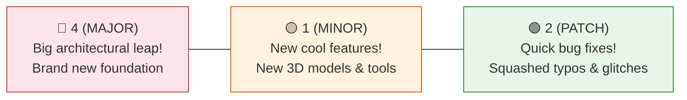

# Releases, Git Tags & Version Milestones Explained

**Topic:** GitHub Releases, Semantic Versioning & Release Drafter  
**Metaphor:** "The Official Ribbon-Cutting Ceremony & Wrapped Gift Box Shipping"  

---

## 🎁 What Is a Release in GitHub

When you write code on your computer, you save your progress every few minutes with a "commit" (like saving a game checkpoint). But when a major batch of awesome new features is finished and tested, we hold a special celebration called a **Release**!

A **Release** (located at `<repository-url>/releases`) is an official, numbered snapshot of the software (e.g. **`v4.1.2`**) packaged up with nice release notes, a list of contributors, and downloadable files.

```
┌────────────────────────────────────────────────────────────────────────┐
│                   THE SOFTWARE GIFT BOX & CELEBRATION                  │
├────────────────────────────────────────────────────────────────────────┤
│                                                                        │
│   [ 🧩 Hundreds of Commits ] ──► [ 🏷️ Git Tag: v4.1.2 ]                │
│   Small daily improvements       Stamped with immutable version marker │
│                                                     │                  │
│                                                     ▼                  │
│                                                                        │
│   [ 🌍 Downloadable Source ] ◄── [ 🎁 GitHub Release Page ]            │
│   `Source code.zip` & notes      Categorized changelog by robot helper │
│                                                                        │
└────────────────────────────────────────────────────────────────────────┘
```

---

## 🏷️ How Semantic Versioning Works (SemVer)

Software version numbers look like `4.1.2`. Here is what each number means:



---

## 🤖 Meet the Release Drafter Helper

In RUN Remix, we don't write release notes by hand at 2:00 AM. Instead, our robot helper **Release Drafter** ([`.github/release-drafter.yml`](file:///Users/hateemjamshaid/Sites/RUN/.github/release-drafter.yml)) reads every merged pull request label and writes the release notes automatically:

```
┌────────────────────────────────────────────────────────────────────────┐
│                   WHAT A RELEASE CARD LOOKS LIKE                       │
├────────────────────────────────────────────────────────────────────────┤
│  🏷️ RUN Remix v4.1.2 (Latest Release)                                  │
│                                                                        │
│  🚀 FEATURES & ENHANCEMENTS                                            │
│  • Added real-time 3D jersey configurator (#104) @hateemjamshaid       │
│  • Added GOTS certified organic fabric catalog (#108)                  │
│                                                                        │
│  🐛 BUG FIXES                                                          │
│  • Fixed dark-mode logo contrast in top ceiling notch navbar (#112)    │
│  • Fixed mobile viewports horizontal scroll leak on 320px screens (#115)│
│                                                                        │
│  📦 ASSETS & DOWNLOADS                                                 │
│  • Source code (zip) • Source code (tar.gz)                            │
└────────────────────────────────────────────────────────────────────────┘
```

---

## 💡 Key Takeaway

A GitHub Release is the **finish line of a sprint**. It gives users, developers, and B2B sportswear clients a stable, trusted version of the platform that has passed all safety gates!
