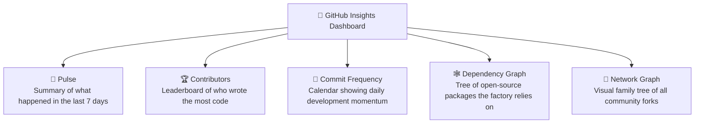

# Insights, Graphs, Pulse & Network Explained

**Topic:** GitHub Insights, Pulse Analytics, Contributor Leaderboards & Dependency Graphs  
**Metaphor:** "The Factory Health Electrocardiogram & Hall of Fame Leaderboard"  

---

## 💓 What Is GitHub Pulse & Insights

If you want to know if a factory is healthy, vibrant, and energetic, you look at its activity!

The **Insights & Pulse** tab (located at `<repository-url>/pulse` and `<repository-url>/graphs/contributors`) is the factory's live electrocardiogram and health monitor. It tracks every commit, code review, conversation, and bug fix across the entire project.

```
┌────────────────────────────────────────────────────────────────────────┐
│                   THE FACTORY HEALTH PULSE MONITOR                     │
├────────────────────────────────────────────────────────────────────────┤
│                                                                        │
│   📈 14 active pull requests merged      🐛 28 issues closed           │
│   🔨 128 commits pushed to main          👨‍💻 4 core active builders     │
│                                                                        │
│   PULSE ACTIVITY: ──/\_/\/\__/\/\/\___/\__ (High Energy & Healthy!)     │
│                                                                        │
└────────────────────────────────────────────────────────────────────────┘
```

---

## 📊 The 5 Big Insight Screens



---

## 🏆 The Contributors Hall of Fame

Under `Graphs > Contributors`, GitHub ranks all developers who helped make the factory better:

```
┌────────────────────────────────────────────────────────────────────────┐
│                   CONTRIBUTOR LEADERBOARD SNAPSHOT                     │
├───────┬──────────────────────┬────────────────────┬────────────────────┤
│ Rank  │ Maintainer / Builder │ Commits            │ Lines of Code      │
├───────┼──────────────────────┼────────────────────┼────────────────────┤
│ 🥇 1  │ @hateemjamshaid      │ 450+ commits       │ 120,000+ lines     │
│ 🥈 2  │ @github-actions[bot] │ 180+ sync runs     │ Automated tools    │
│ 🥉 3  │ Open Source Builders │ PR contributions   │ Community features │
└───────┴──────────────────────┴────────────────────┴────────────────────┘
```

---

## 🕸️ The Dependency Graph & Supply Chain Security

Under `Insights > Dependency graph`, GitHub lists every single open-source library that powers RUN Remix:
- **Direct Dependencies:** React 19, Express 5, Vite 8, Drizzle ORM, Tailwind CSS v4.
- **Security Watchdogs:** Dependabot scans this graph 24/7. If any library announces a known vulnerability, Dependabot instantly alerts our maintainers so a patch can be applied before anyone is affected.

---

## 💡 Key Takeaway

The **Insights** tab proves that RUN Remix is an **active, transparent, secure, and thriving** open-source project. Anyone can inspect our pulse and verify our engineering health in real time!
