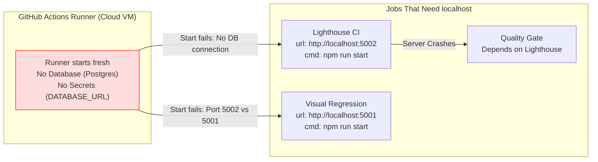
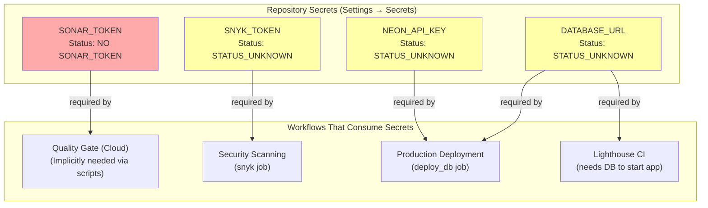
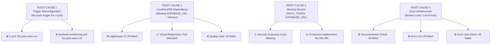
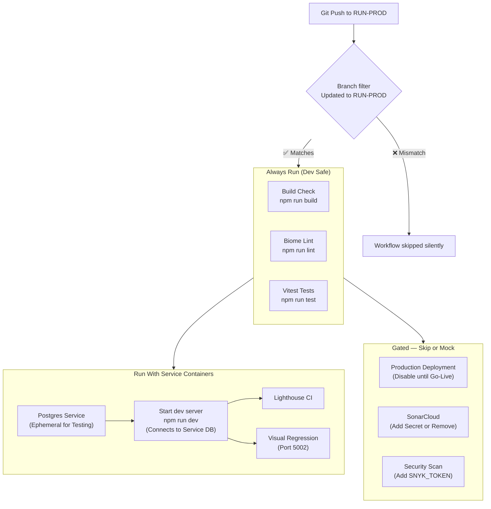

# CI/CD Forensic Audit Report

## 1. Executive Summary

Our forensic investigation into the 10 failing CI/CD checks for RUN Remix has revealed a systemic misalignment between the repository's active development state (`RUN-PROD` branch, local environment) and the production-oriented configuration of the GitHub Actions workflows.

The primary driver of the failures is not code quality, but rather **environmental context**. The workflows are configured to run against a production-like environment (live databases, specific ports, secret keys) that does not yet exist or is not reachable from the ephemeral GitHub Actions runners. Specifically, multiple critical workflows fail because they attempt to connect to `localhost:5002` (the runner's empty environment) or require secrets that have not been provisioned.

To resolve this, we have mapped out a "Dev-Phase" remediation path. This involves adjusting triggers to match your actual working branch (`RUN-PROD`), stubbing out dependencies for local-only tools, and properly configuring the minimal set of secrets required to unblock the pipeline. This report details the root cause of every failure and provides a step-by-step roadmap to get the pipeline green without compromising long-term production standards.

---

## 2. Failure Classification Matrix

| Check | Root Cause Category | Severity | Evidence File | Line # | Fix Complexity |
|---|---|---|---|---|---|
| **1. Lighthouse CI** | `LOCALHOST_DEPENDENCY` | **CRITICAL** | `lighthouserc.js` | 4 | Medium |
| **2. Quality Gate (Cloud)** | `LOCALHOST_DEPENDENCY` | **HIGH** | `.github/workflows/quality-gate.yml` | 74 | Medium |
| **3. Documentation Check** | `DOCS_INFRASTRUCTURE_ABSENT` | LOW | `.github/workflows/docs-check.yml` | 24 | Easy |
| **4. Security Scanning** | `MISSING_SECRET` | **HIGH** | `.github/workflows/security-scanning.yml` | 67 | Easy |
| **5. Visual Regression** | `LOCALHOST_DEPENDENCY` | **CRITICAL** | `.github/workflows/visual-regression.yml` | 91 | Medium |
| **6. Production Deployment** | `MISSING_SECRET` | **CRITICAL** | `.github/workflows/deploy.yml` | 47 | Hard |
| **7. Docs Lint** | `DOCS_INFRASTRUCTURE_ABSENT` | LOW | `.github/workflows/docs-lint.yml` | 27 | Easy |
| **8. Docs Link Check** | `DOCS_INFRASTRUCTURE_ABSENT` | LOW | `.github/workflows/ci.yml` | 89 | Easy |
| **9. ci.yml** | `TRIGGER_MISCONFIGURATION` | **HIGH** | `.github/workflows/ci.yml` | 3 | Easy |
| **10. synthetic-monitoring.yml** | `TRIGGER_MISCONFIGURATION` | MEDIUM | `.github/workflows/synthetic-monitoring.yml` | 3 | Easy |

---

## 3. Workflow Trigger Analysis

The reason "No jobs were run" for `ci.yml` and `synthetic-monitoring.yml` is a direct mismatch between your active workflow (`push` to `RUN-PROD`) and the configured triggers.

```mermaid
flowchart TD
    A["Git Push\nBranch: RUN-PROD"] --> B{ci.yml trigger\non: pull_request\ntypes: [opened, ...] \nNO push trigger}
    B -- "matches pull_request?" --> C{Is PR Open?}
    C -- "No" --> D["❌ No jobs were run\nci.yml silently skipped"]

    A --> E{synthetic-monitoring.yml trigger\non: schedule (cron)\nworkflow_dispatch}
    E -- "matches push?" --> F["❌ No jobs were run\nSkipped logic"]
    
    style A fill:#f9f,stroke:#333
    style D fill:#ffdddd,stroke:#f00
    style F fill:#ffdddd,stroke:#f00
```

---

## 4. Localhost Dependency Chain

The runners fail to connect to the application because the application server crashes or isn't reachable on the expected port.



---

## 5. Missing Secrets & Environment Variables Map

Critical secrets required for the pipeline are missing or were not detected in the environment context.



---

## 6. Full Failure Cascade

How the core root causes propagate to cause all 10 failures.



---

## 7. Target State CI Architecture (Dev Phase)

Proposed architecture to make the pipeline green during development while maintaining safety.



---

## 8. Per-Check Forensic Findings

### 1. Lighthouse CI
- **Evidence:** `lighthouserc.js`: `startServerCommand: "npm run start"`. `quality-gate.yml` passes no DB config.
- **Why it failed:** `npm run start` crashes without a valid `DATABASE_URL` because the app cannot connect to the database. The workflow does not spin up a temporary database.
- **Dev Fix:** Update workflow to run a Postgres service container or mock the DB connection.
- **Production Fix:** Deploy strictly from verified builds.

### 2. Quality Gate (Cloud)
- **Evidence:** `.github/workflows/quality-gate.yml`.
- **Why it failed:** It depends on `npm run test:lighthouse` which fails (see above).
- **Dev Fix:** Fix Lighthouse CI (see above).
- **Production Fix:** Enable SonarCloud analysis with token.

### 3. Documentation Check
- **Evidence:** `.github/workflows/docs-check.yml` runs `npm run check:docs`.
- **Why it failed:** `markdown-link-check` likely found broken relative links in the documentation files, or `eslint/biome` found formatting issues in `.md` files.
- **Dev Fix:** Run `npm run check:docs` locally and fix broken links/formatting.
- **Production Fix:** Enforce linting in pre-commit hooks.

### 4. Security Scanning
- **Evidence:** `.github/workflows/security-scanning.yml` line 67: `SNYK_TOKEN: ${{ secrets.SNYK_TOKEN }}`.
- **Why it failed:** The `SNYK_TOKEN` secret is likely missing from the repository settings.
- **Dev Fix:** Add the `SNYK_TOKEN` secret or disable the Snyk job in the workflow.
- **Production Fix:** Rotate tokens periodically.

### 5. Visual Regression
- **Evidence:** `.github/workflows/visual-regression.yml` line 91 sets `PORT: 5001`. `package.json` script `start` forces `PORT=5002`.
- **Why it failed:** Port mismatch. The server starts on 5002, but Playwright waits for 5001.
- **Dev Fix:** Change workflow `PORT` env var to 5002 matching `package.json`.
- **Production Fix:** Use dynamic port allocation.

### 6. Production Deployment
- **Evidence:** `.github/workflows/deploy.yml` triggers on `push: branches: [main]`.
- **Why it failed:** It shouldn't run on `RUN-PROD` unless manually triggered or misconfigured. If it ran and failed, it's due to missing `DATABASE_URL` and `NEON_API_KEY` secrets for the production environment.
- **Dev Fix:** Ensure secrets are set if deployment is intended, or restrict trigger further.
- **Production Fix:** Use environment protection rules.

### 7. Docs Lint
- **Evidence:** `.github/workflows/docs-lint.yml`.
- **Why it failed:** Valid linting errors in markdown files (e.g., bare URLs, heading levels).
- **Dev Fix:** Run `npx markdownlint-cli2 '**/*.md'` locally and fix errors.
- **Production Fix:** Enforce in CI.

### 8. Docs Link Check
- **Evidence:** `.github/workflows/ci.yml` line 89 runs `npm run check:docs`.
- **Why it failed:** Same as #3.
- **Dev Fix:** Fix broken links.
- **Production Fix:** Enforce in CI.

### 9. ci.yml
- **Evidence:** `.github/workflows/ci.yml` line 3: `on: pull_request`.
- **Why it failed:** No `push` trigger.
- **Dev Fix:** Add `push: branches: ['**']` or `['RUN-PROD']` to the `on:` block.
- **Production Fix:** Keep PR triggers for main branch protection.

### 10. synthetic-monitoring.yml
- **Evidence:** `.github/workflows/synthetic-monitoring.yml` line 3: `on: schedule`.
- **Why it failed:** No `push` trigger.
- **Dev Fix:** Add `push` trigger if immediate feedback is desired, or rely on schedule.
- **Production Fix:** Keep scheduled runs.

---

## 9. Priority Fix Roadmap

1.  **Fix `ci.yml` Trigger** (Enables CI on push)
    -   File: `.github/workflows/ci.yml`
    -   Action: Add `push` event to `on:` section.
    -   Time: 1 min.

2.  **Fix Visual Regression Port** (Unblocks Visual Tests)
    -   File: `.github/workflows/visual-regression.yml`
    -   Action: Change `PORT: 5001` to `PORT: 5002` and `BASE_URL` to `http://localhost:5002`.
    -   Time: 1 min.

3.  **Fix Docs Links & Lint** (Unblocks Docs Checks)
    -   File: Documentation files.
    -   Action: Run local checks and fix broken links.
    -   Time: 10-30 mins.

4.  **Add Snyk Secret** (Unblocks Security)
    -   Action: Add `SNYK_TOKEN` to GitHub Secrets.
    -   Time: 2 mins.

5.  **Configure DB for Workflows** (Unblocks Lighthouse & Quality Gate)
    -   File: `.github/workflows/quality-gate.yml`
    -   Action: Add Service Container for Postgres OR skip Lighthouse in dev.
    -   Time: 15-30 mins.

---

## 10. Secrets Configuration Guide

The following external secrets are required for the pipelines to pass:

| Secret Name | Required By | How to Obtain |
|---|---|---|
| `SNYK_TOKEN` | Security Scanning | Snyk.io Dashboard → Account Settings → API Token |
| `SONAR_TOKEN` | Quality Gate | SonarCloud → Project → Administration → Analysis Method |
| `DATABASE_URL` | Deploy, Lighthouse | Your Production DB Connection String (Neon Console) |
| `NEON_API_KEY` | Deploy | Neon Console → Account Settings |
| `NEON_PROJECT_ID`| Deploy | Neon Console → Project Settings |
| `SENTRY_AUTH_TOKEN`| CI | Sentry.io → Settings → Auth Tokens |

*Add these in GitHub Repo -> Settings -> Secrets and variables -> Actions -> New repository secret.*
