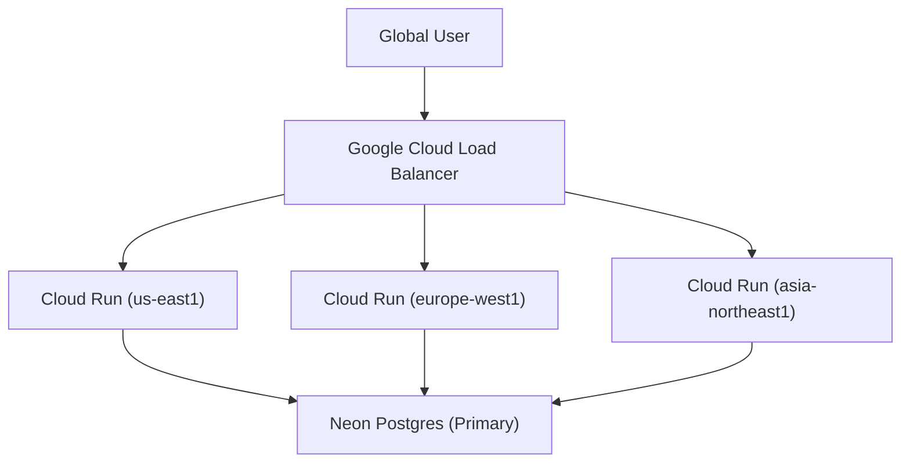

# Multi-Region Deployment Strategy 🌍

**Last Updated:** May 2026  
**Status:** Planned / Tier 1 Implemented

The RUN Remix platform is designed for global scalability with a multi-region deployment strategy to ensure low latency and high availability for B2B clients worldwide.

## 1. Phase 1: Current Architecture (Single Region + CDN)

-   **Compute**: Google Cloud Run in `us-east1`.
-   **Database**: Neon Postgres in `us-east-1` (AWS) to match Upstash/GCS proximity.
-   **CDN**: GCS multi-region bucket for global asset delivery.

## 2. Phase 2: Multi-Region Compute (Tier 2)

To reduce latency for European and Asian clients, we will deploy the API to multiple Cloud Run regions.

### Challenges & Solutions:
-   **Database Latency**: Since Neon is currently in `us-east-1`, European/Asian instances will have higher DB latency.
-   **Solution**: Implement Neon **Read Replicas** in target regions when they become available, or use **Neon Global Read-only Replicas**.

## 3. Session Synchronization

We use **Upstash Global Redis** to ensure sessions are available across all regions.

-   **Primary Region**: `us-east-1`.
-   **Replicas**: Automatically replicated to 2+ regions by Upstash.

## 4. Implementation Checklist

-   [x] Stateless Authentication (JWT/Session in Redis).
-   [x] Relative asset paths (CDN-ready).
-   [ ] GCLB Anycast IP configuration.
-   [ ] Region-aware database connection pooling.
-   [ ] Multi-region Health Checks.
