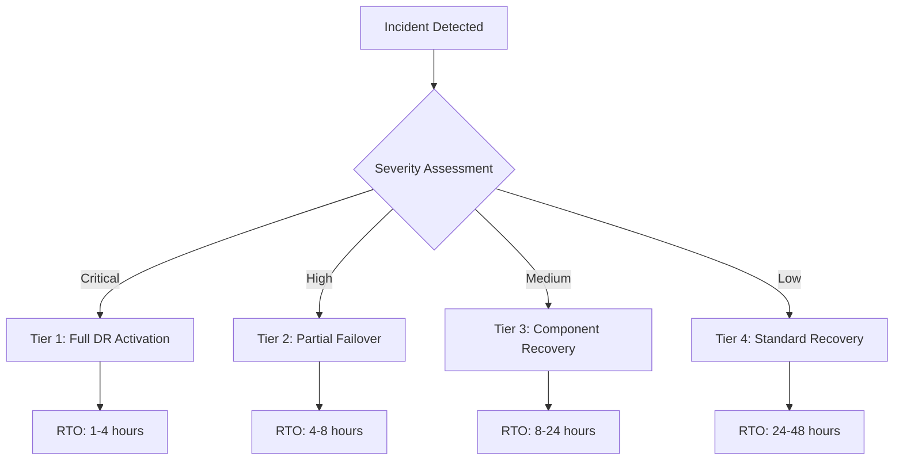
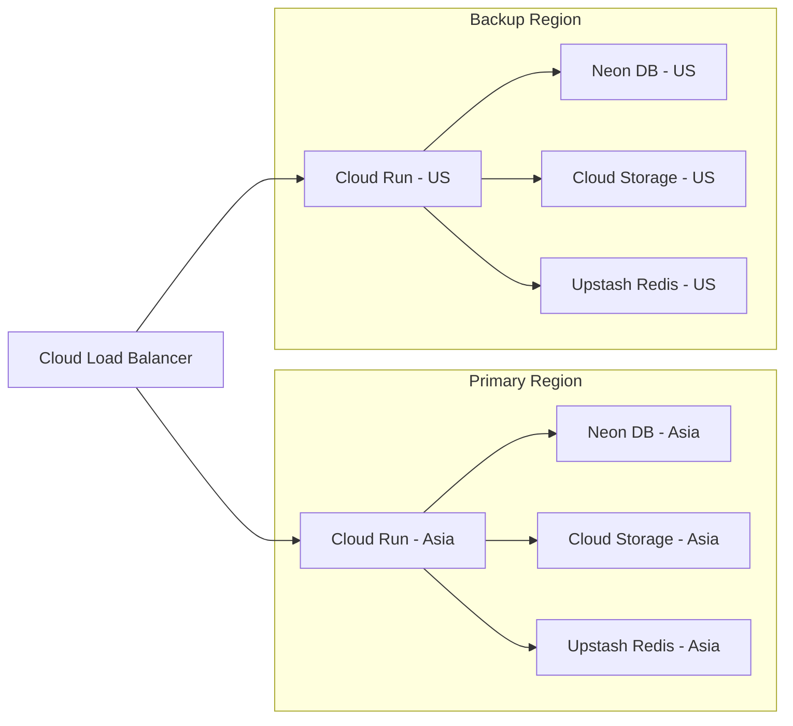
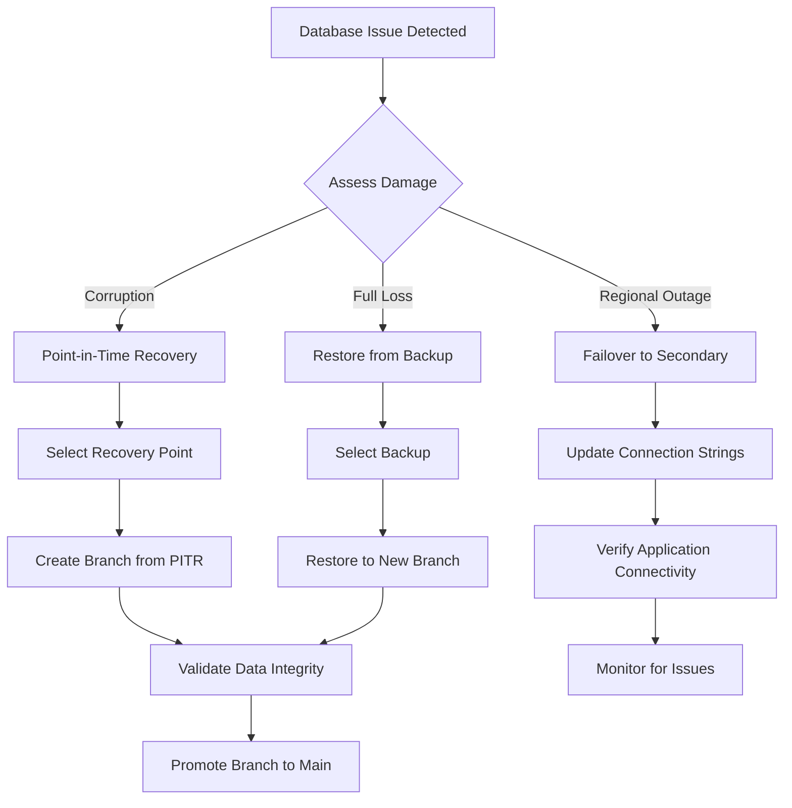

# Disaster Recovery Plan

## Overview

This document outlines the disaster recovery (DR) procedures for the RUN Remix platform, ensuring business continuity and minimal data loss in the event of a system failure, data corruption, or regional outage.

**Status:** Production Ready  
**Last Updated:** February 2026  
**Review Frequency:** Quarterly  
**Next Review:** May 2026

---

## Table of Contents

1. [Recovery Objectives](#recovery-objectives)
2. [Infrastructure Overview](#infrastructure-overview)
3. [Backup Strategy](#backup-strategy)
4. [Recovery Procedures](#recovery-procedures)
5. [Communication Plan](#communication-plan)
6. [Testing & Validation](#testing--validation)

---

## Recovery Objectives

### Key Metrics

| Metric | Target | Description |
|--------|--------|-------------|
| **RTO** (Recovery Time Objective) | 4 hours | Maximum time to restore full service |
| **RPO** (Recovery Point Objective) | 1 hour | Maximum acceptable data loss |
| **MTTR** (Mean Time To Recovery) | 2 hours | Average recovery time |
| **Uptime SLA** | 99.9% | Annual uptime commitment |

### Priority Tiers



### Tier Definitions

| Tier | Systems | RTO | RPO | Examples |
|------|---------|-----|-----|----------|
| **Tier 1** | Critical | 1-4 hours | 1 hour | Database, Authentication, Order Processing |
| **Tier 2** | Important | 4-8 hours | 4 hours | Product Catalog, Media Storage, Cache |
| **Tier 3** | Standard | 8-24 hours | 12 hours | Analytics, Reporting, Admin Panel |
| **Tier 4** | Low | 24-48 hours | 24 hours | Development Tools, Staging Environments |

---

## Infrastructure Overview

### Primary Infrastructure



### Component Inventory

| Component | Provider | Region | Backup Region |
|-----------|----------|--------|---------------|
| **Frontend** | Cloud Run | asia-southeast1 | us-central1 |
| **Backend API** | Cloud Run | asia-southeast1 | us-central1 |
| **Database** | Neon | AWS ap-southeast-1 | AWS us-east-1 |
| **Cache** | Upstash Redis | ap-southeast-1 | us-east-1 |
| **Media Storage** | Cloud Storage | asia-southeast1 | us-central1 |
| **CDN** | Cloud CDN | Global | N/A |
| **DNS** | Cloud DNS | Global | N/A |

---

## Backup Strategy

### Database Backups

#### Neon Serverless Postgres

Neon provides automatic backups with Point-in-Time Recovery (PITR):

```yaml
# Neon Backup Configuration
backup_settings:
  automated_backups: true
  retention_period: 30 days
  pitr_enabled: true
  pitr_retention: 7 days
  
  # Manual backup schedule
  manual_backups:
    - schedule: "0 2 * * *"  # Daily at 2 AM UTC
      type: full
      retention: 90 days
    - schedule: "0 2 * * 0"  # Weekly on Sunday
      type: full
      retention: 1 year
```

#### Backup Verification Script

```bash
#!/bin/bash
# scripts/verify-backups.sh

set -e

echo "Verifying Neon database backups..."

# Check latest backup timestamp
LATEST_BACKUP=$(neon backup list --project-id $NEON_PROJECT_ID --format json | jq -r '.[0].created_at')

# Calculate age in hours
BACKUP_AGE=$(( ($(date +%s) - $(date -d "$LATEST_BACKUP" +%s)) / 3600 ))

if [ $BACKUP_AGE -gt 25 ]; then
  echo "ERROR: Latest backup is $BACKUP_AGE hours old (threshold: 25 hours)"
  exit 1
fi

echo "SUCCESS: Latest backup is $BACKUP_AGE hours old"
```

### Media Storage Backups

#### Google Cloud Storage

```yaml
# Cloud Storage Backup Configuration
bucket: run-remix-media
backup_bucket: run-remix-media-backup

backup_settings:
  replication:
    type: dual-region
    regions:
      - asia-southeast1
      - us-central1
  
  versioning:
    enabled: true
    retention: 90 days
  
  lifecycle:
    - action: delete
      condition:
        age: 365 days
        isLive: false
```

### Application Configuration Backups

```bash
#!/bin/bash
# scripts/backup-config.sh

set -e

BACKUP_DIR="gs://run-remix-backups/config/$(date +%Y-%m-%d)"

# Backup environment configurations
gcloud secrets versions access latest --secret="run-remix-env" > .env.backup
gsutil cp .env.backup "$BACKUP_DIR/.env"

# Backup service account keys (rotated regularly)
gcloud secrets versions access latest --secret="run-remix-sa-key" > sa-key.backup
gsutil cp sa-key.backup "$BACKUP_DIR/sa-key.json"

# Backup Cloud Run service configurations
gcloud run services describe run-remix-api --region=asia-southeast1 --format=yaml > service-config.yaml
gsutil cp service-config.yaml "$BACKUP_DIR/service-config.yaml"

echo "Configuration backup completed: $BACKUP_DIR"
```

---

## Recovery Procedures

### Procedure 1: Database Recovery

#### Scenario: Database corruption or data loss



#### Step-by-Step: Point-in-Time Recovery

```bash
# 1. Identify the recovery point (before the incident)
RECOVERY_TIME="2026-02-14T10:00:00Z"

# 2. Create a new branch from the recovery point
neon branches create \
  --project-id $NEON_PROJECT_ID \
  --name "recovery-$(date +%Y%m%d-%H%M%S)" \
  --timestamp "$RECOVERY_TIME"

# 3. Get connection string for the recovery branch
RECOVERY_BRANCH_ID="br-recovery-xxxxx"
neon connection-string \
  --project-id $NEON_PROJECT_ID \
  --branch-id $RECOVERY_BRANCH_ID

# 4. Validate data in the recovery branch
psql $RECOVERY_CONNECTION_STRING -c "SELECT COUNT(*) FROM orders WHERE created_at > '$RECOVERY_TIME'"

# 5. If validation passes, promote to main
neon branches set-primary \
  --project-id $NEON_PROJECT_ID \
  --branch-id $RECOVERY_BRANCH_ID

# 6. Update application environment
gcloud run services update run-remix-api \
  --set-env-vars="DATABASE_URL=$NEW_CONNECTION_STRING" \
  --region=asia-southeast1
```

### Procedure 2: Application Recovery

#### Scenario: Cloud Run service failure

```bash
# 1. Check service status
gcloud run services describe run-remix-api --region=asia-southeast1

# 2. View recent revisions
gcloud run revisions list --service=run-remix-api --region=asia-southeast1

# 3. Rollback to previous revision if needed
gcloud run services update-traffic run-remix-api \
  --to-revisions=run-remix-api-00001=100 \
  --region=asia-southeast1

# 4. If rollback fails, redeploy from source
git clone https://github.com/hateem2121/RUN.git
cd RUN
git checkout production
npm ci
npm run build
gcloud run deploy run-remix-api \
  --source=./server \
  --region=asia-southeast1 \
  --platform=managed
```

### Procedure 3: Regional Failover

#### Scenario: Complete regional outage

```bash
# 1. Verify primary region is unavailable
gcloud run services describe run-remix-api --region=asia-southeast1 || echo "Primary region unavailable"

# 2. Activate secondary region
gcloud run services update run-remix-api \
  --region=us-central1 \
  --min-instances=2

# 3. Update DNS to point to secondary region
gcloud dns record-sets update api.wear-run.com \
  --zone=run-remix-zone \
  --type=A \
  --ttl=60 \
  --rrdatas="us-central1-run-remix-api-xxxxx-uc.a.run.app"

# 4. Update database connection to secondary
gcloud run services update run-remix-api \
  --region=us-central1 \
  --set-env-vars="DATABASE_URL=$SECONDARY_DB_URL"

# 5. Verify service health
curl -f https://api.wear-run.com/health || echo "Health check failed"

# 6. Notify stakeholders
./scripts/notify-failover.sh "US Central"
```

### Procedure 4: Cache Recovery

#### Scenario: Redis cache failure

```bash
# 1. Check Redis status
upstash redis ping --url $REDIS_URL

# 2. If cache is corrupted, flush and rebuild
upstash redis flushall --url $REDIS_URL

# 3. Warm up cache with critical data
curl -X POST https://api.wear-run.com/admin/cache/warm \
  -H "Authorization: Bearer $ADMIN_TOKEN"

# 4. Verify cache hit rate
curl https://api.wear-run.com/metrics/cache | jq '.hit_rate'
```

---

## Communication Plan

### Incident Severity Levels

| Level | Description | Response Time | Notification |
|-------|-------------|---------------|--------------|
| **SEV1** | Complete service outage | 15 minutes | All stakeholders + SMS |
| **SEV2** | Major feature unavailable | 30 minutes | Technical team + Email |
| **SEV3** | Degraded performance | 2 hours | Technical team |
| **SEV4** | Minor issue | 24 hours | On-call engineer |

### Notification Templates

#### SEV1: Complete Outage

```
🚨 INCIDENT ALERT - SEV1 🚨

Service: RUN Remix Platform
Status: COMPLETE OUTAGE
Time: [TIMESTAMP]
Impact: All users affected

Current Actions:
- [ ] Incident commander assigned
- [ ] Root cause investigation started
- [ ] DR procedures initiated

Next Update: 30 minutes

Incident Channel: #incident-[ID]
Bridge: +92-336-1777313
```

#### SEV2: Major Degradation

```
⚠️ INCIDENT ALERT - SEV2 ⚠️

Service: RUN Remix Platform
Status: DEGRADED
Time: [TIMESTAMP]
Impact: [Specific feature] unavailable

Current Actions:
- [ ] Investigating root cause
- [ ] Workaround being implemented

Next Update: 1 hour

Incident Channel: #incident-[ID]
```

### Stakeholder Contact List

| Role | Name | Contact | Notification Method |
|------|------|---------|---------------------|
| Incident Commander | M. Hateem Jamshaid | +92-336-1777313 | SMS + Call |
| Technical Lead | [TBD] | [Contact] | SMS + Slack |
| DevOps | [TBD] | [Contact] | Slack |
| Business | [TBD] | [Contact] | Email |

---

## Testing & Validation

### DR Testing Schedule

| Test Type | Frequency | Scope | Duration |
|-----------|-----------|-------|----------|
| **Backup Verification** | Daily | Automated | 5 minutes |
| **Component Recovery** | Monthly | Single component | 1 hour |
| **Regional Failover** | Quarterly | Full failover | 4 hours |
| **Full DR Exercise** | Annually | Complete recovery | 8 hours |

### DR Test Checklist

```markdown
## Pre-Test Checklist
- [ ] Test window approved by stakeholders
- [ ] Backup verification completed
- [ ] Communication plan reviewed
- [ ] Rollback plan documented
- [ ] Monitoring dashboards ready

## Test Execution
- [ ] Simulate failure scenario
- [ ] Execute recovery procedure
- [ ] Verify RTO compliance
- [ ] Validate data integrity
- [ ] Test application functionality
- [ ] Document any issues

## Post-Test
- [ ] Update DR documentation
- [ ] Review and improve procedures
- [ ] Share results with stakeholders
- [ ] Schedule follow-up actions
```

### Validation Scripts

```bash
#!/bin/bash
# scripts/validate-recovery.sh

set -e

echo "Validating recovery..."

# 1. Database connectivity
echo "Testing database connectivity..."
psql $DATABASE_URL -c "SELECT 1" || { echo "FAILED: Database connection"; exit 1; }

# 2. API health check
echo "Testing API health..."
curl -f https://api.wear-run.com/health || { echo "FAILED: API health check"; exit 1; }

# 3. Authentication
echo "Testing authentication..."
TOKEN=$(curl -s -X POST https://api.wear-run.com/auth/login \
  -H "Content-Type: application/json" \
  -d '{"email":"test@wear-run.com","password":"test"}' | jq -r '.token')
[ -n "$TOKEN" ] || { echo "FAILED: Authentication"; exit 1; }

# 4. Order processing
echo "Testing order processing..."
ORDER_ID=$(curl -s -X POST https://api.wear-run.com/orders \
  -H "Authorization: Bearer $TOKEN" \
  -H "Content-Type: application/json" \
  -d '{"product_id":"test-product","quantity":1}' | jq -r '.id')
[ -n "$ORDER_ID" ] || { echo "FAILED: Order creation"; exit 1; }

# 5. Cache functionality
echo "Testing cache..."
CACHE_STATUS=$(curl -s https://api.wear-run.com/metrics/cache | jq -r '.status')
[ "$CACHE_STATUS" = "healthy" ] || { echo "FAILED: Cache status"; exit 1; }

echo "✅ All validation checks passed!"
```

---

## Recovery Time Estimates

| Scenario | Estimated Time | Confidence |
|----------|----------------|------------|
| Database PITR | 30-60 minutes | High |
| Database Full Restore | 1-2 hours | High |
| Application Rollback | 5-15 minutes | High |
| Application Redeploy | 15-30 minutes | High |
| Regional Failover | 1-2 hours | Medium |
| Full Platform Recovery | 2-4 hours | Medium |

---

## Appendix

### A. Emergency Contacts

| Service | Provider | Support Contact |
|---------|----------|-----------------|
| Neon Database | Neon | support@neon.tech |
| Cloud Run | Google Cloud | Google Cloud Support |
| Upstash Redis | Upstash | support@upstash.com |
| Cloud Storage | Google Cloud | Google Cloud Support |

### B. Useful Commands

```bash
# Quick status check
gcloud run services list --platform=managed

# Database branch list
neon branches list --project-id $NEON_PROJECT_ID

# Redis info
upstash redis info --url $REDIS_URL

# Storage bucket status
gsutil ls -L -b gs://run-remix-media

# DNS records
gcloud dns record-sets list --zone=run-remix-zone
```

### C. Related Documentation

- [Security Documentation](./security.md)
- [Multi-Region Deployment](./multi-region-deployment.md)
- [API Endpoints](../api/endpoints.md)
- [Developer Workflow](../guides/developer-workflow.md)

---

**Version:** 1.0.0 | **For:** M. Hateem Jamshaid @ RUN APPAREL (PVT) LTD