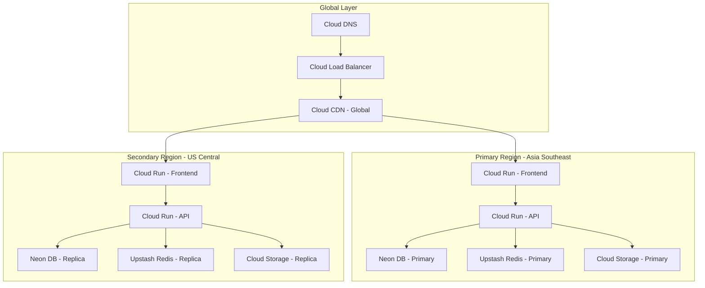
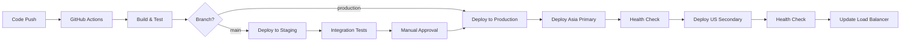
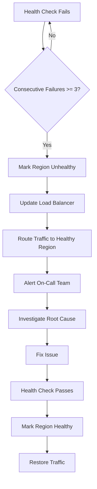

# Multi-Region Deployment

## Overview

This document outlines the multi-region deployment architecture for the RUN Remix platform, ensuring high availability, low latency, and disaster recovery capabilities for global B2B clients.

**Status:** Production Ready  
**Last Updated:** February 2026  
**Review Frequency:** Quarterly  
**Next Review:** May 2026

---

## Table of Contents

1. [Architecture Overview](#architecture-overview)
2. [Regional Configuration](#regional-configuration)
3. [Deployment Strategy](#deployment-strategy)
4. [Traffic Management](#traffic-management)
5. [Data Replication](#data-replication)
6. [Failover Procedures](#failover-procedures)
7. [Monitoring & Alerting](#monitoring--alerting)

---

## Architecture Overview

### Global Architecture Diagram



### Design Principles

| Principle | Implementation |
|-----------|----------------|
| **Active-Active** | Both regions serve traffic simultaneously |
| **Data Locality** | Users routed to nearest region |
| **Failover** | Automatic failover to healthy region |
| **Consistency** | Eventual consistency with conflict resolution |
| **Compliance** | Data residency per regional requirements |

---

## Regional Configuration

### Primary Region: Asia Southeast (Singapore)

```yaml
region: asia-southeast1
provider: Google Cloud Platform

services:
  frontend:
    name: run-remix-frontend
    min_instances: 2
    max_instances: 100
    memory: 512Mi
    cpu: 1
    
  api:
    name: run-remix-api
    min_instances: 2
    max_instances: 50
    memory: 1Gi
    cpu: 2

database:
  provider: Neon
  region: AWS ap-southeast-1
  type: primary
  read_replicas: 1
  
cache:
  provider: Upstash
  region: ap-southeast-1
  type: primary
  replication: true

storage:
  provider: Cloud Storage
  bucket: run-remix-media-asia
  class: STANDARD
  replication: dual-region
```

### Secondary Region: US Central (Iowa)

```yaml
region: us-central1
provider: Google Cloud Platform

services:
  frontend:
    name: run-remix-frontend-us
    min_instances: 1
    max_instances: 50
    memory: 512Mi
    cpu: 1
    
  api:
    name: run-remix-api-us
    min_instances: 1
    max_instances: 25
    memory: 1Gi
    cpu: 2

database:
  provider: Neon
  region: AWS us-east-1
  type: replica
  sync_mode: asynchronous
  
cache:
  provider: Upstash
  region: us-east-1
  type: replica
  replication: true

storage:
  provider: Cloud Storage
  bucket: run-remix-media-us
  class: STANDARD
  replication: dual-region
```

---

## Deployment Strategy

### CI/CD Pipeline



### Deployment Configuration

```yaml
# cloudbuild-multiregion.yaml
steps:
  # Build and test
  - name: 'node:24'
    entrypoint: 'npm'
    args: ['ci']
  
  - name: 'node:24'
    entrypoint: 'npm'
    args: ['run', 'test']
  
  - name: 'node:24'
    entrypoint: 'npm'
    args: ['run', 'build']
  
  # Deploy to Asia (Primary)
  - name: 'gcr.io/cloud-builders/gcloud'
    args:
      - 'run'
      - 'deploy'
      - 'run-remix-api'
      - '--image=gcr.io/$PROJECT_ID/run-remix-api:$COMMIT_SHA'
      - '--region=asia-southeast1'
      - '--platform=managed'
      - '--min-instances=2'
    waitFor: ['build']
  
  # Health check Asia
  - name: 'gcr.io/cloud-builders/curl'
    args: ['-f', 'https://asia.run-remix-api.example.com/health']
    waitFor: ['deploy-asia']
  
  # Deploy to US (Secondary)
  - name: 'gcr.io/cloud-builders/gcloud'
    args:
      - 'run'
      - 'deploy'
      - 'run-remix-api-us'
      - '--image=gcr.io/$PROJECT_ID/run-remix-api:$COMMIT_SHA'
      - '--region=us-central1'
      - '--platform=managed'
      - '--min-instances=1'
    waitFor: ['health-asia']
  
  # Health check US
  - name: 'gcr.io/cloud-builders/curl'
    args: ['-f', 'https://us.run-remix-api.example.com/health']
    waitFor: ['deploy-us']
  
  # Update load balancer
  - name: 'gcr.io/cloud-builders/gcloud'
    entrypoint: 'bash'
    args: ['./scripts/update-load-balancer.sh']
    waitFor: ['health-us']

timeout: '1800s'
```

### Blue-Green Deployment

```bash
#!/bin/bash
# scripts/blue-green-deploy.sh

set -e

REGION=$1
SERVICE_NAME=$2
NEW_REVISION=$3

echo "Starting blue-green deployment for $SERVICE_NAME in $REGION"

# Get current traffic split
CURRENT_TRAFFIC=$(gcloud run services describe $SERVICE_NAME \
  --region=$REGION \
  --format='value(status.traffic[0].percent)')

# Deploy new revision with 0% traffic
gcloud run deploy $SERVICE_NAME \
  --region=$REGION \
  --image=$NEW_REVISION \
  --no-traffic \
  --tag=green

# Run smoke tests against green
./scripts/smoke-test.sh $REGION green

# Gradual traffic shift: 10% -> 50% -> 100%
for percent in 10 50 100; do
  echo "Shifting $percent% traffic to green"
  
  gcloud run services update-traffic $SERVICE_NAME \
    --region=$REGION \
    --to-tags=green=$percent
  
  # Monitor for errors
  sleep 60
  ERROR_RATE=$(./scripts/get-error-rate.sh $REGION)
  
  if [ $(echo "$ERROR_RATE > 1.0" | bc) -eq 1 ]; then
    echo "Error rate too high: $ERROR_RATE%. Rolling back..."
    gcloud run services update-traffic $SERVICE_NAME \
      --region=$REGION \
      --to-revisions=$SERVICE_NAME-blue=100
    exit 1
  fi
done

echo "Blue-green deployment complete"
```

---

## Traffic Management

### Cloud Load Balancer Configuration

```yaml
# Global HTTP Load Balancer
name: run-remix-lb

# Backend services
backend_services:
  - name: run-remix-frontend-asia
    region: asia-southeast1
    health_check: /health
    timeout: 30s
    
  - name: run-remix-frontend-us
    region: us-central1
    health_check: /health
    timeout: 30s

# URL maps
url_maps:
  - path: /*
    backend: run-remix-frontend-asia
    weight: 70  # Primary region gets more traffic
    
  - path: /*
    backend: run-remix-frontend-us
    weight: 30

# Health checks
health_checks:
  - name: frontend-health
    protocol: HTTPS
    port: 443
    request_path: /health
    check_interval: 10s
    timeout: 5s
    healthy_threshold: 2
    unhealthy_threshold: 3
```

### Geographic Routing

```yaml
# Cloud DNS Geolocation Routing
dns_config:
  name: api.wear-run.com
  type: A
  ttl: 60
  
  routing_policy:
    type: GEO
    items:
      - location: asia-east1
        rrdatas:
          - asia.run-remix-api.example.com
      
      - location: asia-southeast1
        rrdatas:
          - asia.run-remix-api.example.com
      
      - location: us-central1
        rrdatas:
          - us.run-remix-api.example.com
      
      - location: us-east1
        rrdatas:
          - us.run-remix-api.example.com
      
      - location: europe-west1
        rrdatas:
          - us.run-remix-api.example.com  # Route to US for Europe
      
      - location: *
        rrdatas:
          - asia.run-remix-api.example.com  # Default to Asia
```

### Latency-Based Routing

```typescript
// client/app/lib/region-selector.ts

interface RegionConfig {
  name: string;
  endpoint: string;
  latency: number;
}

const REGIONS: RegionConfig[] = [
  { name: 'asia', endpoint: 'https://asia.api.wear-run.com', latency: 0 },
  { name: 'us', endpoint: 'https://us.api.wear-run.com', latency: 0 },
];

export async function selectOptimalRegion(): Promise<string> {
  const results = await Promise.all(
    REGIONS.map(async (region) => {
      const start = performance.now();
      try {
        await fetch(`${region.endpoint}/health`, { 
          method: 'HEAD',
          mode: 'no-cors'
        });
        const latency = performance.now() - start;
        return { ...region, latency };
      } catch {
        return { ...region, latency: Infinity };
      }
    })
  );
  
  // Select region with lowest latency
  const optimal = results.reduce((best, current) => 
    current.latency < best.latency ? current : best
  );
  
  // Cache the selection
  localStorage.setItem('selected_region', optimal.name);
  
  return optimal.endpoint;
}

export function getCachedRegion(): string | null {
  return localStorage.getItem('selected_region');
}
```

---

## Data Replication

### Database Replication

```yaml
# Neon Database Replication Configuration
primary:
  region: ap-southeast-1
  branch: main
  
replicas:
  - region: us-east-1
    branch: us-replica
    sync_mode: asynchronous
    lag_threshold: 5s
    
replication_settings:
  mode: async
  commit_scope: remote_apply
  failover: automatic
  failover_threshold: 30s
```

### Cache Replication

```typescript
// server/config/redis-multi-region.ts

import { Redis } from '@upstash/redis';

// Primary Redis (Asia)
const primaryRedis = new Redis({
  url: process.env.UPSTASH_REDIS_URL_ASIA!,
  token: process.env.UPSTASH_REDIS_TOKEN_ASIA!,
});

// Secondary Redis (US)
const secondaryRedis = new Redis({
  url: process.env.UPSTASH_REDIS_URL_US!,
  token: process.env.UPSTASH_REDIS_TOKEN_US!,
});

export class MultiRegionCache {
  private primary: Redis;
  private secondary: Redis;
  private region: string;
  
  constructor(region: string) {
    this.region = region;
    this.primary = region === 'asia' ? primaryRedis : secondaryRedis;
    this.secondary = region === 'asia' ? secondaryRedis : primaryRedis;
  }
  
  async get<T>(key: string): Promise<T | null> {
    // Try primary first
    const value = await this.primary.get<T>(key);
    if (value !== null) {
      return value;
    }
    
    // Fallback to secondary
    return this.secondary.get<T>(key);
  }
  
  async set(key: string, value: unknown, ttl: number): Promise<void> {
    // Write to both regions
    await Promise.all([
      this.primary.set(key, value, { ex: ttl }),
      this.secondary.set(key, value, { ex: ttl }),
    ]);
  }
  
  async delete(key: string): Promise<void> {
    await Promise.all([
      this.primary.del(key),
      this.secondary.del(key),
    ]);
  }
}
```

### Storage Replication

```bash
#!/bin/bash
# scripts/sync-storage.sh

# Sync media files between regions
gsutil -m rsync -r \
  -d \
  -x ".*\.tmp$" \
  gs://run-remix-media-asia \
  gs://run-remix-media-us

echo "Storage sync complete"
```

---

## Failover Procedures

### Automatic Failover



### Manual Failover

```bash
#!/bin/bash
# scripts/manual-failover.sh

FROM_REGION=$1  # asia
TO_REGION=$2    # us

echo "Initiating manual failover from $FROM_REGION to $TO_REGION"

# 1. Verify target region is healthy
echo "Verifying $TO_REGION health..."
curl -f "https://$TO_REGION.api.wear-run.com/health" || {
  echo "ERROR: Target region is not healthy"
  exit 1
}

# 2. Update DNS to point to target region
echo "Updating DNS records..."
gcloud dns record-sets update api.wear-run.com \
  --zone=run-remix-zone \
  --type=A \
  --ttl=60 \
  --rrdatas="$TO_REGION.api.wear-run.com"

# 3. Scale up target region
echo "Scaling up $TO_REGION..."
gcloud run services update run-remix-api-$TO_REGION \
  --region=$TO_REGION \
  --min-instances=5

# 4. Verify traffic is flowing
echo "Verifying traffic..."
sleep 30
TRAFFIC=$(curl -s "https://api.wear-run.com/metrics/traffic" | jq -r ".$TO_REGION")
echo "Traffic to $TO_REGION: $TRAFFIC%"

# 5. Notify team
echo "Failover complete. Notifying team..."
./scripts/notify-failover.sh "$FROM_REGION" "$TO_REGION"
```

### Failback Procedure

```bash
#!/bin/bash
# scripts/failback.sh

PRIMARY_REGION=$1  # asia

echo "Initiating failback to $PRIMARY_REGION"

# 1. Verify primary region is healthy
echo "Verifying $PRIMARY_REGION health..."
curl -f "https://$PRIMARY_REGION.api.wear-run.com/health" || {
  echo "ERROR: Primary region is not healthy"
  exit 1
}

# 2. Sync data from secondary to primary
echo "Syncing data..."
./scripts/sync-database.sh
./scripts/sync-storage.sh

# 3. Gradual traffic shift
for percent in 10 25 50 75 100; do
  echo "Shifting $percent% traffic to $PRIMARY_REGION"
  
  gcloud run services update-traffic run-remix-api \
    --region=$PRIMARY_REGION \
    --to-revisions=run-remix-api=$percent
  
  sleep 120
done

# 4. Scale down secondary
echo "Scaling down secondary region..."
gcloud run services update run-remix-api-us \
  --region=us-central1 \
  --min-instances=1

echo "Failback complete"
```

---

## Monitoring & Alerting

### Regional Health Dashboard

```yaml
# Monitoring Configuration
dashboards:
  - name: Multi-Region Health
    widgets:
      - type: scorecard
        title: Asia Region Status
        metric: custom/region_health
        filters:
          region: asia-southeast1
          
      - type: scorecard
        title: US Region Status
        metric: custom/region_health
        filters:
          region: us-central1
          
      - type: time_series
        title: Latency by Region
        metrics:
          - custom/request_latency_p99
        group_by: region
        
      - type: time_series
        title: Error Rate by Region
        metrics:
          - custom/error_rate
        group_by: region
```

### Alerting Policies

```yaml
# Cloud Alerting Policies
alert_policies:
  - name: Region Unhealthy
    conditions:
      - type: threshold
        metric: custom/region_health
        threshold: 0
        duration: 60s
    notification_channels:
      - sms
      - email
      - slack
    
  - name: High Cross-Region Latency
    conditions:
      - type: threshold
        metric: custom/cross_region_latency
        threshold: 500ms
        duration: 300s
    notification_channels:
      - email
      - slack
    
  - name: Replication Lag High
    conditions:
      - type: threshold
        metric: custom/replication_lag
        threshold: 10s
        duration: 120s
    notification_channels:
      - email
      - slack
    
  - name: Traffic Imbalance
    conditions:
      - type: threshold
        metric: custom/traffic_ratio
        threshold: 0.9  # 90% to one region
        duration: 300s
    notification_channels:
      - email
```

### Health Check Endpoints

```typescript
// server/routes/health.ts

import { Router } from 'express';
import { db } from '../db';
import { redis } from '../config/redis';

const router = Router();

router.get('/health', async (req, res) => {
  const checks = {
    status: 'healthy',
    timestamp: new Date().toISOString(),
    region: process.env.REGION,
    version: process.env.COMMIT_SHA,
    checks: {
      database: false,
      cache: false,
      storage: false,
    },
  };
  
  try {
    // Database check
    await db.execute('SELECT 1');
    checks.checks.database = true;
  } catch (error) {
    checks.status = 'unhealthy';
  }
  
  try {
    // Cache check
    await redis.ping();
    checks.checks.cache = true;
  } catch (error) {
    checks.status = 'degraded';
  }
  
  try {
    // Storage check
    // Implementation depends on storage provider
    checks.checks.storage = true;
  } catch (error) {
    checks.status = 'degraded';
  }
  
  const statusCode = checks.status === 'healthy' ? 200 : 
                     checks.status === 'degraded' ? 200 : 503;
  
  res.status(statusCode).json(checks);
});

router.get('/health/ready', async (req, res) => {
  // Readiness check - can this instance serve traffic?
  const isReady = await checkReadiness();
  res.status(isReady ? 200 : 503).json({ ready: isReady });
});

router.get('/health/live', (req, res) => {
  // Liveness check - is this instance running?
  res.status(200).json({ alive: true });
});

export default router;
```

---

## Cost Optimization

### Regional Cost Breakdown

| Component | Asia (Monthly) | US (Monthly) | Total |
|-----------|----------------|--------------|-------|
| Cloud Run | $150 | $75 | $225 |
| Neon DB | $100 | $50 | $150 |
| Upstash Redis | $30 | $15 | $45 |
| Cloud Storage | $50 | $25 | $75 |
| Load Balancer | $25 | - | $25 |
| CDN | $40 | - | $40 |
| **Total** | **$395** | **$165** | **$560** |

### Scaling Policies

```yaml
# Autoscaling Configuration
autoscaling:
  asia:
    min_instances: 2
    max_instances: 100
    target_concurrency: 80
    target_cpu: 70
    
  us:
    min_instances: 1
    max_instances: 50
    target_concurrency: 80
    target_cpu: 70
    
  # Scale down during low traffic
  scheduled_scaling:
    - schedule: "0 22 * * *"  # 10 PM UTC
      min_instances: 1
    - schedule: "0 6 * * *"   # 6 AM UTC
      min_instances: 2
```

---

## Appendix

### A. Regional Endpoints

| Service | Asia Endpoint | US Endpoint |
|---------|---------------|-------------|
| Frontend | <https://asia.wear-run.com> | <https://us.wear-run.com> |
| API | <https://asia.api.wear-run.com> | <https://us.api.wear-run.com> |
| Health | <https://asia.api.wear-run.com/health> | <https://us.api.wear-run.com/health> |

### B. Related Documentation

- [Disaster Recovery Plan](./disaster-recovery.md)
- [Security Documentation](./security.md)
- [API Endpoints](../api/endpoints.md)
- [Performance Budget](../development/performance-budget.md)

### C. Emergency Contacts

| Role | Contact | Availability |
|------|---------|--------------|
| On-Call Engineer | +92-336-1777313 | 24/7 |
| Platform Lead | <team@wear-run.com> | Business Hours |
| Google Cloud Support | Premium Support | 24/7 |

---

**Version:** 1.0.0 | **For:** M. Hateem Jamshaid @ RUN APPAREL (PVT) LTD
