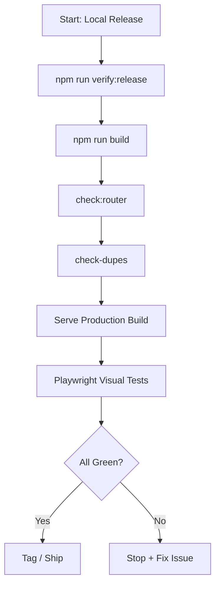

# Local Release Workflow Checklist

## Goal

Verify that the `main` or `dev` branch is stable and ready for deployment without regression.

## 1. Setup (One-time)

Ensure you have the latest dependencies and Playwright browsers installed:

```bash
npm install
npx playwright install chromium
```

## 2. Release Verification (The "Magic Command")

Run the following command in your terminal. This will build the app, run all guardrails, and execute visual tests against the production build.

```bash
npm run verify:release
```

## 3. Interpreting Results

- **✅ PASS (All Green):**

  - Build successful.
  - No forbidden router imports.
  - No duplicate React versions.
  - All critical UI layers match visual snapshots.
  - **Action:** Safe to merge or deploy.

- **❌ FAIL:**
  - Read the error log.
  - **Router Error:** You imported from `@tanstack/react-router`. Remove it.
  - **Duplicate React:** Check `npm ls react`. Dedupe your lockfile.
  - **Visual Diff:** "Error: Screenshot comparison failed".
    - Check if the UI change was intentional.
    - If intentional, run `Cross-Env E2E_MODE=production npx playwright test e2e/visual --update-snapshots`.
    - If UNINTENTIONAL breakdown (e.g., header covering content), **FIX THE CSS**.

## Workflow Diagram


